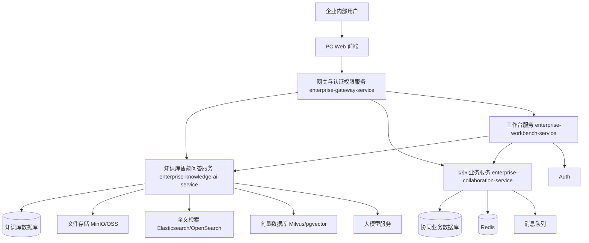

# AGENTS.md

## 1. 文件目的

本文件用于约束 AI 编程 Agent 和开发人员在本项目中的工作方式。

当 AI Agent 或开发人员为“企业内部智能协同平台”生成代码、修改文件、设计接口、编写数据库脚本或补充文档时，必须遵循本文件中的上下文和规则。

## 2. 项目概述

本项目是一个面向企业内部使用的智能协同办公平台，核心模块包括：

1. 工作台
2. 知识库
3. 智能问答
4. 时间管理
5. 会议预约
6. 待办事项
7. 任务协同
8. 消息通知
9. 数据看板
10. 系统管理

一期采用微服务架构，核心能力微服务化。系统拆分为：

1. **enterprise-gateway-service**：统一入口、路由、鉴权、限流、日志管理，并合并用户管理、部门管理、角色权限管理等认证与权限功能。
2. **enterprise-knowledge-ai-service**：知识库、文档解析、全文检索、向量检索、智能问答服务。
3. **enterprise-workbench-service**：工作台数据聚合服务。
4. **enterprise-collaboration-service**：时间管理、会议预约、待办事项、任务协同、消息通知、数据看板等业务模块。




## 3. 架构规则

### 3.1 后端分层

后端应采用以下分层结构：

1. Controller 层：负责请求接收、参数校验、统一响应。
2. Service 层：负责业务逻辑。
3. Domain / Model 层：负责领域对象和业务模型。
4. Repository / Mapper 层：负责数据库访问。
5. Infrastructure 层：负责文件存储、检索引擎、向量库、消息队列、第三方接口等基础设施能力。

### 3.2 前端结构

前端应按照业务模块组织：

1. auth：登录认证。
2. workbench：工作台。
3. knowledge：知识库。
4. ai-qa：智能问答。
5. calendar：日历与时间管理。
6. meeting：会议预约。
7. todo：待办事项。
8. task：任务协同。
9. notification：消息通知。
10. dashboard：数据看板。
11. system：系统管理。

### 3.3 模块边界

不要在不同模块之间随意混写业务逻辑。

示例：

1. 会议模块可以通过接口调用通知模块。
2. 智能问答模块可以调用知识库检索服务，但不能绕过权限过滤。
3. 数据看板模块应尽量读取统计数据或查询优化后的数据，不应承担核心业务写入逻辑。

## 4. 安全规则

1. 所有业务接口默认必须登录。
2. 所有文档访问必须校验权限。
3. 所有智能问答检索必须进行权限过滤。
4. 管理后台接口必须校验管理员权限。
5. 密码绝不能明文存储。
6. 敏感操作必须记录操作日志。
7. 后端不能向前端返回堆栈信息。
8. 不允许泄露无权限文档的标题、摘要、片段或来源。

## 5. 智能问答规则

实现智能问答时必须遵守：

1. 只能检索用户有权限访问的文档切片。
2. 回答必须基于检索到的内容。
3. 返回答案时应附带来源文档。
4. 如果没有可靠来源，应返回“未找到明确依据”类提示。
5. 需要保存用户反馈，用于后续优化。
6. 不能把隐藏文档或无权限文档作为上下文。
7. 需要防范文档内容中的提示词注入。

## 6. 数据库规则

1. 主键统一使用 bigint 类型 id。
2. 核心表使用 created_at 和 updated_at。
3. 需要软删除的表使用 deleted 字段。
4. 涉及状态流转的表使用 status 字段。
5. 常用查询条件需要建立索引。
6. 关键业务数据避免物理删除。
7. 多对多关系使用关联表。

## 7. API 规则

### 7.1 统一响应格式

所有接口返回格式应统一为：

```json
{
  "code": 200,
  "message": "success",
  "data": {},
  "traceId": "request-trace-id"
}
```

### 7.2 分页响应格式

```json
{
  "current": 1,
  "size": 20,
  "total": 100,
  "records": []
}
```

### 7.3 接口命名

接口尽量采用 RESTful 风格：

1. GET /api/kb/documents
2. POST /api/kb/documents/upload
3. GET /api/meetings
4. POST /api/meetings
5. POST /api/meetings/check-conflict
6. GET /api/tasks
7. POST /api/tasks

## 8. 代码风格规则

1. 方法职责要单一。
2. 避免重复业务逻辑。
3. 命名要清晰。
4. 请求参数必须校验。
5. 状态值应使用常量或枚举。
6. 权限过滤、会议冲突检测、RAG 检索等复杂逻辑需要写注释。
7. 不允许硬编码密钥。
8. 不允许提交账号、密码、Token、私钥等敏感信息。

## 9. 核心状态值

### 文档状态

1. DRAFT：草稿。
2. PARSING：解析中。
3. REVIEWING：审核中。
4. PUBLISHED：已发布。
5. REJECTED：审核拒绝。
6. OFFLINE：已下架。
7. FAILED：解析失败。

### 会议状态

1. BOOKED：已预约。
2. CANCELLED：已取消。
3. FINISHED：已结束。
4. EXPIRED：已过期。

### 待办状态

1. TODO：未开始。
2. IN_PROGRESS：进行中。
3. DONE：已完成。
4. DELAYED：已延期。
5. CANCELLED：已取消。

### 任务状态

1. NOT_STARTED：未开始。
2. IN_PROGRESS：进行中。
3. WAIT_CONFIRM：待确认。
4. DONE：已完成。
5. DELAYED：已延期。
6. CANCELLED：已取消。

## 10. 开发优先级

### P0

1. 登录认证。
2. 用户和权限管理。
3. 知识库。
4. 会议预约和冲突检测。
5. 待办事项。
6. 任务协同。
7. 消息通知。

### P1

1. 智能问答。
2. 文档版本管理。
3. 会议纪要。
4. 数据看板。

### P2

1. 第三方系统集成。
2. 高级智能排程。
3. 移动端。
4. 高级 BI。

## 11. 禁止事项

1. MVP 阶段不要做复杂 OA 审批系统。
3. 智能问答不能在没有来源依据时回答制度和流程问题。
4. 搜索和智能问答不能绕过权限过滤。
5. 关键业务数据不要物理删除。
