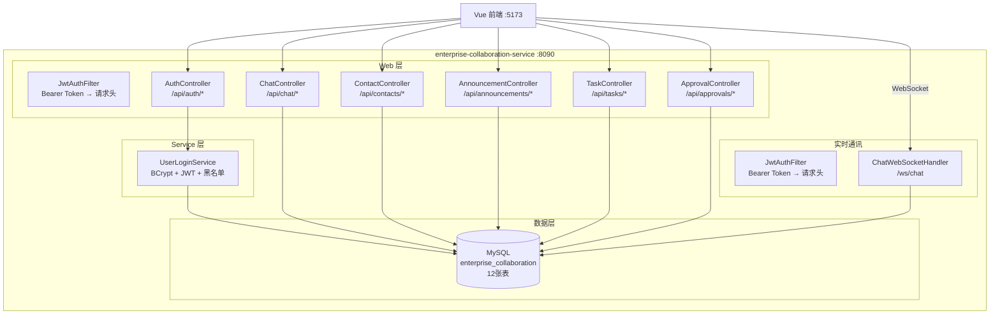
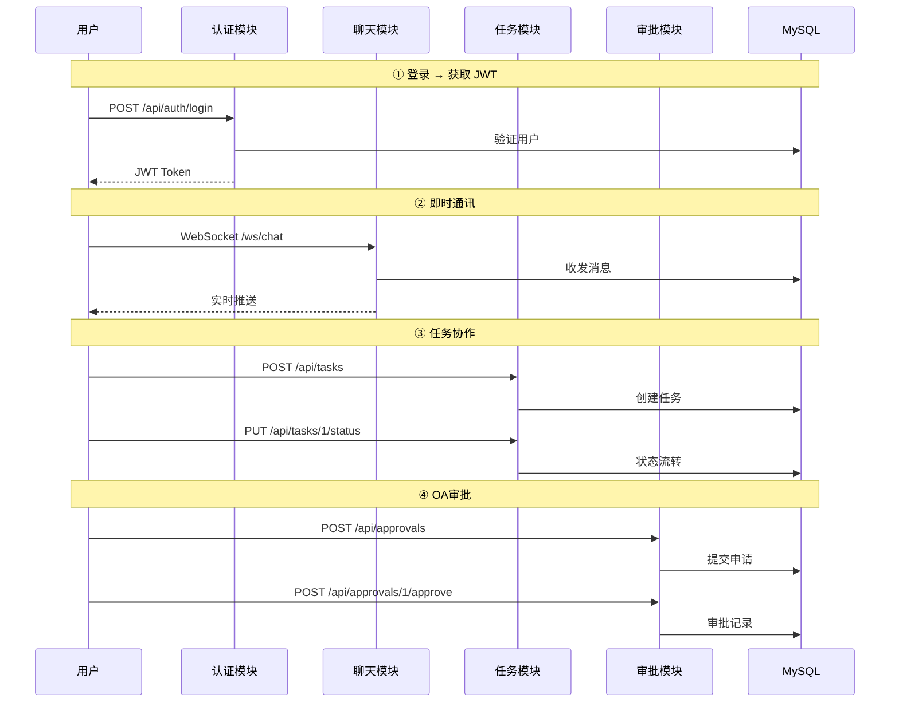
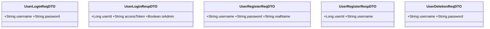
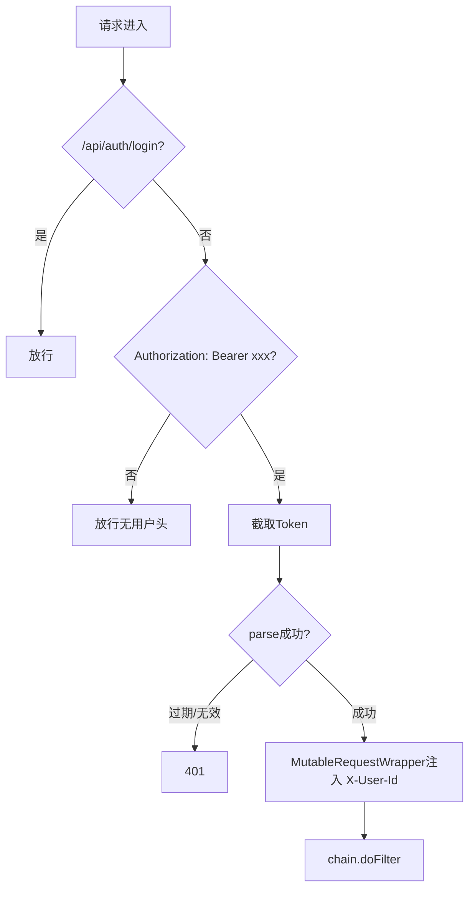
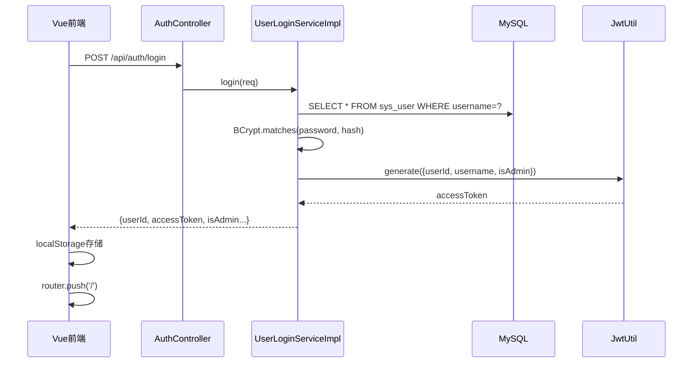
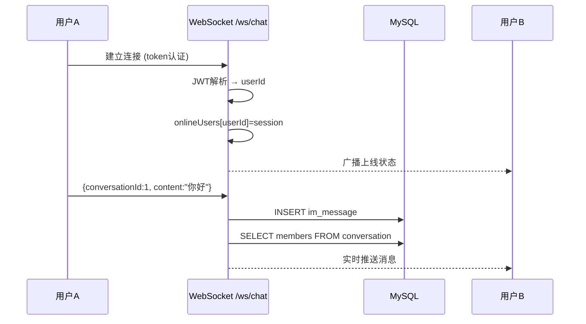
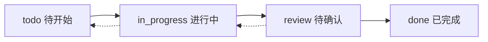
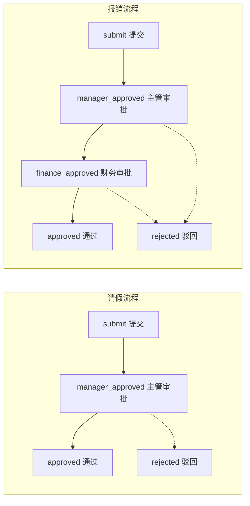
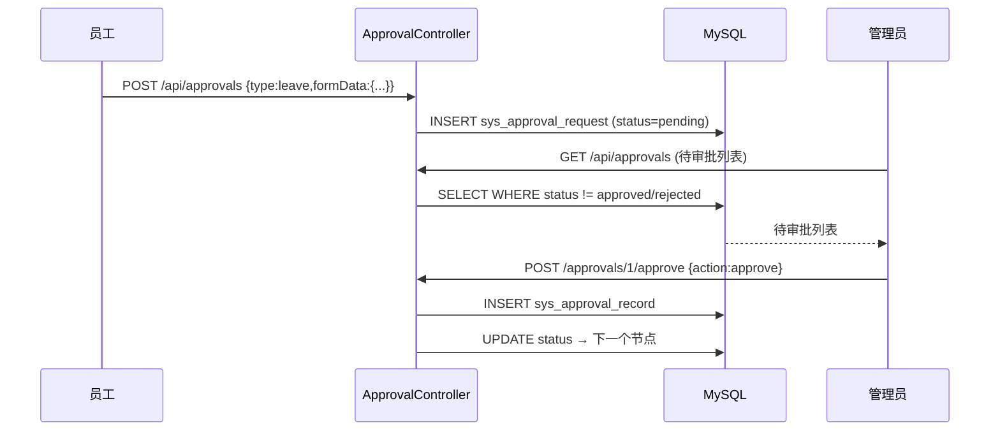
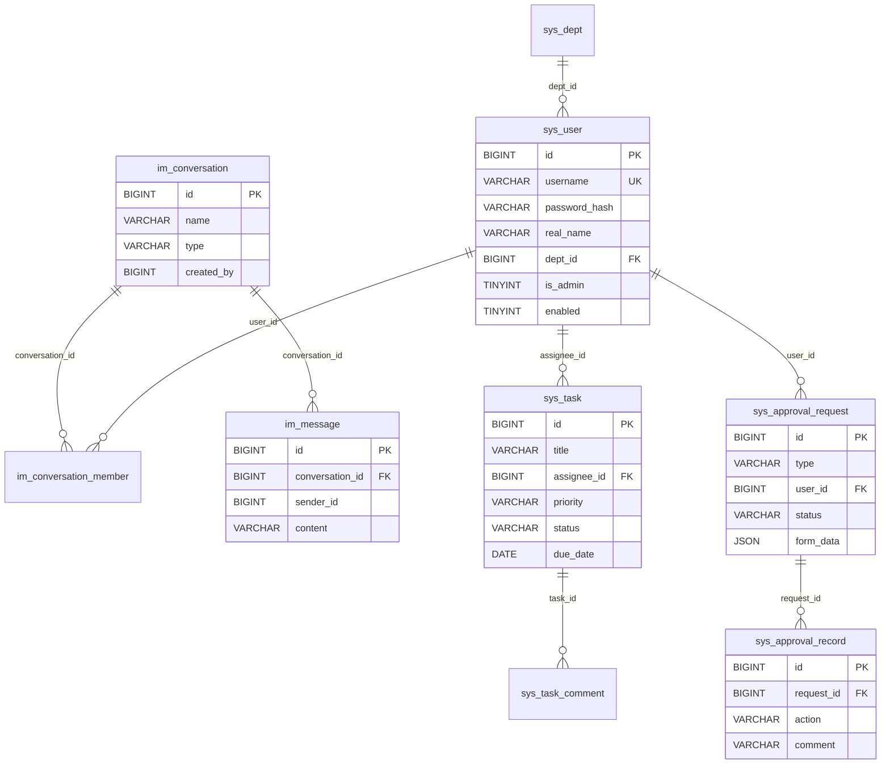

# enterprise-collaboration-service 服务解析

> 基于 2026-05-12 代码，解析企业协同微服务的完整架构、组件职责与数据流。涵盖认证、即时通讯、通讯录、公告、任务看板、OA 审批。

---

## 目录

1. [系统架构总览](#1-系统架构总览)
2. [启动入口](#2-启动入口)
3. [配置体系](#3-配置体系)
4. [模块全景](#4-模块全景)
5. [Entity / DTO 层](#5-entity--dto-层)
6. [认证模块](#6-认证模块)
7. [即时通讯模块](#7-即时通讯模块)
8. [通讯录与公告模块](#8-通讯录与公告模块)
9. [任务管理模块](#9-任务管理模块)
10. [OA 审批模块](#10-oa-审批模块)
11. [数据库设计](#11-数据库设计)
12. [完整 API 接口清单](#12-完整-api-接口清单)
13. [目录结构速查](#13-目录结构速查)

---

## 1. 系统架构总览

### 1.1 微服务全景图



### 1.2 数据流全景



---

## 2. 启动入口

### 2.1 CollaborationApplication

```java
@SpringBootApplication(scanBasePackages = {"com.zjl.collaboration", "com.zjl.common"})
@MapperScan("com.zjl.collaboration.mapper")
public class CollaborationApplication {
    public static void main(String[] args) {
        SpringApplication.run(CollaborationApplication.class, args);
    }
}
```

| 注解 | 作用 |
|------|------|
| `@SpringBootApplication(scanBasePackages)` | 扫描本服务包 + frameworks 公共组件 |
| `@MapperScan` | MyBatis-Plus Mapper 代理生成 |

---

## 3. 配置体系

### 3.1 application.yml

```yaml
spring:
  datasource:
    url: jdbc:mysql://127.0.0.1:3306/enterprise_collaboration
    username: root / password: 123456
  sql.init.mode: always
server.port: 8090
mybatis-plus.configuration.map-underscore-to-camel-case: true
auth.jwt.secret: enterprise-work-platform-jwt-secret-key-2026
auth.jwt.expiration: 86400000  # 24h
```

### 3.2 关键配置类

| 配置类 | 作用 |
|--------|------|
| `FilterConfig` | 注册 JwtAuthFilter，拦截 `/api/*` |
| `WebSocketConfig` | 注册 ChatWebSocketHandler，路径 `/ws/chat` |

---

## 4. 模块全景

```
enterprise-collaboration-service :8090
├── 认证模块 (/api/auth)         login/register/checkLogin/logout/deletion
├── 即时通讯 (/api/chat + /ws/chat)  会话/消息/群聊 + WebSocket实时推送
├── 通讯录 (/api/contacts)       部门筛选 + 员工列表
├── 公告 (/api/announcements)    发布/删除/列表
├── 任务 (/api/tasks)            Kanban看板 + 状态流转 + 评论
└── 审批 (/api/approvals)        请假/报销 + 固定审批链
```

---

## 5. Entity / DTO 层

### 5.1 SysUser 实体

**表名**：`sys_user` | **主键策略**：`IdType.AUTO`

| 字段 | 类型 | DB列 | 说明 |
|------|------|------|------|
| `id` | `Long` | `id BIGINT PK AUTO_INCREMENT` | 自增主键 |
| `username` | `String` | `username VARCHAR(64) UNIQUE` | 用户名 |
| `passwordHash` | `String` | `password_hash VARCHAR(200)` | BCrypt哈希 |
| `realName` | `String` | `real_name VARCHAR(64)` | 真实姓名 |
| `deptId` | `Long` | `dept_id BIGINT` | 部门ID |
| `isAdmin` | `Integer` | `is_admin TINYINT DEFAULT 0` | 管理员标识 |
| `enabled` | `Integer` | `enabled TINYINT DEFAULT 1` | 启用状态 |

### 5.2 DTO 清单



---

## 6. 认证模块

### 6.1 JWT 工具

```java
@Component
public class JwtUtil {
    // HS256 签名 + 24h 过期
    public String generate(Map<String, Object> claims) { ... }
    public Claims parse(String token) { ... }
}
```

### 6.2 UserLoginService

| 方法 | 说明 |
|------|------|
| `login(req)` | BCrypt 验密 → JWT 签发 |
| `checkLogin(token)` | 黑名单检查 → JWT 解析 → 用户状态检查 |
| `logout(token)` | Token 加入内存黑名单 |
| `hasUserName(name)` | 用户名唯一性检查 |
| `register(req)` | BCrypt 加密 → INSERT |
| `deletion(req)` | 密码验证 → 物理删除 |

### 6.3 JWT 认证链路



### 6.4 AuthController 接口

| 方法 | 路径 | 说明 |
|------|------|------|
| `POST` | `/login` | 登录返回JWT |
| `GET` | `/check-login` | Token验证 |
| `POST` | `/logout` | 登出黑名单 |
| `GET` | `/has-username` | 用户名检查 |
| `POST` | `/register` | 注册 |
| `POST` | `/deletion` | 注销 |

### 6.5 登录完整链路



---

## 7. 即时通讯模块

### 7.1 架构



### 7.2 ChatWebSocketHandler

**文件**：`web/ChatWebSocketHandler.java`

| 回调 | 逻辑 |
|------|------|
| `afterConnectionEstablished` | JWT 解析 → userId → onlineUsers.put |
| `handleTextMessage` | 落库 im_message → 查询群成员 → 遍历推送 |
| `afterConnectionClosed` | onlineUsers.remove → 广播离线状态 |

### 7.3 ChatController REST 接口

| 方法 | 路径 | 说明 |
|------|------|------|
| `GET` | `/conversations` | 我的会话列表（含最后消息） |
| `GET` | `/messages/{convId}` | 会话历史消息（最近100条） |
| `POST` | `/conversations` | 创建群聊（指定成员） |
| `GET` | `/members/{convId}` | 查看群成员 |

---

## 8. 通讯录与公告模块

### 8.1 ContactController

| 方法 | 路径 | 说明 |
|------|------|------|
| `GET` | `/api/contacts/users?deptId=` | 按部门筛选员工 |
| `GET` | `/api/contacts/departments` | 部门列表 |

### 8.2 AnnouncementController

| 方法 | 路径 | 说明 |
|------|------|------|
| `GET` | `/api/announcements` | 公告列表（置顶优先） |
| `POST` | `/api/announcements` | 管理员发布公告 |
| `DELETE` | `/api/announcements/{id}` | 删除公告 |

---

## 9. 任务管理模块

### 9.1 Kanban 状态流转



### 9.2 TaskController

| 方法 | 路径 | 说明 |
|------|------|------|
| `GET` | `/api/tasks?status=` | 任务列表（可按状态筛选） |
| `POST` | `/api/tasks` | 创建任务（标题/描述/负责人/优先级/截止日） |
| `PUT` | `/api/tasks/{id}` | 更新任务 |
| `PUT` | `/api/tasks/{id}/status` | 状态流转 |
| `DELETE` | `/api/tasks/{id}` | 删除任务 |
| `GET` | `/api/tasks/{id}/comments` | 查看评论 |
| `POST` | `/api/tasks/{id}/comments` | 添加评论 |

---

## 10. OA 审批模块

### 10.1 审批流程



### 10.2 ApprovalController

| 方法 | 路径 | 说明 |
|------|------|------|
| `GET` | `/api/approvals` | 审批列表（管理员看全部，普通用户看自己） |
| `POST` | `/api/approvals` | 提交审批（type + formData JSON） |
| `GET` | `/api/approvals/{id}` | 审批详情（含审批记录时间线） |
| `POST` | `/api/approvals/{id}/approve` | 审批通过/驳回 |

### 10.3 审批数据流



---

## 11. 数据库设计

### 11.1 ER 图



### 11.2 12 张表总览

| 表名 | 用途 | 删除策略 |
|------|------|----------|
| `sys_dept` | 部门 | 保留 |
| `sys_user` | 用户 | 物理删除 |
| `sys_announcement` | 公告 | 物理删除 |
| `im_conversation` | 会话 | 保留 |
| `im_conversation_member` | 会话成员 | 物理删除 |
| `im_message` | 聊天消息 | 保留 |
| `sys_task` | 任务 | 物理删除 |
| `sys_task_comment` | 任务评论 | 物理删除 |
| `sys_approval_request` | 审批申请 | 保留 |
| `sys_approval_record` | 审批记录 | 保留 |

### 11.3 种子数据

| 用户名 | 密码 | 角色 | 部门 |
|--------|------|------|------|
| `admin` | `123456` | 管理员 | 技术部 |
| `zhangsan` | `123456` | 普通用户 | 技术部 |
| `lisi` | `123456` | 普通用户 | 产品部 |
| `wangwu` | `123456` | 普通用户 | 技术部 |
| `zhaoliu` | `123456` | 普通用户 | 设计部 |

---

## 12. 完整 API 接口清单

### 12.1 认证 /api/auth（6个）

| # | 方法 | 路径 | 说明 |
|---|------|------|------|
| 1 | `POST` | `/login` | 登录 → JWT |
| 2 | `GET` | `/check-login` | Token验证 |
| 3 | `POST` | `/logout` | 登出黑名单 |
| 4 | `GET` | `/has-username` | 用户名检查 |
| 5 | `POST` | `/register` | 注册 |
| 6 | `POST` | `/deletion` | 注销 |

### 12.2 即时通讯 /api/chat（4个）

| # | 方法 | 路径 | 说明 |
|---|------|------|------|
| 7 | `GET` | `/conversations` | 会话列表 |
| 8 | `GET` | `/messages/{convId}` | 历史消息 |
| 9 | `POST` | `/conversations` | 创建群聊 |
| 10 | `GET` | `/members/{convId}` | 群成员 |

### 12.3 通讯录 + 公告（4个）

| # | 方法 | 路径 | 说明 |
|---|------|------|------|
| 11 | `GET` | `/api/contacts/users` | 员工列表 |
| 12 | `GET` | `/api/contacts/departments` | 部门列表 |
| 13 | `GET/POST/DELETE` | `/api/announcements` | 公告CRUD |
| 14 | `DELETE` | `/api/announcements/{id}` | 删除公告 |

### 12.4 任务管理 /api/tasks（7个）

| # | 方法 | 路径 | 说明 |
|---|------|------|------|
| 15 | `GET` | `/api/tasks` | 列表(可按status筛选) |
| 16 | `POST` | `/api/tasks` | 创建任务 |
| 17 | `PUT` | `/api/tasks/{id}` | 更新任务 |
| 18 | `PUT` | `/api/tasks/{id}/status` | 状态流转 |
| 19 | `DELETE` | `/api/tasks/{id}` | 删除 |
| 20 | `GET` | `/api/tasks/{id}/comments` | 评论列表 |
| 21 | `POST` | `/api/tasks/{id}/comments` | 添加评论 |

### 12.5 OA审批 /api/approvals（4个）

| # | 方法 | 路径 | 说明 |
|---|------|------|------|
| 22 | `GET` | `/api/approvals` | 列表(管理员全量) |
| 23 | `POST` | `/api/approvals` | 提交审批 |
| 24 | `GET` | `/api/approvals/{id}` | 详情+记录 |
| 25 | `POST` | `/api/approvals/{id}/approve` | 通过/驳回 |

---

## 13. 目录结构速查

```
enterprise-collaboration-service/
├── pom.xml
└── src/main/
    ├── java/com/zjl/collaboration/
    │   ├── CollaborationApplication.java
    │   ├── config/
    │   │   ├── FilterConfig.java             # JWT过滤器注册
    │   │   └── WebSocketConfig.java          # WebSocket注册 /ws/chat
    │   ├── dto/                              # 5个DTO
    │   │   ├── UserLoginReqDTO.java
    │   │   ├── UserLoginRespDTO.java
    │   │   ├── UserRegisterReqDTO.java
    │   │   ├── UserRegisterRespDTO.java
    │   │   └── UserDeletionReqDTO.java
    │   ├── entity/
    │   │   └── SysUser.java                  # 用户实体
    │   ├── mapper/
    │   │   └── SysUserMapper.java            # MyBatis-Plus Mapper
    │   ├── service/
    │   │   ├── UserLoginService.java         # 接口 6方法
    │   │   └── impl/
    │   │       └── UserLoginServiceImpl.java # BCrypt+JWT+黑名单
    │   ├── util/
    │   │   └── JwtUtil.java                  # HS256工具
    │   └── web/
    │       ├── AuthController.java           # /api/auth/*
    │       ├── ChatController.java           # /api/chat/*
    │       ├── ChatWebSocketHandler.java     # /ws/chat WebSocket
    │       ├── ContactController.java        # /api/contacts/*
    │       ├── AnnouncementController.java   # /api/announcements/*
    │       ├── TaskController.java           # /api/tasks/*
    │       ├── ApprovalController.java       # /api/approvals/*
    │       ├── JwtAuthFilter.java            # Bearer Token过滤器
    │       └── MutableRequestWrapper.java    # 请求头注入
    └── resources/
        ├── application.yml                   # 端口8090 + JWT配置
        └── db/
            └── schema.sql                    # 10表 + 种子数据
```

---

**文档版本**：v2.0（全模块版）  
**最后更新**：2026-05-12  
**覆盖范围**：20个 Java 源文件 + 2个资源文件，涵盖 6 大模块  
**图表数量**：9 个 Mermaid 图表
