# enterprise-collaboration-service 代码分析

本文基于当前 `enterprise-collaboration-service` 代码整理，目标是把这个服务从“看上去像骨架”重新解释为“当前实际已经承载的协同业务集合”。

---

## 1. 服务定位

`enterprise-collaboration-service` 当前并不是空壳，它已经集成了一组轻量协同功能，覆盖：

1. 用户认证
2. 即时通讯
3. 通讯录
4. 公告
5. 会议预约
6. 待办事项
7. 任务协同与评论
8. OA 审批
9. 协同文档

它更像一个“协同业务域合并服务”，而不是单一垂直模块。

---

## 2. 当前代码结构

```text
enterprise-collaboration-service/src/main/java/com/zjl/collaboration
├── config           # Filter / WebSocket / MyBatis 配置
├── dto              # 登录、注册、注销 DTO
├── entity           # 聊天、任务、会议、审批、公告、文档等实体
├── integration      # 外部集成，例如 ZoomMeetingClient
├── mapper           # 各实体对应 Mapper
├── service          # 认证服务接口
├── service/impl     # 认证服务实现
├── util             # JWT 工具
└── web              # Controller、Filter、WebSocketHandler
```

从包结构就能看出，这个服务是“多个业务块并列”而不是“严格按领域拆分多个子模块”。

---

## 3. 启动与配置

### 3.1 启动入口

入口类：

- [CollaborationApplication.java](/Users/zjl/projectByZhangjilin/EnterpriseKnowledgeWorkspace/enterprise-collaboration-service/src/main/java/com/zjl/collaboration/CollaborationApplication.java)

关键点：

1. 扫描 `com.zjl.collaboration`
2. 同时扫描 `com.zjl.common`
3. `@MapperScan("com.zjl.collaboration.mapper")`
4. `@EnableCaching`

这说明该服务已经接入：

1. 公共统一响应与异常处理
2. MyBatis-Plus
3. Spring Cache

### 3.2 当前配置

配置文件：

- [application.yml](/Users/zjl/projectByZhangjilin/EnterpriseKnowledgeWorkspace/enterprise-collaboration-service/src/main/resources/application.yml)

当前关键配置项：

| 配置项 | 当前含义 |
|------|----------|
| `server.port=8090` | 协同服务端口 |
| `spring.datasource.*` | `enterprise_collaboration` 数据库 |
| `spring.sql.init.mode=always` | 启动时执行 schema |
| `spring.data.redis.*` | Redis 缓存支持 |
| `auth.jwt.expiration` | JWT 过期时间 |

和知识服务不同，这里没有单独复杂的业务配置类，整体配置比较轻。

---

## 4. 当前接口版图

从 `web` 包可以看出，当前已经暴露了以下业务入口：

| Controller | 路径前缀 | 业务域 |
|-----------|---------|-------|
| `AuthController` | `/api/auth` | 登录注册注销 |
| `ChatController` | `/api/chat` | 会话、消息、成员 |
| `ContactController` | `/api/contacts` | 通讯录 |
| `AnnouncementController` | `/api/announcements` | 公告 |
| `MeetingController` | `/api/meetings` | 会议 |
| `TodoController` | `/api/todos` | 待办 |
| `TaskController` | `/api/tasks` | 任务与评论 |
| `ApprovalController` | `/api/approvals` | 审批 |
| `DocController` | `/api/docs` | 协同文档 |

此外还有：

| 组件 | 作用 |
|------|------|
| `ChatWebSocketHandler` | `/ws/chat` WebSocket 实时聊天 |
| `JwtAuthFilter` | HTTP 请求上的 JWT 解析 |

---

## 5. 认证模型

### 5.1 当前实现风格

这个服务有自己的一套轻量认证体系，并不是完全复用网关那套。

核心组件：

1. `AuthController`
2. `UserLoginService`
3. `UserLoginServiceImpl`
4. `JwtUtil`
5. `JwtAuthFilter`

### 5.2 请求链路

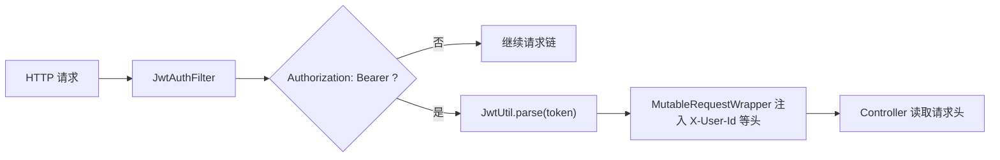

它当前的思路不是构建完整 Spring Security 认证上下文，而是：

1. 解析 Token
2. 把用户信息改写回请求头
3. 让 Controller 直接从请求头里拿 `X-User-Id`

这是一个轻量实现，开发成本低，但也意味着：

1. 和网关服务的安全模型不完全统一
2. 权限细粒度控制主要靠 Controller/业务逻辑自己约束

### 5.3 `AuthController` 能力

当前已提供：

1. `POST /api/auth/login`
2. `GET /api/auth/check-login`
3. `POST /api/auth/logout`
4. `GET /api/auth/has-username`
5. `POST /api/auth/register`
6. `POST /api/auth/deletion`

所以从能力上看，这个服务可以独立完成一套本地用户认证闭环。

### 5.4 登录完整时序图

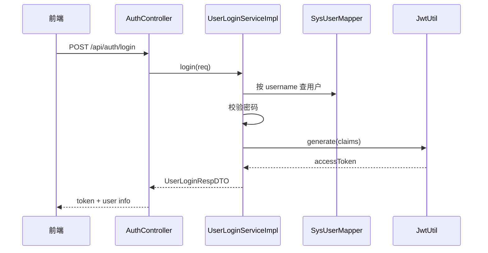

### 5.5 请求鉴权补充图

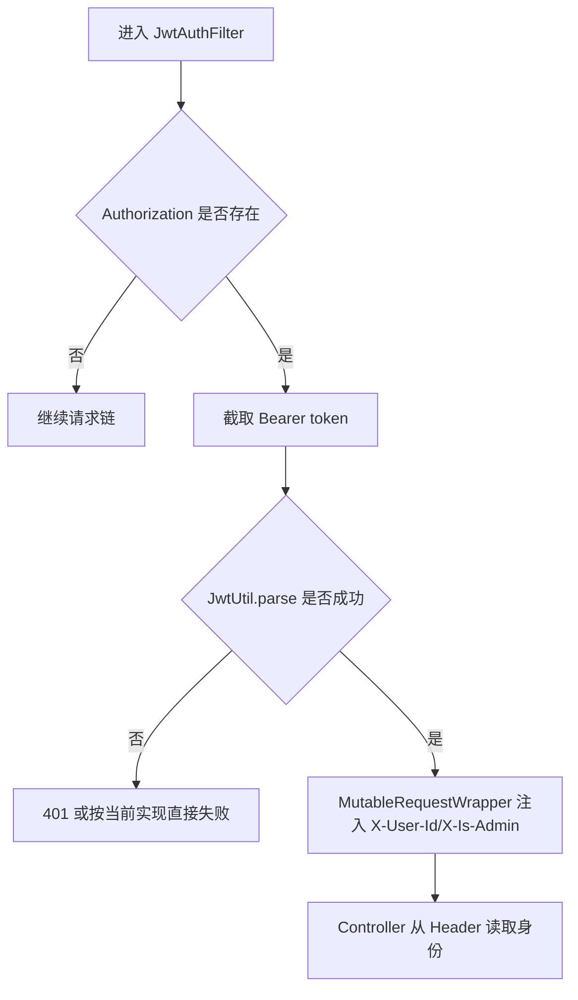

---

## 6. 即时通讯模块

### 6.1 核心对象

聊天相关实体：

1. `ImConversation`
2. `ImConversationMember`
3. `ImMessage`

相关 Mapper：

1. `ImConversationMapper`
2. `ImConversationMemberMapper`
3. `ImMessageMapper`

### 6.2 HTTP 能力

`ChatController` 当前提供：

1. `GET /api/chat/conversations`
2. `GET /api/chat/messages/{convId}`
3. `POST /api/chat/conversations`
4. `GET /api/chat/members/{convId}`

从代码逻辑看，它支持：

1. 查询我参与的会话
2. 查询某会话最近消息
3. 创建会话并添加成员
4. 查询会话成员

### 6.3 WebSocket 能力

`ChatWebSocketHandler` 对应 `/ws/chat`，这是当前实时通讯的核心入口。

这意味着聊天模块是“HTTP 查询 + WebSocket 实时推送”的混合模式，而不是纯 REST。

### 6.4 聊天流程图

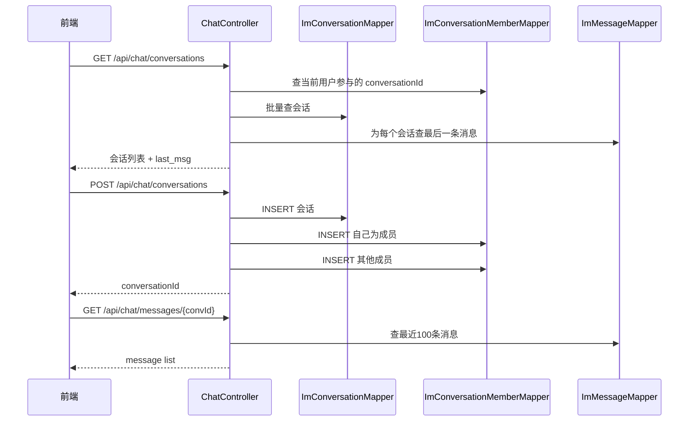

### 6.5 WebSocket 与 HTTP 的分工

当前实现建议这样理解：

1. HTTP 负责“查”
2. WebSocket 负责“实时收发”

也就是：

1. 进入聊天页时，先走 `GET /conversations` 和 `GET /messages/{convId}`
2. 真正输入消息后，再通过 `/ws/chat` 做实时推送

这种分工比较常见，也更容易和前端页面生命周期配合。

---

## 7. 通讯录与公告

### 7.1 通讯录

`ContactController` 当前主要提供：

1. 用户列表查询
2. 结合部门等信息做基础通讯录输出

它依赖的实体基础是 `SysUser`。

### 7.2 公告

`AnnouncementController` 当前已具备：

1. 公告列表
2. 公告新增
3. 公告删除

对应实体是：

- `SysAnnouncement`

这说明公告模块已经形成了基本 CRUD。

### 7.3 公告流程图

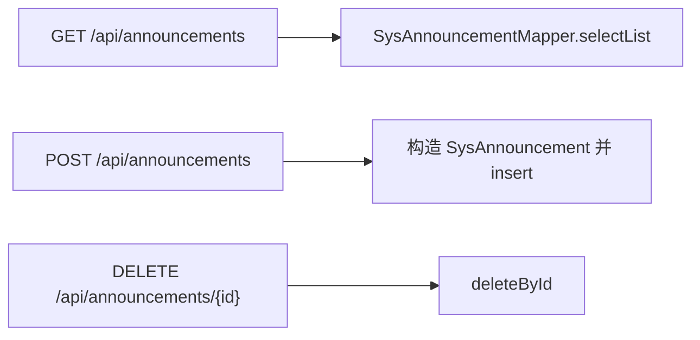

---

## 8. 会议模块

### 8.1 核心对象

- `SysMeeting`

### 8.2 当前接口

`MeetingController` 当前已实现：

1. `GET /api/meetings`
2. `POST /api/meetings`
3. `PUT /api/meetings/{id}`
4. `DELETE /api/meetings/{id}`

从当前代码组织看，会议模块已经完成了基础的增删改查闭环，后续还能接入 `ZoomMeetingClient` 做外部会议平台联动。

### 8.3 会议创建流程图

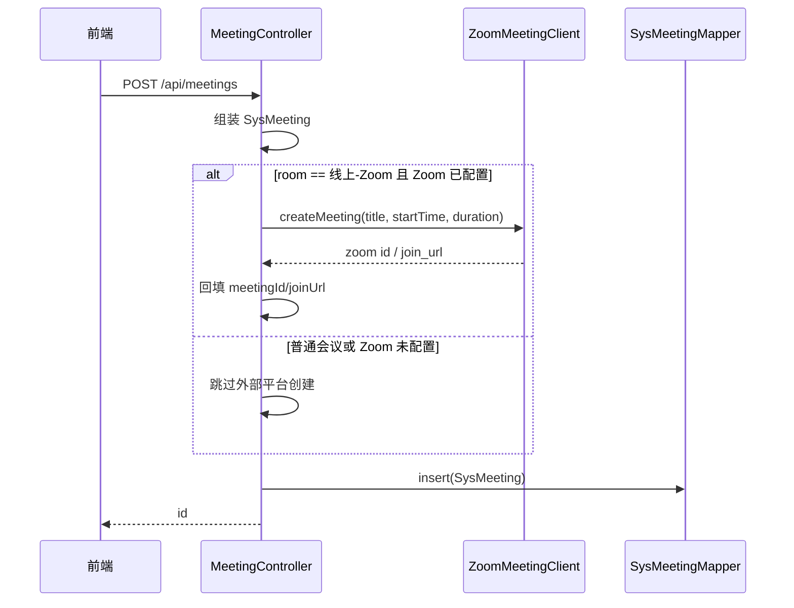

---

## 9. 待办模块

### 9.1 核心对象

- `SysTodo`

### 9.2 当前接口

`TodoController` 已提供：

1. `GET /api/todos`
2. `POST /api/todos`
3. `PUT /api/todos/{id}`
4. `PUT /api/todos/{id}/toggle`
5. `DELETE /api/todos/{id}`

这说明待办模块除了标准 CRUD，还支持“完成/未完成切换”这种更偏前台交互的轻量操作。

### 9.3 待办流程图

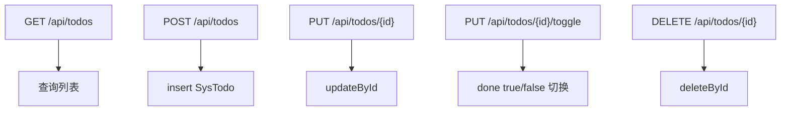

---

## 10. 任务协同模块

### 10.1 核心对象

1. `SysTask`
2. `SysTaskComment`

### 10.2 当前接口

`TaskController` 当前已提供：

1. `GET /api/tasks`
2. `POST /api/tasks`
3. `PUT /api/tasks/{id}`
4. `PUT /api/tasks/{id}/status`
5. `DELETE /api/tasks/{id}`
6. `GET /api/tasks/{taskId}/comments`
7. `POST /api/tasks/{taskId}/comments`

也就是说，这个模块已不只是“任务列表”，还包含：

1. 任务状态流转
2. 任务评论协作

从工作台聚合代码看，前端也已经在消费这部分数据。

### 10.3 任务流程图

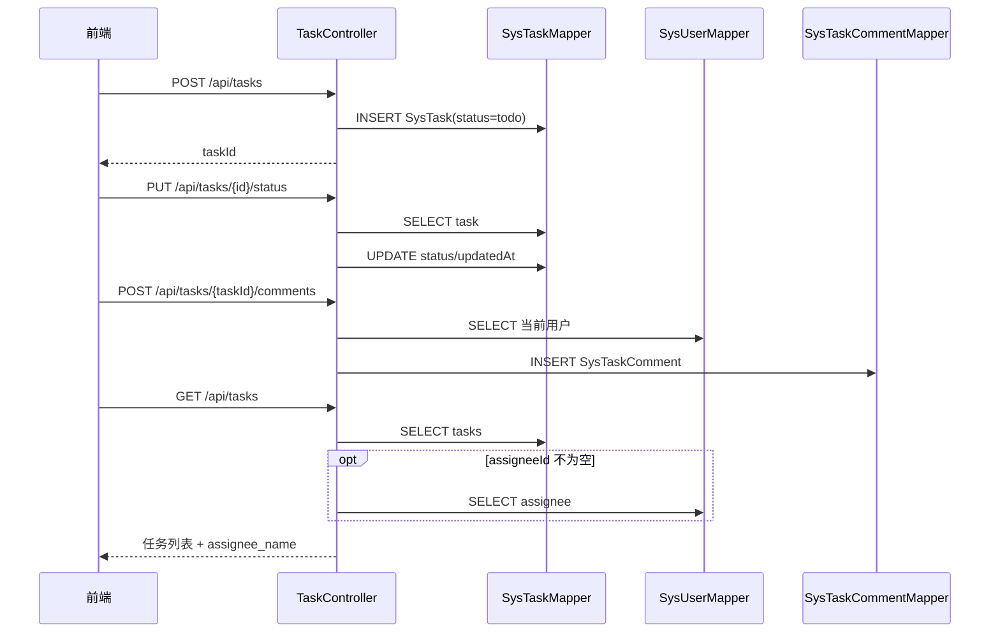

### 10.4 任务状态流转说明

当前 `TaskController` 本身没有把状态流转规则收得特别严，基本上是：

1. 前端传什么 `status`
2. 后端就写什么 `status`

所以它现在更像“开放状态字段”，不是“严格状态机”。  
这也解释了为什么工作台里会直接按字符串统计 `todo`、`in_progress`、`review`、`done`。

---

## 11. OA 审批模块

### 11.1 核心对象

1. `SysApprovalRequest`
2. `SysApprovalRecord`

### 11.2 当前接口

`ApprovalController` 当前已提供：

1. `GET /api/approvals`
2. `POST /api/approvals`
3. `GET /api/approvals/{id}`
4. `POST /api/approvals/{id}/approve`

这意味着审批模块至少已经覆盖：

1. 发起申请
2. 查询申请
3. 审批动作
4. 审批记录存储

### 11.3 审批流转图

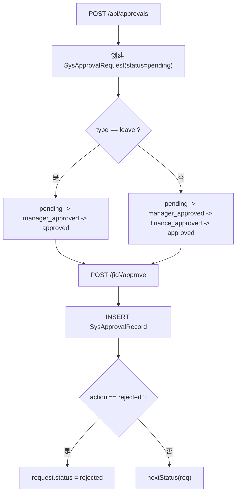

### 11.4 审批详细时序

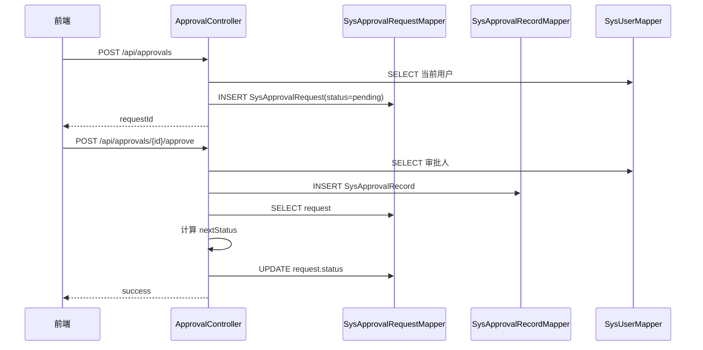

---

## 12. 协同文档模块

`DocController` 当前提供：

1. `GET /api/docs`
2. `GET /api/docs/{id}`
3. `POST /api/docs`
4. `PUT /api/docs/{id}`
5. `DELETE /api/docs/{id}`

对应实体：

- `SysDoc`

所以协同服务中其实已经有一套“轻量文档协作”能力，它和知识库服务的文档处理不同：

1. 协同服务的文档更偏日常协作内容
2. 知识服务的文档更偏结构化知识沉淀、分块、检索、向量化

### 12.1 协同文档 CRUD 图

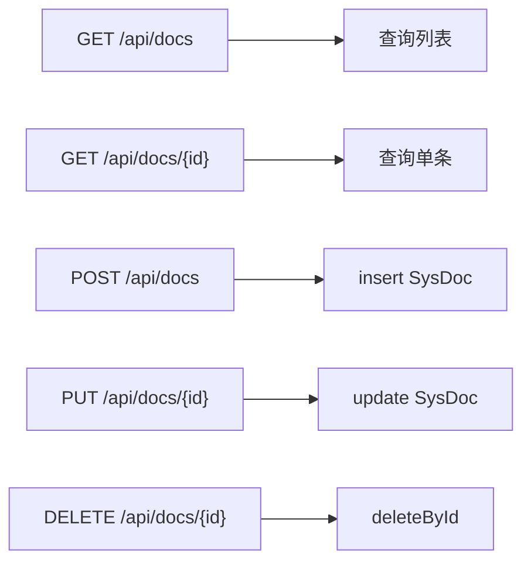

---

## 13. 数据模型概览

从实体代码看，当前协同服务的数据域大概分为 5 组。

### 13.1 用户与基础资料

1. `SysUser`

### 13.2 聊天域

1. `ImConversation`
2. `ImConversationMember`
3. `ImMessage`

### 13.3 协同办公域

1. `SysMeeting`
2. `SysTodo`
3. `SysTask`
4. `SysTaskComment`
5. `SysDoc`

### 13.4 审批域

1. `SysApprovalRequest`
2. `SysApprovalRecord`

### 13.5 公共通知域

1. `SysAnnouncement`

所以如果把这个服务看成“协同平台业务库”，它的建模已经初具规模。

---

## 14. 与其他服务的关系

### 14.1 和网关的关系

网关当前会把以下路径路由到协同服务：

1. `/api/meetings/**`
2. `/api/todos/**`
3. `/api/tasks/**`
4. `/api/notifications/**`

但当前协同服务真实 Controller 还包括：

1. `/api/auth/**`
2. `/api/chat/**`
3. `/api/contacts/**`
4. `/api/announcements/**`
5. `/api/approvals/**`
6. `/api/docs/**`

这说明网关路由配置与协同服务实际接口面当前并不完全对齐，后续如果统一由网关入口访问，需要补齐对应路由。

### 14.2 和工作台的关系

工作台服务当前会主动聚合协同服务的：

1. 待办
2. 会议
3. 任务
4. 审批

所以协同服务现在已经是工作台首页的重要数据来源。

---

## 15. 当前实现成熟度判断

### 15.1 已经比较可用的部分

1. 登录注册基础闭环
2. 会话、消息、WebSocket 聊天
3. 会议、待办、任务、审批、公告基础接口
4. 工作台可消费的数据面

### 15.2 仍需继续强化的部分

1. 和网关认证模型统一
2. 路由配置与实际接口对齐
3. 更细粒度的权限控制
4. DTO/Service/Controller 分层进一步收敛
5. 更多显式的状态枚举与校验收口

---

## 16. 推荐阅读顺序

如果要快速理解这个服务，推荐按这个顺序看：

1. `application.yml`
2. `AuthController` + `UserLoginServiceImpl` + `JwtAuthFilter`
3. `ChatController` + `ChatWebSocketHandler`
4. `MeetingController`
5. `TodoController`
6. `TaskController`
7. `ApprovalController`
8. `DocController`

一句话总结：

`enterprise-collaboration-service` 当前已经是一个“多业务并行”的协同域服务，虽然实现风格偏轻量，但绝不是单纯的占位模块。

---

## 17. 完整代码地图

这一节按包把当前协同服务的主要代码都列出来，方便你顺着文档和代码一一对照。

### 17.1 启动与配置

| 文件 | 说明 |
|------|------|
| `CollaborationApplication.java` | 启动入口，负责组件扫描、Mapper 扫描、缓存开启。 |
| `config/FilterConfig.java` | 注册 `JwtAuthFilter`。 |
| `config/WebSocketConfig.java` | 注册 `ChatWebSocketHandler` 到 `/ws/chat`。 |
| `config/MybatisPlusConfig.java` | MyBatis-Plus 基础配置。 |

### 17.2 DTO 层

| 文件 | 说明 |
|------|------|
| `dto/UserLoginReqDTO.java` | 登录请求。 |
| `dto/UserLoginRespDTO.java` | 登录响应。 |
| `dto/UserRegisterReqDTO.java` | 注册请求。 |
| `dto/UserRegisterRespDTO.java` | 注册响应。 |
| `dto/UserDeletionReqDTO.java` | 注销请求。 |

DTO 层目前集中在认证模块，其他业务模块更多是直接在 Controller 内部使用实体或内部静态请求类。

### 17.3 Entity 层

| 文件 | 说明 |
|------|------|
| `entity/SysUser.java` | 用户实体。 |
| `entity/ImConversation.java` | 会话实体。 |
| `entity/ImConversationMember.java` | 会话成员实体。 |
| `entity/ImMessage.java` | 聊天消息实体。 |
| `entity/SysAnnouncement.java` | 公告实体。 |
| `entity/SysMeeting.java` | 会议实体。 |
| `entity/SysTodo.java` | 待办实体。 |
| `entity/SysTask.java` | 任务实体。 |
| `entity/SysTaskComment.java` | 任务评论实体。 |
| `entity/SysApprovalRequest.java` | 审批申请实体。 |
| `entity/SysApprovalRecord.java` | 审批记录实体。 |
| `entity/SysDoc.java` | 协同文档实体。 |

### 17.4 Mapper 层

| 文件 | 说明 |
|------|------|
| `mapper/SysUserMapper.java` | 用户表访问。 |
| `mapper/ImConversationMapper.java` | 会话表访问。 |
| `mapper/ImConversationMemberMapper.java` | 会话成员表访问。 |
| `mapper/ImMessageMapper.java` | 消息表访问。 |
| `mapper/SysAnnouncementMapper.java` | 公告表访问。 |
| `mapper/SysMeetingMapper.java` | 会议表访问。 |
| `mapper/SysTodoMapper.java` | 待办表访问。 |
| `mapper/SysTaskMapper.java` | 任务表访问。 |
| `mapper/SysTaskCommentMapper.java` | 任务评论表访问。 |
| `mapper/SysApprovalRequestMapper.java` | 审批申请表访问。 |
| `mapper/SysApprovalRecordMapper.java` | 审批记录表访问。 |
| `mapper/SysDocMapper.java` | 文档表访问。 |

### 17.5 认证相关代码

| 文件 | 说明 |
|------|------|
| `service/UserLoginService.java` | 认证服务接口。 |
| `service/impl/UserLoginServiceImpl.java` | 登录、登出、校验、注册、注销等实现。 |
| `util/JwtUtil.java` | JWT 生成与解析。 |
| `web/JwtAuthFilter.java` | 请求过滤器，把 JWT 解析结果写回请求头。 |
| `web/MutableRequestWrapper.java` | 支持在请求链中动态追加请求头。 |
| `web/AuthController.java` | 对外认证接口。 |

### 17.6 协同业务 Controller

| 文件 | 说明 |
|------|------|
| `web/ChatController.java` | 会话、消息、成员查询与新建会话。 |
| `web/ChatWebSocketHandler.java` | 实时聊天收发。 |
| `web/ContactController.java` | 通讯录查询。 |
| `web/AnnouncementController.java` | 公告 CRUD。 |
| `web/MeetingController.java` | 会议 CRUD。 |
| `web/TodoController.java` | 待办 CRUD 与完成切换。 |
| `web/TaskController.java` | 任务 CRUD、状态流转、评论。 |
| `web/ApprovalController.java` | 审批列表、发起、详情、审批。 |
| `web/DocController.java` | 协同文档 CRUD。 |

### 17.7 外部集成

| 文件 | 说明 |
|------|------|
| `integration/ZoomMeetingClient.java` | 会议外部平台集成入口，目前属于预留/扩展方向。 |

---

## 18. 关键方法导读

这一节列出最值得先读的方法，用来快速抓住各条业务链。

### 18.1 登录链路

1. `AuthController.login(...)`
2. `UserLoginServiceImpl.login(...)`
3. `JwtUtil.generate(...)`
4. `JwtAuthFilter.doFilter(...)`

### 18.2 会话与聊天链路

1. `ChatController.conversations(...)`
2. `ChatController.messages(...)`
3. `ChatController.createConv(...)`
4. `ChatWebSocketHandler.handleTextMessage(...)`

### 18.3 会议链路

1. `MeetingController.list(...)`
2. `MeetingController.create(...)`
3. `MeetingController.update(...)`
4. `MeetingController.delete(...)`

### 18.4 待办链路

1. `TodoController.list(...)`
2. `TodoController.create(...)`
3. `TodoController.update(...)`
4. `TodoController.toggle(...)`
5. `TodoController.delete(...)`

### 18.5 任务链路

1. `TaskController.list(...)`
2. `TaskController.create(...)`
3. `TaskController.update(...)`
4. `TaskController.updateStatus(...)`
5. `TaskController.comments(...)`
6. `TaskController.addComment(...)`

### 18.6 审批链路

1. `ApprovalController.list(...)`
2. `ApprovalController.create(...)`
3. `ApprovalController.detail(...)`
4. `ApprovalController.approve(...)`

### 18.7 协同文档链路

1. `DocController.list(...)`
2. `DocController.detail(...)`
3. `DocController.create(...)`
4. `DocController.update(...)`
5. `DocController.delete(...)`

---

## 19. 业务流程细化

### 19.1 登录与鉴权

当前登录流程：

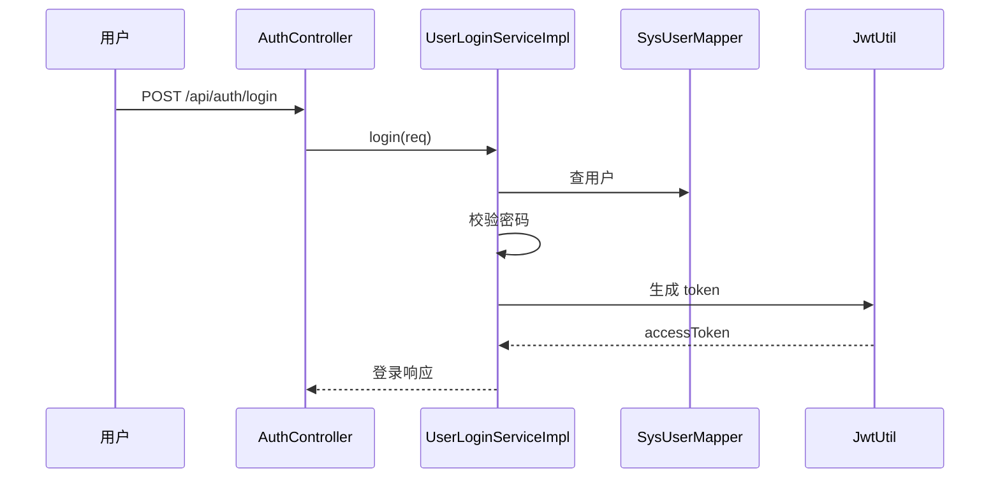

后续普通请求再经 `JwtAuthFilter` 恢复用户头。

### 19.2 聊天

聊天当前分两面：

1. `ChatController` 提供历史消息、会话列表、会话新建
2. `ChatWebSocketHandler` 提供实时收发

所以它不是“只做 websocket”，而是典型 IM 的读写分离模式：

1. 历史消息走 HTTP
2. 实时消息走 WS

### 19.3 任务协同

任务链路当前包括：

1. 新建任务
2. 更新任务内容
3. 修改任务状态
4. 查询任务评论
5. 新增评论

这比普通 ToDo 更接近轻量项目协作。

### 19.4 审批

审批链路是当前最接近 OA 的部分，至少覆盖：

1. 申请单创建
2. 审批单详情
3. 审批动作
4. 审批记录

它当前的实现偏轻量，但从模型上已经具备继续扩展的基础。

---

## 20. 代码风格与结构特点

从当前协同服务代码可以看出几个明显特征：

1. Controller 里直接使用 Mapper 的情况较多，业务下沉到 Service 的深度不如知识服务
2. 各业务块实现风格偏轻，适合快速推进
3. 鉴权实现更偏工程化简化，不是完整 Security 体系
4. 对前端很友好，接口通常比较直给

换句话说，这个服务当前是“可跑、可联调、可继续扩展”的业务聚合服务，但代码结构成熟度不如知识服务高。
