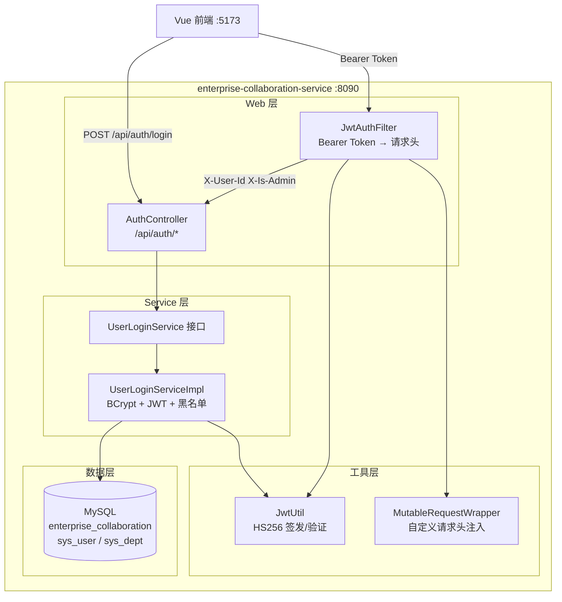
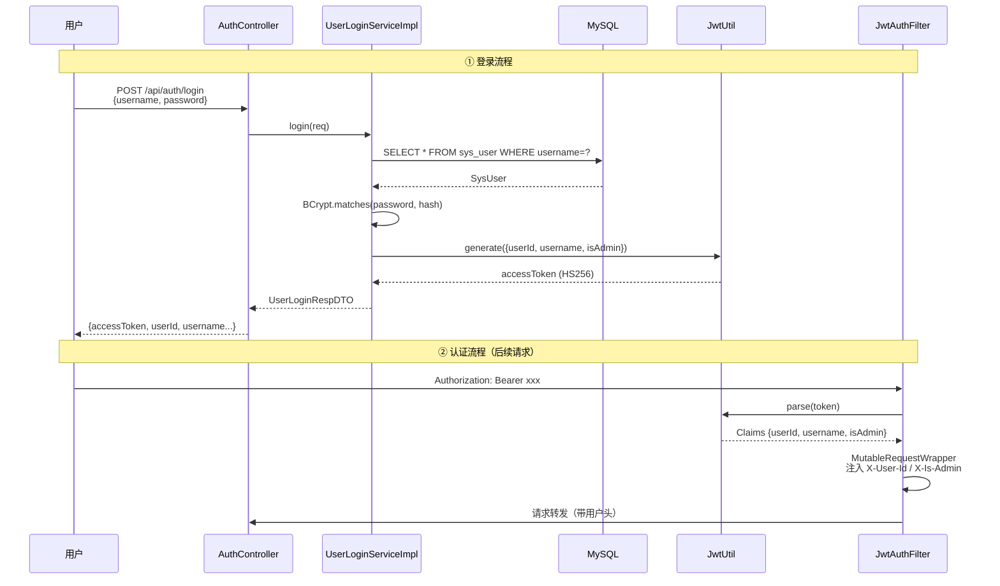
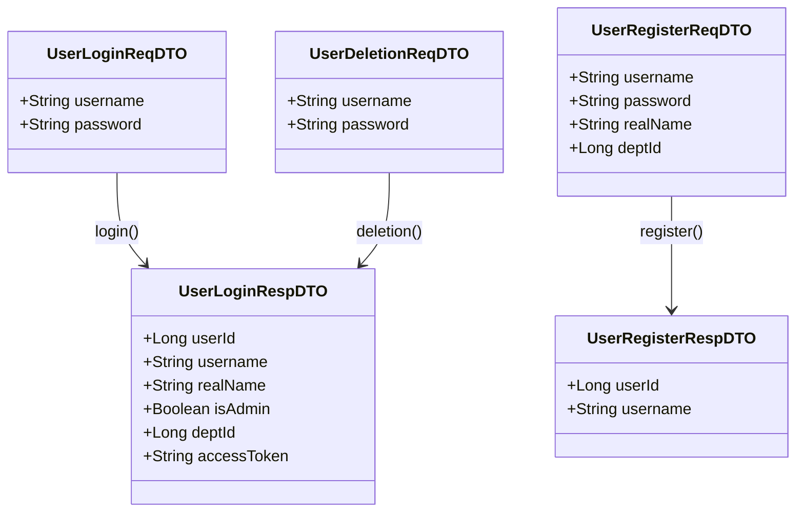
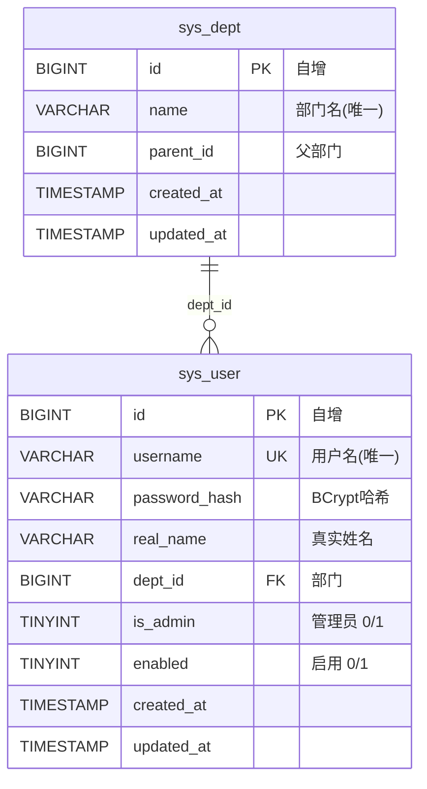

# enterprise-collaboration-service 服务解析

> 基于 2026-05-12 代码，解析 JWT 用户认证微服务的完整架构、组件职责与数据流。

---

## 目录

1. [系统架构总览](#1-系统架构总览)
2. [启动入口](#2-启动入口)
3. [配置体系](#3-配置体系)
4. [Entity 层](#4-entity-层)
5. [DTO 层](#5-dto-层)
6. [Mapper 层](#6-mapper-层)
7. [Service 层](#7-service-层)
8. [Controller 层](#8-controller-层)
9. [JWT 认证链路](#9-jwt-认证链路)
10. [数据库设计](#10-数据库设计)
11. [完整 API 接口清单](#11-完整-api-接口清单)
12. [目录结构速查](#12-目录结构速查)

---

## 1. 系统架构总览

### 1.1 微服务全景图



### 1.2 JWT 认证数据流



---

## 2. 启动入口

### 2.1 CollaborationApplication

**文件路径**：`CollaborationApplication.java`

```java
@SpringBootApplication(scanBasePackages = {"com.zjl.collaboration", "com.zjl.common"})
@MapperScan("com.zjl.collaboration.mapper")
public class CollaborationApplication {
    public static void main(String[] args) {
        SpringApplication.run(CollaborationApplication.class, args);
    }
}
```

| 注解 | 作用 |
|------|------|
| `@SpringBootApplication(scanBasePackages)` | 扫描 `com.zjl.collaboration`（本服务）和 `com.zjl.common`（frameworks 公共组件） |
| `@MapperScan("com.zjl.collaboration.mapper")` | 为 MyBatis-Plus Mapper 接口生成代理 |

---

## 3. 配置体系

### 3.1 application.yml

**文件路径**：`src/main/resources/application.yml`

```yaml
spring:
  datasource:
    url: jdbc:mysql://127.0.0.1:3306/enterprise_collaboration
    username: root
    password: 123456
  sql:
    init:
      mode: always
      schema-locations: classpath:db/schema.sql

server:
  port: 8090

mybatis-plus:
  configuration:
    map-underscore-to-camel-case: true

auth:
  jwt:
    secret: enterprise-work-platform-jwt-secret-key-2026
    expiration: 86400000
```

| 配置项 | 值 | 说明 |
|--------|-----|------|
| `server.port` | 8090 | 服务端口 |
| `spring.datasource.url` | `enterprise_collaboration` | 专属数据库 |
| `spring.sql.init.mode` | always | 每次启动执行 schema.sql |
| `auth.jwt.secret` | HS256 密钥 | JWT 签名密钥 |
| `auth.jwt.expiration` | 86400000 (24h) | Token 过期时间（毫秒） |

### 3.2 FilterConfig

**文件路径**：`config/FilterConfig.java`

```java
@Configuration
public class FilterConfig {
    @Bean
    public FilterRegistrationBean<JwtAuthFilter> jwtFilter(JwtAuthFilter filter) {
        FilterRegistrationBean<JwtAuthFilter> reg = new FilterRegistrationBean<>();
        reg.setFilter(filter);
        reg.addUrlPatterns("/api/*");
        reg.setOrder(1);
        return reg;
    }
}
```

注册 `JwtAuthFilter` 拦截 `/api/*` 所有请求。

---

## 4. Entity 层

### 4.1 SysUser

**文件路径**：`entity/SysUser.java`  
**表名**：`sys_user`  
**主键策略**：`IdType.AUTO`（自增）

| 字段 | 类型 | 数据库列 | 说明 |
|------|------|----------|------|
| `id` | `Long` | `id BIGINT PK AUTO_INCREMENT` | 自增主键 |
| `username` | `String` | `username VARCHAR(64) UNIQUE` | 用户名 |
| `passwordHash` | `String` | `password_hash VARCHAR(200)` | BCrypt 密码哈希 |
| `realName` | `String` | `real_name VARCHAR(64)` | 真实姓名 |
| `deptId` | `Long` | `dept_id BIGINT` | 部门 ID |
| `isAdmin` | `Integer` | `is_admin TINYINT DEFAULT 0` | 是否管理员 |
| `enabled` | `Integer` | `enabled TINYINT DEFAULT 1` | 是否启用 |
| `createdAt` | `LocalDateTime` | `created_at` | 创建时间 |
| `updatedAt` | `LocalDateTime` | `updated_at` | 更新时间 |

---

## 5. DTO 层



### 5.1 DTO 清单

| DTO | 字段 | 用途 |
|-----|------|------|
| `UserLoginReqDTO` | username, password | 登录请求 |
| `UserLoginRespDTO` | userId, username, realName, isAdmin, deptId, accessToken | 登录/checkLogin 响应 |
| `UserRegisterReqDTO` | username, password, realName, deptId | 注册请求 |
| `UserRegisterRespDTO` | userId, username | 注册响应 |
| `UserDeletionReqDTO` | username, password | 注销请求 |

---

## 6. Mapper 层

### 6.1 SysUserMapper

**文件路径**：`mapper/SysUserMapper.java`

```java
@Mapper
public interface SysUserMapper extends BaseMapper<SysUser> {
}
```

继承 `BaseMapper<SysUser>`，获得 MyBatis-Plus 内置的 insert / updateById / deleteById / selectById / selectOne / selectCount 等方法。

---

## 7. Service 层

### 7.1 UserLoginService 接口

**文件路径**：`service/UserLoginService.java`

```java
public interface UserLoginService {
    UserLoginRespDTO login(UserLoginReqDTO requestParam);        // 登录
    UserLoginRespDTO checkLogin(String accessToken);              // Token 验证
    void logout(String accessToken);                              // 登出
    Boolean hasUserName(String username);                         // 用户名检查
    UserRegisterRespDTO register(UserRegisterReqDTO requestParam); // 注册
    void deletion(UserDeletionReqDTO requestParam);               // 注销用户
}
```

### 7.2 UserLoginServiceImpl 详解

**文件路径**：`service/impl/UserLoginServiceImpl.java`  
**依赖**：`SysUserMapper` + `JwtUtil` + `BCryptPasswordEncoder`

#### login() 流程

```
login(req)
  ├── 参数校验：username/password 非空
  ├── 查库：SELECT * FROM sys_user WHERE username=?
  ├── 状态检查：enabled == 0 → UNAUTHORIZED
  ├── 密码校验：BCryptPasswordEncoder.matches(password, hash)
  │     └── 不匹配 → UNAUTHORIZED
  ├── 构造 JWT Claims：{userId, username, isAdmin}
  ├── jwtUtil.generate(claims) → accessToken
  └── 返回 UserLoginRespDTO
```

#### checkLogin() 流程

```
checkLogin(accessToken)
  ├── 空值检查
  ├── 黑名单检查：tokenBlacklist.contains(token) → UNAUTHORIZED
  ├── jwtUtil.parse(token) → Claims
  ├── 查库：selectById(userId)
  │     └── 不存在或 disabled → UNAUTHORIZED
  └── 返回 UserLoginRespDTO（不含 token）
```

#### register() 流程

```
register(req)
  ├── 参数校验：username/password 非空
  ├── 用户名唯一性检查：hasUserName()
  ├── BCryptPasswordEncoder.encode(password)
  ├── INSERT sys_user (isAdmin=0, enabled=1)
  └── 返回 UserRegisterRespDTO {userId, username}
```

#### logout() 与 deletion()

```
logout(accessToken)
  └── tokenBlacklist.add(accessToken)   // 内存黑名单

deletion(req)
  ├── 用户名密码校验
  ├── sysUserMapper.deleteById(id)      // 物理删除
  └── @Transactional 保护
```

---

## 8. Controller 层

### 8.1 AuthController

**文件路径**：`web/AuthController.java`  
**路径前缀**：`/api/auth`  
**依赖**：`UserLoginService`

| 方法 | 路径 | 请求体 | 响应 | 说明 |
|------|------|--------|------|------|
| `POST` | `/login` | `UserLoginReqDTO` | `Result<UserLoginRespDTO>` | 登录，返回 JWT |
| `GET` | `/check-login` | Query: `accessToken` | `Result<UserLoginRespDTO>` | 验证 token 有效性 |
| `POST` | `/logout` | Query: `accessToken` | `Result<Void>` | 登出，token 加黑名单 |
| `GET` | `/has-username` | Query: `username` | `Result<Boolean>` | 用户名是否存在 |
| `POST` | `/register` | `UserRegisterReqDTO` | `Result<UserRegisterRespDTO>` | 注册新用户 |
| `POST` | `/deletion` | `UserDeletionReqDTO` | `Result<Void>` | 注销用户 |

---

## 9. JWT 认证链路

### 9.1 JwtUtil

**文件路径**：`util/JwtUtil.java`

```java
@Component
public class JwtUtil {
    private final SecretKey key;        // HS256 密钥
    private final long expiration;      // 24h

    public JwtUtil(@Value("${auth.jwt.secret}") String secret,
                   @Value("${auth.jwt.expiration}") long expiration) {
        this.key = Keys.hmacShaKeyFor(secret.getBytes(StandardCharsets.UTF_8));
        this.expiration = expiration;
    }

    public String generate(Map<String, Object> claims) {
        return Jwts.builder()
                .claims(claims)                              // {userId, username, isAdmin}
                .issuedAt(new Date())
                .expiration(new Date(System.currentTimeMillis() + expiration))
                .signWith(key)
                .compact();
    }

    public Claims parse(String token) {
        return Jwts.parser().verifyWith(key).build()
                .parseSignedClaims(token).getPayload();
    }
}
```

### 9.2 JwtAuthFilter

**文件路径**：`web/JwtAuthFilter.java`

```mermaid
flowchart TD
    A[请求进入] --> B{路径是 /api/auth/login?}
    B -->|是| C[放行，不校验 Token]
    B -->|否| D{Authorization: Bearer xxx?}
    D -->|否| E[放行，无用户头]
    D -->|是| F[截取 Token]
    F --> G{parse(token) 成功?}
    G -->|过期| H[401 Token已过期]
    G -->|无效| I[401 Token无效]
    G -->|成功| J[提取 Claims]
    J --> K[MutableRequestWrapper 注入:<br/>X-User-Id / X-Department-Id / X-Is-Admin]
    K --> L[chain.doFilter]
```

### 9.3 MutableRequestWrapper

**文件路径**：`web/MutableRequestWrapper.java`

继承 `HttpServletRequestWrapper`，允许向请求中添加自定义 Header。解决 `HttpServletRequest` 不允许修改 Header 的限制。

```java
public class MutableRequestWrapper extends HttpServletRequestWrapper {
    private final Map<String, String> customHeaders = new HashMap<>();

    public void putHeader(String name, String value) {
        customHeaders.put(name, value);
    }

    @Override
    public String getHeader(String name) {
        return customHeaders.getOrDefault(name, super.getHeader(name));
    }
}
```

---

## 10. 数据库设计

### 10.1 ER 图



### 10.2 种子数据

| 用户名 | 密码 | 角色 |
|--------|------|------|
| `admin` | `123456` (BCrypt) | 管理员 |
| `zhangsan` | `123456` | 普通用户 |
| `lisi` | `123456` | 普通用户 |

部门：`技术部`、`产品部`、`设计部`

---

## 11. 完整 API 接口清单

| # | 方法 | 路径 | 参数 | 响应 | 认证 |
|---|------|------|------|------|------|
| 1 | `POST` | `/api/auth/login` | `{username, password}` | `{userId, username, realName, isAdmin, deptId, accessToken}` | 否 |
| 2 | `GET` | `/api/auth/check-login` | Query: `accessToken` | `{userId, username, realName, isAdmin, deptId}` | 否 |
| 3 | `POST` | `/api/auth/logout` | Query: `accessToken` | `null` | 否 |
| 4 | `GET` | `/api/auth/has-username` | Query: `username` | `true/false` | 否 |
| 5 | `POST` | `/api/auth/register` | `{username, password, realName, deptId}` | `{userId, username}` | 否 |
| 6 | `POST` | `/api/auth/deletion` | `{username, password}` | `null` | 否 |

---

## 12. 目录结构速查

```
enterprise-collaboration-service/
├── pom.xml
└── src/main/
    ├── java/com/zjl/collaboration/
    │   ├── CollaborationApplication.java       # 启动类
    │   ├── config/
    │   │   └── FilterConfig.java               # JWT 过滤器注册
    │   ├── dto/                                 # DTO（5个文件）
    │   │   ├── UserLoginReqDTO.java             # 登录入参
    │   │   ├── UserLoginRespDTO.java            # 登录出参
    │   │   ├── UserRegisterReqDTO.java          # 注册入参
    │   │   ├── UserRegisterRespDTO.java         # 注册出参
    │   │   └── UserDeletionReqDTO.java          # 注销入参
    │   ├── entity/
    │   │   └── SysUser.java                     # 用户实体
    │   ├── mapper/
    │   │   └── SysUserMapper.java               # extends BaseMapper
    │   ├── service/
    │   │   ├── UserLoginService.java            # 接口（6个方法）
    │   │   └── impl/
    │   │       └── UserLoginServiceImpl.java    # BCrypt + JWT + 黑名单
    │   ├── util/
    │   │   └── JwtUtil.java                     # HS256 JWT 工具
    │   └── web/
    │       ├── AuthController.java              # /api/auth/*
    │       ├── JwtAuthFilter.java               # Bearer Token 过滤器
    │       └── MutableRequestWrapper.java       # 请求头注入包装器
    └── resources/
        ├── application.yml                      # 端口 8090 + JWT 配置
        └── db/
            └── schema.sql                       # sys_user + sys_dept + 种子数据
```

---

**文档版本**：v1.0  
**最后更新**：2026-05-12  
**覆盖范围**：14 个 Java 源文件 + 2 个资源文件  
**图表数量**：5 个 Mermaid 图表
