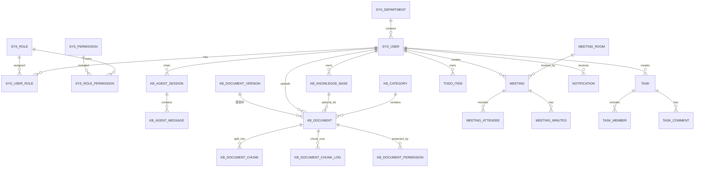

# Database 数据库设计

## 1. ER 关系图

## 2. 核心数据表

### 2.1 sys_user 用户表

用途：存储系统用户账号信息。

字段：

1. id：用户 ID。
2. username：登录用户名。
3. password_hash：加密后的密码。
4. real_name：真实姓名。
5. email：邮箱。
6. phone：手机号。
7. department_id：所属部门 ID。
8. position_name：岗位名称。
9. avatar_url：头像地址。
10. status：账号状态。
11. last_login_at：最近登录时间。
12. created_at：创建时间。
13. updated_at：更新时间。
14. deleted：是否删除。

### 2.2 sys_department 部门表

用途：存储组织架构。

字段：

1. id：部门 ID。
2. parent_id：上级部门 ID。
3. department_name：部门名称。
4. manager_id：部门负责人 ID。
5. sort_order：排序。
6. status：状态。
7. created_at：创建时间。
8. updated_at：更新时间。
9. deleted：是否删除。

### 2.3 sys_role 角色表

用途：存储系统角色。

字段：

1. id：角色 ID。
2. role_code：角色编码。
3. role_name：角色名称。
4. description：角色说明。
5. status：状态。
6. created_at：创建时间。
7. updated_at：更新时间。

### 2.4 sys_user_role 用户角色关联表

用途：维护用户和角色的多对多关系。

字段：

1. id：主键 ID。
2. user_id：用户 ID。
3. role_id：角色 ID。
4. created_at：创建时间。

### 2.5 sys_permission 权限表

用途：存储菜单、接口和操作权限。

字段：

1. id：权限 ID。
2. permission_code：权限编码。
3. permission_name：权限名称。
4. permission_type：权限类型。
5. parent_id：上级权限 ID。
6. path：前端路由或接口路径。
7. component：前端组件。
8. sort_order：排序。
9. status：状态。
10. created_at：创建时间。
11. updated_at：更新时间。

### 2.6 sys_role_permission 角色权限关联表

用途：维护角色和权限的多对多关系。

字段：

1. id：主键 ID。
2. role_id：角色 ID。
3. permission_id：权限 ID。
4. created_at：创建时间。

### 2.7 kb_category 知识分类表

用途：存储知识库分类。

字段：

1. id：分类 ID。
2. parent_id：上级分类 ID。
3. category_name：分类名称。
4. category_type：分类类型。
5. department_id：所属部门 ID。
6. sort_order：排序。
7. status：状态。
8. created_at：创建时间。
9. updated_at：更新时间。
10. deleted：是否删除。

### 2.7.1 kb_knowledge_base 逻辑知识库表

用途：描述一个知识库及其对应的 **Milvus 集合名**、可选嵌入模型标识；文档可通过 `kb_id` 关联。

字段（与 `schema.sql` 一致，可按迁移脚本扩展）：

1. id：主键。
2. name：展示名称（唯一性由业务校验）。
3. embedding_model：可选；为空时使用全局嵌入配置。
4. collection_name：Milvus 集合名（创建库时服务端建集并加载）。
5. owner_id：拥有者用户 ID。
6. created_at / updated_at：时间戳。
7. deleted：逻辑删除。

### 2.8 kb_document 知识文档表

用途：存储知识文档元数据、解析文本、分块与摄取状态。

字段（与 `schema.sql` 和 `KbDocument` 实体完全对齐）：

1. id：文档 ID（雪花 ID）。
2. title：文档标题。
3. category_id：分类 ID。
4. kb_id：可选；绑定 `kb_knowledge_base.id`，用于路由 Milvus 集合与嵌入模型。
5. owner_id：上传人 ID。
6. department_id：所属部门 ID。
7. file_name：原始文件名。
8. file_url：文件存储路径（本地落盘路径）。
9. file_type：MIME/探测类型。
10. file_size：文件大小（字节）。
11. summary：摘要（分块成功后由正文前 200 字生成）。
12. content_text：解析后的正文全量。
13. tags：标签。
14. permission_type：权限类型（ALL / DEPARTMENT / PROJECT / USER / ADMIN）。
15. status：文档状态（摄取主路径：**PENDING → RUNNING → SUCCESS / FAILED**；扩展：DRAFT / PARSING / REVIEWING / PUBLISHED / REJECTED / OFFLINE）。
16. current_version：当前版本号（预留，暂未落地版本流转）。
17. chunk_count：切片数量。
18. enabled：是否启用（0=禁用 / 1=启用）。
19. process_mode：处理模式（CHUNK / PIPELINE，当前仅 CHUNK 可用）。
20. chunk_strategy：分块策略（FIXED_SIZE / PARAGRAPH）。
21. chunk_config：分块参数 JSON。
22. pipeline_id：Pipeline 定义 ID（PIPELINE 模式时使用，预留）。
23. source_type：来源类型（FILE / URL）。
24. source_location：URL 来源地址等。
25. schedule_enabled：是否启用定时拉取（0/1，仅 URL 来源可用）。
26. schedule_cron：定时 Cron 表达式。
27. created_at / updated_at / deleted：时间戳与逻辑删除。

### 2.9 kb_document_version 文档版本表（规划中）

> ⚠️ **规划表**：`schema.sql` 中尚未包含此表，`kb_document.current_version` 字段已预留但版本流转逻辑未实现。以下字段为设计草案，实际落地时可能调整。

用途：存储文档历史版本。

字段：

1. id：版本 ID。
2. document_id：文档 ID。
3. version_no：版本号。
4. file_name：文件名。
5. file_url：文件地址。
6. content_text：版本正文。
7. change_note：变更说明。
8. created_by：创建人。
9. created_at：创建时间。

### 2.10 kb_document_chunk 文档切片表

用途：存储文档切片文本与统计信息；`id`（字符串化）与 Milvus 主键 `id` 对齐。

字段（与当前 `schema.sql` 完全对齐）：

1. id：切片主键（雪花 ID）。
2. document_id：文档 ID。
3. chunk_index：切片序号。
4. chunk_text：切片文本。
5. content_hash：SHA-256 内容哈希。
6. char_count：字符数。
7. token_count：Token 数（估算）。
8. vector_id：Milvus 主键引用（字符串，通常同 chunk.id）。
9. enabled：是否启用（0/1）。
10. metadata_json：扩展元数据 JSON。
11. created_by：创建人 ID。
12. updated_by：更新人 ID。
13. created_at：创建时间。
14. updated_at：更新时间。

### 2.10.1 kb_document_chunk_log 分块任务日志表

用途：每次文档分块/摄取任务一条记录，保存状态与各阶段耗时、错误信息，供接口分页查询。

主要字段：document_id、status、process_mode、chunk_strategy、pipeline_id、chunk_count、各 duration 字段、error_message、started_at、ended_at 等（见 `schema.sql`）。

### 2.11 kb_document_permission 文档权限表

用途：存储文档访问权限规则。

字段：

1. id：权限记录 ID。
2. document_id：文档 ID。
3. permission_target_type：授权对象类型。
4. permission_target_id：授权对象 ID。
5. permission_level：权限级别。
6. created_by：创建人。
7. created_at：创建时间。

### 2.11.1 kb_agent_session Agent 会话表

用途：存储 Agent 对话会话。

字段：

1. id：会话 ID。
2. user_id：用户 ID。
3. title：会话标题（自动生成或由首条消息截取）。
4. status：状态（ACTIVE / ARCHIVED）。
5. created_at：创建时间。
6. updated_at：更新时间。

### 2.11.2 kb_agent_message Agent 消息表

用途：存储 Agent 对话中的每条消息（含用户消息、助手回复、工具调用记录）。

字段：

1. id：消息 ID。
2. session_id：会话 ID。
3. role：消息角色（user / assistant / tool）。
4. content：文本内容（user 或 assistant 消息）。
5. tool_name：工具名（role=tool 时）。
6. tool_input：工具入参 JSON（role=tool 时）。
7. tool_output：工具返回结果 JSON（role=tool 时）。
8. token_count：Token 用量。
9. created_at：创建时间。

### 2.12 meeting_room 会议室表

用途：存储会议室资源。

字段：

1. id：会议室 ID。
2. room_name：会议室名称。
3. location：位置。
4. capacity：容纳人数。
5. equipment_json：设备信息。
6. open_start_time：开放开始时间。
7. open_end_time：开放结束时间。
8. manager_id：管理员 ID。
9. status：状态。
10. created_at：创建时间。
11. updated_at：更新时间。
12. deleted：是否删除。

### 2.13 meeting 会议表

用途：存储会议信息。

字段：

1. id：会议 ID。
2. title：会议标题。
3. room_id：会议室 ID。
4. creator_id：创建人 ID。
5. start_time：开始时间。
6. end_time：结束时间。
7. description：会议说明。
8. meeting_type：会议类型。
9. online_url：线上会议链接。
10. status：会议状态。
11. need_minutes：是否需要纪要。
12. created_at：创建时间。
13. updated_at：更新时间。
14. deleted：是否删除。

### 2.14 meeting_attendee 会议参会人表

用途：存储会议参会人。

字段：

1. id：主键 ID。
2. meeting_id：会议 ID。
3. user_id：参会人 ID。
4. attendee_status：参会状态。
5. created_at：创建时间。
6. updated_at：更新时间。

### 2.15 meeting_minutes 会议纪要表

用途：存储会议纪要。

字段：

1. id：纪要 ID。
2. meeting_id：会议 ID。
3. content：纪要正文。
4. action_items_json：行动项。
5. document_id：关联知识文档 ID。
6. created_by：创建人。
7. created_at：创建时间。
8. updated_at：更新时间。

### 2.16 todo_item 待办事项表

用途：存储个人待办。

字段：

1. id：待办 ID。
2. title：标题。
3. description：说明。
4. owner_id：所属用户 ID。
5. due_time：截止时间。
6. reminder_time：提醒时间。
7. priority：优先级。
8. status：状态。
9. related_type：关联业务类型。
10. related_id：关联业务 ID。
11. repeat_rule：重复规则。
12. completed_at：完成时间。
13. created_at：创建时间。
14. updated_at：更新时间。
15. deleted：是否删除。

### 2.17 task 任务表

用途：存储正式协同任务。

字段：

1. id：任务 ID。
2. title：任务标题。
3. description：任务说明。
4. creator_id：创建人 ID。
5. assignee_id：负责人 ID。
6. department_id：所属部门 ID。
7. project_id：项目 ID。
8. due_time：截止时间。
9. priority：优先级。
10. status：状态。
11. result_text：结果说明。
12. related_type：关联业务类型。
13. related_id：关联业务 ID。
14. completed_at：完成时间。
15. created_at：创建时间。
16. updated_at：更新时间。
17. deleted：是否删除。

### 2.18 task_member 任务成员表

用途：存储任务参与人。

字段：

1. id：主键 ID。
2. task_id：任务 ID。
3. user_id：用户 ID。
4. member_role：成员角色。
5. created_at：创建时间。

### 2.19 task_comment 任务评论表

用途：存储任务评论。

字段：

1. id：评论 ID。
2. task_id：任务 ID。
3. user_id：评论人 ID。
4. content：评论内容。
5. attachment_json：附件信息。
6. created_at：创建时间。
7. deleted：是否删除。

### 2.20 notification 消息通知表

用途：存储站内消息通知。

字段：

1. id：通知 ID。
2. receiver_id：接收人 ID。
3. title：通知标题。
4. content：通知内容。
5. notification_type：通知类型。
6. related_type：关联业务类型。
7. related_id：关联业务 ID。
8. read_status：是否已读。
9. read_at：阅读时间。
10. created_at：创建时间。

### 2.21 approval_workflow 审批工作流表

审批申请保留在 `sys_approval_request`，并通过 `workflow_instance_id` 关联通用工作流实例。旧表 `sys_approval_record` 不再承载新审批流转，只作为历史兼容表保留。

核心表：

1. `wf_template`：流程模板，内置 `leave`、`expense`，业务类型为 `approval`。
2. `wf_node`：模板节点，节点类型为 `START`、`APPROVAL`、`END`，首版审批模式为 `ANY`。
3. `wf_node_approver`：节点候选审批人，支持 `USER` 和 `ROLE`。
4. `wf_instance`：流程实例，关联业务类型、业务 ID、发起人、当前节点和实例状态。
5. `wf_task`：审批任务，记录候选人、处理人、处理时间、意见和任务状态。
6. `wf_record`：流程流转记录，记录 `START`、`APPROVE`、`REJECT`、`AUTO_CLOSE`、`COMPLETE`。

状态：

1. 实例状态：`RUNNING`、`APPROVED`、`REJECTED`、`CANCELLED`。
2. 任务状态：`PENDING`、`APPROVED`、`REJECTED`、`CLOSED`。

内置流程：

1. 请假：`start → manager_approve → end`。
2. 报销：`start → manager_approve → finance_approve → end`。

### 2.22 operation_log 操作日志表

用途：存储系统关键操作审计日志。

字段：

1. id：日志 ID。
2. operator_id：操作人 ID。
3. operation_module：操作模块。
4. operation_type：操作类型。
5. operation_content：操作内容。
6. request_uri：请求地址。
7. request_method：请求方法。
8. ip_address：IP 地址。
9. user_agent：客户端信息。
10. result_status：执行结果。
11. error_message：错误信息。
12. created_at：创建时间。
