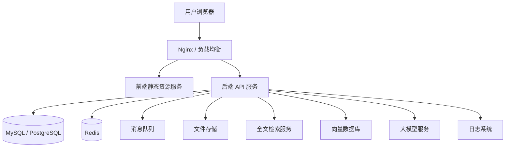

# Deployment 部署与运维设计

## 1. 部署架构

## 2. 环境规划

| 环境 | 说明 |
|---|---|
| DEV | 开发环境，用于开发和本地联调 |
| TEST | 测试环境，用于测试人员验证 |
| UAT | 用户验收环境，用于业务方验收 |
| PROD | 生产环境，用于正式使用 |

## 3. 服务清单

| 服务 | 说明 |
|---|---|
| frontend-web | PC Web 前端 |
| backend-api | 后端主服务 |
| enterprise-knowledge-ai-service | 知识库与摄取服务（默认 **8081**）；依赖 **MySQL**、**Milvus**、本地 **`app.kb.upload-dir`**；详见 `docs/step3-summary.md` |
| mysql/postgresql | 关系型数据库 |
| redis | 缓存 |
| minio/oss | 文件存储 |
| elasticsearch/opensearch | 全文检索 |
| milvus/pgvector | 向量检索 |
| rabbitmq/kafka/rocketmq | 异步任务和通知 |
| nginx | 反向代理和静态资源服务 |

## 4. 日志设计

系统应采集以下日志：

1. 应用运行日志。
2. 接口访问日志。
3. 异常错误日志。
4. 操作审计日志。
5. 智能问答调用日志。
6. 文档解析日志。

## 5. 监控指标

需要监控以下指标：

1. API QPS。
2. API 响应时间。
3. API 错误率。
4. 数据库 CPU、连接数和慢 SQL。
5. Redis 内存使用率。
6. 文件上传成功率。
7. 智能问答响应时间。
8. 文档解析失败率。
9. 会议预约失败率。
10. 通知发送成功率。

## 6. 备份策略

1. 数据库每日全量备份。
2. 关键业务数据尽量支持按小时增量备份。
3. 文件存储定期备份。
4. 知识库原始文档必须保留。
5. 解析文本和切片数据应保留。
6. 定期进行备份恢复演练。

## 7. 上线检查清单

生产上线前应检查：

1. 数据库迁移脚本已评审（含 `enterprise-knowledge-ai-service/src/main/resources/db/*.sql` 与 `schema.sql` 差异；**Milvus 集合 Schema 变更**时需评估是否 drop 重建集合）。
2. 环境配置已核对（`app.milvus.*`、`app.kb.upload-dir`、MySQL 库名等）。
3. 密钥和密码已安全存储。
4. 日志已开启。
5. 监控已开启。
6. 备份已开启。
7. 权限测试已通过。
8. 智能问答安全测试已通过。
9. 会议冲突测试已通过。
10. 回滚方案已准备。
