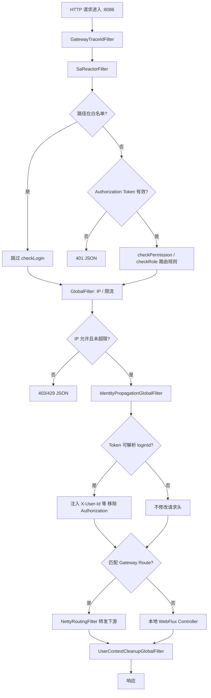
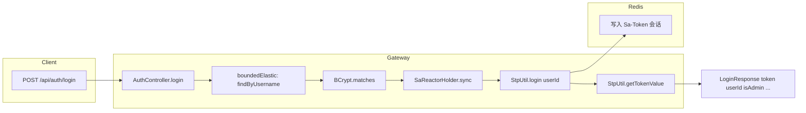
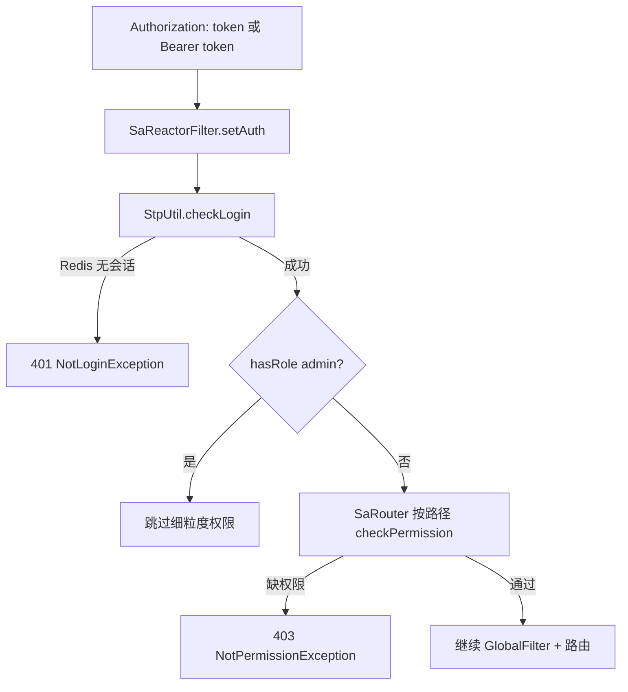
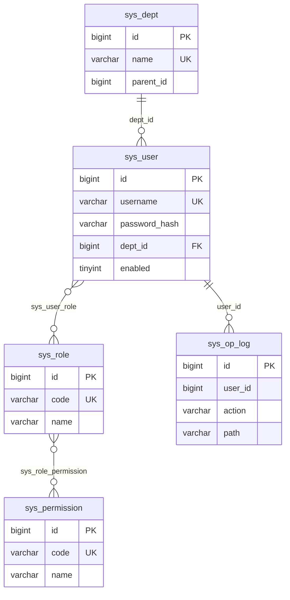

# enterprise-gateway-service 服务分析

> **文档版本**：v4.1 · **更新日期**：2026-05-27  
> 基于当前 `enterprise-gateway-service` 源码整理。认证方案为 **Sa-Token + Redis 会话**（已从 v3 的 JWT 方案迁移）。  
> 端到端登录说明见 [`login-flow.md`](login-flow.md)。

本文重点解释网关**真实请求顺序**（WebFilter / SaReactorFilter / GlobalFilter 的先后）、Sa-Token 在 WebFlux 下的编程约束、身份如何透传到下游、RBAC 与细粒度权限路由，以及本地开发与生产部署的常见坑。

### 速查卡

| 你想… | 看这里 |
|--------|--------|
| 理解请求怎么穿过网关 | §5 请求链路 |
| 登录 / Token / Redis | §7、§9、[`login-flow.md`](login-flow.md) |
| 下游为什么收不到 userId | §6.4、§10 |
| 403 权限不足 | §8 权限矩阵 + §8.5 种子补全 |
| 管理后台 API | §11、§24 |
| 本地 Vite 代理坑 | §10.3、§25 |
| 排查 500 SaTokenContext | §0、§16、§21 |
| curl 自测 | §26 |

**文档结构**

| 章节 | 内容 |
|------|------|
| §0 | **近期修复**（WebFlux + Sa-Token 踩坑） |
| §1–§4 | 定位、目录树、启动配置、Controller 分组 |
| §5 | **请求链路**（架构图 + WebFilter/GlobalFilter 对照） |
| §6–§8 | Filter 逐类、Sa-Token 鉴权、权限路由矩阵 |
| §9–§10 | 登录/退出/profile、身份透传与下游契约 |
| §11–§12 | SystemAdmin 全量 API、Service/Repository |
| §13–§14 | 路由表、数据库与种子数据 |
| §15–§16 | 响应/错误码、WebFlux + Sa-Token 编程规范 |
| §17 | 阅读路线与问题反查 |
| §18 | 完整代码地图（逐文件） |
| §19–§21 | 附录：REST 速查、调用链、Gotchas |
| §22–§27 | **v4.1 新增**：实体字段、Service 索引、DTO、前端映射、验证清单、文件清单 |

---

## 0. 近期修复（2026-05-27）

从 JWT 迁移到 Sa-Token 后，WebFlux 环境下出现过三类生产级故障，均已合入当前源码：

| 问题 | 现象 | 根因 | 修复 |
|------|------|------|------|
| 登录 500 | `POST /api/auth/login` → SaTokenContext 未初始化 | JPA 在 `boundedElastic`，`StpUtil.login` 脱离 Reactor 上下文 | `AuthController`：`SaReactorHolder.sync(() -> StpUtil.login(...))` |
| Profile 500 | `GET /api/auth/profile` 同上 | 直接调用 `StpUtil.checkLogin()` | profile/logout 同样包在 `SaReactorHolder.sync` |
| 转发 500 | `/api/meetings/**`、`/api/chat/**` 经网关 500 | `IdentityPropagationGlobalFilter` 调用 `StpUtil.isLogin()`，GlobalFilter 线程无 Sa 上下文 | 改为 `StpUtil.getLoginIdByToken(token)` |
| 路径解析 NPE | 偶发鉴权异常 | `setAuth` 强转 `(ServerWebExchange) obj` 为 null | 改用 `SaHolder.getRequest().getRequestPath()` / `getParam("token")` |

**排查口诀**：Controller 里动 `StpUtil` → 用 `SaReactorHolder.sync`；GlobalFilter 里动 `StpUtil` → 只用 `getLoginIdByToken`，不要用 `isLogin()` / `getLoginIdAsString()`。

---

## 1. 服务定位

`enterprise-gateway-service` 是平台 **生产环境主 HTTP 入口**（`:8086`），承担 7 条能力线：

1. **统一路由**：Spring Cloud Gateway + Nacos `lb://` 转发至 knowledge / collaboration / workbench
2. **Sa-Token 认证**：登录创建 Redis 会话；请求校验 Token；退出销毁会话
3. **RBAC + 细粒度权限**：用户/角色/权限/部门 CRUD；路由级 `checkPermission` / `checkRole`
4. **访问控制**：IP 黑白名单、内存固定窗口限流（默认 120 req/60s/IP）
5. **身份透传**：已认证转发请求注入 `X-User-Id` / `X-Department-Id` / `X-Is-Admin`，**移除 Authorization**
6. **全链路追踪**：`X-Trace-Id` 生成/透传 + MDC `%X{traceId}` 日志
7. **操作审计**：SystemAdmin 写操作异步写入 `sys_op_log`

| 项 | 值 |
|---|---|
| 端口 | **8086** |
| 数据库 | MySQL `enterprise_gateway` |
| 会话存储 | Redis `:6379`（Sa-Token） |
| ORM | JPA/Hibernate（`ddl-auto: none`） |
| 运行时 | **WebFlux + Spring Cloud Gateway**（非 Servlet） |
| 服务发现 | Nacos `:8848` → `lb://enterprise-*-service` |
| Java | 17 |
| 启动类 | `GatewaySpringbootStarter` |

**Maven 坐标**：`com.zjl:enterprise-gateway-service:1.0-SNAPSHOT`  
**父 POM**：`EnterpriseKnowledgeWorkspace`（Spring Boot **3.4.4**，Spring Cloud **2024.0.1**，Nacos **2025.0.0.0**，Sa-Token **1.43.0**）

### 1.1 平台架构位置

```text
┌─────────────┐  Authorization: <token>  ┌──────────────────────────┐
│  enterprise │ ────────────────────────► │ enterprise-gateway-service│
│  -web :5173 │                           │         :8086             │
└─────────────┘                           └───────────┬──────────────┘
                                                      │
         ┌────────────────────────────────────────────┼────────────────────────┐
         │ 本地 Controller                            │ lb:// 转发              │
         ▼                                            ▼                        ▼
  /api/auth/*, /api/system/*                    knowledge-ai :8083    collaboration :8090
  /api/contacts/*                               workbench :8084       /ws/** → :8090
```

> **统一认证（v4）**：全平台仅 **网关 `POST /api/auth/login`（Sa-Token）** 一套登录。Collaboration **已移除** `/api/auth/login` 与 JWT 过滤器；REST 与 WebSocket 均经 `:8086` 校验 Token，由 `IdentityPropagationGlobalFilter` 注入 **`X-User-Id`** 后转发至 `:8090`。Gateway 库 `sys_user` 是用户主数据；Collaboration 库若仍保留 `sys_user` 表仅为历史/种子，**不参与登录**。

### 1.2 与其他服务文档的交叉引用

| 下游 | 文档 | 端口 |
|------|------|:----:|
| knowledge-ai | `knowledge-service-code-analysis.md` | 8083 |
| collaboration | `collaboration-service-code-analysis.md` | 8090 |
| workbench | `workbench-service-code-analysis.md` | 8084 |
| 登录流程 | `login-flow.md` | — |

### 1.3 v3 → v4 迁移摘要

| v3（已废弃） | v4（当前） |
|-------------|-----------|
| `JwtUtil` / HS256 JWT | Sa-Token `simple-uuid` Token + Redis |
| `JwtAuthenticationWebFilter` + `SecurityConfig` | `SaReactorFilter`（`SaTokenConfig`） |
| `TokenBlacklistService` + `sys_token_blacklist` | `StpUtil.logout()` 销毁 Redis 会话 |
| `jjwt-*` 依赖 | `sa-token-reactor-spring-boot3-starter` + `sa-token-redis-jackson` |
| `@PreAuthorize("hasRole('ADMIN')")` | `SaTokenConfig` 内 `StpUtil.checkRole("admin")` |

---

## 2. 代码结构树

```text
enterprise-gateway-service/src/main/java/com/zjl/
├── GatewaySpringbootStarter.java
├── config/
│   ├── AppSecurityProperties.java       # app.security.whitelist
│   ├── AppGatewayProperties.java        # app.gateway.ip / rateLimit
│   ├── SaTokenConfig.java               # SaReactorFilter + 权限路由
│   └── SaTokenStpInterfaceImpl.java     # StpInterface：角色/权限数据源
├── filter/
│   ├── GatewayTraceIdFilter.java        # WebFilter
│   ├── IpAccessGlobalFilter.java        # GlobalFilter Order=-100
│   ├── SimpleRateLimitGlobalFilter.java # GlobalFilter Order=-90
│   ├── IdentityPropagationGlobalFilter.java # GlobalFilter Order=200
│   └── UserContextCleanupGlobalFilter.java  # GlobalFilter LOWEST_PRECEDENCE
├── security/
│   ├── UserContext.java                 # ThreadLocal（转发链 + 本地 Controller 日志）
│   └── PasswordConfig.java              # BCryptPasswordEncoder @Bean
├── web/
│   ├── AuthController.java              # login / logout / profile
│   ├── SystemAdminController.java       # RBAC 全套 + logs
│   ├── ContactDirectoryController.java  # 通讯录
│   └── GatewayExceptionHandler.java     # BizException / Sa-Token 异常
├── service/
│   ├── UserService.java
│   ├── UserInfoDTO.java
│   ├── RoleService.java
│   ├── RoleDTO.java
│   └── OpLogService.java
├── domain/          # SysUser, SysDept, SysRole, SysPermission, SysOpLog
├── repository/      # 5 个 JpaRepository
└── gateway/response/
    └── ApiResponseWriter.java
```

共 **32** 个 Java 源文件（v3 的 JWT/Security 相关类已移除）。

---

## 3. 启动与配置

### 3.1 启动入口

**文件**：`GatewaySpringbootStarter.java`

```java
@SpringBootApplication
public class GatewaySpringbootStarter { ... }
```

当前**未声明** `@EnableScheduling`（若后续需要定时任务，在启动类补充）。

### 3.2 配置加载

```yaml
spring.config.import:
  - optional:classpath:application-secrets.yml
  - optional:nacos:enterprise-gateway-service.yaml
  - optional:nacos:common-config.yaml
```

| 来源 | 典型内容 |
|------|----------|
| `application.yml` | 端口、路由、Sa-Token、白名单、限流、Redis |
| `application-secrets.yml` | `spring.datasource.password`（不入 Git） |
| Nacos | 数据源 URL、生产 Redis、IP 名单 |

### 3.3 完整配置项表

| 配置项 | 默认值（application.yml） | 说明 |
|--------|---------------------------|------|
| `server.port` | 8086 | HTTP |
| `spring.application.name` | `enterprise-gateway-service` | Nacos 注册名 |
| `spring.cloud.nacos.discovery.server-addr` | localhost:8848 | 服务发现 |
| `spring.jpa.hibernate.ddl-auto` | none | 不自动 DDL |
| `spring.jpa.open-in-view` | false | 关闭 OSIV |
| `spring.data.redis.host` | localhost | Sa-Token 会话 |
| `spring.data.redis.port` | 6379 | |
| `spring.cloud.gateway.default-filters` | PreserveHostHeader | 转发保留 Host |
| `sa-token.token-name` | **Authorization** | 与 HTTP 头同名 |
| `sa-token.timeout` | **2592000** | 30 天（秒） |
| `sa-token.is-concurrent` | true | 允许多端同时在线 |
| `sa-token.is-share` | false | 每次 login 生成新 Token |
| `sa-token.token-style` | simple-uuid | UUID 字符串 |
| `app.security.whitelist.paths` | login、actuator 等 | Ant 风格路径 |
| `app.gateway.rateLimit.enabled` | true | |
| `app.gateway.rateLimit.requests` | **120** | 窗口内最大请求（类默认 60） |
| `app.gateway.rateLimit.windowSeconds` | 60 | |
| `app.gateway.ip.blacklist` | [] | 精确 IP 匹配 |
| `app.gateway.ip.whitelist` | [] | 非空则仅允许列表内 IP |

### 3.4 鉴权白名单

| 路径 | 说明 |
|------|------|
| `/api/auth/login` | 唯一业务免登入口 |
| `/actuator/health` | 健康检查 |
| `/actuator/info` | 应用信息 |
| `/api/system/health` | yml 配置了但 **无 Controller 实现** |

### 3.5 Maven 依赖摘要

| 依赖 | 用途 |
|------|------|
| `spring-cloud-starter-gateway` | 网关核心 |
| `spring-boot-starter-webflux` | 响应式 Web |
| `sa-token-reactor-spring-boot3-starter` 1.43.0 | WebFlux 鉴权过滤器 |
| `sa-token-redis-jackson` | Token 会话持久化 |
| `spring-boot-starter-data-redis` + `commons-pool2` | Redis 连接池 |
| `spring-boot-starter-data-jpa` | RBAC 持久化 |
| `mysql-connector-j` | MySQL |
| `frameworks-common-spring-boot-starter` | Result、BizException、ErrorCode、TraceIdHolder |
| `spring-cloud-starter-alibaba-nacos-discovery/config` | Nacos |
| `spring-cloud-starter-loadbalancer` | `lb://` 解析 |
| `spring-boot-starter-actuator` | 健康/路由端点 |
| `spring-boot-starter-validation` | Jakarta Validation |
| `transmittable-thread-local` | 依赖引入（UserContext 当前用标准 ThreadLocal） |

> **已移除**：`spring-boot-starter-security`、`jjwt-*`（v3 JWT 方案）。

### 3.6 Actuator

```yaml
management.endpoints.web.exposure.include: health,info,gateway
management.endpoint.health.show-details: always
```

| 端点 | 白名单 | 说明 |
|------|:------:|------|
| `/actuator/health` | ✅ | 免 Token |
| `/actuator/info` | ✅ | 免 Token |
| `/actuator/gateway/routes` | ❌ | 需登录，可查看运行时路由 |

### 3.7 Nacos 集成

| 项 | 配置 |
|----|------|
| 注册 | `spring.cloud.nacos.discovery.server-addr: localhost:8848` |
| 配置中心 | `enterprise-gateway-service.yaml`、`common-config.yaml`（`optional:` + `refreshEnabled=true`） |
| 路由 URI | `lb://enterprise-knowledge-ai-service` 等，依赖 Nacos 实例列表 |
| 启动日志 | `nacos registry ... register finished` 表示注册成功 |

本地开发若 Nacos 未启动：配置为 `optional:` 时可降级；但 `lb://` 转发需要至少一个已注册实例，否则下游 503。

### 3.8 Redis 与 Sa-Token 会话

| 项 | 说明 |
|----|------|
| 依赖 | `sa-token-redis-jackson` + `spring-boot-starter-data-redis` |
| 连接 | `spring.data.redis.host/port`（默认 localhost:6379） |
| Token 存储 | Sa-Token 自动写入 Redis；logout 删除对应会话 |
| loginId | 值为 `sys_user.id` 字符串 |
| 运维 | Redis 宕机 → 全部 Token 失效，用户需重新登录 |

Actuator `health` 组件含 `redis` 状态，可用于探活。

### 3.9 数据库迁移脚本

路径：`src/main/resources/db/migration/`

| 脚本 | 作用 |
|------|------|
| `001-add-real-name.sql` | `sys_user` 增加 `real_name` 列 |
| `002-fix-seed-password-hash.sql` | 修复无效 BCrypt 种子 hash，测试密码统一为 `123456` |

> 项目约定 `spring.sql.init.mode=never`，迁移需**手动**在 MySQL `enterprise_gateway` 库执行。

### 3.10 日志

`logback-spring.xml`：控制台 pattern 含 `[%X{traceId}]`，与 `GatewayTraceIdFilter` / MDC 配合。

---

## 4. Controller 分组

### 4.1 本地处理（不匹配 Gateway Route，由 WebFlux Dispatcher 处理）

| Controller | 前缀 | 鉴权 | 返回类型 |
|-----------|------|------|----------|
| `AuthController` | `/api/auth` | login 白名单；logout/profile 需 Token | `Mono<Result<T>>` |
| `SystemAdminController` | `/api/system` | `SaTokenConfig` → `checkRole("admin")` | `Mono<Result<T>>` |
| `ContactDirectoryController` | `/api/contacts` | 登录 + `collab:contact:read` | `Mono<Result<T>>` |

### 4.2 转发下游

凡匹配 `application.yml` 中 `spring.cloud.gateway.routes` 的 Path predicate 的请求，经 GlobalFilter 链后 `NettyRoutingFilter` 转发至 Nacos 实例。

### 4.3 响应格式

Controller 与 Filter 均输出 `Result<T>`：

```json
{
  "code": "200",
  "message": "success",
  "data": { },
  "traceId": "uuid-or-upstream-id"
}
```

| 来源 | 失败码示例 |
|------|-----------|
| SaReactorFilter 未登录 | `40100` UNAUTHORIZED |
| SaReactorFilter 无角色/权限 | `40300` FORBIDDEN |
| IP 403 | `40300` FORBIDDEN |
| 限流 429 | `42900` 自定义 message |
| Controller BizException | 业务码如 `40000`、`40400` |
| 参数校验 | `40000` PARAM_INVALID |

Filter 层用 `ApiResponseWriter`；Controller 层用 `GatewayExceptionHandler` 捕获 `BizException`（HTTP 200 + code 非 200）。

---

## 5. 请求链路（重要：顺序与分流）

> **与旧 Spring Security 文档的区别**：当前无 `JwtAuthenticationWebFilter`。鉴权由 **`SaReactorFilter`（WebFilter）** 完成；IP/限流在其**之前**执行（GlobalFilter 与 WebFilter 的相对顺序见下文）。

### 5.1 真实 Filter 执行顺序

```text
【WebFilter 链 — 进入 Netty 后】
  ① GatewayTraceIdFilter              生成/透传 X-Trace-Id，写入 MDC
  ② SaReactorFilter（SaTokenConfig）  白名单跳过；否则 checkLogin + 权限路由
  ③ SaToken 内置 CORS / Context 等 WebFilter

【Gateway GlobalFilter 链 — 与 WebFilter 交错，大致如下】
  ④ IpAccessGlobalFilter              Order = -100
  ⑤ SimpleRateLimitGlobalFilter       Order = -90
  ⑥ … 框架内置 Filter（RoutePredicate、LoadBalancer 等）…
  ⑦ IdentityPropagationGlobalFilter   Order = 200
  ⑧ RouteToRequestUrlFilter           Order = 10000
  ⑨ NettyRoutingFilter                Order = MAX（转发下游或本地响应）
  ⑩ UserContextCleanupGlobalFilter    Order = LOWEST_PRECEDENCE（doFinally 清理 ThreadLocal）
```

**依据**：

- `IpAccessGlobalFilter.getOrder()` → `-100`
- `IdentityPropagationGlobalFilter.getOrder()` → `200`
- `UserContextCleanupGlobalFilter.getOrder()` → `Ordered.LOWEST_PRECEDENCE`
- Spring Cloud Gateway 内置 `RouteToRequestUrlFilter` Order = `10000`

**关键结论**：

1. **白名单路径**（如 `/api/auth/login`）跳过 `checkLogin`，但仍会经过 TraceId、IP、限流。
2. **非白名单**必须先通过 SaReactorFilter，才会进入路由转发。
3. `IdentityPropagationGlobalFilter` 在 Gateway 路由链中**不能**调用 `StpUtil.isLogin()`（ThreadLocal 上下文不在同一线程），改用 `StpUtil.getLoginIdByToken(token)`（见 §10.1）。

### 5.1.1 WebFilter 与 GlobalFilter 两阶段对照

| 阶段 | 组件类型 | 典型 Order | 是否验 Token |
|------|----------|------------|--------------|
| A | `GatewayTraceIdFilter`（WebFilter） | 最早 | 否 |
| B | `SaReactorFilter`（WebFilter） | Sa 内置 | **是**（白名单除外） |
| C | `IpAccessGlobalFilter` | -100 | 否 |
| D | `SimpleRateLimitGlobalFilter` | -90 | 否 |
| E | `IdentityPropagationGlobalFilter` | 200 | 读 Token 注入 Header |
| F | `NettyRoutingFilter` | MAX | 否 |
| G | `UserContextCleanupGlobalFilter` | LOWEST | 否（清理） |

**重要**：阶段 B 失败则请求不会进入下游；阶段 C/D 对**已通过 B 的请求**和**白名单请求**都会执行。未登录请求在 B 即 401，**不会**消耗 C/D 限流配额。

### 5.2 请求分流总览



### 5.3 两条典型路径对比

| 步骤 | `POST /api/auth/login` | `GET /api/kb/documents` + Authorization |
|------|------------------------|-------------------------------------------|
| TraceId | ✅ | ✅ |
| SaReactorFilter | 白名单跳过 | checkLogin + kb:document:read |
| IP/限流 | ✅ | ✅ |
| IdentityPropagation | 无 Token 或无效，不注入 | 注入 X-User-Id / X-Department-Id / X-Is-Admin，删 Authorization |
| 路由 | 无 Route → 本地 AuthController | knowledge-ai Route → :8083 |

### 5.4 登录流程



### 5.5 Token 校验流程（非白名单请求）



---

## 6. Filter 逐类说明

### 6.1 GatewayTraceIdFilter

| 项 | 值 |
|----|-----|
| 类型 | `WebFilter` |
| 常量 | `TRACE_ID_HEADER = "X-Trace-Id"` |
| 逻辑 | 有头则复用，无则 UUID；写 MDC + 响应头；`doFinally` 清理 MDC |

### 6.2 IpAccessGlobalFilter

| 项 | 值 |
|----|-----|
| Order | **-100** |
| 白名单非空 | IP 不在列表 → 403「IP 未在白名单内」 |
| 黑名单 | IP 在列表 → 403「IP 已被禁止访问」 |
| IP 来源 | `getRemoteAddress()` **仅直连 IP** |

### 6.3 SimpleRateLimitGlobalFilter

| 项 | 值 |
|----|-----|
| Order | **-90** |
| 算法 | 固定窗口：`windowStart = nowSec - nowSec % windowSeconds` |
| 计数 | `ConcurrentHashMap<String, WindowCounter>` key=IP（null 时用 `unknown`） |
| 拒绝 | `count > limit` → HTTP 429，body code=`42900` |
| 关闭 | `rateLimit.enabled=false` 直接放行 |

**窗口示例**（windowSeconds=60）：

```text
时间 10:00:00 ~ 10:00:59 → 同一 windowStart
第 121 次请求 → 429
10:01:00 → 新窗口，计数重置为 1
```

### 6.4 IdentityPropagationGlobalFilter

| 项 | 值 |
|----|-----|
| Order | **200** |
| Token 解析 | 从 `Authorization` 读取（兼容 `Bearer ` 前缀） |
| loginId | `StpUtil.getLoginIdByToken(token)` — **不依赖 SaTokenContext** |
| 注入 | `X-User-Id`, `X-Is-Admin`, 有部门时 `X-Department-Id` |
| 删除 | `Authorization` 头 |
| UserContext | 查库成功后 `UserContext.set(UserInfo)` 供本地 Controller 日志 |
| 未认证 | token 为空或无效 → 原样放行（下游 Servlet 服务会 401） |

**WebFlux 上下文陷阱（2026-05-27 修复）**：

Gateway 的 `GlobalFilter` 与 `SaReactorFilter` 不在同一线程绑定 Sa-Token 上下文。若在 GlobalFilter 中调用 `StpUtil.isLogin()` / `getLoginIdAsString()`，会抛出 `SaTokenContext 上下文尚未初始化` 并导致 `/api/meetings/**`、`/api/chat/**` 等转发 500。修复方式：仅用 `getLoginIdByToken` 做无上下文校验。

### 6.5 UserContextCleanupGlobalFilter

| 项 | 值 |
|----|-----|
| Order | `LOWEST_PRECEDENCE` |
| 逻辑 | `chain.filter(...).doFinally(_ -> UserContext.clear())` |
| 目的 | 防止 `IdentityPropagationGlobalFilter` 设置的 ThreadLocal 泄漏 |

### 6.6 ApiResponseWriter

Filter 层统一 JSON 输出工具，供 IP 拦截、限流使用；写入 `Result` 结构并保留 HTTP 状态码（403/429）。

---

## 7. Sa-Token 鉴权

### 7.1 核心类

| 类 | 职责 |
|----|------|
| `SaTokenConfig` | 注册 `SaReactorFilter`：白名单、checkLogin、SaRouter 权限、错误 JSON |
| `SaTokenStpInterfaceImpl` | 实现 `StpInterface`：从 `sys_user` 加载 role code / permission code |
| `AuthController` | login / logout / profile；login 内 `SaReactorHolder.sync` |
| `GatewayExceptionHandler` | 捕获 Controller 内 `NotLoginException` / `NotRoleException` |

### 7.2 Token 格式与传递

| 项 | 值 |
|---|---|
| 请求头 | `Authorization: <uuid>` |
| Bearer | 前端 `getAuthHeaders()` 可带 `Bearer` 前缀；网关解析时兼容 |
| 存储 | Redis（Sa-Token 管理 key，如 `satoken:login:token:*`） |
| loginId | `sys_user.id`（Long 转字符串） |
| 有效期 | 30 天（`sa-token.timeout=2592000`） |
| 并发 | `is-concurrent=true` 同账号多端在线；`is-share=false` 每次 login 新 Token |

### 7.3 角色与权限数据源

`SaTokenStpInterfaceImpl` 每次 `checkRole` / `checkPermission` 时按 loginId 查库：

```text
sys_user → sys_user_role → sys_role.code          → getRoleList()
sys_user → sys_role → sys_role_permission → sys_permission.code → getPermissionList()
```

**admin 短路**：`SaTokenConfig` 中若 `StpUtil.hasRole("admin")` 为 true，跳过所有 `SaRouter` 细粒度权限检查（但仍需已登录）。

### 7.4 鉴权错误响应

`SaTokenConfig.renderAuthError`：

| 异常 | code | message |
|------|------|---------|
| `NotLoginException` | 40100 | 未登录或登录已过期 |
| `NotRoleException` / `NotPermissionException` | 40300 | 无权限 |
| 其他 | 40100 | 异常 message 或默认文案 |

---

## 8. 权限路由矩阵（SaRouter）

以下规则在 `SaTokenConfig.setAuth` 中定义（非 admin 用户生效）：

### 8.1 Knowledge Base

| 路径 | GET | 其他方法 |
|------|-----|----------|
| `/api/kb/documents/**` | `kb:document:read` | `kb:document:write` |
| `/api/kb/bases/**` | `kb:bases:read` | `kb:bases:write` |
| `/api/kb/agent/chat` | `kb:agent:chat` | `kb:agent:chat` |
| `/api/kb/pipelines/**` | `kb:pipeline:read` | `kb:pipeline:write` |
| `/api/kb/categories` | `kb:document:read` | — |

### 8.2 Collaboration

| 路径 | GET | 其他方法 |
|------|-----|----------|
| `/api/meetings/**` | `collab:meeting:read` | `collab:meeting:write` |
| `/api/tasks/**` | `collab:task:read` | `collab:task:write` |
| `/api/todos/**` | `collab:todo:read` | `collab:todo:write` |
| `/api/docs/**` | `collab:doc:read` | `collab:doc:write` |
| `/api/chat/**` | `collab:chat:use` | `collab:chat:use` |
| `/api/approvals/**` | `collab:approval:read` | `collab:approval:write` |
| `/api/announcements/**` | `collab:announcement:read` | `collab:announcement:write` |
| `/api/contacts/**` | `collab:contact:read` | — |
| `/api/notifications/**` | `collab:notification:read` | — |
| `/api/intents/**` | `collab:intent:read` | — |
| `/api/keyword-mappings/**` | `collab:intent:read` | — |

### 8.3 Workbench & System

| 路径 | 权限 |
|------|------|
| `/api/workbench/**` | `workbench:access` |
| `/api/system/users/batch` | **仅需 login**（`SaRouter.match` 空回调，豁免 admin） |
| `/api/system/users/search` | **仅需 login**（同上） |
| `/api/system/**` 其余 | `checkRole("admin")` |

### 8.4 WebSocket

| 路径 | 规则 |
|------|------|
| `/ws/**` | query `token` 有效则 `StpUtil.setTokenValue(token)`；否则 fallback `checkLogin()` |

Route `collaboration-ws` 将 `/ws/**` 转发至 collaboration 服务。

> **种子数据注意**：`enterprise_knowledge_workspace.sql` 中 `sys_permission` 仅含 system/kb 共 9 条；collab/workbench 权限码需在库中补全并绑定角色，否则非 admin 用户访问对应 API 会 403。

### 8.5 权限种子补全示例（非 admin 用户必需）

`SaTokenConfig` 已引用但 SQL 种子未包含的 permission code，需手动 INSERT 并绑定到 `manager` / `user` 角色，例如：

```sql
INSERT INTO sys_permission (code, name) VALUES
  ('kb:bases:read', '查看知识库'),
  ('kb:bases:write', '管理知识库'),
  ('kb:agent:chat', 'Agent 对话'),
  ('kb:pipeline:read', '查看流水线'),
  ('kb:pipeline:write', '管理流水线'),
  ('collab:meeting:read', '查看会议'),
  ('collab:meeting:write', '管理会议'),
  ('collab:task:read', '查看任务'),
  ('collab:task:write', '管理任务'),
  ('collab:todo:read', '查看待办'),
  ('collab:todo:write', '管理待办'),
  ('collab:doc:read', '查看协同文档'),
  ('collab:doc:write', '编辑协同文档'),
  ('collab:chat:use', '使用 IM'),
  ('collab:approval:read', '查看审批'),
  ('collab:approval:write', '处理审批'),
  ('collab:announcement:read', '查看公告'),
  ('collab:announcement:write', '发布公告'),
  ('collab:contact:read', '查看通讯录'),
  ('collab:notification:read', '查看通知'),
  ('collab:intent:read', '查看意图配置'),
  ('workbench:access', '访问工作台')
ON DUPLICATE KEY UPDATE name = VALUES(name);
```

绑定示例（admin 角色可跳过检查，但 manager/user 必须绑定）：

```sql
INSERT INTO sys_role_permission (role_id, permission_id)
SELECT 2, p.id FROM sys_permission p WHERE p.code LIKE 'collab:%' OR p.code = 'workbench:access';
```

---

## 9. 登录、退出与 Profile

### 9.1 登录 API

**`POST /api/auth/login`**（白名单）

请求：

```json
{ "username": "admin", "password": "123456" }
```

测试环境种子账号密码均为 **`123456`**（见 `002-fix-seed-password-hash.sql`）。

响应 `LoginResponse`：

| 字段 | 来源 |
|------|------|
| token | `StpUtil.getTokenValue()` |
| userId | `user.id` |
| username | |
| realName | |
| deptId | `user.dept.id` 可 null |
| isAdmin | roles 含 code=admin |

失败：统一 `40100`「用户名或密码错误」。

**WebFlux 实现要点**：

```java
return Mono.fromCallable(() -> { /* JPA 查用户 + BCrypt */ })
    .subscribeOn(Schedulers.boundedElastic())
    .flatMap(user -> SaReactorHolder.sync(() -> {
        StpUtil.login(user.getId());
        return Results.success(new LoginResponse(...));
    }));
```

- JPA 在 `boundedElastic`
- `StpUtil.login` **必须**在 `SaReactorHolder.sync` 内，否则 `SaTokenContext 上下文尚未初始化`

### 9.2 Profile API

**`GET /api/auth/profile`**（需 Token）

返回 `ProfileResponse`（无 token），供前端 `checkAuth()` 刷新本地用户缓存。

### 9.3 退出 API

**`POST /api/auth/logout`**（需 Token）

- `SaReactorHolder.sync(() -> StpUtil.logout())`
- 销毁 Redis 中当前 Token 会话（非 JWT 黑名单）

---

## 10. 身份透传与下游契约

### 10.1 下游如何读身份

| 服务 | 机制 |
|------|------|
| knowledge-ai | `UserContextInterceptor` → `UserContextHolder` |
| workbench | `@RequestHeader X-User-Id` / `X-Is-Admin` |
| collaboration | 只读 `X-User-Id` / `X-Is-Admin`（**不验 Token**）；用户姓名经 `GatewayUserClient` 回调网关 batch/search |

### 10.2 Header 契约

| Header | Gateway 行为 | 下游 |
|--------|-------------|------|
| `X-User-Id` | 从 Token loginId 注入 | 必填（Servlet 拦截器） |
| `X-Is-Admin` | 角色含 admin → true/false | 权限放宽 |
| `X-Department-Id` | 查库后注入 `user.dept.id` | Knowledge DEPARTMENT 权限 |
| `X-Project-Id` | 未实现 | 文档预留 |
| `Authorization` | **转发前删除** | 下游不应依赖 Gateway Token |

### 10.3 前端开发代理（vite.config.js）

```javascript
proxy: {
  '/api/workbench': 'http://localhost:8084',
  '/api/kb':        'http://localhost:8083',
  '/api/auth':      'http://localhost:8086',
  '/api':           'http://localhost:8086',
  '/mcp':           'http://localhost:8083',
}
```

| 路径 | 实际到达 | 鉴权 |
|------|----------|------|
| `/api/auth/*`、`/api/system/*`、会议/聊天等 | 网关 :8086 | Sa-Token 完整链路 |
| `/api/kb/*` | **直连** knowledge :8083 | **绕过网关**；仅检查 `X-User-Id` |
| `/api/workbench/*` | **直连** workbench :8084 | 仅检查 `X-User-Id` |

联调完整鉴权链时，应统一经 `:8086` 入口。

---

## 11. SystemAdmin 全量 API

类：`SystemAdminController` · 前缀 `/api/system` · 鉴权由 `SaTokenConfig` 统一 `checkRole("admin")`

写操作异步记 `OpLogService.log(operatorId, operatorName, action, request, detail)`。  
操作日志读取 `UserContext.userId()`（由 `IdentityPropagationGlobalFilter` 在转发路径设置；纯本地 `/api/system` 请求同样会设置）。

### 11.1 用户

| 方法 | 路径 | 说明 |
|------|------|------|
| GET | `/users` | query: keyword, page, size |
| GET | `/users/stats` | UserStats |
| GET | `/users/{id}` | 含 dept、roles |
| POST | `/users` | CreateUserRequest，BCrypt 密码 |
| PUT | `/users/{id}` | UpdateUserRequest |
| PUT | `/users/{id}/roles` | `{roleCodes:[...]}` |
| DELETE | `/users/{id}` | **物理删除** |
| GET | `/users/batch` | 批量查询（SaRouter 免额外权限） |
| GET | `/users/search` | 搜索（SaRouter 免额外权限） |

### 11.2 角色

| 方法 | 路径 | Body |
|------|------|------|
| GET | `/roles` | — → `List<RoleDTO>` 含 userCount |
| GET | `/roles/{id}` | — |
| POST | `/roles` | `{code,name,permissionCodes?}` |
| PUT | `/roles/{id}` | `{name?,permissionCodes?}` |
| DELETE | `/roles/{id}` | userCount>0 拒绝 |

### 11.3 权限

| 方法 | 路径 | Body |
|------|------|------|
| GET | `/permissions` | — 全量 |
| POST | `/permissions` | `{code,name}` code 唯一 |

### 11.4 部门

| 方法 | 路径 | Body |
|------|------|------|
| GET | `/depts` | — |
| POST | `/depts` | `{name,parentId?}` name 唯一 |

### 11.5 操作日志

| 方法 | 路径 | Query |
|------|------|-------|
| GET | `/logs` | keyword, action, page, size |

**action 枚举（代码中出现的）**：

`CREATE_USER`, `UPDATE_USER`, `DELETE_USER`, `UPDATE_USER_ROLES`, `CREATE_ROLE`, `UPDATE_ROLE`, `DELETE_ROLE`, `CREATE_PERMISSION`, `CREATE_DEPT`

---

## 12. Service 与 Repository

### 12.1 UserService

| 方法 | 事务 | 说明 |
|------|------|------|
| `listUsers(keyword, page, size)` | 读写 | Page 1 起 |
| `listDirectoryUsers(deptId)` | readOnly | enabled=true；JOIN FETCH dept+roles |
| `getUser(id)` | 读写 | 40400 |
| `getUserStats()` | 读写 | total/enabled/admin/disabled |
| `createUser(...)` | 读写 | 用户名唯一；BCrypt |
| `updateUser(...)` | 读写 | 部分更新 |
| `deleteUser(id)` | 读写 | deleteById 物理删 |
| `updateUserRoles(id, codes)` | 读写 | 替换角色集 |

### 12.2 RoleService / OpLogService

- `RoleService`：角色 CRUD；删除前检查 `countByRoleId`
- `OpLogService`：异步 `Mono.fromRunnable(...).subscribeOn(boundedElastic).then()`

### 12.3 Repository 自定义 SQL

| Repository | 方法 | 要点 |
|------------|------|------|
| `SysUserRepository` | `searchUsers` | username OR realName LIKE |
| | `countByRoleId` | JOIN roles |
| | `countAdmin` | role.code = 'admin' |
| | `findDirectoryUsers` | enabled + optional deptId |
| `SysOpLogRepository` | `searchLogs` | keyword/action 过滤 |

### 12.4 ContactDirectoryController

| 端点 | 逻辑 |
|------|------|
| `GET /api/contacts/departments` | 全部部门 id ASC |
| `GET /api/contacts/users?deptId=` | 启用用户摘要 |

需登录 + `collab:contact:read`（admin 角色跳过）。

---

## 13. Gateway 路由表

配置：`application.yml` → `spring.cloud.gateway.routes`

### 13.1 已配置 Route

| Route ID | URI | Path |
|----------|-----|------|
| knowledge-ai | `lb://enterprise-knowledge-ai-service` | `/api/kb/**`, `/api/ai-qa/**` |
| collaboration | `lb://enterprise-collaboration-service` | `/api/meetings/**`, `/api/todos/**`, `/api/tasks/**`, `/api/notifications/**`, `/api/chat/**`, `/api/docs/**`, `/api/approvals/**`, `/api/announcements/**`, `/api/intents/**`, `/api/keyword-mappings/**` |
| workbench | `lb://enterprise-workbench-service` | `/api/workbench/**` |
| collaboration-ws | `lb://enterprise-collaboration-service` | `/ws/**` |

### 13.2 本地处理（无 Route 条目）

| 前缀 | Controller | 说明 |
|------|------------|------|
| `/api/auth/**` | AuthController | 登录/登出/profile |
| `/api/system/**` | SystemAdminController | RBAC 管理 |
| `/api/contacts/**` | ContactDirectoryController | 无 Route 条目，Dispatcher 本地处理 |

> `/api/contacts/**` 在 `SaTokenConfig` 中需 `collab:contact:read`，但数据来自**网关库** `sys_user` / `sys_dept`，不会转发到 collaboration 服务。

### 13.3 开发期 Vite 直连（不经 Gateway 鉴权）

| 前缀 | 直连端口 |
|------|----------|
| `/api/kb/**` | :8083 |
| `/api/workbench/**` | :8084 |
| `/mcp/**` | :8083 |

### 13.4 WebSocket

| 能力 | 经 Gateway | 直连 |
|------|-----------|------|
| IM / 文档协同 WS | `ws://host:8086/ws/...?token=`（Sa-Token，推荐） | `ws://host:8090/ws/...` + 握手头 `X-User-Id`（仅开发/集成测试） |

---

## 14. 数据库与种子数据

**Schema**：`enterprise_gateway`  
**DDL + Seed**：`resouces/enterprise_knowledge_workspace.sql`  
**密码修复脚本**：`enterprise-gateway-service/src/main/resources/db/migration/002-fix-seed-password-hash.sql`

### 14.1 ER 图



> v3 的 `sys_token_blacklist` 表在 Sa-Token 方案下**不再使用**（会话在 Redis）。

### 14.2 种子用户速查

**测试密码**：`123456`（BCrypt hash 见 migration 脚本）

| id | username | realName | dept | enabled | 角色 |
|----|----------|----------|------|---------|------|
| 1 | admin | 系统管理员 | 1 | ✅ | admin |
| 2 | zhangsan | 张三 | 1 | ✅ | manager |
| 3 | lisi | 李四 | 2 | ✅ | user |
| 4 | wangwu | 王五 | 1 | ❌ | user |
| 5 | zhaoliu | 赵六 | 3 | ✅ | user |

**角色**：admin / manager / user

**种子 permission（SQL 内）**：`system:*`, `kb:document:*` 等 9 条；collab/workbench 权限需另行 INSERT。

---

## 15. 响应与错误处理

### 15.1 两套异常出口

| 层级 | 处理器 | HTTP 状态 | Body code |
|------|--------|-----------|-----------|
| SaReactorFilter | `renderAuthError` JSON 字符串 | 200（Sa 默认） | 40100/40300 |
| IP/限流 Filter | `ApiResponseWriter` | 403/429 | 40300/42900 |
| Controller | `GatewayExceptionHandler` | **200** | BizException.code |
| Controller Sa 异常 | `GatewayExceptionHandler` | **200** | 40100/40300 |

### 15.2 ErrorCode（frameworks-common）

| 枚举 | 码 | 场景 |
|------|-----|------|
| UNAUTHORIZED | 40100 | 未登录/Token 无效 |
| FORBIDDEN | 40300 | 无权限/IP 拒绝 |
| PARAM_INVALID | 40000 | 校验、业务参数 |
| SYSTEM_ERROR | 50000 | 未捕获 |

---

## 16. WebFlux + JPA + Sa-Token 编程规范

### 16.1 铁律

1. **所有 JPA 调用**必须在 `Schedulers.boundedElastic()` 上执行。
2. **所有 `StpUtil.login/logout/checkLogin/getTokenValue`** 必须在 `SaReactorHolder.sync(() -> { ... })` 内执行（或在 `SaReactorFilter` 已激活的同步回调中）。
3. **GlobalFilter 中不要调用依赖 ThreadLocal 上下文的 StpUtil 方法**；用 `getLoginIdByToken` 代替。

### 16.2 常见组合模式

| 场景 | 模式 |
|------|------|
| 登录 | `fromCallable(JPA).subscribeOn(boundedElastic).flatMap(u -> SaReactorHolder.sync(() -> { StpUtil.login; return Result }))` |
| profile | `SaReactorHolder.sync(checkLogin).flatMap(id -> fromCallable(JPA)...)` |
| 查询 API | `fromCallable(...).subscribeOn(boundedElastic).map(Results::success)` |
| 身份透传 | GlobalFilter 内 `getLoginIdByToken` + `fromCallable(findById).subscribeOn(boundedElastic)` |

### 16.3 UserContext 生命周期

```text
IdentityPropagationGlobalFilter（有 Token）
    → UserContext.set(UserInfo)
    → SystemAdminController 日志读 UserContext.userId()
UserContextCleanupGlobalFilter.doFinally
    → UserContext.clear()
```

---

## 17. 阅读路线与问题反查

| 阶段 | 阅读顺序 |
|------|----------|
| ① | `application.yml` routes + whitelist + sa-token |
| ② | §5 请求顺序（本文） |
| ③ | `SaTokenConfig` → `SaTokenStpInterfaceImpl` |
| ④ | GlobalFilter 五个类 |
| ⑤ | `AuthController` → Redis 会话 |
| ⑥ | `SystemAdminController` → `UserService` |
| ⑦ | `IdentityPropagationGlobalFilter` + 下游 Interceptor |

| 现象 | 排查 |
|------|------|
| 登录 500 SaTokenContext | login/profile 是否包在 `SaReactorHolder.sync` 内 |
| 转发 500 SaTokenContext | GlobalFilter 是否误用 `StpUtil.isLogin()` |
| 有 token 仍 401 | Redis 是否启动；Token 是否已 logout；header 名是否为 Authorization |
| 403 访问 kb/meeting | 非 admin 用户是否缺少对应 permission 种子数据 |
| ADMIN 403 | 角色 code 是否为 `admin`（Sa-Token 用小写 `admin`） |
| 下游无 userId | 是否经 Gateway；Vite 直连是否伪造/遗漏 X-User-Id |
| dept 权限失效 | 经 Gateway 时应有 X-Department-Id；直连 kb 需前端手动带头 |
| 8086 端口冲突 | IDEA 与 Maven 同时 `spring-boot:run` → exit 137 |
| `/api/system/health` 404 | 白名单配置了但未实现 |
| 协作 Connection refused | collaboration :8090 未启动 |

---

## 18. 完整代码地图（逐文件）

### 18.1 启动与配置

| 文件 | 说明 |
|------|------|
| `GatewaySpringbootStarter.java` | 启动入口 |
| `config/AppSecurityProperties.java` | whitelist.paths |
| `config/AppGatewayProperties.java` | ip、rateLimit |
| `config/SaTokenConfig.java` | SaReactorFilter + SaRouter |
| `config/SaTokenStpInterfaceImpl.java` | RBAC 数据源 |

### 18.2 Filter

| 文件 | 说明 |
|------|------|
| `filter/GatewayTraceIdFilter.java` | WebFilter；X-Trace-Id |
| `filter/IpAccessGlobalFilter.java` | IP 403 |
| `filter/SimpleRateLimitGlobalFilter.java` | 429 限流 |
| `filter/IdentityPropagationGlobalFilter.java` | 下游 Header；getLoginIdByToken |
| `filter/UserContextCleanupGlobalFilter.java` | ThreadLocal 清理 |

### 18.3 Security

| 文件 | 说明 |
|------|------|
| `security/UserContext.java` | ThreadLocal 用户上下文 |
| `security/PasswordConfig.java` | BCryptPasswordEncoder |

### 18.4 Web / Service / Domain / Repository

| 包 | 关键文件 |
|----|----------|
| web | AuthController, SystemAdminController, ContactDirectoryController, GatewayExceptionHandler |
| service | UserService, RoleService, OpLogService, RoleDTO, UserInfoDTO |
| domain | SysUser, SysDept, SysRole, SysPermission, SysOpLog |
| repository | 5 × JpaRepository + 自定义 JPQL |
| gateway/response | ApiResponseWriter |

---

## 19. 附录 A — REST 接口速查

### Auth `/api/auth`

| 方法 | 路径 | 鉴权 |
|------|------|------|
| POST | `/login` | 白名单 |
| POST | `/logout` | Token |
| GET | `/profile` | Token |

### System `/api/system`

| 资源 | 方法 | 鉴权 |
|------|------|------|
| users（管理） | GET/POST `/users`, GET/PUT/DELETE `/users/{id}`, GET `/users/stats`, PUT `/users/{id}/roles` | admin |
| users/batch | GET `/users/batch?ids=1,2,3` | **login 即可** |
| users/search | GET `/users/search?keyword=&limit=50` | **login 即可** |
| roles | GET/POST `/roles`, GET/PUT/DELETE `/roles/{id}` | admin |
| permissions | GET/POST `/permissions` | admin |
| depts | GET/POST `/depts` | admin |
| logs | GET `/logs` | admin |

### Contacts `/api/contacts`（login + collab:contact:read）

| 方法 | 路径 |
|------|------|
| GET | `/departments` |
| GET | `/users?deptId=` |

---

## 20. 附录 B — 关键调用链

### 20.1 登录

```
POST /api/auth/login
  AuthController.login
    Mono.fromCallable → SysUserRepository.findByUsername (boundedElastic)
    BCryptPasswordEncoder.matches
    SaReactorHolder.sync → StpUtil.login(userId) → Redis
    StpUtil.getTokenValue
    Results.success(LoginResponse)
```

### 20.2 带 Token 访问下游 KB

```
GET /api/kb/documents + Authorization
  GatewayTraceIdFilter
  SaReactorFilter → checkLogin → kb:document:read
  IpAccessGlobalFilter → SimpleRateLimitGlobalFilter
  IdentityPropagationGlobalFilter
    getLoginIdByToken → X-User-Id, X-Department-Id, X-Is-Admin
    remove Authorization
  Route knowledge-ai → NettyRoutingFilter → :8083
  Knowledge UserContextInterceptor
```

### 20.3 管理员创建用户

```
POST /api/system/users + Authorization (admin)
  SaReactorFilter → checkRole("admin")
  UserService.createUser (boundedElastic)
  OpLogService.log CREATE_USER (async)
  Results.success(SysUser)
```

### 20.4 退出后再访问

```
POST /api/auth/logout → StpUtil.logout → Redis 删会话
GET /api/kb/... + 旧 token
  SaReactorFilter checkLogin → 401
```

---

## 21. 附录 C — Gotchas 与改进建议

| 项 | 现状 | 影响 | 建议 |
|----|------|------|------|
| SaTokenContext in GlobalFilter | 已修复为 getLoginIdByToken | 否则转发 500 | 新增 GlobalFilter 时禁止依赖 StpUtil 上下文 |
| collab 权限种子缺失 | SQL 仅 9 条 permission | 非 admin 403 | 补全 collab/workbench 权限并绑定角色 |
| 物理删用户 | deleteById | 与 AGENTS 软删规范冲突 | 加 deleted 字段 |
| 限流内存 | 多实例独立 | 总阈值 = N × 120 | Redis 集中限流 |
| 代理 IP | remoteAddress | 限流/IP 不准 | X-Forwarded-For + 可信代理 |
| 双 sys_user | 两库独立 | 协同账号不同步 | SSO 或同步任务 |
| Vite 直连 kb/workbench | 绕过 Sa-Token | 安全边界弱化 | 生产统一 :8086 |
| StpInterface 每次查库 | 无缓存 | 高 QPS 时 DB 压力 | Redis 缓存权限列表 |
| UserContext.isAdmin | set(UserInfo) 未写 isAdmin | isAdmin() 可能 null | 补 set admin 标志 |
| /api/system/health | 白名单无实现 | 探针 404 | 实现或删白名单 |
| IDEA + Maven 双启动 | 8086 冲突 exit 137 | 网关不可用 | 只保留一个实例 |

---

## 22. 实体字段全表（JPA Domain）

### 22.1 sys_user

| 字段 | 类型 | 说明 |
|------|------|------|
| id | Long PK | 自增；Sa-Token loginId |
| username | String(64) UK | 登录名 |
| passwordHash | String(200) | BCrypt；`@JsonIgnore` 不序列化 |
| realName | String(64) | 显示名 |
| dept | ManyToOne LAZY | → sys_dept |
| enabled | boolean | false 禁止登录 |
| roles | ManyToMany **EAGER** | → sys_user_role |
| createdAt / updatedAt | Instant | 审计 |

### 22.2 sys_role

| 字段 | 类型 | 说明 |
|------|------|------|
| id | Long PK | |
| code | String(64) UK | 如 `admin`；Sa-Token `checkRole` 用小写 code |
| name | String(128) | 显示名 |
| permissions | ManyToMany EAGER | → sys_role_permission |

### 22.3 sys_permission

| 字段 | 类型 | 说明 |
|------|------|------|
| id | Long PK | |
| code | String UK | 如 `kb:document:read` |
| name | String | 显示名 |

### 22.4 sys_dept

| 字段 | 类型 | 说明 |
|------|------|------|
| id | Long PK | |
| name | String UK | 部门名 |
| parentId | Long | 上级部门，可 null |

### 22.5 sys_op_log

| 字段 | 类型 | 说明 |
|------|------|------|
| id | Long PK | |
| userId | Long | 操作人 |
| username | String | 冗余用户名 |
| action | String | 如 `CREATE_USER` |
| path | String | 请求路径 |
| detail | String | 附加说明 |
| createdAt | Instant | |

---

## 23. Service 方法索引

### 23.1 UserService

| 方法 | 返回 | 说明 |
|------|------|------|
| `listUsers(keyword, page, size)` | `PageResult<SysUser>` | 管理后台分页 |
| `listDirectoryUsers(deptId)` | `List<Map>` | 通讯录；enabled 用户 |
| `getUser(id)` | `SysUser` | 详情；40400 |
| `batchGetUsers(ids)` | `Map<Long, UserInfoDTO>` | `/users/batch` |
| `searchUsers(keyword, limit)` | `List<UserInfoDTO>` | `/users/search` |
| `getUserStats()` | `UserStats` | total/enabled/admin/disabled |
| `createUser(...)` | `SysUser` | BCrypt + 角色 |
| `updateUser(...)` | `SysUser` | 部分更新 |
| `deleteUser(id)` | void | 物理删除 |
| `updateUserRoles(id, codes)` | `SysUser` | 替换角色集 |

### 23.2 RoleService

| 方法 | 说明 |
|------|------|
| `listRoles()` | `RoleDTO` + userCount |
| `getRole(id)` | 单角色 |
| `createRole / updateRole` | 绑定 permissionCodes |
| `deleteRole(id)` | 有用户则 40000 |

### 23.3 OpLogService

| 方法 | 说明 |
|------|------|
| `log(operatorId, operatorName, action, request, detail)` | 异步 boundedElastic 写 `sys_op_log` |

---

## 24. Controller DTO 与请求体

### 24.1 AuthController

| Record | 字段 |
|--------|------|
| `LoginRequest` | username, password |
| `LoginResponse` | token, userId, username, realName, deptId, isAdmin |
| `ProfileResponse` | userId, username, realName, deptId, isAdmin（无 token） |

### 24.2 SystemAdminController

| Record | 字段 |
|--------|------|
| `CreateUserRequest` | username, password, realName?, deptId?, roleCodes? |
| `UpdateUserRequest` | realName?, deptId?, enabled?, roleCodes? |
| `UpdateUserRolesRequest` | roleCodes（非空） |
| `CreateRoleRequest` | code, name, permissionCodes? |
| `UpdateRoleRequest` | name?, permissionCodes? |
| `CreatePermissionRequest` | code, name |
| `CreateDeptRequest` | name, parentId? |

### 24.3 UserInfoDTO（下游批量查询）

| 字段 | 说明 |
|------|------|
| userId | |
| username | |
| realName | |
| deptId / deptName | 可 null |

---

## 25. 前端消费映射

| 前端模块 | 文件 | 网关 API | 说明 |
|----------|------|----------|------|
| 登录 | `Login.vue` | `POST /api/auth/login` | `saveStoredAuth` 写 token + user |
| 启动鉴权 | `api/index.js` `checkAuth()` | `GET /api/auth/profile` | 刷新 localStorage |
| 请求头 | `getAuthHeaders()` | — | `Authorization` + `X-User-Id` 等 |
| 路由守卫 | `router/index.js` | — | `requiresAuth` / `requiresAdmin` |
| 管理后台 | `admin/*.vue` | `/api/system/**` | 需 admin 角色 |
| 通讯录 | `Contacts.vue` | `/api/contacts/**` | 网关本地；需 collab:contact:read |
| 知识库 | `Documents.vue` 等 | `/api/kb/**` | Vite **直连 :8083**，绕过网关 Sa-Token |
| 工作台 | `Dashboard.vue` | `/api/workbench/**` | Vite **直连 :8084** |

**生产建议**：前端统一走 `:8086`，避免直连下游伪造 `X-User-Id`。

---

## 26. 快速验证清单

```bash
# 0. 前置：MySQL enterprise_gateway、Redis :6379、Nacos（可选）

# 1. 启动网关
mvn spring-boot:run -pl enterprise-gateway-service

# 2. 健康检查（白名单）
curl -s http://localhost:8086/actuator/health | jq .status

# 3. 登录
TOKEN=$(curl -s -X POST http://localhost:8086/api/auth/login \
  -H 'Content-Type: application/json' \
  -d '{"username":"admin","password":"123456"}' | jq -r '.data.token')
echo "token=$TOKEN"

# 4. Profile
curl -s http://localhost:8086/api/auth/profile -H "Authorization: $TOKEN" | jq .

# 5. 经网关访问知识库（需 admin 或 kb:document:read 权限）
curl -s 'http://localhost:8086/api/kb/documents?current=1&size=5' \
  -H "Authorization: $TOKEN" | jq '.code, .data.total'

# 6. 非 admin 批量用户（仅需 login）
curl -s "http://localhost:8086/api/system/users/batch?ids=1,2" \
  -H "Authorization: $TOKEN" | jq .

# 7. 登出
curl -s -X POST http://localhost:8086/api/auth/logout -H "Authorization: $TOKEN" | jq .

# 8. 旧 Token 应 401
curl -s http://localhost:8086/api/auth/profile -H "Authorization: $TOKEN" | jq .code
```

---

## 27. 32 个 Java 源文件清单

| # | 路径 |
|---|------|
| 1 | `GatewaySpringbootStarter.java` |
| 2–5 | `config/AppSecurityProperties`, `AppGatewayProperties`, `SaTokenConfig`, `SaTokenStpInterfaceImpl` |
| 6–10 | `filter/GatewayTraceId`, `IpAccess`, `SimpleRateLimit`, `IdentityPropagation`, `UserContextCleanup` |
| 11–12 | `security/UserContext`, `PasswordConfig` |
| 13–16 | `web/AuthController`, `SystemAdminController`, `ContactDirectoryController`, `GatewayExceptionHandler` |
| 17–21 | `service/UserService`, `UserInfoDTO`, `RoleService`, `RoleDTO`, `OpLogService` |
| 22–26 | `domain/SysUser`, `SysDept`, `SysRole`, `SysPermission`, `SysOpLog` |
| 27–31 | `repository/SysUser`, `SysDept`, `SysRole`, `SysPermission`, `SysOpLog` |
| 32 | `gateway/response/ApiResponseWriter.java` |

---

*文档结束 · v4.1 · 2026-05-27 · 认证方案 Sa-Token + Redis*
