# Enterprise Gateway Service 详细设计文档


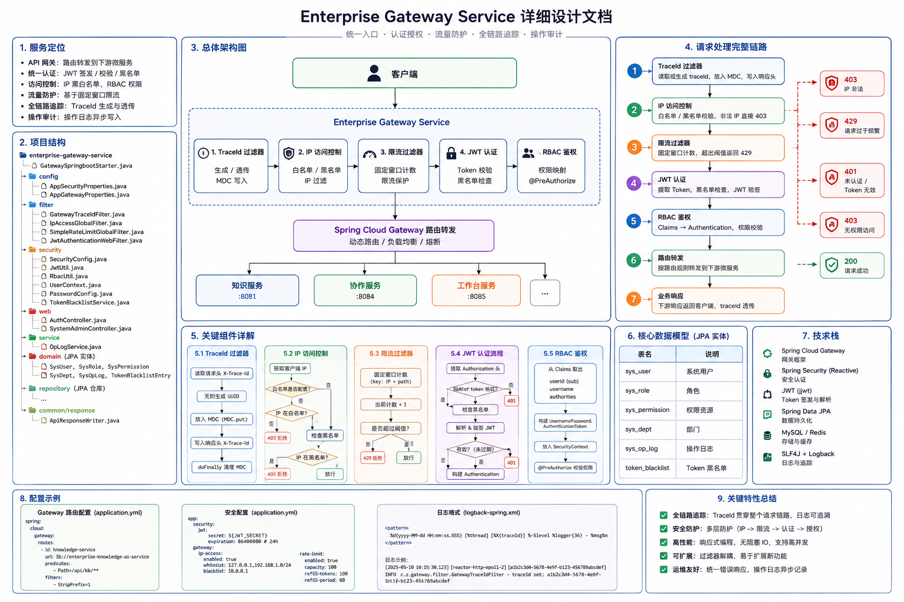

## 1. 服务定位

`enterprise-gateway-service` 是整个企业知识工作平台的**统一入口**，承担以下职责：

- **API 网关**：路由转发，将请求分发到下游微服务（知识服务、协作服务、工作台服务）
- **统一认证**：JWT 签发 / 校验 / 黑名单管理
- **访问控制**：IP 黑白名单、RBAC 权限校验
- **流量防护**：基于固定窗口的简易限流
- **全链路追踪**：TraceId 生成与透传
- **操作审计**：管理操作日志异步写入

---

## 2. 项目结构

```
enterprise-gateway-service/src/main/java/com/zjl/
├── GatewaySpringbootStarter.java          # 启动入口
├── config/
│   ├── AppSecurityProperties.java         # JWT / 白名单配置
│   └── AppGatewayProperties.java          # IP黑白名单 / 限流配置
├── filter/
│   ├── GatewayTraceIdFilter.java          # TraceId 生成与透传（最先执行）
│   ├── IpAccessGlobalFilter.java          # IP 黑白名单过滤（Order=-100）
│   ├── SimpleRateLimitGlobalFilter.java   # 简易限流（Order=-90）
│   └── JwtAuthenticationWebFilter.java    # JWT 认证过滤器
├── security/
│   ├── SecurityConfig.java                # Spring Security 核心配置
│   ├── JwtUtil.java                       # JWT 签发与解析
│   ├── RbacUtil.java                      # Claims → Authentication 映射
│   ├── UserContext.java                   # 请求级用户上下文（ThreadLocal）
│   ├── PasswordConfig.java                # BCrypt 密码编码器
│   └── TokenBlacklistService.java         # Token 黑名单（登出失效）
├── web/
│   ├── AuthController.java                # 登录 / 退出接口
│   └── SystemAdminController.java         # RBAC 管理后台（管理员专用）
├── service/
│   └── OpLogService.java                  # 操作日志异步写入
├── domain/                                # JPA 实体
│   ├── SysUser.java
│   ├── SysRole.java
│   ├── SysPermission.java
│   ├── SysDept.java
│   ├── SysOpLog.java
│   └── TokenBlacklistEntry.java
├── repository/                            # JPA 仓库
│   └── ...
└── common/response/
    └── ApiResponseWriter.java             # 统一 JSON 响应输出器
```

---

## 3. 请求处理完整链路

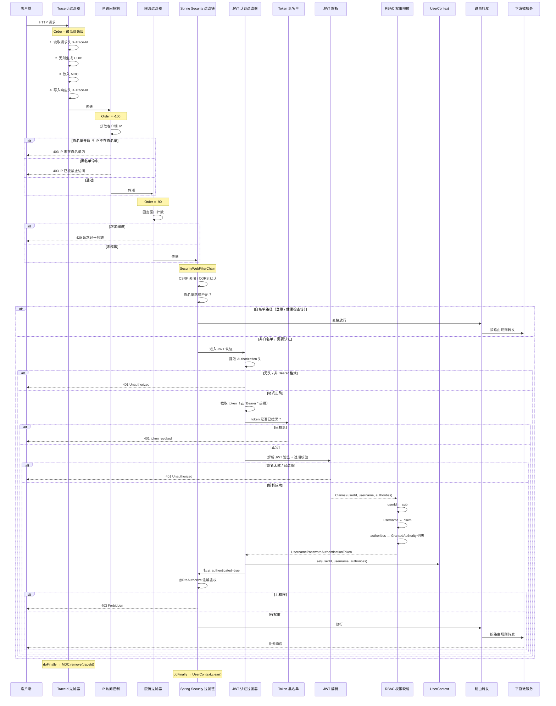

---

## 4. 各层详解

### 4.1 TraceId 过滤器（GatewayTraceIdFilter）

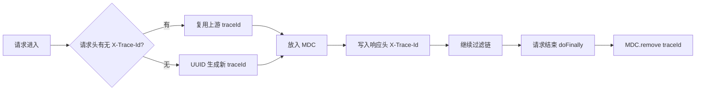

**关键设计**：
- 实现了 `WebFilter` 接口（非 `GlobalFilter`），优先级最高，最先执行
- 请求头透传机制：如果上游（Nginx、前端）已传 traceId，直接复用，保证全链路串联
- 响应也带 traceId，排查问题时前端可直接拿到
- `doFinally` 清理 MDC，防止线程复用时 traceId 串用
- 日志配置 `%X{traceId}` 让每条日志自动带上 traceId

### 4.2 IP 访问控制（IpAccessGlobalFilter）

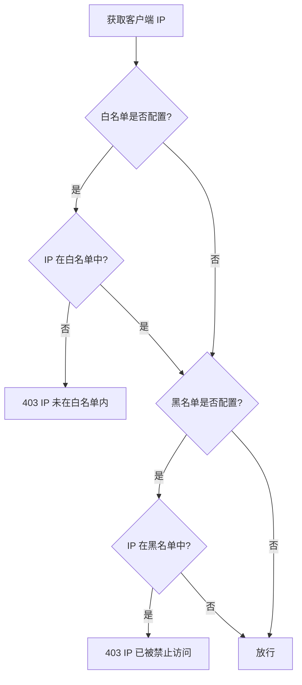

**关键设计**：
- `Order = -100`，在限流和认证之前执行
- 白名单优先：若配置了白名单，非白名单 IP 直接拒绝（黑名单不再检查）
- 从 `remoteAddress` 获取 IP；若部署在反向代理后需要改为解析 `X-Forwarded-For`
- 均通过 `ApiResponseWriter` 返回统一 JSON

### 4.3 简易限流（SimpleRateLimitGlobalFilter）

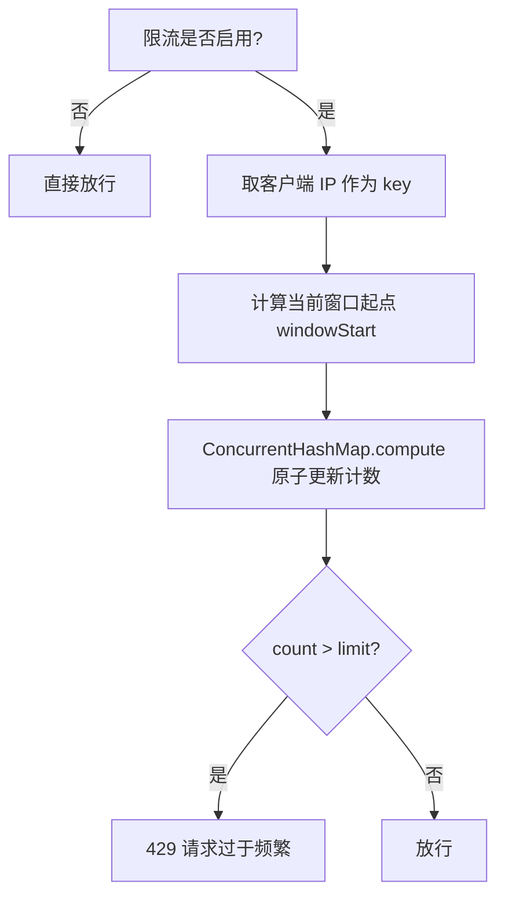

**关键设计**：
- `Order = -90`，在 IP 过滤之后、认证之前执行
- 算法：**固定窗口计数**，按 IP 维度统计，窗口大小和阈值可配置
- 使用 `ConcurrentHashMap.compute` 原子更新，无锁线程安全
- MVP 阶段使用内存计数器，生产环境建议替换为 Redis 集中式限流
- 当前默认：60 秒窗口内最多 120 次请求

### 4.4 Spring Security 过滤链（SecurityConfig）

```mermaid
flowchart TD
    subgraph SecurityWebFilterChain
        A[csrf: disable] --> B[cors: defaults]
        B --> C[securityContextRepo: NoOp 无状态]
        C --> D[httpBasic/formLogin: disable]
        D --> E[请求结束 → UserContext.clear]
        E --> F{URL 匹配?}
        F -->|白名单| G[permitAll 放行]
        F -->|其他| H[需要认证]
        H --> I[JWT 认证过滤器]
        I -->|成功| J[@PreAuthorize 权限校验]
        J -->|有权限| K[转发下游]
        I -->|失败| L[401 统一 JSON]
        J -->|无权限| M[403 统一 JSON]
    end
```

**关键设计**：
- **无状态模式**：`NoOpServerSecurityContextRepository`，不依赖 Session
- **关闭 CSRF**：前后端分离 + JWT，无 Cookie-Session 机制
- **白名单**：登录接口 `/api/auth/login`、健康检查等直接放行
- **JWT 过滤器**：在 `AUTHENTICATION` 位置替换默认的表单认证
- **异常统一处理**：401 和 403 通过 `ApiResponseWriter` 返回 JSON，而非默认的重定向页面
- **UserContext 清理**：`doFinally` 确保每次请求结束清空 ThreadLocal

### 4.5 JWT 认证过滤器（JwtAuthenticationWebFilter）

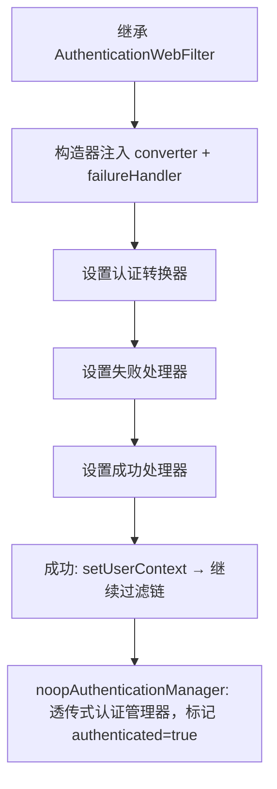

**关键设计**：
- 继承 Spring Security 的 `AuthenticationWebFilter`，只负责**组装流程**
- 真正的 JWT 解析逻辑在 `ServerAuthenticationConverter`（定义在 SecurityConfig 中）
- 使用"透传式"认证管理器：converter 已完成校验，不再二次认证
- 认证成功后将用户信息写入 `UserContext`，供业务代码使用

### 4.6 JWT 认证转换器（jwtAuthenticationConverter）

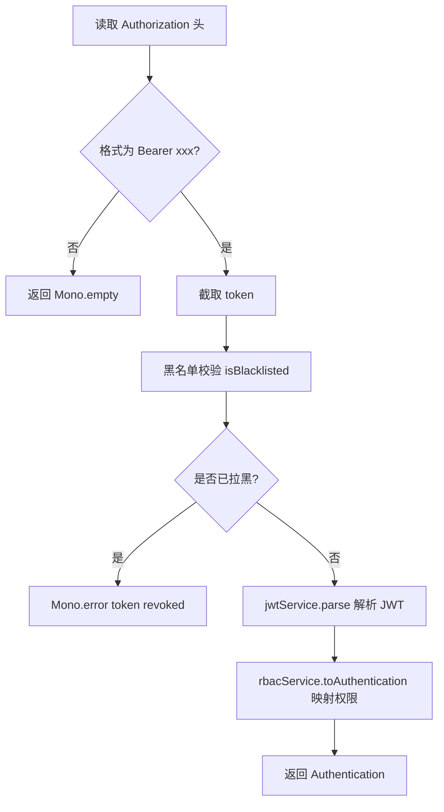

**完整转换链路**：
```
HTTP Request → 提取 Bearer token → 黑名单校验 → JWT 解析 → RBAC 权限映射 → Authentication
```

### 4.7 RBAC 权限映射（RbacUtil）

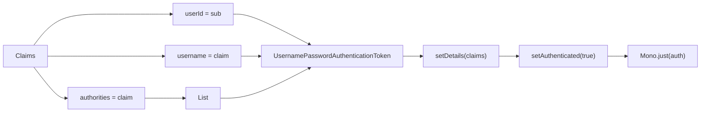

**JWT Claims 约定**：

| Claim | 含义 | 示例 |
|-------|------|------|
| `sub` | 用户 ID | `1` |
| `username` | 用户名 | `admin` |
| `authorities` | 权限列表 | `["ROLE_ADMIN", "PERM_doc_delete"]` |

### 4.8 UserContext（请求级用户上下文）

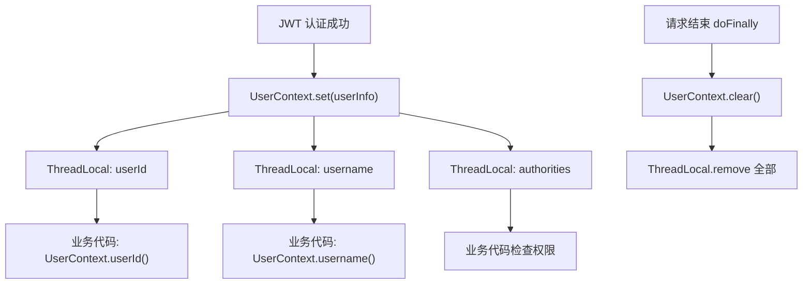

**为什么用 ThreadLocal**：
- 避免层层传参：下游任何地方直接 `UserContext.userId()` 即可获取当前用户
- `doFinally` 确保每次请求结束自动清理，防止内存泄漏和上下文串用

---

## 5. 认证模块详解

### 5.1 登录流程

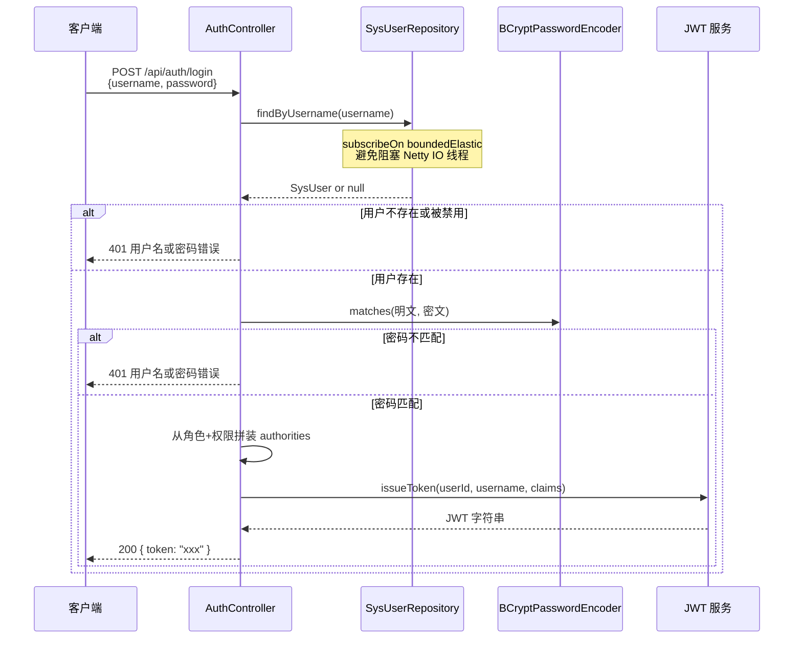

**authorities 组装规则**（`authoritiesOf` 方法）：

```
用户拥有的角色 → ROLE_admin, ROLE_user
用户拥有的权限 → PERM_doc_delete, PERM_user_create
最终 JWT 中存储完整的角色 + 权限列表
```

**安全设计**：
- 不区分"用户不存在"和"密码错误"，统一返回相同错误信息，防止用户名枚举攻击
- BCrypt 加密存储，不可逆
- JWT 有效期可配置（默认 7200 秒）

### 5.2 退出流程（Token 黑名单）

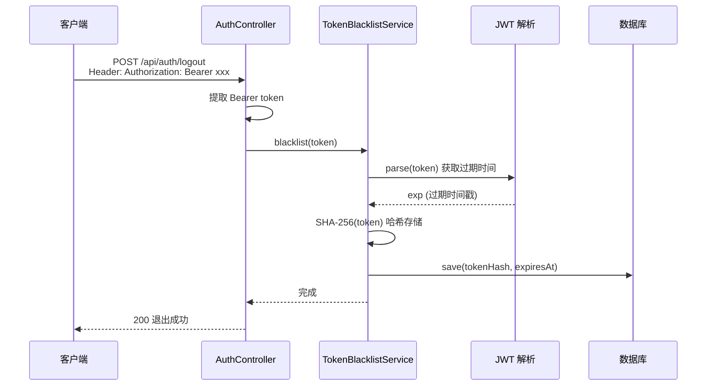

**为什么不用 JWT 自身的过期机制而要加黑名单？**

JWT 的过期时间是签发时固定的，假设签发时设了 2 小时有效期，用户在第 1 小时点击退出，剩余的 1 小时内 token 仍然有效。黑名单解决了这个问题——退出后立即让 token 失效。

**安全细节**：
- 数据库只存 SHA-256 哈希，不存原文，防止数据库泄露时 token 被窃取
- 记录 `expiresAt`，定时任务每 60 秒清理已过期条目
- 退出接口幂等设计：无 token 也返回成功

### 5.3 管理后台（SystemAdminController）

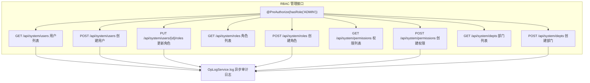

**RBAC 数据模型**：

```
SysUser ──多对多── SysRole ──多对多── SysPermission
   │                    │
   └── deptId           └── code (ROLE_ADMIN / ROLE_USER)
   
SysDept (树形结构, parentId)
```

**角色编码约定**：
- `admin` → JWT 中存为 `ROLE_admin`
- `user` → JWT 中存为 `ROLE_user`

**权限编码约定**（直接放入 JWT）：
- `user:create` → `PERM_user_create`
- `doc:delete` → `PERM_doc_delete`

---

## 6. 配置详解

### 6.1 路由配置

```yaml
spring.cloud.gateway.routes:
  - id: knowledge-ai           # 知识库与问答服务
    uri: http://localhost:8081
    predicates:
      - Path=/api/kb/**,/api/ai-qa/**
      
  - id: collaboration          # 协同业务服务
    uri: http://localhost:8090
    predicates:
      - Path=/api/meetings/**,/api/todos/**,/api/tasks/**,/api/notifications/**
      
  - id: workbench              # 工作台聚合服务
    uri: http://localhost:8083
    predicates:
      - Path=/api/workbench/**
```

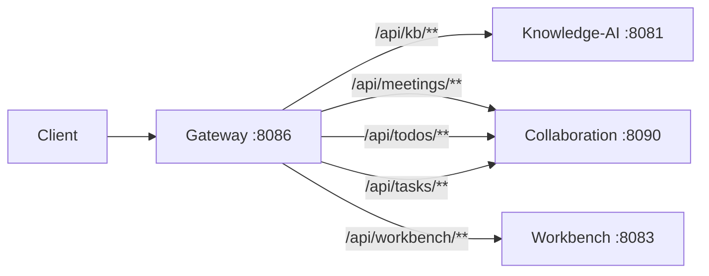

### 6.2 安全配置

| 配置项 | 说明 | 默认值 |
|--------|------|--------|
| `app.security.jwt.secret` | HS256 签名密钥（生产应改为安全存储） | dev 占位值 |
| `app.security.jwt.ttl-seconds` | JWT 有效期（秒） | 7200（2 小时） |
| `app.security.whitelist.paths` | 无需认证的路径 | `/api/auth/login`, `/actuator/health` |

### 6.3 网关配置

| 配置项 | 说明 | 默认值 |
|--------|------|--------|
| `app.gateway.ip.blacklist` | IP 黑名单 | `[]` |
| `app.gateway.ip.whitelist` | IP 白名单（非空则只允许白名单） | `[]` |
| `app.gateway.rateLimit.enabled` | 是否启用限流 | `true` |
| `app.gateway.rateLimit.requests` | 窗口内最大请求数 | 120 |
| `app.gateway.rateLimit.windowSeconds` | 时间窗口（秒） | 60 |

### 6.4 数据库

网关有自己的数据库 `enterprise_gateway`，用于存储：
- RBAC 数据：用户、角色、权限、部门
- Token 黑名单：登出后的 token 哈希
- 操作日志：管理操作的审计记录

**注意**：`ddl-auto: none`，依赖手工执行 SQL 脚本建表。

---

## 7. 整体架构图

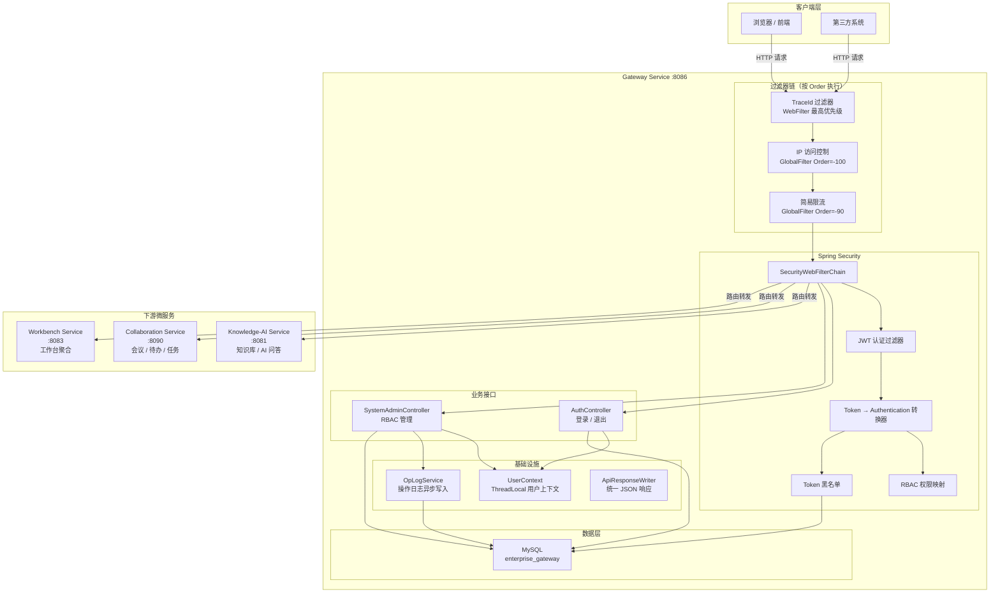

---

## 8. 请求处理完整时序总结

```
请求进入
  │
  ├─ 1. TraceId 过滤器
  │     └─ 生成/复用 traceId → 放入 MDC → 写入响应头
  │
  ├─ 2. IP 访问控制（Order=-100）
  │     └─ 白名单校验 → 黑名单校验 → 放行/403
  │
  ├─ 3. 简易限流（Order=-90）
  │     └─ 固定窗口计数 → 超限则 429
  │
  ├─ 4. Spring Security 过滤链
  │     ├─ 4.1 白名单匹配 → 直接放行
  │     └─ 4.2 JWT 认证
  │           ├─ 提取 Bearer token
  │           ├─ 黑名单校验 → 已拉黑则 401
  │           ├─ JWT 验签 + 过期校验 → 无效则 401
  │           ├─ Claims → RBAC 权限映射 → Authentication
  │           └─ UserContext.set(用户信息)
  │
  ├─ 5. @PreAuthorize 权限校验 → 无权限则 403
  │
  ├─ 6. 路由转发到下游微服务
  │
  └─ 7. 清理
        ├─ UserContext.clear()
        └─ MDC.remove(traceId)
```
