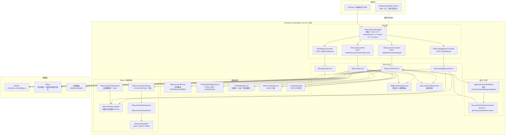
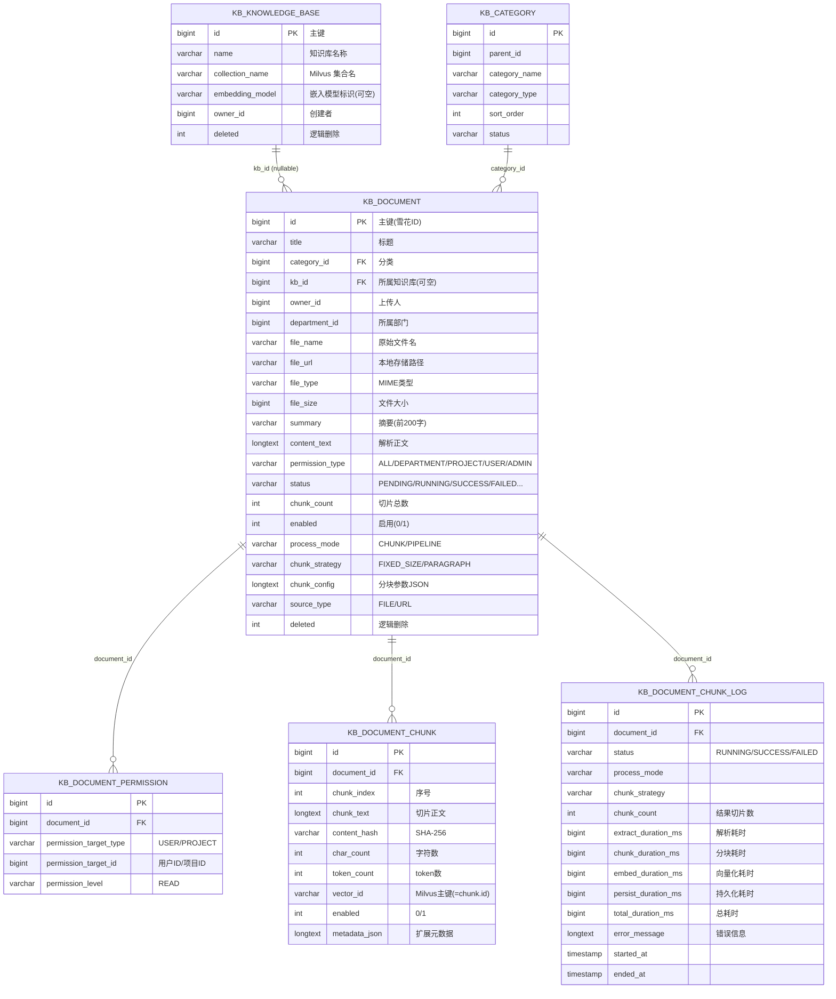
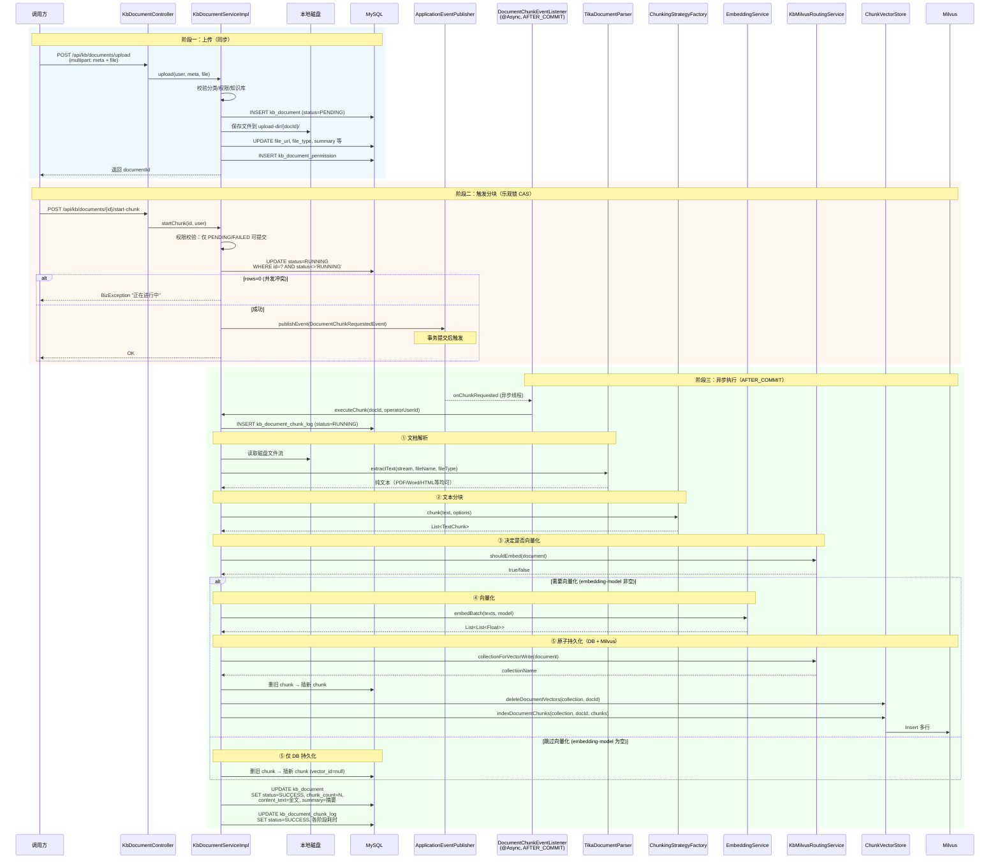
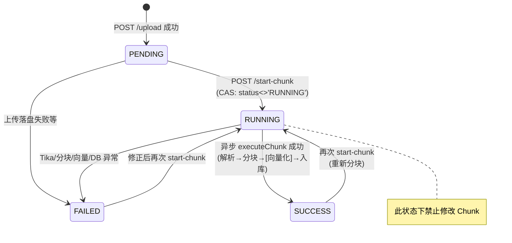
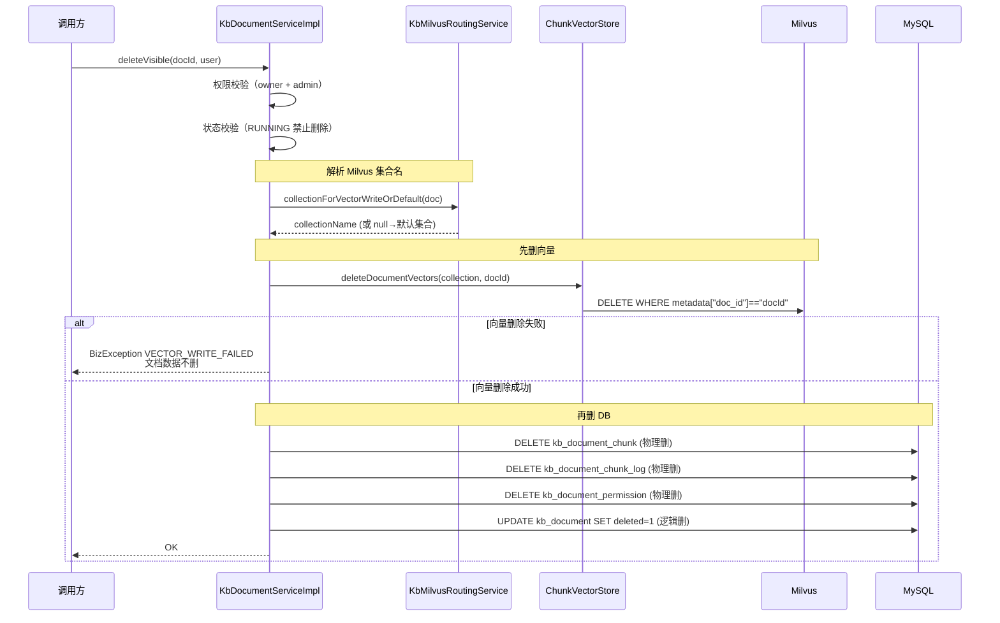
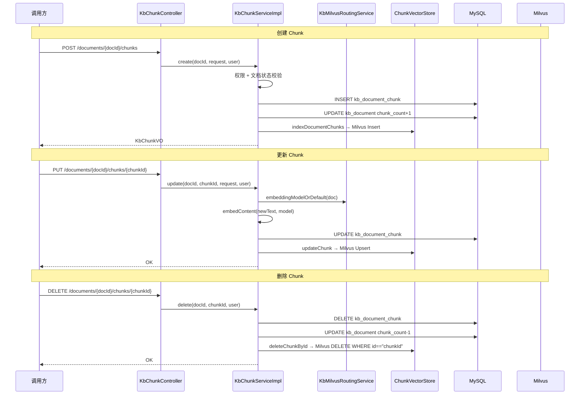
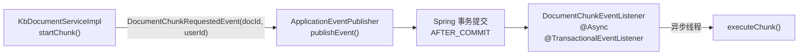

# enterprise-knowledge-ai-service 知识库微服务架构文档

> 本文档全面梳理 `enterprise-knowledge-ai-service` 的代码结构、核心流程、组件职责与数据模型。
> 对应 SDD 规范（`docs/sdd.md`）、产品需求（`docs/spec.md §3.2`）及 Step3 闭环（`docs/step3-summary.md`）。

---

## 1. 整体架构总览



---

## 2. 包结构与源码索引

```
enterprise-knowledge-ai-service/src/main/java/com/zjl/knowledge/
├── KnowledgeAiApplication.java          # 启动类（@EnableAsync, @MapperScan, @ConfigurationPropertiesScan）
├── chunk/                                # 分块策略
│   ├── ChunkingStrategy.java            # 策略接口
│   ├── ChunkingStrategyFactory.java     # 策略工厂（自动注册）
│   ├── ChunkingOptions.java             # 分块参数
│   ├── FixedSizeChunkingStrategy.java   # 固定大小分块
│   ├── ParagraphChunkingStrategy.java   # 按段落分块
│   └── TextChunk.java                   # 分块结果 POJO
├── config/                               # 配置
│   ├── KnowledgeAiProperties.java       # app.knowledge.*（embedding-model, vector-write-enabled）
│   ├── KbStorageProperties.java         # app.kb.*（upload-dir）
│   ├── MilvusProperties.java            # app.milvus.*（uri, collection, vector-dimension, fail-on-init）
│   ├── MilvusClientConfiguration.java   # MilvusClientV2 Bean
│   ├── MybatisPlusConfig.java           # MyBatis-Plus 分页插件
│   ├── TransactionConfig.java           # 事务管理器
│   └── WebMvcConfig.java                # Web MVC + Interceptor 注册
├── domain/                               # 枚举
│   ├── ChunkingMode.java                # FIXED_SIZE, PARAGRAPH
│   ├── DocumentPermissionType.java      # ALL, DEPARTMENT, PROJECT, USER, ADMIN
│   ├── DocumentStatus.java              # PENDING, RUNNING, SUCCESS, FAILED, DRAFT...
│   ├── ProcessMode.java                 # CHUNK, PIPELINE
│   └── SourceType.java                  # FILE, URL
├── dto/                                  # 请求/响应 DTO
│   ├── chunk/                            # Chunk 相关 DTO
│   ├── kb/                               # 知识库相关 DTO
│   ├── KbDocumentUploadRequest.java
│   ├── KbDocumentUpdateRequest.java
│   ├── KbDocumentChunkLogVO.java
│   └── PageResult.java
├── embedding/                            # 向量化
│   ├── EmbeddingService.java            # 向量化接口
│   └── PlaceholderEmbeddingService.java # 占位实现（SHA-256 展开）
├── entity/                               # 数据库实体
│   ├── KbCategory.java
│   ├── KbKnowledgeBase.java             # 知识库（绑定 Milvus 集合）
│   ├── KbDocument.java                  # 文档（核心实体，30+ 字段）
│   ├── KbDocumentChunk.java             # 切片
│   ├── KbDocumentChunkLog.java          # 分块任务日志
│   └── KbDocumentPermission.java        # 文档权限明细
├── event/                                # 事件驱动
│   ├── DocumentChunkRequestedEvent.java # 分块请求事件（record）
│   └── DocumentChunkEventListener.java  # 异步监听器
├── mapper/                               # MyBatis-Plus Mapper
│   ├── KbCategoryMapper.java
│   ├── KbKnowledgeBaseMapper.java
│   ├── KbDocumentMapper.java            # 含自定义 SQL: selectPageVisible
│   ├── KbDocumentChunkMapper.java
│   ├── KbDocumentChunkLogMapper.java
│   └── KbDocumentPermissionMapper.java
├── milvus/                               # Milvus 向量存储
│   ├── ChunkVectorStore.java            # 向量存储门面接口
│   ├── MilvusChunkVectorStore.java      # Milvus 实现（→ VectorStoreService）
│   ├── VectorStoreService.java          # 向量存储抽象
│   ├── MilvusVectorStoreService.java    # 委托 MilvusVectorWriter
│   ├── MilvusVectorWriter.java          # 底层 Insert/Upsert/Delete
│   ├── MilvusCollectionBootstrap.java   # 启动时建集合
│   ├── MilvusCollectionHelper.java      # Schema 创建工具
│   ├── PlaceholderEmbedding.java        # SHA-256 → L2 归一化向量
│   └── VectorDocChunk.java              # 向量切片 DTO
├── service/                              # 服务接口
│   ├── KbCategoryService.java
│   ├── KbKnowledgeBaseService.java
│   ├── KbDocumentService.java           # 继承 IService<KbDocument>
│   ├── KbChunkService.java
│   ├── KbMilvusRoutingService.java      # 集合 & 模型路由
│   ├── DocumentVisibilityService.java   # 权限校验
│   └── TikaDocumentParser.java          # Apache Tika 解析
│   └── impl/                             # 服务实现
│       ├── KbCategoryServiceImpl.java
│       ├── KbKnowledgeBaseServiceImpl.java
│       ├── KbDocumentServiceImpl.java   # ★ 核心（上传/分块/向量/删除）
│       └── KbChunkServiceImpl.java      # ★ Chunk CRUD + 向量同步
├── token/
│   ├── TokenCounterService.java
│   └── SimpleTokenCounterService.java
├── util/
│   └── ContentHashUtil.java
└── web/                                  # Controller
    ├── KbCategoryController.java        # /api/kb/categories
    ├── KbKnowledgeBaseController.java   # /api/kb/bases
    ├── KbDocumentController.java        # /api/kb/documents
    ├── KbChunkController.java           # /api/kb/documents/{docId}/chunks
    ├── SystemHealthController.java
    ├── UserContext.java                 # 用户上下文（record-like POJO）
    ├── UserContextHolder.java           # ThreadLocal
    └── UserContextInterceptor.java      # 请求头 → UserContext
```

---

## 3. 数据库表结构（ER 图）



---

## 4. 核心流程详解

### 4.1 文档上传 → 异步分块 → 完成（完整时序图）



### 4.2 文档状态机



### 4.3 文档删除 → 向量清理



### 4.4 Chunk 手动 CRUD 与向量同步



---

## 5. 各组件详细说明

### 5.1 启动类 `KnowledgeAiApplication`

| 注解 | 作用 |
|------|------|
| `@SpringBootApplication(scanBasePackages = {"com.zjl.knowledge", "com.zjl.common"})` | 扫描知识库服务 + 公共框架 |
| `@ConfigurationPropertiesScan` | 自动注册 `@ConfigurationProperties` 类 |
| `@MapperScan("com.zjl.knowledge.mapper")` | MyBatis-Plus Mapper 扫描 |
| `@EnableAsync` | 启用异步（分块监听器 `@Async`） |
| `@EnableTransactionManagement` | 启用注解事务 |

---

### 5.2 Web 层（Controller + 拦截器）

| 组件 | 路径 | 职责 |
|------|------|------|
| `UserContextInterceptor` | — | 从请求头 `X-User-Id` / `X-Department-Id` / `X-Project-Id` / `X-Is-Admin` 解析用户身份，写入 `UserContextHolder`（ThreadLocal） |
| `UserContext` | — | 不可变 POJO：`userId`, `departmentId`, `projectId`, `isAdmin` |
| `KbCategoryController` | `/api/kb/categories` | 分类 CRUD（GET/POST/PUT/DELETE） |
| `KbKnowledgeBaseController` | `/api/kb/bases` | 知识库管理：创建（绑定 Milvus 集合）、更新（嵌入模型变更校验）、重命名、删除、分页 |
| `KbDocumentController` | `/api/kb/documents` | 文档核心接口：上传（multipart）、start-chunk、execute-chunk、update、enabled、chunk-logs、search、delete |
| `KbChunkController` | `/api/kb/documents/{docId}/chunks` | Chunk CRUD + batch + enabled |

---

### 5.3 Service 层核心实现

#### 5.3.1 `KbDocumentServiceImpl` — 文档服务 ★

继承 `ServiceImpl<KbDocumentMapper, KbDocument>`，使用 `baseMapper` 操作数据库。

| 方法 | 事务 | 职责 |
|------|------|------|
| `upload()` | `@Transactional` | 校验元数据 → INSERT kb_document (PENDING) → 落盘 → Tika 探测 MIME → INSERT 权限行 |
| `startChunk()` | `@Transactional` | CAS 更新 status→RUNNING → 发布 `DocumentChunkRequestedEvent` |
| `executeChunk()` | — | 分块任务执行体：① Tika 解析 ② 策略分块 ③ `shouldEmbed()` 判断 ④ 条件向量化 ⑤ `persistChunksAndVectorsAtomically()` |
| `persistChunksAndVectorsAtomically()` | `TransactionTemplate` | 事务内：删旧 chunk → 插新 chunk → [写 Milvus] → 更新文档 SUCCESS |
| `enableDocument()` | — | 启用：重建向量；禁用：删向量 |
| `deleteVisible()` | `@Transactional` | 先删向量 → 再删 DB（权限/chunk/log/document） |
| `pageVisible()` | — | 调用 `baseMapper.selectPageVisible()` XML SQL 按权限过滤 |
| `searchDocuments()` | — | 简易标题 LIKE 搜索 |

**关键设计决策**：
- `shouldEmbed()` 决定是否向量化：`vector-write-enabled=true` 且 `embedding-model` 非空时才执行
- 向量化失败时文档状态回退到 FAILED，通过 `kb_document_chunk_log` 记录各阶段耗时

#### 5.3.2 `KbChunkServiceImpl` — Chunk 服务

| 方法 | 职责 |
|------|------|
| `create()` | 单条创建 → INSERT chunk → chunk_count+1 → 同步写 Milvus |
| `batchCreate()` | 批量创建，可选 `writeVector` 参数控制是否写向量 |
| `update()` | 更新内容 → 重算哈希/token → Upsert Milvus |
| `delete()` | 删除单条 → chunk_count-1 → 删 Milvus 向量 |
| `enableChunk()` | 启用：重建向量；禁用：删向量 |
| `batchToggleEnabled()` | 批量启用/禁用，上限500条 |
| `updateEnabledByDocId()` | 批量更新某文档下所有 chunk 的 enabled 状态 |

#### 5.3.3 `KbKnowledgeBaseServiceImpl` — 知识库服务

| 方法 | 关键逻辑 |
|------|----------|
| `create()` | 校验名称/集合名唯一性 → INSERT → `MilvusCollectionHelper.ensureCollectionLoaded()` 建 Milvus 集合 |
| `update()` | 修改嵌入模型前检查是否有已向量化文档（chunk_count>0） |
| `delete()` | 检查是否有关联文档（有则禁止删） |
| `pageQuery()` | 非管理员仅看自己的库；批量聚合 documentCount |

#### 5.3.4 `KbMilvusRoutingService` — 路由服务

| 方法 | 职责 |
|------|------|
| `shouldEmbed(KbDocument)` | 全局开关 + 模型配置 → 决定是否执行向量化 |
| `collectionForVectorWrite(KbDocument)` | kb_id → kb_knowledge_base → collection_name |
| `collectionForVectorWriteOrDefault(KbDocument)` | 同上，但知识库不存在时回退 null（默认集合） |
| `embeddingModelOrDefault(KbDocument)` | 知识库配置优先 → 全局配置 |

---

### 5.4 基础设施层

| 组件 | 职责 |
|------|------|
| `TikaDocumentParser` | 使用 Apache Tika `AutoDetectParser` 解析 PDF/Word/Excel/PPT/HTML/Markdown/TXT，最大 32MB 正文 |
| `ChunkingStrategyFactory` | 自动注入所有 `ChunkingStrategy` 实现，按 `ChunkingMode` 路由 |
| `FixedSizeChunkingStrategy` | 固定大小分块（如 512 token/chunk） |
| `ParagraphChunkingStrategy` | 按段落（`\n\n`）分块 |
| `PlaceholderEmbeddingService` | 一期占位：SHA-256(text) → 展开为 dim 维向量 → L2 归一化 |
| `SimpleTokenCounterService` | 简单 token 计数（按字符数估算） |
| `ContentHashUtil` | SHA-256 哈希（用于 chunk 去重/比对） |

---

### 5.5 Milvus 向量存储层

```
业务层调用链：
  ChunkVectorStore (接口)
    → MilvusChunkVectorStore (实现)
      → VectorStoreService (接口)
        → MilvusVectorStoreService (实现)
          → MilvusVectorWriter (底层，直接操作 MilvusClientV2)
```

#### 5.5.1 Milvus Collection Schema

| 字段 | 类型 | 说明 |
|------|------|------|
| `id` | VarChar(128) PK | Chunk 主键字符串（=`kb_document_chunk.id`） |
| `content` | VarChar(65535) | 切片正文（超长截断） |
| `metadata` | JSON | 包含 `collection_name`, `doc_id`, `chunk_index` + 业务扩展 |
| `embedding` | FloatVector(dim) | AUTOINDEX + COSINE 度量 |

#### 5.5.2 操作说明

| 操作 | Milvus 表达式 |
|------|---------------|
| 按文档删向量 | `metadata["doc_id"] == "123"` |
| 按 Chunk 删向量 | `id == "456"` |
| 批量删 Chunk | `id in ["456", "789"]` |
| 更新 Chunk | Upsert 同一 `id` |

#### 5.5.3 集合管理

| 组件 | 职责 |
|------|------|
| `MilvusCollectionBootstrap` | `@PostConstruct`：启动时创建默认集合并 load |
| `MilvusCollectionHelper.ensureCollectionLoaded()` | 检查是否存在 → 不存在则建集合（Schema + Index） → load 到内存 |
| 知识库创建时 | `KbKnowledgeBaseServiceImpl.create()` 中调用 `ensureCollectionLoaded()` 为每个知识库创建独立集合 |

---

### 5.6 权限体系

#### 5.6.1 文档权限类型 `DocumentPermissionType`

| 类型 | 可见范围 |
|------|----------|
| `ALL` | 全员可见 |
| `DEPARTMENT` | 同部门可见（`document.department_id == user.departmentId`） |
| `PROJECT` | 项目成员（需 `kb_document_permission` 中有对应 PROJECT 行） |
| `USER` | 指定人员（需 `kb_document_permission` 中有对应 USER 行） |
| `ADMIN` | 仅管理员可见 |

#### 5.6.2 权限校验链路

```
Controller → Service.pageVisible() 
  → baseMapper.selectPageVisible() [XML SQL 含权限子查询]
  → 结果自动过滤

Controller → Service.getVisible()
  → DocumentVisibilityService.canView(doc, user, perms)
  → switch(permissionType) 按类型判断
```

#### 5.6.3 权限 SQL（`KbDocumentMapper.xml`）

核心查询条件（在 `WHERE` 子句中）：
```sql
WHERE d.deleted = 0
  AND (
    d.owner_id = #{userId}                          -- 本人
    OR d.permission_type = 'ALL'                    -- 全员
    OR (d.permission_type = 'DEPARTMENT'            -- 同部门
        AND d.department_id = #{deptId})
    OR (d.permission_type = 'ADMIN' AND #{admin}=1) -- 管理员
    OR EXISTS (SELECT 1 FROM kb_document_permission  -- 项目成员
               WHERE ... AND p.permission_target_type='PROJECT')
    OR EXISTS (SELECT 1 FROM kb_document_permission  -- 指定用户
               WHERE ... AND p2.permission_target_type='USER')
  )
```

---

### 5.7 事件与异步



| 组件 | 说明 |
|------|------|
| `DocumentChunkRequestedEvent` | Java `record`：`documentId` + `operatorUserId` |
| `DocumentChunkEventListener` | `@Async` + `@TransactionalEventListener(phase=AFTER_COMMIT)` |
| 设计意图 | 替代消息队列的最小实现：事务提交后才触发，保证 DB 状态已更新；异步执行不阻塞 HTTP 响应 |

---

## 6. 配置说明

```yaml
# application.yml 关键配置

app:
  kb:
    upload-dir: ./data/kb-uploads          # 文件上传目录

  knowledge:
    embedding-model: ""                     # 为空 → 跳过向量化
    vector-write-enabled: true              # 全局向量写入开关

  milvus:
    uri: http://localhost:19530             # Milvus 地址
    collection: kb_chunk_embedding          # 默认集合名
    vector-dimension: 128                   # 向量维度
    fail-on-init: false                     # 启动时 Milvus 不可用是否中止

mybatis-plus:
  global-config:
    db-config:
      logic-delete-field: deleted           # 逻辑删除字段
      logic-delete-value: 1
      logic-not-delete-value: 0
```

---

## 7. API 接口清单

### 7.1 分类 `/api/kb/categories`

| 方法 | 路径 | 说明 |
|------|------|------|
| GET | `/api/kb/categories` | 全量列表 |
| GET | `/api/kb/categories/{id}` | 详情 |
| POST | `/api/kb/categories` | 新建 |
| PUT | `/api/kb/categories/{id}` | 更新 |
| DELETE | `/api/kb/categories/{id}` | 删除 |

### 7.2 知识库 `/api/kb/bases`

| 方法 | 路径 | 说明 |
|------|------|------|
| POST | `/api/kb/bases` | 创建（建 Milvus 集合） |
| GET | `/api/kb/bases` | 分页列表（含 documentCount） |
| GET | `/api/kb/bases/{id}` | 详情 |
| PUT | `/api/kb/bases/{id}` | 更新（嵌入模型变更需无向量化文档） |
| PUT | `/api/kb/bases/{id}/rename` | 重命名 |
| DELETE | `/api/kb/bases/{id}` | 删除（需无下属文档） |

### 7.3 文档 `/api/kb/documents`

| 方法 | 路径 | 说明 |
|------|------|------|
| GET | `/api/kb/documents` | 权限过滤分页列表 |
| GET | `/api/kb/documents/{id}` | 详情（权限校验） |
| POST | `/api/kb/documents/upload` | multipart 上传 → PENDING |
| POST | `/api/kb/documents/{id}/start-chunk` | 提交异步分块 |
| POST | `/api/kb/documents/{id}/execute-chunk` | 同步分块（补偿用） |
| PUT | `/api/kb/documents/{id}` | 更新元数据 |
| PATCH | `/api/kb/documents/{id}/enabled?on=` | 启用/禁用 |
| GET | `/api/kb/documents/{id}/chunk-logs` | 分块日志分页 |
| GET | `/api/kb/documents/search` | 标题搜索 |
| DELETE | `/api/kb/documents/{id}` | 删除（先删向量） |

### 7.4 Chunk `/api/kb/documents/{docId}/chunks`

| 方法 | 路径 | 说明 |
|------|------|------|
| GET | `/chunks` | 分页 |
| GET | `/chunks/list` | 全量列表 |
| POST | `/chunks` | 单条创建（同步向量） |
| POST | `/chunks/batch?writeVector=` | 批量创建 |
| PUT | `/chunks/{chunkId}` | 更新（Upsert 向量） |
| DELETE | `/chunks/{chunkId}` | 删除 |
| PATCH | `/chunks/{chunkId}/enabled?on=` | 单条启用/禁用 |
| POST | `/chunks/batch-enabled?on=` | 批量启用/禁用 |

---

## 8. 统一响应格式

```json
{
  "code": 200,
  "message": "success",
  "data": {},
  "traceId": "uuid"
}
```

- 成功：`Result` 来自 `frameworks-common`
- 业务异常：`BizException` + `ErrorCode` 枚举（`PARAM_INVALID`, `NOT_FOUND`, `FORBIDDEN`, `VECTOR_WRITE_FAILED`, `SYSTEM_ERROR`）
- 分页：`PageResult { current, size, total, records }`

---

## 9. 已知边界与后续规划

| 项目 | 当前状态 | 计划 |
|------|----------|------|
| 全文检索（ES/OpenSearch） | 未接入，仅有标题 LIKE 搜索 | Step4 |
| RAG 问答编排 | 未实现 | Step4 |
| 真实 Embedding 模型 | 使用 SHA-256 占位 | 接入 text-embedding-ada-002 等 |
| 异步重试 | 失败后文档卡在 RUNNING，需手动补偿 | 引入重试队列 |
| 文档版本管理 | 表有 current_version 字段但未落地 | P1 |
| 定时拉取（URL 来源） | 字段已预留，逻辑未实现 | P1 |
| Milvus 高可用 | 单节点 | 生产部署需集群 |

---

**文档版本**：v1.0  
**最后更新**：2026-05-03  
**对应代码版本**：当前仓库 `enterprise-knowledge-ai-service` 实现
