# enterprise-knowledge-ai-service 服务解析

> 基于 2026-05-10 代码，逐文件、逐方法、逐行解析知识库微服务的完整架构、组件职责、数据流与实现细节。含 Agent 智能检索 + MCP Server 模块。

---

## 目录

1. [系统架构总览](#1-系统架构总览)
2. [启动入口与组件扫描](#2-启动入口与组件扫描)
3. [配置体系](#3-配置体系)
4. [Web 层 —— 请求链路](#4-web-层--请求链路)
5. [Controller 层](#5-controller-层)
6. [Domain 层 —— 枚举定义](#6-domain-层--枚举定义)
7. [Entity 层 —— ORM 实体](#7-entity-层--orm-实体)
8. [DTO 层 —— 数据传输对象](#8-dto-层--数据传输对象)
9. [Mapper 层 —— 数据访问](#9-mapper-层--数据访问)
10. [Service 层 —— 核心业务逻辑](#10-service-层--核心业务逻辑)
11. [分块策略 —— 策略模式](#11-分块策略--策略模式)
12. [向量存储层 —— 三层架构](#12-向量存储层--三层架构)
13. [嵌入服务与 Token 计数](#13-嵌入服务与-token-计数)
14. [事件驱动异步](#14-事件驱动异步)
15. [Agent 智能检索 + MCP Server（新增）](#15-agent-智能检索--mcp-server新增)
16. [数据库设计](#16-数据库设计)
17. [权限模型](#17-权限模型)
18. [文档状态机](#18-文档状态机)
19. [完整 API 接口清单](#19-完整-api-接口清单)
20. [目录结构速查](#20-目录结构速查)

---

## 1. 系统架构总览

### 1.1 微服务全景图

```mermaid
graph TB
    subgraph "网关层 :8086"
        GW[Spring Cloud Gateway<br/>JWT 鉴权 + RBAC]
    end

    subgraph "enterprise-knowledge-ai-service :8081"
        direction TB

        subgraph "Web 层"
            FILTER[TraceIdFilter<br/>MDC traceId]
            INTERCEPTOR[UserContextInterceptor<br/>请求头解析]
            CTL_DOC[KbDocumentController]
            CTL_CHUNK[KbChunkController]
            CTL_KB[KbKnowledgeBaseController]
            CTL_CAT[KbCategoryController]
        end

        subgraph "Service 层"
            DOC_SVC[KbDocumentServiceImpl<br/>门面 + 查询]
            UPLOAD_SVC[DocumentUploadService<br/>上传 + 权限行]
            CHUNK_SVC[DocumentChunkingService<br/>异步分块核心]
            DELETE_SVC[DocumentDeleteService<br/>先删向量再删DB]
            CHUNK_CRUD[KbChunkServiceImpl<br/>Chunk CRUD]
            KB_SVC[KbKnowledgeBaseServiceImpl<br/>知识库管理]
            VEC_SYNC[VectorSyncService<br/>向量同步入口]
            ROUTE_SVC[KbMilvusRoutingService<br/>多集合路由]
            VIS_SVC[DocumentVisibilityService<br/>权限判断]
        end

        subgraph "数据层"
            MYSQL[(MySQL<br/>enterprise_knowledge_ai<br/>6 张表)]
            MILVUS[(Milvus<br/>向量集合<br/>id/content/metadata/embedding)]
            DISK[(本地磁盘<br/>./data/kb-uploads)]
        end

        subgraph "Agent 模块（新增）"
            AGENT_CTL[AgentController<br/>对话 + 会话管理]
            AGENT_LOOP[AgentLoop<br/>Agent 循环]
            AGENT_SESSION[AgentSessionService<br/>会话持久化]
            MCP_SERVER[McpServerController<br/>MCP SSE 端点]
            TOOL_REG[ToolRegistry<br/>Tool 注册表]
            AGENT_TOOLS[4 个检索 Tool<br/>search/list/detail/bases]
            LLM_CLIENT[LlmClient<br/>LLM 调用抽象]
        end

        subgraph "基础设施"
            TIKA[Apache Tika<br/>文档解析]
            CHUNK_STRATEGY[分块策略工厂<br/>FIXED_SIZE / PARAGRAPH]
            EMBED[EmbeddingService<br/>文本向量化]
            TOKEN[TokenCounterService<br/>Token 计数]
            EVENT[事件驱动<br/>@Async + AFTER_COMMIT]
        end
    end

    FRONTEND[前端 / API 客户端] --> GW
    GW -->|X-User-Id 等请求头| FILTER
    FILTER --> INTERCEPTOR
    INTERCEPTOR --> CTL_DOC & CTL_CHUNK & CTL_KB & CTL_CAT & AGENT_CTL
    CTL_DOC --> DOC_SVC
    CTL_CHUNK --> CHUNK_CRUD
    CTL_KB --> KB_SVC
    CTL_CAT --> CAT_SVC[KbCategoryServiceImpl]
    AGENT_CTL --> AGENT_LOOP

    DOC_SVC --> UPLOAD_SVC & CHUNK_SVC & DELETE_SVC & VEC_SYNC & VIS_SVC
    CHUNK_CRUD --> VEC_SYNC & VIS_SVC
    KB_SVC --> MILVUS_HELPER[MilvusCollectionHelper]

    UPLOAD_SVC --> MYSQL & DISK & TIKA
    CHUNK_SVC --> TIKA & CHUNK_STRATEGY & EMBED & TOKEN & MYSQL & MILVUS & EVENT
    DELETE_SVC --> MYSQL & MILVUS
    CHUNK_CRUD --> MYSQL & MILVUS
    VEC_SYNC --> ROUTE_SVC & EMBED
    ROUTE_SVC --> MYSQL

    AGENT_LOOP --> LLM_CLIENT
    AGENT_LOOP --> TOOL_REG
    AGENT_LOOP --> AGENT_SESSION
    AGENT_LOOP --> DOC_SVC & KB_SVC
    TOOL_REG --> AGENT_TOOLS
    LLM_CLIENT --> LLM[大模型 API<br/>Anthropic / OpenAI]
    MCP_SERVER --> TOOL_REG
    AGENT_SESSION --> MYSQL

    style GW fill:#e1f5fe
    style MYSQL fill:#fff3e0
    style MILVUS fill:#e8f5e9
    style DISK fill:#fce4ec
```

### 1.2 模块依赖关系

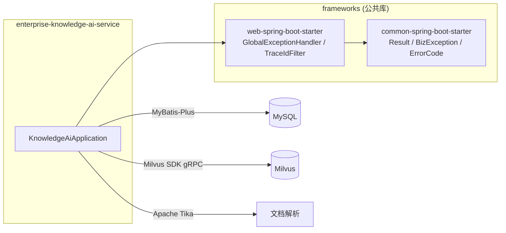
```mermaid
graph LR
    subgraph "frameworks (公共库)"
        COMMON[common-spring-boot-starter<br/>Result / BizException / ErrorCode]
        WEB[web-spring-boot-starter<br/>GlobalExceptionHandler / TraceIdFilter]
    end

    subgraph "enterprise-knowledge-ai-service"
        APP[KnowledgeAiApplication]
    end

    WEB --> COMMON
    APP --> WEB
    APP -->|MyBatis-Plus| MYSQL_DB[(MySQL)]
    APP -->|Milvus SDK gRPC| MILVUS_DB[(Milvus)]
    APP -->|Apache Tika| TIKA_LIB[文档解析]
```

### 1.3 数据流全景图

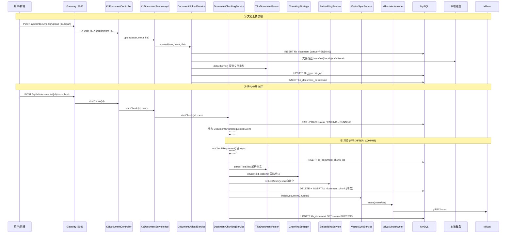
```mermaid
sequenceDiagram
    participant U as 用户/前端
    participant GW as Gateway :8086
    participant CTL as KbDocumentController
    participant SVC as KbDocumentServiceImpl
    participant UPL as DocumentUploadService
    participant CHK as DocumentChunkingService
    participant TIKA as TikaDocumentParser
    participant STR as ChunkingStrategy
    participant EMB as EmbeddingService
    participant VEC as VectorSyncService
    participant MV as MilvusVectorWriter
    participant DB as MySQL
    participant DISK as 本地磁盘
    participant MIL as Milvus

    Note over U,MIL: ① 文档上传流程
    U->>GW: POST /api/kb/documents/upload (multipart)
    GW->>CTL: + X-User-Id, X-Department-Id...
    CTL->>SVC: upload(user, meta, file)
    SVC->>UPL: upload(user, meta, file)
    UPL->>DB: INSERT kb_document (status=PENDING)
    UPL->>DISK: 文件落盘 baseDir/{docId}/{safeName}
    UPL->>TIKA: detectMime() 探测文件类型
    UPL->>DB: UPDATE file_type, file_url
    UPL->>DB: INSERT kb_document_permission

    Note over U,MIL: ② 异步分块流程
    U->>GW: POST /api/kb/documents/{id}/start-chunk
    GW->>CTL: startChunk(id)
    CTL->>SVC: startChunk(id, user)
    SVC->>CHK: startChunk(id, user)
    CHK->>DB: CAS UPDATE status PENDING→RUNNING
    CHK-->>CHK: 发布 DocumentChunkRequestedEvent

    Note over CHK,MIL: ③ 异步执行 (AFTER_COMMIT)
    CHK->>CHK: onChunkRequested() @Async
    CHK->>DB: INSERT kb_document_chunk_log
    CHK->>TIKA: extractText(file) 解析全文
    CHK->>STR: chunk(text, options) 策略分块
    CHK->>EMB: embedBatch(texts) 向量化
    CHK->>DB: DELETE + INSERT kb_document_chunk (事务)
    CHK->>VEC: indexDocumentChunks()
    VEC->>MV: insert(InsertReq)
    MV->>MIL: gRPC insert
    CHK->>DB: UPDATE kb_document SET status=SUCCESS
```

---

## 2. 启动入口与组件扫描

### 2.1 KnowledgeAiApplication

**文件路径**：`src/main/java/com/zjl/knowledge/KnowledgeAiApplication.java`  
**代码行数**：17 行  
**类注解**：5 个  
**继承关系**：无（纯 Spring Boot 启动类）

```java
package com.zjl.knowledge;

import org.mybatis.spring.annotation.MapperScan;
import org.springframework.boot.SpringApplication;
import org.springframework.boot.autoconfigure.SpringBootApplication;
import org.springframework.boot.context.properties.ConfigurationPropertiesScan;
import org.springframework.scheduling.annotation.EnableAsync;
import org.springframework.transaction.annotation.EnableTransactionManagement;

@SpringBootApplication(scanBasePackages = {"com.zjl.knowledge", "com.zjl.common"})
@ConfigurationPropertiesScan
@MapperScan({"com.zjl.knowledge.mapper", "com.zjl.knowledge.agent.mapper"})
@EnableAsync
@EnableTransactionManagement
public class KnowledgeAiApplication {

    public static void main(String[] args) {
        SpringApplication.run(KnowledgeAiApplication.class, args);
    }
}
```

**每个注解的详细解析**：

| 行号 | 注解 | 完整类名 | 作用机制 | 为什么需要 |
|------|------|----------|----------|-----------|
| 1 | `@SpringBootApplication` | `org.springframework.boot.autoconfigure.SpringBootApplication` | 组合注解 = `@Configuration` + `@EnableAutoConfiguration` + `@ComponentScan`。`scanBasePackages` 指定两个扫描根包 | 让 `com.zjl.common` 下的 `GlobalExceptionHandler`、`TraceIdFilter`、`Results` 等公共组件也被 Spring 容器管理 |
| 2 | `@ConfigurationPropertiesScan` | `org.springframework.boot.context.properties.ConfigurationPropertiesScan` | 自动扫描 classpath 下所有 `@ConfigurationProperties` 标注的类并注册为 Bean | 让 `MilvusProperties`、`KnowledgeAiProperties`、`KbStorageProperties` 三个配置属性类自动生效，无需手动 `@EnableConfigurationProperties` |
| 3 | `@MapperScan` | `org.mybatis.spring.annotation.MapperScan` | 扫描指定包路径下的接口，使用 `MapperFactoryBean` 为每个接口生成 MyBatis 代理实现 | 让 6 个 Mapper 接口（`KbDocumentMapper` 等）可以被 `@Autowired` 注入 |
| 4 | `@EnableAsync` | `org.springframework.scheduling.annotation.EnableAsync` | 创建 `AsyncAnnotationBeanPostProcessor`，拦截 `@Async` 方法并提交给 `TaskExecutor` 异步执行 | 让 `DocumentChunkEventListener.onChunkRequested()` 的 `@Async` 生效，分块任务不阻塞 HTTP 响应 |
| 5 | `@EnableTransactionManagement` | `org.springframework.transaction.annotation.EnableTransactionManagement` | 创建 `InfrastructureAdvisorAutoProxyCreator`，为 `@Transactional` 方法生成 AOP 代理 | 让所有 Service 层的 `@Transactional` 注解生效，保证数据一致性 |

**启动流程**：

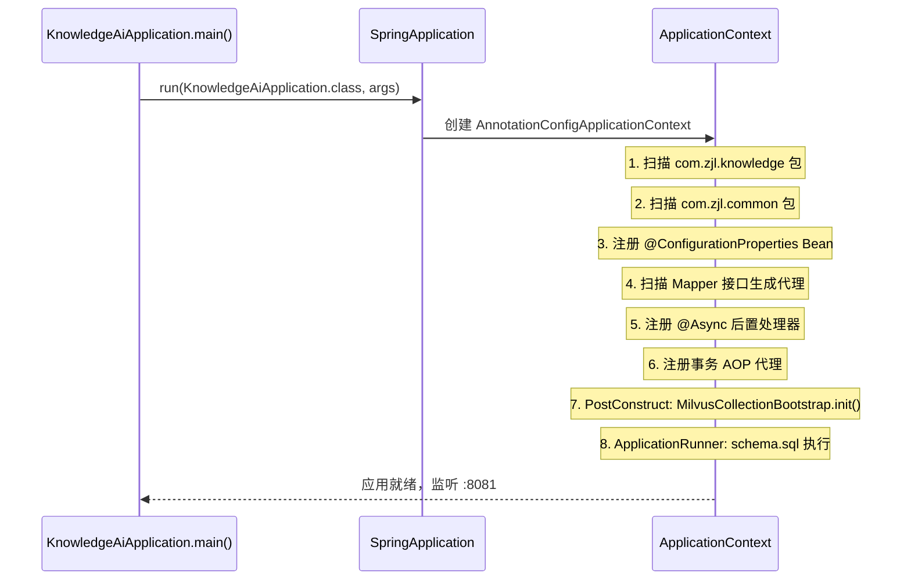
```mermaid
sequenceDiagram
    participant MAIN as KnowledgeAiApplication.main()
    participant SPRING as SpringApplication
    participant CTX as ApplicationContext

    MAIN->>SPRING: run(KnowledgeAiApplication.class, args)
    SPRING->>CTX: 创建 AnnotationConfigApplicationContext
    Note over CTX: 1. 扫描 com.zjl.knowledge 包
    Note over CTX: 2. 扫描 com.zjl.common 包
    Note over CTX: 3. 注册 @ConfigurationProperties Bean
    Note over CTX: 4. 扫描 Mapper 接口生成代理
    Note over CTX: 5. 注册 @Async 后置处理器
    Note over CTX: 6. 注册事务 AOP 代理
    Note over CTX: 7. PostConstruct: MilvusCollectionBootstrap.init()
    Note over CTX: 8. ApplicationRunner: schema.sql 执行
    CTX-->>MAIN: 应用就绪，监听 :8081
```

---

## 3. 配置体系

### 3.1 application.yml 完整解析

**文件路径**：`src/main/resources/application.yml`  
**代码行数**：54 行

```yaml
# ============ Spring Boot 核心 ============
spring:
  application:
    name: enterprise-knowledge-ai-service       # 服务名（用于注册中心/日志）
  servlet:
    multipart:
      max-file-size: 50MB                        # 单文件上传上限
      max-request-size: 55MB                     # 单次请求总大小（含 meta JSON）

  # ============ 数据源 ============
  datasource:
    url: jdbc:mysql://127.0.0.1:3306/enterprise_knowledge_ai
         ?useUnicode=true                        # 启用 Unicode
         &characterEncoding=utf8                 # UTF-8 编码
         &serverTimezone=Asia/Shanghai           # 时区
         &allowPublicKeyRetrieval=true           # 允许客户端获取公钥（MySQL 8+）
         &useSSL=false                           # 本地开发关闭 SSL
    username: root
    password: 123456
    driver-class-name: com.mysql.cj.jdbc.Driver  # MySQL 8.x 驱动

  sql:
    init:
      mode: always                               # 每次启动都执行 schema.sql
      schema-locations: classpath:schema.sql     # DDL 脚本位置

# ============ 服务端口 ============
server:
  port: 8081

# ============ MyBatis-Plus ============
mybatis-plus:
  mapper-locations: classpath:/mapper/**/*.xml   # XML Mapper 文件位置
  configuration:
    map-underscore-to-camel-case: true           # 数据库下划线 → Java 驼峰自动转换
  global-config:
    db-config:
      logic-delete-field: deleted                # 逻辑删除字段名
      logic-delete-value: 1                      # 已删除标记值
      logic-not-delete-value: 0                  # 未删除标记值

# ============ 业务配置 ============
app:
  kb:
    upload-dir: ./data/kb-uploads                # 文件上传根目录（相对路径，自动转绝对）
  knowledge:
    embedding-model: ""                          # 为空时 shouldEmbed() 返回 false，跳过向量化
    vector-write-enabled: true                   # 全局向量写入总开关
  milvus:
    uri: http://localhost:19530                  # Milvus gRPC 地址
    collection: kb_chunk_embedding               # 默认向量集合名
    vector-dimension: 128                        # 向量维度（必须与 EmbeddingService 输出一致）
    fail-on-init: false                          # true=启动时 Milvus 不可用则中止

# ============ 日志 ============
logging:
  pattern:
    console: "%d{yyyy-MM-dd HH:mm:ss.SSS} [%thread] %-5level [%X{traceId}] %logger - %msg%n"
    # [%X{traceId}] 从 MDC 读取 TraceIdFilter 设置的 traceId

# ============ 监控 ============
management:
  endpoints:
    web:
      exposure:
        include: health,info                     # 暴露健康检查和信息端点
```

### 3.2 配置属性类详解

#### 3.2.1 MilvusProperties

**文件路径**：`config/MilvusProperties.java`  
**前缀**：`app.milvus`  
**注解**：`@Data`（Lombok）+ `@ConfigurationProperties(prefix = "app.milvus")`

```java
@Data
@ConfigurationProperties(prefix = "app.milvus")
public class MilvusProperties {
    private String uri = "http://localhost:19530";     // Milvus gRPC 地址
    private String collection = "kb_chunk_embedding";  // 默认集合名
    private int vectorDimension = 128;                  // 向量维度
    private boolean failOnInit = true;                  // 启动失败策略
}
```

**使用位置**（6 处引用）：
1. `MilvusClientConfiguration`：创建 `MilvusClientV2` Bean 时读取 `uri`
2. `MilvusVectorWriter`：读取 `vectorDimension` 校验向量，读取 `collection` 作为默认集合
3. `MilvusCollectionHelper`：读取 `vectorDimension` 创建 Schema
4. `MilvusCollectionBootstrap`：读取 `collection` 和 `failOnInit` 控制启动行为
5. `PlaceholderEmbeddingService`：读取 `vectorDimension` 生成占位向量

#### 3.2.2 KnowledgeAiProperties

**文件路径**：`config/KnowledgeAiProperties.java`  
**前缀**：`app.knowledge`  
**注解**：`@Data` + `@Component` + `@ConfigurationProperties(prefix = "app.knowledge")`

```java
@Data
@Component
@ConfigurationProperties(prefix = "app.knowledge")
public class KnowledgeAiProperties {
    private String embeddingModel = "";    // 空串 → shouldEmbed() 返回 false
    private boolean vectorWriteEnabled = true;
}
```

**使用位置**：`KbMilvusRoutingService` 中：
- `shouldEmbed()` 方法：`!vectorWriteEnabled` → 直接返回 false
- `embeddingModelOrDefault()` 方法：知识库未配模型时回退到此值

#### 3.2.3 KbStorageProperties

**文件路径**：`config/KbStorageProperties.java`  
**前缀**：`app.kb`  
**注解**：`@Data` + `@ConfigurationProperties(prefix = "app.kb")`

```java
@Data
@ConfigurationProperties(prefix = "app.kb")
public class KbStorageProperties {
    private String uploadDir = "./data/kb-uploads";
}
```

**使用位置**：`LocalFileStorageService` 中作为文件存储根目录。

### 3.3 Spring 配置类详解

#### 3.3.1 MilvusClientConfiguration

**文件路径**：`config/MilvusClientConfiguration.java`  
**行数**：27 行

```java
@Configuration
public class MilvusClientConfiguration {

    /**
     * 创建 Milvus gRPC 客户端 Bean。
     * 使用 ConnectConfig 构建，URI 从 MilvusProperties 读取。
     *
     * @param properties Milvus 配置（Spring 自动注入）
     * @return MilvusClientV2 单例（整个应用共享一个 gRPC 连接）
     */
    @Bean
    public MilvusClientV2 milvusClientV2(MilvusProperties properties) {
        ConnectConfig connectConfig = ConnectConfig.builder()
                .uri(properties.getUri())           // 如 http://localhost:19530
                .build();
        return new MilvusClientV2(connectConfig);   // Milvus Java SDK 核心客户端
    }
}
```

**关键设计**：`MilvusClientV2` 是**单例 Bean**，整个应用共享一个 gRPC 连接池。所有向量操作（Insert/Upsert/Delete/Search）都通过它完成。Milvus SDK 内部管理连接池和重连逻辑。

#### 3.3.2 WebMvcConfig

**文件路径**：`config/WebMvcConfig.java`  
**行数**：32 行

```java
@Configuration
@RequiredArgsConstructor
public class WebMvcConfig implements WebMvcConfigurer {

    private final UserContextInterceptor userContextInterceptor;  // 构造器注入

    @Override
    public void addInterceptors(InterceptorRegistry registry) {
        registry.addInterceptor(userContextInterceptor)
                .addPathPatterns("/**")                    // 拦截所有请求
                .excludePathPatterns("/actuator/**",       // 排除健康检查
                                     "/api/system/**");    // 排除系统接口
    }
}
```

**拦截器执行顺序**：`TraceIdFilter`（Servlet Filter）→ `UserContextInterceptor`（Spring Interceptor）→ Controller

#### 3.3.3 MybatisPlusConfig

**文件路径**：`config/MybatisPlusConfig.java`  
**行数**：26 行

```java
@Configuration
public class MybatisPlusConfig {

    /**
     * 注册 MyBatis-Plus 分页插件。
     * 不注册此 Bean 则 Page<T> 分页查询不会自动添加 LIMIT 子句。
     *
     * @return MybatisPlusInterceptor（含 PaginationInnerInterceptor）
     */
    @Bean
    public MybatisPlusInterceptor mybatisPlusInterceptor() {
        MybatisPlusInterceptor interceptor = new MybatisPlusInterceptor();
        // DbType.MYSQL → 生成 MySQL 方言的 LIMIT ?,? 语句
        interceptor.addInnerInterceptor(new PaginationInnerInterceptor(DbType.MYSQL));
        return interceptor;
    }
}
```

#### 3.3.4 TransactionConfig

**文件路径**：`config/TransactionConfig.java`  
**行数**：19 行

```java
@Configuration
public class TransactionConfig {

    /**
     * 编程式事务模板。
     * 用于非 @Transactional 方法中需要事务控制的场景，
     * 典型用途：分块流程中 DB + Milvus 双写的原子操作。
     *
     * @param transactionManager Spring 自动注入的 PlatformTransactionManager
     * @return TransactionTemplate
     */
    @Bean
    public TransactionTemplate transactionTemplate(PlatformTransactionManager transactionManager) {
        return new TransactionTemplate(transactionManager);
    }
}
```

**为什么需要编程式事务**：`persistChunksAndVectorsAtomically()` 方法需要在运行时决定事务边界（DB 操作 + Milvus 操作），不能仅靠 `@Transactional` 声明式事务。`TransactionTemplate.executeWithoutResult()` 提供了精确的事务控制。


---

## 4. Web 层 —— 请求链路

### 4.1 完整请求处理时序图

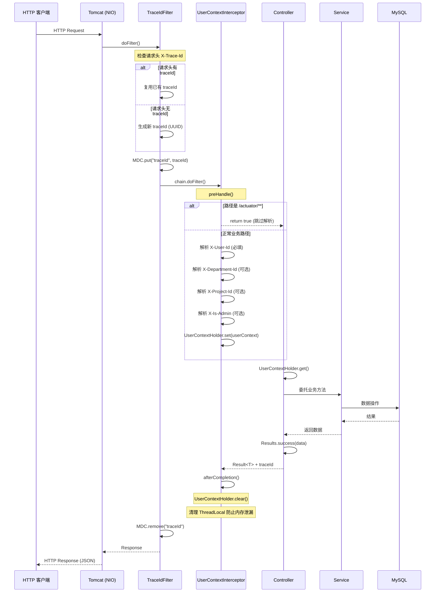
```mermaid
sequenceDiagram
    participant CLIENT as HTTP 客户端
    participant TOMCAT as Tomcat (NIO)
    participant TFILTER as TraceIdFilter
    participant INTER as UserContextInterceptor
    participant CTL as Controller
    participant SVC as Service
    participant DB as MySQL

    CLIENT->>TOMCAT: HTTP Request
    TOMCAT->>TFILTER: doFilter()

    Note over TFILTER: 检查请求头 X-Trace-Id
    alt 请求头有 traceId
        TFILTER->>TFILTER: 复用已有 traceId
    else 请求头无 traceId
        TFILTER->>TFILTER: 生成新 traceId (UUID)
    end
    TFILTER->>TFILTER: MDC.put("traceId", traceId)
    TFILTER->>INTER: chain.doFilter()

    Note over INTER: preHandle()
    alt 路径是 /actuator/**
        INTER-->>CTL: return true (跳过解析)
    else 正常业务路径
        INTER->>INTER: 解析 X-User-Id (必填)
        INTER->>INTER: 解析 X-Department-Id (可选)
        INTER->>INTER: 解析 X-Project-Id (可选)
        INTER->>INTER: 解析 X-Is-Admin (可选)
        INTER->>INTER: UserContextHolder.set(userContext)
    end

    CTL->>CTL: UserContextHolder.get()
    CTL->>SVC: 委托业务方法
    SVC->>DB: 数据操作
    DB-->>SVC: 结果
    SVC-->>CTL: 返回数据
    CTL->>CTL: Results.success(data)
    CTL-->>INTER: Result<T> + traceId

    INTER->>INTER: afterCompletion()
    Note over INTER: UserContextHolder.clear()
    Note over INTER: 清理 ThreadLocal 防止内存泄漏

    TFILTER->>TFILTER: MDC.remove("traceId")
    TFILTER-->>TOMCAT: Response
    TOMCAT-->>CLIENT: HTTP Response (JSON)
```

### 4.2 UserContext —— 用户上下文

**文件路径**：`web/UserContext.java`  
**行数**：32 行  
**注解**：`@Getter` + `@Builder`（Lombok）  
**设计模式**：不可变对象（Immutable Object）—— 所有字段为 `final`

```java
@Getter
@Builder
public class UserContext {

    /** 用户 ID —— 由网关 JWT 解析后通过 X-User-Id 头传入 */
    private final Long userId;

    /** 部门 ID —— 用于 DEPARTMENT 权限判断，可为 null */
    private final Long departmentId;

    /** 项目 ID —— 用于 PROJECT 权限判断（需配合 kb_document_permission），可为 null */
    private final Long projectId;

    /** 是否管理员 —— 由网关 RBAC 判断后通过 X-Is-Admin 头传入，默认 false */
    private final boolean admin;
}
```

**字段对照表**：

| 字段 | 类型 | final | 请求头 | 默认值 | 用途 |
|------|------|-------|--------|--------|------|
| `userId` | `Long` | 是 | `X-User-Id` | 无（必填） | 上传者标识、owner 权限判断 |
| `departmentId` | `Long` | 是 | `X-Department-Id` | null | DEPARTMENT 权限匹配 |
| `projectId` | `Long` | 是 | `X-Project-Id` | null | PROJECT 权限匹配 |
| `admin` | `boolean` | 是 | `X-Is-Admin` | false | 全局可见 + 写权限 |

### 4.3 UserContextHolder

**文件路径**：`web/UserContextHolder.java`  
**行数**：40 行  
**设计模式**：ThreadLocal 模式

```java
public final class UserContextHolder {

    /** 使用 ThreadLocal 保证线程安全，每个请求线程独立 */
    private static final ThreadLocal<UserContext> CTX = new ThreadLocal<>();

    private UserContextHolder() {}  // 工具类，禁止实例化

    /** 设置当前线程的用户上下文 */
    public static void set(UserContext ctx) {
        CTX.set(ctx);
    }

    /** 获取当前线程的用户上下文 */
    public static UserContext get() {
        return CTX.get();
    }

    /** 请求结束后清理，防止内存泄漏（线程池复用场景下尤其重要） */
    public static void clear() {
        CTX.remove();
    }
}
```

**内存泄漏风险分析**：
- Tomcat 使用线程池处理请求，线程会被复用
- 如果 `afterCompletion()` 未调用 `clear()`，旧的 `UserContext` 会残留在 `ThreadLocal` 中
- 下一个请求复用该线程时，`get()` 会返回旧数据 → 权限错乱
- `afterCompletion()` 在 `finally` 语义下保证执行（Spring 框架保证）

### 4.4 UserContextInterceptor

**文件路径**：`web/UserContextInterceptor.java`  
**行数**：94 行  
**实现接口**：`HandlerInterceptor`  
**注解**：`@Component`

```java
@Component
public class UserContextInterceptor implements HandlerInterceptor {

    // 请求头常量定义
    public static final String HEADER_USER_ID = "X-User-Id";
    public static final String HEADER_DEPT_ID = "X-Department-Id";
    public static final String HEADER_PROJECT_ID = "X-Project-Id";
    public static final String HEADER_ADMIN = "X-Is-Admin";

    /**
     * preHandle：在 Controller 方法执行前调用
     *
     * 返回 true → 继续执行后续拦截器和 Controller
     * 抛出异常 → 由 GlobalExceptionHandler 处理，返回错误响应
     */
    @Override
    public boolean preHandle(HttpServletRequest request,
                             HttpServletResponse response,
                             Object handler) {
        // ① 健康检查路径跳过认证
        String path = request.getRequestURI();
        if (path.startsWith("/actuator")) {
            return true;
        }

        // ② X-User-Id 必填校验
        String uid = request.getHeader(HEADER_USER_ID);
        if (!StringUtils.hasText(uid)) {
            throw new BizException(ErrorCode.UNAUTHORIZED);
        }

        // ③ 解析并构造 UserContext
        try {
            Long userId = Long.parseLong(uid.trim());
            Long dept = parseLongHeader(request, HEADER_DEPT_ID);     // null 容错
            Long project = parseLongHeader(request, HEADER_PROJECT_ID); // null 容错
            boolean admin = "true".equalsIgnoreCase(
                request.getHeader(HEADER_ADMIN));  // 大小写不敏感

            UserContextHolder.set(UserContext.builder()
                    .userId(userId)
                    .departmentId(dept)
                    .projectId(project)
                    .admin(admin)
                    .build());
            return true;

        } catch (NumberFormatException ex) {
            throw new BizException(ErrorCode.PARAM_INVALID, "用户请求头格式错误");
        }
    }

    /**
     * afterCompletion：请求处理完成后调用（包括异常情况）
     * 无论 Controller 正常返回还是抛异常，都会执行
     */
    @Override
    public void afterCompletion(HttpServletRequest request,
                                 HttpServletResponse response,
                                 Object handler, Exception ex) {
        UserContextHolder.clear();  // 保证 ThreadLocal 被清理
    }

    /**
     * 辅助方法：安全解析可选的 Long 类型请求头
     *
     * @return Long 值或 null（头不存在或为空时）
     */
    private Long parseLongHeader(HttpServletRequest request, String name) {
        String v = request.getHeader(name);
        if (!StringUtils.hasText(v)) {
            return null;
        }
        return Long.parseLong(v.trim());
    }
}
```

**异常处理流程图**：

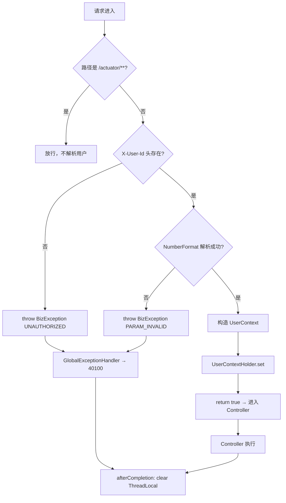
```mermaid
flowchart TD
    A[请求进入] --> B{路径是 /actuator/**?}
    B -->|是| C[放行，不解析用户]
    B -->|否| D{X-User-Id 头存在?}
    D -->|否| E[throw BizException UNAUTHORIZED]
    D -->|是| F{NumberFormat 解析成功?}
    F -->|否| G[throw BizException PARAM_INVALID]
    F -->|是| H[构造 UserContext]
    H --> I[UserContextHolder.set]
    I --> J[return true → 进入 Controller]
    E --> K[GlobalExceptionHandler → 40100]
    G --> K
    J --> L[Controller 执行]
    L --> M[afterCompletion: clear ThreadLocal]
    K --> M
```

### 4.5 统一响应格式与异常处理

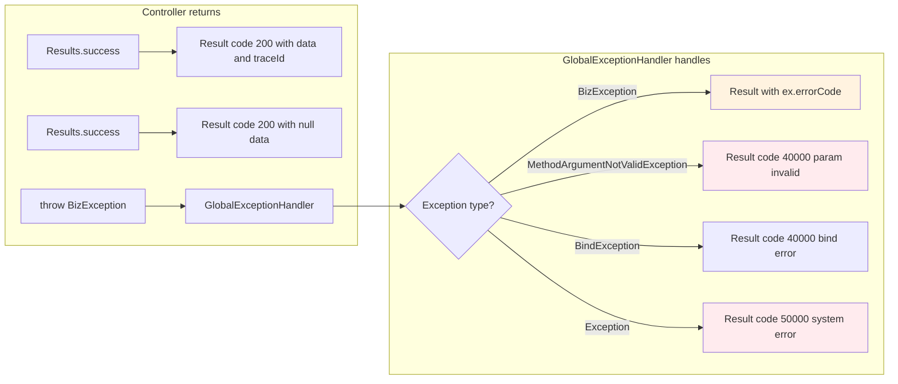
```mermaid
flowchart LR
    subgraph "Controller returns"
        A[Results.success] --> B[Result code 200 with data and traceId]
        C[Results.success] --> D[Result code 200 with null data]
        E[throw BizException] --> F[GlobalExceptionHandler]
    end

    subgraph "GlobalExceptionHandler handles"
        F --> G{Exception type?}
        G -->|BizException| H[Result with ex.errorCode]
        G -->|MethodArgumentNotValidException| I[Result code 40000 param invalid]
        G -->|BindException| J[Result code 40000 bind error]
        G -->|Exception| K[Result code 50000 system error]
    end

    style H fill:#fff3e0
    style I fill:#ffebee
    style K fill:#ffebee
```

**ErrorCode 枚举完整定义**（frameworks-common）：

| 错误码 | 枚举值 | HTTP 等效 | 分类 | 典型触发场景 |
|--------|--------|-----------|------|-------------|
| 40000 | `PARAM_INVALID` | 400 | 客户端错误 | `@Valid` 校验失败、参数格式错误、业务规则校验不通过 |
| 40100 | `UNAUTHORIZED` | 401 | 客户端错误 | `X-User-Id` 请求头缺失 |
| 40300 | `FORBIDDEN` | 403 | 客户端错误 | 非 owner 且非 admin 用户尝试修改/删除他人文档 |
| 40400 | `NOT_FOUND` | 404 | 客户端错误 | 文档/知识库/分类/Chunk 不存在 |
| 50000 | `SYSTEM_ERROR` | 500 | 服务端错误 | 未预期的 `NullPointerException`、`IOException` 等 |
| 50301 | `VECTOR_WRITE_FAILED` | 503 | 外部服务错误 | Milvus gRPC 调用失败、向量维度不匹配 |

---

## 5. Controller 层

### 5.1 控制器依赖关系图

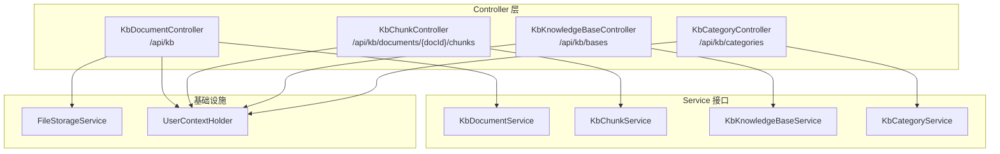
```mermaid
graph TB
    subgraph "Controller 层"
        DOC_CTL[KbDocumentController<br/>/api/kb]
        CHUNK_CTL["KbChunkController<br/>/api/kb/documents/{docId}/chunks"]
        KB_CTL[KbKnowledgeBaseController<br/>/api/kb/bases]
        CAT_CTL[KbCategoryController<br/>/api/kb/categories]
    end

    subgraph "Service 接口"
        DOC_SVC[KbDocumentService]
        CHUNK_SVC[KbChunkService]
        KB_SVC[KbKnowledgeBaseService]
        CAT_SVC[KbCategoryService]
    end

    subgraph "基础设施"
        FS[FileStorageService]
        UCTX[UserContextHolder]
    end

    DOC_CTL --> DOC_SVC
    DOC_CTL --> FS
    DOC_CTL --> UCTX
    CHUNK_CTL --> CHUNK_SVC
    CHUNK_CTL --> UCTX
    KB_CTL --> KB_SVC
    KB_CTL --> UCTX
    CAT_CTL --> CAT_SVC
    CAT_CTL --> UCTX
```

### 5.2 KbDocumentController 完整分析

**文件路径**：`web/KbDocumentController.java`  
**行数**：187 行  
**注解**：`@RestController` + `@RequestMapping("/api/kb")` + `@RequiredArgsConstructor`  
**依赖注入**：`KbDocumentService`（构造器注入）+ `FileStorageService`（构造器注入）

#### 5.2.1 接口清单（11 个接口）

| # | HTTP | 路径 | 参数 | 返回值 | 权限要求 | 行号 |
|---|------|------|------|--------|----------|------|
| 1 | `GET` | `/documents` | `current`(1), `size`(20) | `Result<PageResult<KbDocument>>` | 自动过滤可见文档 | 62-71 |
| 2 | `GET` | `/documents/{id}` | `@PathVariable Long id` | `Result<KbDocument>` | 可读（getVisible） | 79-83 |
| 3 | `POST` | `/documents/upload` | `@RequestPart meta` + `@RequestPart file` | `Result<Long>` | 登录即可 | 88-96 |
| 4 | `POST` | `/documents/{id}/start-chunk` | `@PathVariable Long id` | `Result<Void>` | 可写（assertWritable） | 101-105 |
| 5 | `POST` | `/documents/{id}/execute-chunk` | `@PathVariable Long id` | `Result<Void>` | 可写 | 110-114 |
| 6 | `PUT` | `/documents/{id}` | `@Valid KbDocumentUpdateRequest` | `Result<Void>` | 可写 | 116-123 |
| 7 | `PATCH` | `/documents/{id}/enabled` | `@RequestParam on` | `Result<Void>` | 可写 | 125-131 |
| 8 | `GET` | `/documents/{id}/chunk-logs` | `current`(1), `size`(20) | `Result<IPage<KbDocumentChunkLogVO>>` | 可读 | 134-141 |
| 9 | `GET` | `/documents/search` | `keyword`(必填), `limit`(10) | `Result<List<KbDocument>>` | 非admin只看自己的 | 143-149 |
| 10 | `GET` | `/documents/{id}/download` | `@PathVariable Long id` | `ResponseEntity<Resource>` | 可读 | 157-173 |
| 11 | `DELETE` | `/documents/{id}` | `@PathVariable Long id` | `Result<Void>` | owner 或 admin | 181-186 |

#### 5.2.2 每个接口的详细代码分析

**接口 1：分页列表 `GET /documents`**

```java
@GetMapping("/documents")
public Result<PageResult<KbDocument>> page(
        @RequestParam(defaultValue = "1") long current,   // 页码，默认 1
        @RequestParam(defaultValue = "20") long size      // 每页条数，默认 20
) {
    UserContext user = UserContextHolder.get();            // ① 获取当前用户
    Page<KbDocument> p = new Page<>(current, size);       // ② 构建 MyBatis-Plus 分页对象
    IPage<KbDocument> pageResult = kbDocumentService.pageVisible(p, user); // ③ 权限过滤分页
    return Results.success(
        PageResult.of(                                    // ④ 包装为 PageResult
            pageResult.getCurrent(),
            pageResult.getSize(),
            pageResult.getTotal(),
            pageResult.getRecords()
        )
    );
}
```

调用链：Controller → `KbDocumentServiceImpl.pageVisible()` → `baseMapper.selectPageVisible()` → `KbDocumentMapper.xml` 中的权限过滤 SQL（6 种 OR 条件）

**接口 3：上传 `POST /documents/upload`**

```java
@PostMapping(value = "/documents/upload", consumes = MediaType.MULTIPART_FORM_DATA_VALUE)
public Result<Long> upload(
        @Valid @RequestPart("meta") KbDocumentUploadRequest meta,  // JSON 元数据
        @RequestPart("file") MultipartFile file                     // 文件二进制
) {
    UserContext user = UserContextHolder.get();
    Long id = kbDocumentService.upload(user, meta, file);
    return Results.success(id);  // 返回新文档 ID
}
```

**接口 10：下载 `GET /documents/{id}/download`**

```java
@GetMapping("/documents/{id}/download")
public ResponseEntity<org.springframework.core.io.Resource> download(
        @PathVariable("id") Long id
) {
    // ① 权限校验（会抛 FORBIDDEN 如果不可见）
    UserContext user = UserContextHolder.get();
    KbDocument doc = kbDocumentService.getVisible(id, user);

    try {
        // ② 读取文件流
        InputStream is = fileStorageService.read(doc.getId());
        org.springframework.core.io.InputStreamResource resource =
                new org.springframework.core.io.InputStreamResource(is);

        // ③ 设置下载响应头
        return ResponseEntity.ok()
                .header(HttpHeaders.CONTENT_DISPOSITION,
                        "attachment; filename=\"" +
                        java.net.URLEncoder.encode(doc.getFileName(), "UTF-8") + "\"")
                .contentType(MediaType.APPLICATION_OCTET_STREAM)
                .body(resource);
    } catch (Exception e) {
        throw new BizException(ErrorCode.NOT_FOUND, "文件读取失败: " + e.getMessage());
    }
}
```

### 5.3 KbChunkController 完整分析

**文件路径**：`web/KbChunkController.java`  
**行数**：106 行  
**路径前缀**：`/api/kb/documents/{docId}/chunks`

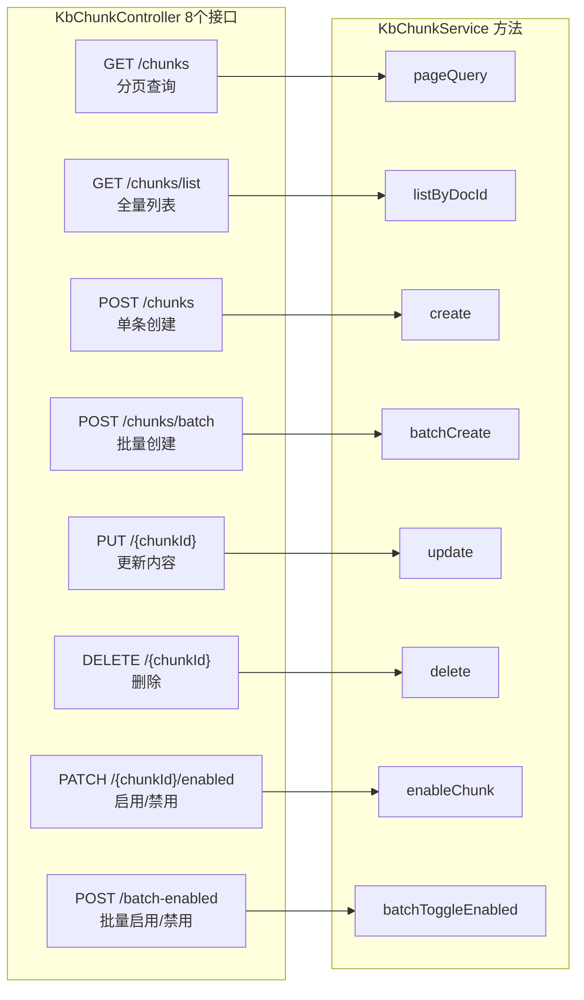
```mermaid
graph LR
    subgraph "KbChunkController 8个接口"
        A[GET /chunks<br/>分页查询]
        B[GET /chunks/list<br/>全量列表]
        C[POST /chunks<br/>单条创建]
        D[POST /chunks/batch<br/>批量创建]
        E["PUT /{chunkId}<br/>更新内容"]
        F["DELETE /{chunkId}<br/>删除"]
        G["PATCH /{chunkId}/enabled<br/>启用/禁用"]
        H[POST /batch-enabled<br/>批量启用/禁用]
    end

    subgraph "KbChunkService 方法"
        A --> S1[pageQuery]
        B --> S2[listByDocId]
        C --> S3[create]
        D --> S4[batchCreate]
        E --> S5[update]
        F --> S6[delete]
        G --> S7[enableChunk]
        H --> S8[batchToggleEnabled]
    end
```

**batchCreate 特殊设计**：
- URL 参数 `writeVector`（默认 false）控制是否在批量创建后执行向量化
- false：仅写入 `kb_document_chunk` 表，不写 Milvus
- true：额外执行 `embedBatch` + `indexDocumentChunks` 写入向量

**batchToggleEnabled 限制**：
- 单次最多 500 条（`KbChunkBatchRequest.chunkIds` 上限）
- 必须指定具体的 chunkIds，不能全量操作

### 5.4 KbKnowledgeBaseController 完整分析

**文件路径**：`web/KbKnowledgeBaseController.java`  
**行数**：73 行  
**路径前缀**：`/api/kb/bases`

6 个接口：create / page / detail / update / rename / delete。

### 5.5 KbCategoryController

**文件路径**：`web/KbCategoryController.java`  

5 个接口：list / detail / create / update / delete。全部委托 `KbCategoryServiceImpl`（继承 `ServiceImpl<M>`）。

---

## 6. Domain 层 —— 枚举定义

### 6.1 枚举全景图

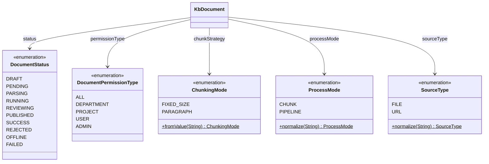
```mermaid
classDiagram
    class DocumentStatus {
        <<enumeration>>
        DRAFT
        PENDING
        PARSING
        RUNNING
        REVIEWING
        PUBLISHED
        SUCCESS
        REJECTED
        OFFLINE
        FAILED
    }

    class DocumentPermissionType {
        <<enumeration>>
        ALL
        DEPARTMENT
        PROJECT
        USER
        ADMIN
    }

    class ChunkingMode {
        <<enumeration>>
        FIXED_SIZE
        PARAGRAPH
        +fromValue(String) ChunkingMode$
    }

    class ProcessMode {
        <<enumeration>>
        CHUNK
        PIPELINE
        +normalize(String) ProcessMode$
    }

    class SourceType {
        <<enumeration>>
        FILE
        URL
        +normalize(String) SourceType$
    }

    KbDocument --> DocumentStatus : status
    KbDocument --> DocumentPermissionType : permissionType
    KbDocument --> ChunkingMode : chunkStrategy
    KbDocument --> ProcessMode : processMode
    KbDocument --> SourceType : sourceType
```

### 6.2 DocumentStatus 详细分析

**文件路径**：`domain/DocumentStatus.java`  
**行数**：57 行  
**枚举值**：10 个（当前使用 3 个核心值 + 7 个预留值）

```java
public enum DocumentStatus {
    DRAFT,        // 草稿（预留 —— 未来可能支持"暂存不提交"）
    PENDING,      // ★ 已上传，等待分块任务
    PARSING,      // 解析中（预留 —— 与 RUNNING 语义相近，可能合并）
    RUNNING,      // ★ 分块/向量任务处理中（禁止手工修改 Chunk）
    REVIEWING,    // 审核中（预留 —— 未来审核流程）
    PUBLISHED,    // 已发布（预留 —— 未来发布管理）
    SUCCESS,      // ★ 分块与向量写入成功
    REJECTED,     // 审核拒绝（预留）
    OFFLINE,      // 已下架（预留）
    FAILED        // ★ 分块失败（可从 PENDING 或 RUNNING 进入）
}
```

**数据库中存储为字符串**（VARCHAR(64) 类型，存储枚举名如 `"PENDING"`），不是序数。这样增减枚举值时不影响已有数据。

### 6.3 DocumentPermissionType 详细分析

**文件路径**：`domain/DocumentPermissionType.java`  
**行数**：32 行

```java
public enum DocumentPermissionType {
    ALL,          // 全员可见 —— 不需要权限明细行
    DEPARTMENT,   // 同部门可见 —— 通过 kb_document.department_id 匹配，不需要权限明细行
    PROJECT,      // 项目成员可见 —— 需要权限明细行：kb_document_permission (PROJECT, projectId)
    USER,         // 指定用户可见 —— 需要权限明细行：kb_document_permission (USER, userId)
    ADMIN         // 仅管理员可见 —— 不需要权限明细行（管理员代码层面判断）
}
```

**权限行是否需要**：

| 类型 | 需要 kb_document_permission? | 判断依据 |
|------|---------------------------|----------|
| ALL | 否 | 直接返回 true |
| DEPARTMENT | 否 | `doc.departmentId == user.departmentId` |
| ADMIN | 否 | `user.isAdmin()` |
| PROJECT | 是 | 查询 permission_target_type='PROJECT' 的行 |
| USER | 是 | 查询 permission_target_type='USER' 的行 |

### 6.4 ChunkingMode 详细分析

**文件路径**：`domain/ChunkingMode.java`  
**行数**：25 行

```java
public enum ChunkingMode {
    FIXED_SIZE,   // 固定窗口滑窗切分 → FixedSizeChunkingStrategy
    PARAGRAPH;    // 按段落切分 → ParagraphChunkingStrategy

    /**
     * 从字符串解析分块模式。
     * 空值 → FIXED_SIZE（默认策略）
     * 无效值 → BizException(PARAM_INVALID)
     */
    public static ChunkingMode fromValue(String raw) {
        if (!StringUtils.hasText(raw)) {
            return FIXED_SIZE;                       // 默认策略：固定大小
        }
        try {
            return ChunkingMode.valueOf(raw.trim().toUpperCase());  // 大小写不敏感
        } catch (IllegalArgumentException ex) {
            throw new BizException(ErrorCode.PARAM_INVALID,
                    "chunkStrategy 非法: " + raw);
        }
    }
}
```

### 6.5 ProcessMode 详细分析

**文件路径**：`domain/ProcessMode.java`  
**行数**：25 行

```java
public enum ProcessMode {
    CHUNK,      // 本地分块 + 向量化（当前唯一支持的路径）
    PIPELINE;   // 外部 Pipeline 编排引擎（预留，调用会抛异常）

    public static ProcessMode normalize(String raw) {
        if (!StringUtils.hasText(raw)) {
            return CHUNK;  // 默认模式：本地分块
        }
        try {
            return ProcessMode.valueOf(raw.trim().toUpperCase());
        } catch (IllegalArgumentException ex) {
            throw new BizException(ErrorCode.PARAM_INVALID,
                    "processMode 非法: " + raw);
        }
    }
}
```

### 6.6 SourceType 详细分析

**文件路径**：`domain/SourceType.java`  
**行数**：25 行

```java
public enum SourceType {
    FILE,   // 本地文件上传（当前唯一支持）
    URL;    // URL 远程拉取（预留，上传时选 URL 会抛异常）

    public static SourceType normalize(String raw) {
        if (!StringUtils.hasText(raw)) {
            return FILE;  // 默认来源：文件上传
        }
        try {
            return SourceType.valueOf(raw.trim().toUpperCase());
        } catch (IllegalArgumentException ex) {
            throw new BizException(ErrorCode.PARAM_INVALID,
                    "sourceType 非法: " + raw);
        }
    }
}
```

---

## 7. Entity 层 —— ORM 实体

### 7.1 实体 ER 关系图

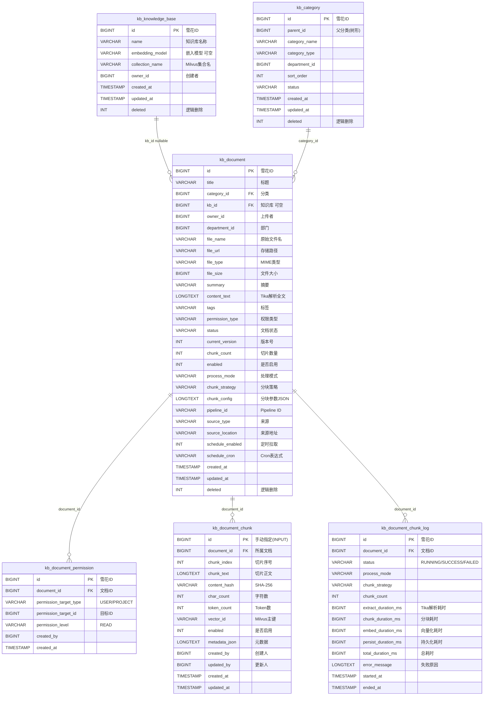
```mermaid
erDiagram
    kb_knowledge_base ||--o{ kb_document : "kb_id nullable"
    kb_category ||--o{ kb_document : "category_id"
    kb_document ||--o{ kb_document_permission : "document_id"
    kb_document ||--o{ kb_document_chunk : "document_id"
    kb_document ||--o{ kb_document_chunk_log : "document_id"

    kb_knowledge_base {
        BIGINT id PK "雪花ID"
        VARCHAR name "知识库名称"
        VARCHAR embedding_model "嵌入模型 可空"
        VARCHAR collection_name "Milvus集合名"
        BIGINT owner_id "创建者"
        TIMESTAMP created_at
        TIMESTAMP updated_at
        INT deleted "逻辑删除"
    }

    kb_document {
        BIGINT id PK "雪花ID"
        VARCHAR title "标题"
        BIGINT category_id FK "分类"
        BIGINT kb_id FK "知识库 可空"
        BIGINT owner_id "上传者"
        BIGINT department_id "部门"
        VARCHAR file_name "原始文件名"
        VARCHAR file_url "存储路径"
        VARCHAR file_type "MIME类型"
        BIGINT file_size "文件大小"
        VARCHAR summary "摘要"
        LONGTEXT content_text "Tika解析全文"
        VARCHAR tags "标签"
        VARCHAR permission_type "权限类型"
        VARCHAR status "文档状态"
        INT current_version "版本号"
        INT chunk_count "切片数量"
        INT enabled "是否启用"
        VARCHAR process_mode "处理模式"
        VARCHAR chunk_strategy "分块策略"
        LONGTEXT chunk_config "分块参数JSON"
        VARCHAR pipeline_id "Pipeline ID"
        VARCHAR source_type "来源"
        VARCHAR source_location "来源地址"
        INT schedule_enabled "定时拉取"
        VARCHAR schedule_cron "Cron表达式"
        TIMESTAMP created_at
        TIMESTAMP updated_at
        INT deleted "逻辑删除"
    }

    kb_document_chunk {
        BIGINT id PK "手动指定(INPUT)"
        BIGINT document_id FK "所属文档"
        INT chunk_index "切片序号"
        LONGTEXT chunk_text "切片正文"
        VARCHAR content_hash "SHA-256"
        INT char_count "字符数"
        INT token_count "Token数"
        VARCHAR vector_id "Milvus主键"
        INT enabled "是否启用"
        LONGTEXT metadata_json "元数据"
        BIGINT created_by "创建人"
        BIGINT updated_by "更新人"
        TIMESTAMP created_at
        TIMESTAMP updated_at
    }

    kb_document_permission {
        BIGINT id PK "雪花ID"
        BIGINT document_id FK "文档ID"
        VARCHAR permission_target_type "USER/PROJECT"
        BIGINT permission_target_id "目标ID"
        VARCHAR permission_level "READ"
        BIGINT created_by
        TIMESTAMP created_at
    }

    kb_document_chunk_log {
        BIGINT id PK "雪花ID"
        BIGINT document_id FK "文档ID"
        VARCHAR status "RUNNING/SUCCESS/FAILED"
        VARCHAR process_mode
        VARCHAR chunk_strategy
        INT chunk_count
        BIGINT extract_duration_ms "Tika解析耗时"
        BIGINT chunk_duration_ms "分块耗时"
        BIGINT embed_duration_ms "向量化耗时"
        BIGINT persist_duration_ms "持久化耗时"
        BIGINT total_duration_ms "总耗时"
        LONGTEXT error_message "失败原因"
        TIMESTAMP started_at
        TIMESTAMP ended_at
    }

    kb_category {
        BIGINT id PK "雪花ID"
        BIGINT parent_id "父分类(树形)"
        VARCHAR category_name
        VARCHAR category_type
        BIGINT department_id
        INT sort_order
        VARCHAR status
        TIMESTAMP created_at
        TIMESTAMP updated_at
        INT deleted "逻辑删除"
    }
```

### 7.2 KbDocument 完整字段分析（28 个字段）

**文件路径**：`entity/KbDocument.java`  
**行数**：164 行  

| # | 字段名 | Java 类型 | DB 列 | DB 类型 | 默认值 | 注解 | 说明 |
|---|--------|-----------|-------|---------|--------|------|------|
| 1 | `id` | `Long` | `id` | `BIGINT PK` | — | `@TableId(ASSIGN_ID)` | 雪花算法自动生成 |
| 2 | `title` | `String` | `title` | `VARCHAR(512)` | — | — | 文档标题，上传时必填 |
| 3 | `categoryId` | `Long` | `category_id` | `BIGINT` | null | — | 外键 → kb_category.id |
| 4 | `kbId` | `Long` | `kb_id` | `BIGINT` | null | — | 外键 → kb_knowledge_base.id，null=默认集合 |
| 5 | `ownerId` | `Long` | `owner_id` | `BIGINT` | — | — | 上传者，权限判断的 owner |
| 6 | `departmentId` | `Long` | `department_id` | `BIGINT` | null | — | DEPARTMENT 权限匹配用 |
| 7 | `fileName` | `String` | `file_name` | `VARCHAR(512)` | null | — | 原始文件名（如 "报告.pdf"） |
| 8 | `fileUrl` | `String` | `file_url` | `VARCHAR(1024)` | null | — | 存储后的绝对/相对路径 |
| 9 | `fileType` | `String` | `file_type` | `VARCHAR(128)` | null | — | MIME 类型（Tika 探测后覆盖） |
| 10 | `fileSize` | `Long` | `file_size` | `BIGINT` | null | — | 文件字节数 |
| 11 | `summary` | `String` | `summary` | `VARCHAR(1024)` | null | — | 摘要（分块后取前 200 字） |
| 12 | `contentText` | `String` | `content_text` | `LONGTEXT` | null | — | Tika 解析后的完整正文 |
| 13 | `tags` | `String` | `tags` | `VARCHAR(512)` | null | — | 逗号分隔的标签 |
| 14 | `permissionType` | `String` | `permission_type` | `VARCHAR(64)` | — | — | DocumentPermissionType 枚举名 |
| 15 | `status` | `String` | `status` | `VARCHAR(64)` | — | — | DocumentStatus 枚举名 |
| 16 | `currentVersion` | `Integer` | `current_version` | `INT` | 1 | — | 版本号（预留） |
| 17 | `chunkCount` | `Integer` | `chunk_count` | `INT` | 0 | — | 切片数（查询计数，非自增） |
| 18 | `enabled` | `Integer` | `enabled` | `INT` | 1 | — | 0=禁用（不影响已写向量） |
| 19 | `processMode` | `String` | `process_mode` | `VARCHAR(32)` | CHUNK | — | 处理模式 |
| 20 | `chunkStrategy` | `String` | `chunk_strategy` | `VARCHAR(64)` | null | — | 分块策略枚举名 |
| 21 | `chunkConfig` | `String` | `chunk_config` | `LONGTEXT` | null | — | 分块参数 JSON |
| 22 | `pipelineId` | `String` | `pipeline_id` | `VARCHAR(128)` | null | — | Pipeline 模式下的管线 ID |
| 23 | `sourceType` | `String` | `source_type` | `VARCHAR(32)` | FILE | — | SourceType 枚举名 |
| 24 | `sourceLocation` | `String` | `source_location` | `VARCHAR(1024)` | null | — | URL 来源地址 |
| 25 | `scheduleEnabled` | `Integer` | `schedule_enabled` | `INT` | 0 | — | 定时拉取开关 |
| 26 | `scheduleCron` | `String` | `schedule_cron` | `VARCHAR(128)` | null | — | Cron 表达式 |
| 27 | `createdAt` | `LocalDateTime` | `created_at` | `TIMESTAMP` | NOW | — | 创建时间 |
| 28 | `updatedAt` | `LocalDateTime` | `updated_at` | `TIMESTAMP` | NOW | — | 自动更新 |
| 29 | `deleted` | `Integer` | `deleted` | `INT` | 0 | `@TableLogic` | 逻辑删除标记 |

### 7.3 KbDocumentChunk 完整字段分析（14 个字段）

**文件路径**：`entity/KbDocumentChunk.java`  
**行数**：87 行  
**主键策略**：`IdType.INPUT`（手动指定，保证与 Milvus 主键一致性）

| # | 字段名 | Java 类型 | DB 列 | 说明 |
|---|--------|-----------|-------|------|
| 1 | `id` | `Long` | `id BIGINT PK` | 手动设置（`IdWorker.getId()` 或请求指定），`String.valueOf(id)` = Milvus PK |
| 2 | `documentId` | `Long` | `document_id BIGINT` | 所属文档 |
| 3 | `chunkIndex` | `Integer` | `chunk_index INT` | 从 0 开始递增 |
| 4 | `chunkText` | `String` | `chunk_text LONGTEXT` | 切片正文 |
| 5 | `contentHash` | `String` | `content_hash VARCHAR(64)` | `ContentHashUtil.sha256Hex()` 计算 |
| 6 | `charCount` | `Integer` | `char_count INT` | `content.length()` |
| 7 | `tokenCount` | `Integer` | `token_count INT` | `SimpleTokenCounterService.countTokens()` |
| 8 | `vectorId` | `String` | `vector_id VARCHAR(256)` | `String.valueOf(id)` |
| 9 | `enabled` | `Integer` | `enabled INT DEFAULT 1` | 禁用后不影响 Milvus 已有向量（需手动删） |
| 10 | `metadataJson` | `String` | `metadata_json LONGTEXT` | 默认为 `"{}"` |
| 11 | `createdBy` | `Long` | `created_by BIGINT` | 创建者用户 ID |
| 12 | `updatedBy` | `Long` | `updated_by BIGINT` | 最后修改者用户 ID |
| 13 | `createdAt` | `LocalDateTime` | `created_at` | 创建时间 |
| 14 | `updatedAt` | `LocalDateTime` | `updated_at` | 更新时间 |

### 7.4 KbDocumentChunkLog 完整字段分析

**文件路径**：`entity/KbDocumentChunkLog.java`  
**行数**：47 行

记录**每次**分块执行的完整追踪信息，包含 5 个阶段耗时：

| 阶段 | 字段 | 说明 |
|------|------|------|
| 1. Tika 解析 | `extractDurationMs` | Apache Tika 解析文档耗时 |
| 2. 策略分块 | `chunkDurationMs` | ChunkingStrategy.chunk() 耗时 |
| 3. 向量化 | `embedDurationMs` | EmbeddingService.embedBatch() 耗时 |
| 4. 持久化 | `persistDurationMs` | DB INSERT + Milvus INSERT 耗时 |
| 5. 总计 | `totalDurationMs` | 从 runChunkTask 开始到结束的总耗时 |

### 7.5 KbKnowledgeBase 完整字段分析

**文件路径**：`entity/KbKnowledgeBase.java`  
**行数**：41 行  
**逻辑删除**：`@TableLogic` on `deleted`

| # | 字段名 | Java 类型 | DB 列 | 说明 |
|---|--------|-----------|-------|------|
| 1 | `id` | `Long` | `id BIGINT PK` | 雪花ID |
| 2 | `name` | `String` | `name VARCHAR(255)` | 唯一（业务校验保证） |
| 3 | `embeddingModel` | `String` | `embedding_model VARCHAR(128)` | null=使用全局默认模型 |
| 4 | `collectionName` | `String` | `collection_name VARCHAR(128)` | Milvus 集合名，唯一 |
| 5 | `ownerId` | `Long` | `owner_id BIGINT` | 创建者 |
| 6 | `createdAt` | `LocalDateTime` | `created_at` | — |
| 7 | `updatedAt` | `LocalDateTime` | `updated_at` | — |
| 8 | `deleted` | `Integer` | `deleted INT DEFAULT 0` | — |

### 7.6 KbDocumentPermission 完整字段分析

**文件路径**：`entity/KbDocumentPermission.java`

| # | 字段名 | Java 类型 | DB 列 | 说明 |
|---|--------|-----------|-------|------|
| 1 | `id` | `Long` | `id BIGINT PK` | 雪花ID |
| 2 | `documentId` | `Long` | `document_id BIGINT` | 关联文档 |
| 3 | `permissionTargetType` | `String` | `permission_target_type VARCHAR(64)` | `"USER"` 或 `"PROJECT"` |
| 4 | `permissionTargetId` | `Long` | `permission_target_id BIGINT` | 用户ID 或 项目ID |
| 5 | `permissionLevel` | `String` | `permission_level VARCHAR(64)` | 当前仅 `"READ"` |
| 6 | `createdBy` | `Long` | `created_by BIGINT` | 创建者 |
| 7 | `createdAt` | `LocalDateTime` | `created_at` | 创建时间 |

**注意**：此表无 `deleted` 字段，删除文档时物理 DELETE。

### 7.7 KbCategory 完整字段分析

**文件路径**：`entity/KbCategory.java`

| # | 字段名 | Java 类型 | DB 列 | 说明 |
|---|--------|-----------|-------|------|
| 1 | `id` | `Long` | `id BIGINT PK` | 雪花ID（种子数据 1001） |
| 2 | `parentId` | `Long` | `parent_id BIGINT` | 父分类，支持树形结构 |
| 3 | `categoryName` | `String` | `category_name VARCHAR(255)` | 分类名称 |
| 4 | `categoryType` | `String` | `category_type VARCHAR(64)` | 分类类型 |
| 5 | `departmentId` | `Long` | `department_id BIGINT` | 所属部门 |
| 6 | `sortOrder` | `Integer` | `sort_order INT DEFAULT 0` | 排序 |
| 7 | `status` | `String` | `status VARCHAR(32) DEFAULT 'ACTIVE'` | 状态 |

---

## 8. DTO 层 —— 数据传输对象

### 8.1 DTO 全景图

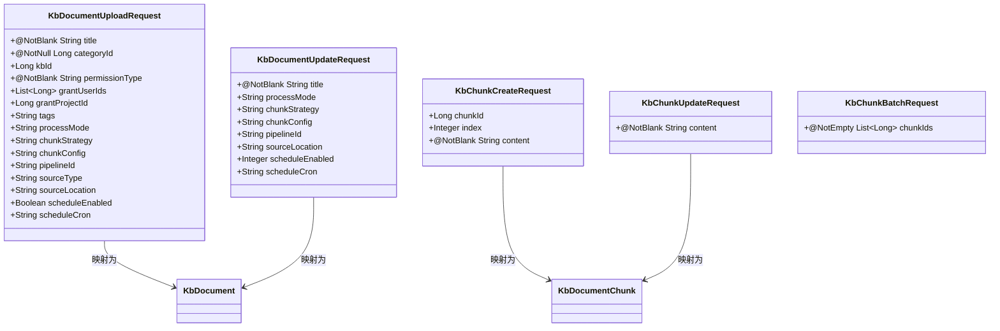
```mermaid
classDiagram
    class KbDocumentUploadRequest {
        +@NotBlank String title
        +@NotNull Long categoryId
        +Long kbId
        +@NotBlank String permissionType
        +List~Long~ grantUserIds
        +Long grantProjectId
        +String tags
        +String processMode
        +String chunkStrategy
        +String chunkConfig
        +String pipelineId
        +String sourceType
        +String sourceLocation
        +Boolean scheduleEnabled
        +String scheduleCron
    }

    class KbDocumentUpdateRequest {
        +@NotBlank String title
        +String processMode
        +String chunkStrategy
        +String chunkConfig
        +String pipelineId
        +String sourceLocation
        +Integer scheduleEnabled
        +String scheduleCron
    }

    class KbChunkCreateRequest {
        +Long chunkId
        +Integer index
        +@NotBlank String content
    }

    class KbChunkUpdateRequest {
        +@NotBlank String content
    }

    class KbChunkBatchRequest {
        +@NotEmpty List~Long~ chunkIds
    }

    KbDocumentUploadRequest --> KbDocument : 映射为
    KbDocumentUpdateRequest --> KbDocument : 映射为
    KbChunkCreateRequest --> KbDocumentChunk : 映射为
    KbChunkUpdateRequest --> KbDocumentChunk : 映射为
```

### 8.2 KbDocumentUploadRequest（15 个字段）

**文件路径**：`dto/KbDocumentUploadRequest.java`  
**行数**：92 行  
**Jakarta Validation 注解**：`@NotBlank`（title, permissionType）、`@NotNull`（categoryId）

每个字段的用途：
- `title`：上传后作为文档标题，trim 后存储
- `categoryId`：必须指向已存在的分类，否则 `NOT_FOUND`
- `kbId`：可选，指定后向量写入对应知识库的 Milvus 集合
- `permissionType`：`"ALL"/"DEPARTMENT"/"PROJECT"/"USER"/"ADMIN"` 之一
- `grantUserIds`：`permissionType=USER` 时必填
- `grantProjectId`：`permissionType=PROJECT` 时必填
- `chunkConfig`：JSON 格式，如 `{"maxChars":2000,"overlapChars":0}`，上传时校验 JSON 合法性

### 8.3 KbChunkCreateRequest（3 个字段）

```java
@Data
public class KbChunkCreateRequest {
    private Long chunkId;         // 可选：指定主键（不传则雪花生成）
    private Integer index;        // 可选：指定序号（不传则追加到末尾）
    @NotBlank
    private String content;       // 必填：切片正文
}
```

**雪花 ID 生成**：`IdWorker.getId()`（MyBatis-Plus 内置），保证分布式唯一。

### 8.4 KbChunkBatchRequest（1 个字段 + 校验）

```java
@Data
public class KbChunkBatchRequest {
    @NotEmpty
    private List<Long> chunkIds;  // 上限 500 条（在 Service 层校验）
}
```

### 8.5 KbKnowledgeBaseCreateRequest（3 个字段）

```java
@Data
public class KbKnowledgeBaseCreateRequest {
    @NotBlank
    private String name;              // 知识库名称（唯一校验）
    @NotBlank
    private String collectionName;    // Milvus 集合名（格式校验：^[a-zA-Z_][a-zA-Z0-9_]{0,127}$）
    private String embeddingModel;    // 可选：不传则使用全局配置
}
```

---

## 9. Mapper 层 —— 数据访问

### 9.1 Mapper 架构图

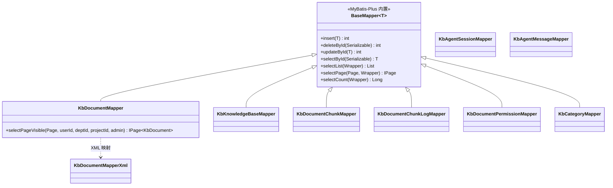
```mermaid
classDiagram
    class BaseMapper~T~ {
        <<MyBatis-Plus 内置>>
        +insert(T) int
        +deleteById(Serializable) int
        +updateById(T) int
        +selectById(Serializable) T
        +selectList(Wrapper) List
        +selectPage(Page, Wrapper) IPage
        +selectCount(Wrapper) Long
    }

    class KbDocumentMapper {
        +selectPageVisible(Page, userId, deptId, projectId, admin) IPage~KbDocument~
    }

    class KbKnowledgeBaseMapper {
    }

    class KbDocumentChunkMapper {
    }

    class KbDocumentChunkLogMapper {
    }

    class KbDocumentPermissionMapper {
    }

    class KbCategoryMapper {
    }

    class KbAgentSessionMapper {
    }

    class KbAgentMessageMapper {
    }

    BaseMapper~KbDocument~ <|-- KbDocumentMapper
    BaseMapper~KbKnowledgeBase~ <|-- KbKnowledgeBaseMapper
    BaseMapper~KbDocumentChunk~ <|-- KbDocumentChunkMapper
    BaseMapper~KbDocumentChunkLog~ <|-- KbDocumentChunkLogMapper
    BaseMapper~KbDocumentPermission~ <|-- KbDocumentPermissionMapper
    BaseMapper~KbCategory~ <|-- KbCategoryMapper

    KbDocumentMapper ..> KbDocumentMapperXml : XML 映射
```

### 9.2 KbDocumentMapper —— 自定义权限过滤查询

**文件路径**：`mapper/KbDocumentMapper.java`  
**行数**：40 行  
**注解**：`@Mapper`  
**继承**：`BaseMapper<KbDocument>`（获得 7 个内置 CRUD 方法）

```java
@Mapper
public interface KbDocumentMapper extends BaseMapper<KbDocument> {

    /**
     * 权限感知分页查询。
     *
     * @param page      MyBatis-Plus 分页对象（含 current, size）
     * @param userId    当前用户 ID —— SQL 中 #{userId}
     * @param deptId    部门 ID（可为 null）—— SQL 中 #{deptId}
     * @param projectId 项目 ID（可为 null）—— SQL 中 #{projectId}
     * @param admin     0=普通用户, 1=管理员 —— SQL 中 #{admin}
     * @return 仅包含当前用户有权限查看的文档
     */
    IPage<KbDocument> selectPageVisible(
            Page<KbDocument> page,
            @Param("userId") Long userId,
            @Param("deptId") Long deptId,
            @Param("projectId") Long projectId,
            @Param("admin") int admin
    );
}
```

### 9.3 KbDocumentMapper.xml —— 权限过滤 SQL 逐行解析

**文件路径**：`src/main/resources/mapper/KbDocumentMapper.xml`  
**行数**：50 行

```xml
<?xml version="1.0" encoding="UTF-8" ?>
<!DOCTYPE mapper PUBLIC "-//mybatis.org//DTD Mapper 3.0//EN"
        "https://mybatis.org/dtd/mybatis-3-mapper.dtd">
<mapper namespace="com.zjl.knowledge.mapper.KbDocumentMapper">

    <select id="selectPageVisible" resultType="com.zjl.knowledge.entity.KbDocument">
        <!-- ★ 注意：SELECT 列表中不包含 content_text (LONGTEXT)
             避免大字段影响分页性能，详情查询时才加载 -->
        SELECT d.id,
               d.title,
               d.category_id,
               d.owner_id,
               d.department_id,
               d.file_name,
               d.file_url,
               d.file_type,
               d.file_size,
               d.summary,
               d.tags,
               d.permission_type,
               d.status,
               d.current_version,
               d.created_at,
               d.updated_at,
               d.deleted
        FROM kb_document d
        WHERE d.deleted = 0       -- ★ 逻辑删除过滤（MyBatis-Plus 自动追加）
          AND (                   -- ★ 权限条件：以下 6 种满足任一即可见
            -- ① 文档上传者本人
            d.owner_id = #{userId}

            -- ② 全员可见文档
            OR d.permission_type = 'ALL'

            -- ③ 同部门可见（双方 department_id 都非空且相等）
            OR (d.permission_type = 'DEPARTMENT'
                AND #{deptId} IS NOT NULL
                AND d.department_id IS NOT NULL
                AND d.department_id = #{deptId})

            -- ④ 管理员可见（仅当 isAdmin=1 时生效）
            OR (d.permission_type = 'ADMIN' AND #{admin} = 1)

            -- ⑤ 项目成员可见（EXISTS 子查询 kb_document_permission）
            OR EXISTS (SELECT 1
                       FROM kb_document_permission p
                       WHERE p.document_id = d.id
                         AND d.permission_type = 'PROJECT'
                         AND #{projectId} IS NOT NULL
                         AND p.permission_target_type = 'PROJECT'
                         AND p.permission_target_id = #{projectId})

            -- ⑥ 指定用户可见（EXISTS 子查询 kb_document_permission）
            OR EXISTS (SELECT 1
                       FROM kb_document_permission p2
                       WHERE p2.document_id = d.id
                         AND d.permission_type = 'USER'
                         AND p2.permission_target_type = 'USER'
                         AND p2.permission_target_id = #{userId})
          )
        ORDER BY d.updated_at DESC   -- 最近更新的排前面
    </select>
</mapper>
```

**SQL 性能分析**：

| 方面 | 分析 |
|------|------|
| 索引利用 | `idx_kb_document_owner`, `idx_kb_document_status` 可辅助过滤 |
| EXISTS vs JOIN | 使用 `EXISTS` 而非 `LEFT JOIN`，因为不需要返回 permission 表的字段，EXISTS 在找到第一条匹配后即停止扫描 |
| LONGTEXT | `content_text` 不在分页 SELECT 中，避免每页传输数十 MB 数据 |
| 参数 null 处理 | `#{deptId} IS NOT NULL` 和 `#{projectId} IS NOT NULL` 在 SQL 层面处理了 Java 端的 null 值 |

### 9.4 MyBatis-Plus 条件构造器使用模式

项目中使用的 4 种核心写法：

```java
// 模式 1：LambdaUpdateWrapper —— CAS 乐观锁更新
kbDocumentMapper.update(null,
    Wrappers.lambdaUpdate(KbDocument.class)
        .set(KbDocument::getStatus, "RUNNING")
        .eq(KbDocument::getId, documentId)
        .ne(KbDocument::getStatus, "RUNNING")  // CAS 条件：只更新非 RUNNING 的行
);
// 生成 SQL: UPDATE kb_document SET status='RUNNING' WHERE id=? AND status<>'RUNNING'

// 模式 2：LambdaQueryWrapper —— 条件查询
kbDocumentChunkMapper.selectList(
    Wrappers.lambdaQuery(KbDocumentChunk.class)
        .eq(KbDocumentChunk::getDocumentId, docId)
        .orderByAsc(KbDocumentChunk::getChunkIndex)
);
// 生成 SQL: SELECT * FROM kb_document_chunk WHERE document_id=? ORDER BY chunk_index ASC

// 模式 3：物理删除（不走 @TableLogic 逻辑删除）
kbDocumentChunkMapper.delete(
    new LambdaQueryWrapper<KbDocumentChunk>()
        .eq(KbDocumentChunk::getDocumentId, docId)
);
// 生成 SQL: DELETE FROM kb_document_chunk WHERE document_id=?

// 模式 4：GROUP BY 聚合查询
kbDocumentMapper.selectMaps(
    Wrappers.query(KbDocument.class)
        .select("kb_id AS kbId", "COUNT(1) AS docCount")
        .in("kb_id", kbIds)
        .groupBy("kb_id")
);
// 生成 SQL: SELECT kb_id AS kbId, COUNT(1) AS docCount FROM kb_document
//            WHERE kb_id IN (...) GROUP BY kb_id
```

---

## 10. Service 层 —— 核心业务逻辑

### 10.1 服务依赖全景图

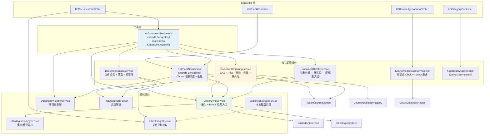
```mermaid
graph TB
    subgraph "Controller 层"
        DOC_CTL[KbDocumentController]
        CHUNK_CTL[KbChunkController]
        KB_CTL[KbKnowledgeBaseController]
        CAT_CTL[KbCategoryController]
    end

    subgraph "门面层"
        DOC_SVC[KbDocumentServiceImpl<br/>extends ServiceImpl<br/>implements KbDocumentService]
    end

    subgraph "独立职责服务"
        UPLOAD[DocumentUploadService<br/>上传校验 + 落盘 + 权限行]
        CHUNKING[DocumentChunkingService<br/>CAS + Tika + 分块 + 向量 + 持久化]
        DELETE[DocumentDeleteService<br/>先删向量 → 删关联 → 逻辑删文档]
        CHUNK_CRUD[KbChunkServiceImpl<br/>extends ServiceImpl<br/>Chunk 增删改查 + 批量]
        KB_SVC[KbKnowledgeBaseServiceImpl<br/>知识库 CRUD + Milvus集合]
        CAT_SVC[KbCategoryServiceImpl<br/>extends ServiceImpl]
    end

    subgraph "横向服务"
        VEC_SYNC[VectorSyncService<br/>嵌入 + Milvus 读写入口]
        VIS_SVC[DocumentVisibilityService<br/>可见性判断]
        ROUTE[KbMilvusRoutingService<br/>集合/模型路由]
        TIKA[TikaDocumentParser<br/>文档解析]
        FILE_SVC[FileStorageService<br/>文件存取接口]
        FILE_IMPL[LocalFileStorageService<br/>本地磁盘实现]
    end

    DOC_CTL --> DOC_SVC
    DOC_CTL --> FILE_SVC
    CHUNK_CTL --> CHUNK_CRUD
    KB_CTL --> KB_SVC
    CAT_CTL --> CAT_SVC

    DOC_SVC --> UPLOAD
    DOC_SVC --> CHUNKING
    DOC_SVC --> DELETE
    DOC_SVC --> VIS_SVC
    DOC_SVC --> VEC_SYNC
    DOC_SVC --> CHUNK_CRUD

    CHUNKING --> TIKA
    CHUNKING --> VEC_SYNC
    CHUNKING --> TOKEN[TokenCounterService]
    CHUNKING --> CHUNK_FACTORY[ChunkingStrategyFactory]

    CHUNK_CRUD --> VEC_SYNC
    CHUNK_CRUD --> VIS_SVC
    CHUNK_CRUD --> TOKEN

    DELETE --> VEC_SYNC

    UPLOAD --> FILE_SVC
    UPLOAD --> TIKA

    VEC_SYNC --> ROUTE
    VEC_SYNC --> EMBED[EmbeddingService]
    VEC_SYNC --> VECTOR_STORE[ChunkVectorStore]

    KB_SVC --> MILVUS_HELPER[MilvusCollectionHelper]

    FILE_IMPL -.-> FILE_SVC

    style DOC_SVC fill:#e3f2fd
    style CHUNKING fill:#fff3e0
    style VEC_SYNC fill:#e8f5e9
```

### 10.2 KbDocumentServiceImpl —— 门面服务

**文件路径**：`service/impl/KbDocumentServiceImpl.java`  
**行数**：283 行  
**继承**：`ServiceImpl<KbDocumentMapper, KbDocument>`（获得 MyBatis-Plus 内置 CRUD）  
**实现**：`KbDocumentService extends IService<KbDocument>`  
**依赖注入**（9 个，全部构造器注入）：

```java
@Slf4j
@Service
@RequiredArgsConstructor  // Lombok：为所有 final 字段生成构造器
public class KbDocumentServiceImpl
        extends ServiceImpl<KbDocumentMapper, KbDocument>
        implements KbDocumentService {

    private final DocumentUploadService documentUploadService;       // 上传
    private final DocumentChunkingService documentChunkingService;   // 分块
    private final DocumentDeleteService documentDeleteService;       // 删除
    private final KbDocumentPermissionMapper kbDocumentPermissionMapper;
    private final KbDocumentChunkMapper kbDocumentChunkMapper;
    private final KbDocumentChunkLogMapper kbDocumentChunkLogMapper;
    private final DocumentVisibilityService documentVisibilityService;
    private final VectorSyncService vectorSyncService;
    private final KbChunkService kbChunkService;
    private final TransactionTemplate transactionTemplate;
}
```

#### 10.2.1 方法职责分类

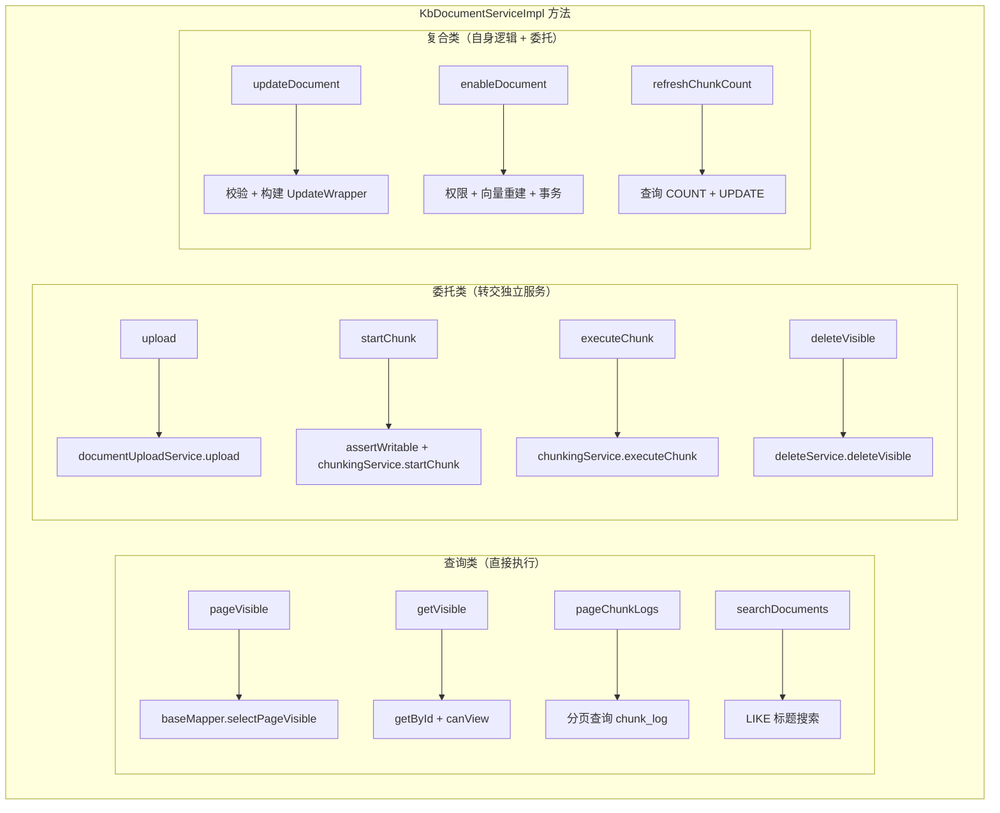
```mermaid
graph TB
    subgraph "KbDocumentServiceImpl 方法"
        subgraph "查询类（直接执行）"
            A[pageVisible] --> A1[baseMapper.selectPageVisible]
            B[getVisible] --> B1[getById + canView]
            C[pageChunkLogs] --> C1[分页查询 chunk_log]
            D[searchDocuments] --> D1[LIKE 标题搜索]
        end

        subgraph "委托类（转交独立服务）"
            E[upload] --> E1[documentUploadService.upload]
            F[startChunk] --> F1[assertWritable + chunkingService.startChunk]
            G[executeChunk] --> G1[chunkingService.executeChunk]
            H[deleteVisible] --> H1[deleteService.deleteVisible]
        end

        subgraph "复合类（自身逻辑 + 委托）"
            I[updateDocument] --> I1[校验 + 构建 UpdateWrapper]
            J[enableDocument] --> J1[权限 + 向量重建 + 事务]
            K[refreshChunkCount] --> K1[查询 COUNT + UPDATE]
        end
    end
```

#### 10.2.2 每个方法的完整逻辑

**方法 1：`pageVisible`**

```java
@Override
public IPage<KbDocument> pageVisible(Page<KbDocument> page, UserContext user) {
    Long deptId = user.getDepartmentId();    // 可为 null
    Long projectId = user.getProjectId();    // 可为 null
    int admin = user.isAdmin() ? 1 : 0;      // 转为 int（MyBatis 参数）
    // ★ 直接调用自定义 Mapper XML 的权限过滤 SQL
    return baseMapper.selectPageVisible(page,
            user.getUserId(), deptId, projectId, admin);
}
```

**方法 2：`getVisible`**

```java
@Override
public KbDocument getVisible(Long id, UserContext user) {
    // ① 查询文档（利用 ServiceImpl 内置的 getById）
    KbDocument doc = getById(id);
    if (doc == null) {
        throw new BizException(ErrorCode.NOT_FOUND);
    }
    // ② 查询该文档的所有权限明细行
    List<KbDocumentPermission> perms = kbDocumentPermissionMapper.selectList(
            new LambdaQueryWrapper<KbDocumentPermission>()
                    .eq(KbDocumentPermission::getDocumentId, id));
    // ③ 调用可见性判断服务
    if (!documentVisibilityService.canView(doc, user, perms)) {
        throw new BizException(ErrorCode.FORBIDDEN);
    }
    return doc;
}
```

**方法 3：`upload`**

```java
@Override
public Long upload(UserContext user, KbDocumentUploadRequest meta, MultipartFile file) {
    // ★ 纯委托：所有上传逻辑都在 DocumentUploadService 中
    return documentUploadService.upload(user, meta, file);
}
```

**方法 4：`startChunk`**

```java
@Override
public void startChunk(Long documentId, UserContext user) {
    // ① 先校验写权限（只有 owner 或 admin 可以触发分块）
    assertWritable(documentId, user);
    // ② 委托分块服务执行 CAS + 事件发布
    documentChunkingService.startChunk(documentId, user);
}
```

**方法 5-6：`executeChunk` / `executeChunkAsUser`**

```java
@Override
public void executeChunk(Long documentId, Long operatorUserId) {
    // 直接委托（由事件监听器或运维调用）
    documentChunkingService.executeChunk(documentId, operatorUserId);
}

@Override
public void executeChunkAsUser(Long documentId, UserContext user) {
    // 带权限校验的手动触发（HTTP 入口 /execute-chunk）
    documentChunkingService.executeChunkAsUser(documentId, user);
}
```

**方法 7：`updateDocument`**

```java
@Override
@Transactional(rollbackFor = Exception.class)
public void updateDocument(Long documentId, KbDocumentUpdateRequest request, UserContext user) {
    // ① 写权限校验
    assertWritable(documentId, user);

    // ② 查文档 + 状态校验
    KbDocument doc = getById(documentId);
    if (doc == null) throw new BizException(ErrorCode.NOT_FOUND, "文档不存在");
    if (DocumentStatus.RUNNING.name().equals(doc.getStatus())) {
        throw new BizException(ErrorCode.PARAM_INVALID, "文档正在分块中，无法修改");
    }

    // ③ 标题校验
    if (!StringUtils.hasText(request.getTitle())) {
        throw new BizException(ErrorCode.PARAM_INVALID, "文档标题不能为空");
    }

    // ④ 构建更新条件
    LambdaUpdateWrapper<KbDocument> uw = Wrappers.lambdaUpdate(KbDocument.class)
            .eq(KbDocument::getId, documentId)
            .set(KbDocument::getTitle, request.getTitle().trim())
            .set(KbDocument::getUpdatedAt, LocalDateTime.now());

    // ⑤ 处理 processMode 分支
    if (StringUtils.hasText(request.getProcessMode())) {
        ProcessMode pm = ProcessMode.normalize(request.getProcessMode());
        uw.set(KbDocument::getProcessMode, pm.name());

        if (pm == ProcessMode.CHUNK) {
            // CHUNK 模式 → 更新分块策略和参数，清空 pipelineId
            ChunkingMode cm = ChunkingMode.fromValue(request.getChunkStrategy());
            String cfg = documentUploadService.normalizeChunkConfigJson(cm, request.getChunkConfig());
            uw.set(KbDocument::getChunkStrategy, cm.name());
            uw.set(KbDocument::getChunkConfig, cfg);
            uw.set(KbDocument::getPipelineId, null);
        } else {
            // PIPELINE 模式 → 必须提供 pipelineId，清空分块策略
            if (!StringUtils.hasText(request.getPipelineId())) {
                throw new BizException(ErrorCode.PARAM_INVALID, "PIPELINE 模式必须指定 pipelineId");
            }
            uw.set(KbDocument::getPipelineId, request.getPipelineId().trim());
            uw.set(KbDocument::getChunkStrategy, null);
            uw.set(KbDocument::getChunkConfig, null);
        }
    }

    // ⑥ 可选字段更新
    if (request.getScheduleEnabled() != null)
        uw.set(KbDocument::getScheduleEnabled, request.getScheduleEnabled());
    if (StringUtils.hasText(request.getScheduleCron()))
        uw.set(KbDocument::getScheduleCron, request.getScheduleCron().trim());
    if (StringUtils.hasText(request.getSourceLocation()))
        uw.set(KbDocument::getSourceLocation, request.getSourceLocation().trim());

    // ⑦ 执行更新
    baseMapper.update(null, uw);
}
```

**方法 8：`enableDocument`（最复杂的方法）**

```java
@Override
public void enableDocument(Long documentId, boolean enabled, UserContext user) {
    // ① 双重权限校验
    getVisible(documentId, user);           // 可读权限
    assertWritable(documentId, user);       // 写权限

    // ② 状态校验
    KbDocument doc = getById(documentId);
    if (DocumentStatus.RUNNING.name().equals(doc.getStatus())) {
        throw new BizException(ErrorCode.PARAM_INVALID, "文档正在分块中");
    }

    // ③ 幂等校验
    int target = enabled ? 1 : 0;
    if (doc.getEnabled() != null && doc.getEnabled() == target) {
        return;  // 已经是目标状态，无需操作
    }

    // ④ 查询所有 Chunk
    boolean shouldEmbed = vectorSyncService.shouldEmbed(doc);
    List<KbDocumentChunk> chunks = kbDocumentChunkMapper.selectList(
            Wrappers.lambdaQuery(KbDocumentChunk.class)
                    .eq(KbDocumentChunk::getDocumentId, documentId)
                    .orderByAsc(KbDocumentChunk::getChunkIndex));

    // ⑤ 启用时重新向量化
    List<VectorDocChunk> vectorChunks = null;
    if (enabled && shouldEmbed) {
        if (chunks.isEmpty()) {
            log.warn("启用文档时未找到任何 Chunk，跳过向量重建");
        } else {
            // 5a: 构建 VectorDocChunk（无 embedding）
            vectorChunks = chunks.stream()
                    .map(c -> VectorDocChunk.builder()
                            .chunkId(String.valueOf(c.getId()))
                            .content(c.getChunkText())
                            .index(c.getChunkIndex())
                            .build())
                    .collect(Collectors.toList());
            // 5b: 批量向量化
            List<String> texts = vectorChunks.stream()
                    .map(VectorDocChunk::getContent).collect(Collectors.toList());
            List<List<Float>> vecs = vectorSyncService.embedBatch(texts, doc);
            // 5c: 设置 embedding
            for (int i = 0; i < vectorChunks.size(); i++) {
                vectorChunks.get(i).setEmbedding(VectorSyncService.toArray(vecs.get(i)));
            }
        }
    }

    // ⑥ 编程式事务：DB + Milvus 原子操作
    final List<VectorDocChunk> finalChunks = vectorChunks;
    transactionTemplate.executeWithoutResult(status -> {
        // 6a: 更新文档 enabled 状态
        doc.setEnabled(target);
        doc.setUpdatedAt(LocalDateTime.now());
        updateById(doc);
        // 6b: 批量更新所有 Chunk 的 enabled 状态
        kbChunkService.updateEnabledByDocId(documentId, enabled, user.getUserId());
        // 6c: 向量操作
        if (shouldEmbed) {
            if (!enabled) {
                vectorSyncService.deleteDocumentVectors(doc);
            } else if (finalChunks != null && !finalChunks.isEmpty()) {
                vectorSyncService.indexDocumentChunks(doc, finalChunks);
            }
        }
    });
}
```

**`enableDocument` 流程时序图**：

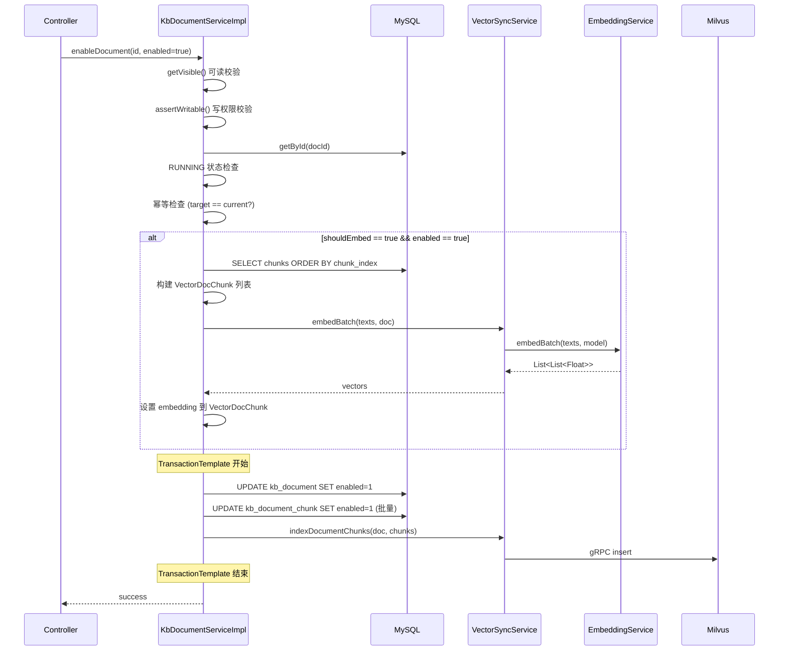
```mermaid
sequenceDiagram
    participant CTL as Controller
    participant SVC as KbDocumentServiceImpl
    participant DB as MySQL
    participant VEC as VectorSyncService
    participant EMB as EmbeddingService
    participant MIL as Milvus

    CTL->>SVC: enableDocument(id, enabled=true)
    SVC->>SVC: getVisible() 可读校验
    SVC->>SVC: assertWritable() 写权限校验
    SVC->>DB: getById(docId)
    SVC->>SVC: RUNNING 状态检查
    SVC->>SVC: 幂等检查 (target == current?)

    alt shouldEmbed == true && enabled == true
        SVC->>DB: SELECT chunks ORDER BY chunk_index
        SVC->>SVC: 构建 VectorDocChunk 列表
        SVC->>VEC: embedBatch(texts, doc)
        VEC->>EMB: embedBatch(texts, model)
        EMB-->>VEC: List<List<Float>>
        VEC-->>SVC: vectors
        SVC->>SVC: 设置 embedding 到 VectorDocChunk
    end

    Note over SVC: TransactionTemplate 开始
    SVC->>DB: UPDATE kb_document SET enabled=1
    SVC->>DB: UPDATE kb_document_chunk SET enabled=1 (批量)
    SVC->>VEC: indexDocumentChunks(doc, chunks)
    VEC->>MIL: gRPC insert
    Note over SVC: TransactionTemplate 结束
    SVC-->>CTL: success
```

**方法 9：`searchDocuments`**

```java
@Override
public List<KbDocument> searchDocuments(UserContext user, String keyword, int limit) {
    if (!StringUtils.hasText(keyword)) {
        return List.of();  // 空关键字直接返回空列表
    }
    // limit 约束在 1~50 之间
    int size = Math.min(Math.max(limit, 1), 50);

    LambdaQueryWrapper<KbDocument> q = Wrappers.lambdaQuery(KbDocument.class)
            .like(KbDocument::getTitle, keyword.trim())  // 标题 LIKE 搜索
            .orderByDesc(KbDocument::getUpdatedAt)
            .last("LIMIT " + size);                       // ★ 使用 last() 拼接 LIMIT

    // ★ 非管理员只能搜自己的文档
    if (!user.isAdmin()) {
        q.eq(KbDocument::getOwnerId, user.getUserId());
    }
    return list(q);  // ServiceImpl 内置的 list() 方法
}
```

**方法 10：`refreshChunkCount`**

```java
@Override
public void refreshChunkCount(Long documentId) {
    // 从 kb_document_chunk 表查询实际数量（不是从 kb_document.chunk_count 读）
    Long count = kbDocumentChunkMapper.selectCount(
            Wrappers.lambdaQuery(KbDocumentChunk.class)
                    .eq(KbDocumentChunk::getDocumentId, documentId));
    // 更新文档表的 chunk_count 字段
    baseMapper.update(null,
            Wrappers.lambdaUpdate(KbDocument.class)
                    .eq(KbDocument::getId, documentId)
                    .set(KbDocument::getChunkCount, count != null ? count.intValue() : 0)
                    .set(KbDocument::getUpdatedAt, LocalDateTime.now()));
}
```

**为什么需要 `refreshChunkCount`**：`chunk_count` 是通过 `countChunksByDoc + 1` 或 `-1` 更新的，并发场景下可能不准确。此方法通过直接 COUNT 查询获取精确值。

**方法 11：`assertWritable`（私有辅助方法）**

```java
private void assertWritable(Long documentId, UserContext user) {
    KbDocument doc = getById(documentId);
    if (doc == null) {
        throw new BizException(ErrorCode.NOT_FOUND, "文档不存在");
    }
    // ★ 只有 owner 或 admin 可以写
    if (!user.isAdmin() && !Objects.equals(doc.getOwnerId(), user.getUserId())) {
        throw new BizException(ErrorCode.FORBIDDEN);
    }
}
```

### 10.3 DocumentUploadService —— 上传服务

**文件路径**：`service/impl/DocumentUploadService.java`  
**行数**：214 行  
**依赖注入**（7 个）：`KbDocumentMapper`, `KbCategoryService`, `KbDocumentPermissionMapper`, `KbKnowledgeBaseMapper`, `TikaDocumentParser`, `FileStorageService`, `ObjectMapper`

#### `upload()` 方法完整流程

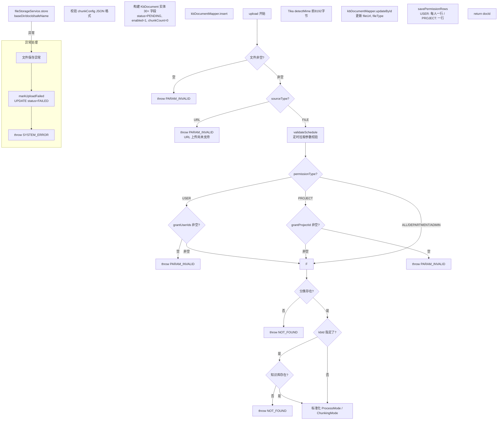
```mermaid
flowchart TD
    A[upload 开始] --> B{文件非空?}
    B -->|空| B1[throw PARAM_INVALID]
    B -->|非空| C{sourceType?}
    C -->|URL| C1[throw PARAM_INVALID<br/>URL 上传尚未支持]
    C -->|FILE| D[validateSchedule<br/>定时拉取参数校验]
    D --> E{permissionType?}
    E -->|USER| E1{grantUserIds 非空?}
    E1 -->|空| E1a[throw PARAM_INVALID]
    E1 -->|非空| F
    E -->|PROJECT| E2{grantProjectId 非空?}
    E2 -->|空| E2a[throw PARAM_INVALID]
    E2 -->|非空| F
    E -->|ALL/DEPARTMENT/ADMIN| F
    F --> G{分类存在?}
    G -->|否| G1[throw NOT_FOUND]
    G -->|是| H{kbId 指定了?}
    H -->|是| H1{知识库存在?}
    H1 -->|否| H1a[throw NOT_FOUND]
    H1 -->|是| I
    H -->|否| I
    I[标准化 ProcessMode / ChunkingMode]
    J[校验 chunkConfig JSON 格式]
    K[构建 KbDocument 实体 30+ 字段<br/>status=PENDING, enabled=1, chunkCount=0]
    L[kbDocumentMapper.insert]
    M["fileStorageService.store<br/>baseDir/docId/safeName"]
    N[Tika detectMime 前8192字节]
    O[kbDocumentMapper.updateById<br/>更新 fileUrl, fileType]
    P[savePermissionRows<br/>USER: 每人一行 / PROJECT: 一行]
    Q[return docId]

    subgraph "异常处理"
        R[文件保存异常]
        R --> R1[markUploadFailed<br/>UPDATE status=FAILED]
        R1 --> R2[throw SYSTEM_ERROR]
    end

    M -->|异常| R
```

#### `savePermissionRows` 方法详解

```java
private void savePermissionRows(Long documentId, DocumentPermissionType type,
                                 KbDocumentUploadRequest meta, Long createdBy) {
    // USER 权限：为 grantUserIds 中每个用户创建一行
    if (type == DocumentPermissionType.USER && meta.getGrantUserIds() != null) {
        for (Long uid : meta.getGrantUserIds()) {
            KbDocumentPermission row = new KbDocumentPermission();
            row.setDocumentId(documentId);
            row.setPermissionTargetType("USER");
            row.setPermissionTargetId(uid);
            row.setPermissionLevel("READ");
            row.setCreatedBy(createdBy);
            row.setCreatedAt(LocalDateTime.now());
            kbDocumentPermissionMapper.insert(row);
        }
    }
    // PROJECT 权限：为 grantProjectId 创建一行
    if (type == DocumentPermissionType.PROJECT && meta.getGrantProjectId() != null) {
        KbDocumentPermission row = new KbDocumentPermission();
        row.setDocumentId(documentId);
        row.setPermissionTargetType("PROJECT");
        row.setPermissionTargetId(meta.getGrantProjectId());
        row.setPermissionLevel("READ");
        row.setCreatedBy(createdBy);
        row.setCreatedAt(LocalDateTime.now());
        kbDocumentPermissionMapper.insert(row);
    }
    // ALL / DEPARTMENT / ADMIN：不写权限行
}
```

### 10.4 DocumentChunkingService —— 异步分块核心

**文件路径**：`service/impl/DocumentChunkingService.java`  
**行数**：302 行  
**依赖注入**（9 个）：`KbDocumentMapper`, `KbDocumentChunkMapper`, `KbDocumentChunkLogMapper`, `TikaDocumentParser`, `ChunkingStrategyFactory`, `VectorSyncService`, `TokenCounterService`, `TransactionTemplate`, `ApplicationEventPublisher`, `ObjectMapper`

#### `startChunk` —— CAS 乐观锁机制

```java
@Transactional(rollbackFor = Exception.class)
public void startChunk(Long documentId, UserContext user) {
    // 步骤 1：查询当前文档
    KbDocument current = kbDocumentMapper.selectById(documentId);
    if (current == null) {
        throw new BizException(ErrorCode.NOT_FOUND, "文档不存在");
    }

    // 步骤 2：状态校验 —— 只有 PENDING 或 FAILED 可以提交
    if (!DocumentStatus.PENDING.name().equals(current.getStatus())
            && !DocumentStatus.FAILED.name().equals(current.getStatus())) {
        throw new BizException(ErrorCode.PARAM_INVALID,
                "仅 PENDING 或 FAILED 状态的文档可提交分块任务");
    }

    // 步骤 3：CAS 乐观锁更新 ★★★
    // SQL: UPDATE kb_document SET status='RUNNING', updated_at=NOW()
    //      WHERE id=? AND status<>'RUNNING'
    int rows = kbDocumentMapper.update(null,
            Wrappers.lambdaUpdate(KbDocument.class)
                    .set(KbDocument::getStatus, DocumentStatus.RUNNING.name())
                    .set(KbDocument::getUpdatedAt, LocalDateTime.now())
                    .eq(KbDocument::getId, documentId)
                    .ne(KbDocument::getStatus, DocumentStatus.RUNNING.name()));

    // 步骤 4：并发冲突检测
    if (rows == 0) {
        // rows=0 说明 status 已经是 RUNNING（被其他请求抢先了）
        KbDocument doc = kbDocumentMapper.selectById(documentId);
        if (doc == null) {
            throw new BizException(ErrorCode.NOT_FOUND, "文档不存在");
        }
        throw new BizException(ErrorCode.PARAM_INVALID,
                "文档分块操作正在进行中，请稍后再试");
    }

    // 步骤 5：发布事件（事务提交后异步执行）
    applicationEventPublisher.publishEvent(
            new DocumentChunkRequestedEvent(documentId, user.getUserId()));
}
```

**CAS 并发安全分析**：

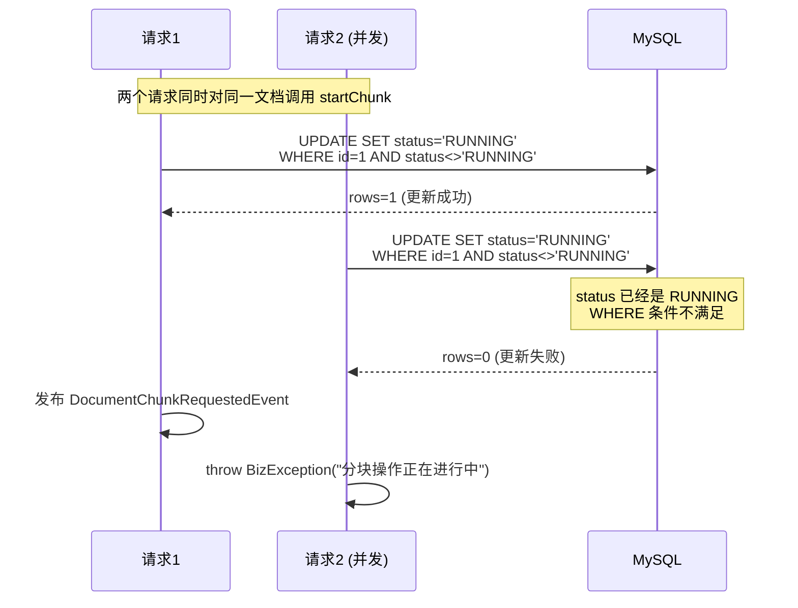
```mermaid
sequenceDiagram
    participant R1 as 请求1
    participant R2 as 请求2 (并发)
    participant DB as MySQL

    Note over R1,R2: 两个请求同时对同一文档调用 startChunk

    R1->>DB: UPDATE SET status='RUNNING'<br/>WHERE id=1 AND status<>'RUNNING'
    DB-->>R1: rows=1 (更新成功)

    R2->>DB: UPDATE SET status='RUNNING'<br/>WHERE id=1 AND status<>'RUNNING'
    Note over DB: status 已经是 RUNNING<br/>WHERE 条件不满足
    DB-->>R2: rows=0 (更新失败)

    R1->>R1: 发布 DocumentChunkRequestedEvent
    R2->>R2: throw BizException("分块操作正在进行中")
```

#### `runChunkTask` —— 异步核心（最复杂方法，约 200 行）

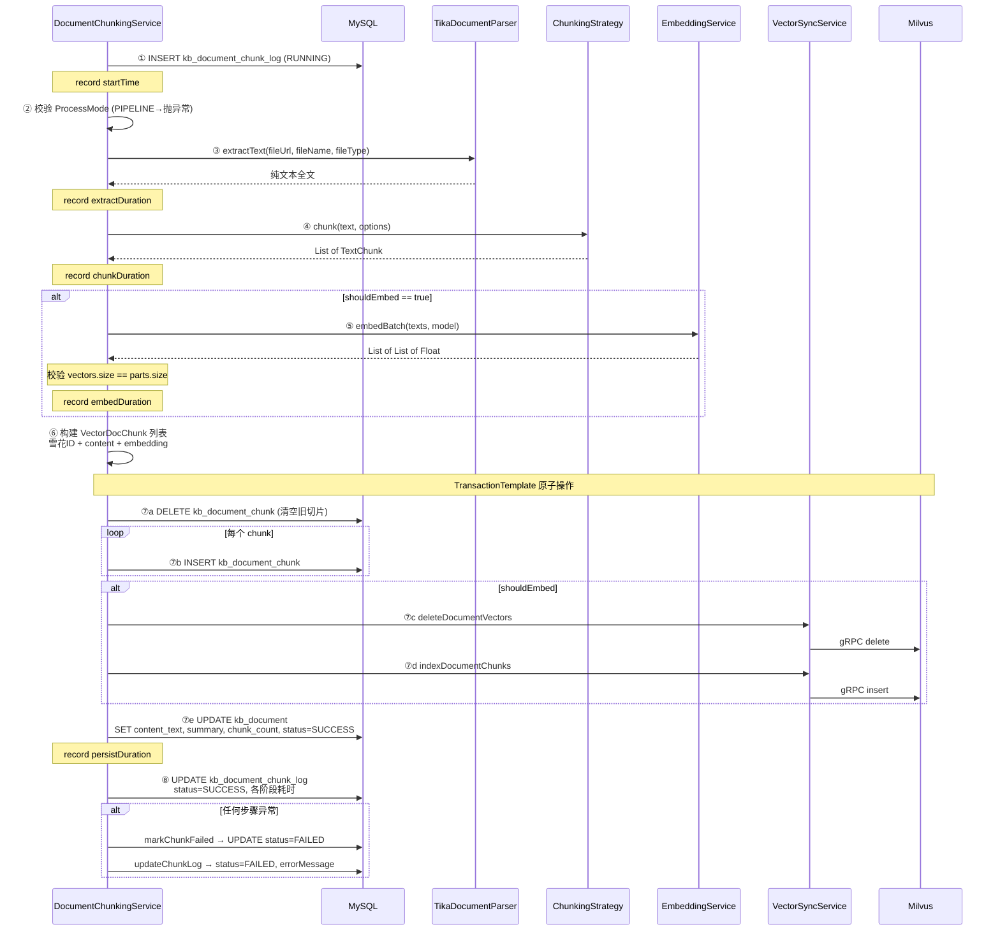
```mermaid
sequenceDiagram
    participant CHK as DocumentChunkingService
    participant DB as MySQL
    participant TIKA as TikaDocumentParser
    participant STG as ChunkingStrategy
    participant EMB as EmbeddingService
    participant VEC as VectorSyncService
    participant MIL as Milvus

    CHK->>DB: ① INSERT kb_document_chunk_log (RUNNING)
    Note over CHK: record startTime

    CHK->>CHK: ② 校验 ProcessMode (PIPELINE→抛异常)
    CHK->>TIKA: ③ extractText(fileUrl, fileName, fileType)
    TIKA-->>CHK: 纯文本全文
    Note over CHK: record extractDuration

    CHK->>STG: ④ chunk(text, options)
    STG-->>CHK: List of TextChunk
    Note over CHK: record chunkDuration

    alt shouldEmbed == true
        CHK->>EMB: ⑤ embedBatch(texts, model)
        EMB-->>CHK: List of List of Float
        Note over CHK: 校验 vectors.size == parts.size
        Note over CHK: record embedDuration
    end

    CHK->>CHK: ⑥ 构建 VectorDocChunk 列表<br/>雪花ID + content + embedding

    Note over CHK,MIL: TransactionTemplate 原子操作
    CHK->>DB: ⑦a DELETE kb_document_chunk (清空旧切片)
    loop 每个 chunk
        CHK->>DB: ⑦b INSERT kb_document_chunk
    end
    alt shouldEmbed
        CHK->>VEC: ⑦c deleteDocumentVectors
        VEC->>MIL: gRPC delete
        CHK->>VEC: ⑦d indexDocumentChunks
        VEC->>MIL: gRPC insert
    end
    CHK->>DB: ⑦e UPDATE kb_document<br/>SET content_text, summary, chunk_count, status=SUCCESS
    Note over CHK: record persistDuration

    CHK->>DB: ⑧ UPDATE kb_document_chunk_log<br/>status=SUCCESS, 各阶段耗时

    alt 任何步骤异常
        CHK->>DB: markChunkFailed → UPDATE status=FAILED
        CHK->>DB: updateChunkLog → status=FAILED, errorMessage
    end
```

#### `persistChunksAndVectorsAtomically` —— 原子持久化方法

```java
private int persistChunksAndVectorsAtomically(
        KbDocument document,
        Long actingUserId,
        List<VectorDocChunk> vectorChunks,
        String fullText,
        boolean shouldEmbed
) {
    final Long docId = document.getId();
    final int[] count = {0};  // 使用数组绕过 lambda 的 effectively final 限制

    transactionTemplate.executeWithoutResult(status -> {
        // ① 清空旧切片（物理 DELETE，不是逻辑删除）
        kbDocumentChunkMapper.delete(
                new LambdaQueryWrapper<KbDocumentChunk>()
                        .eq(KbDocumentChunk::getDocumentId, docId));

        // ② 循环插入新切片
        LocalDateTime now = LocalDateTime.now();
        for (VectorDocChunk vc : vectorChunks) {
            KbDocumentChunk row = new KbDocumentChunk();
            long id = Long.parseLong(vc.getChunkId());
            row.setId(id);
            row.setDocumentId(docId);
            row.setChunkIndex(vc.getIndex());
            row.setChunkText(vc.getContent());
            row.setContentHash(ContentHashUtil.sha256Hex(vc.getContent()));
            row.setCharCount(vc.getContent().length());
            row.setTokenCount(tokenCounterService.countTokens(vc.getContent()));
            row.setEnabled(1);
            row.setVectorId(shouldEmbed ? vc.getChunkId() : null);
            row.setMetadataJson("{}");
            row.setCreatedBy(actingUserId);
            row.setUpdatedBy(actingUserId);
            row.setCreatedAt(now);
            row.setUpdatedAt(now);
            kbDocumentChunkMapper.insert(row);
        }

        // ③ 向量操作（先删后写）
        if (shouldEmbed) {
            vectorSyncService.deleteDocumentVectors(document);
            vectorSyncService.indexDocumentChunks(document, vectorChunks);
        }

        // ④ 更新文档状态
        kbDocumentMapper.update(null,
                Wrappers.lambdaUpdate(KbDocument.class)
                        .eq(KbDocument::getId, docId)
                        .set(KbDocument::getContentText, fullText)
                        .set(KbDocument::getSummary,
                                tikaDocumentParser.summarize(fullText, 200))
                        .set(KbDocument::getChunkCount, vectorChunks.size())
                        .set(KbDocument::getStatus, DocumentStatus.SUCCESS.name())
                        .set(KbDocument::getUpdatedAt, LocalDateTime.now()));

        count[0] = vectorChunks.size();
    });
    return count[0];
}
```

**为什么 DB INSERT 和 Milvus INSERT 要放在同一个事务**：
- 如果 DB 写成功但 Milvus 写失败 → 数据库有 chunk 但 Milvus 无向量 → 检索不到
- 如果 Milvus 写成功但 DB 写失败 → Milvus 有向量但数据库无 chunk → 检索结果无法关联
- 使用 `TransactionTemplate` 确保两者在同一个数据库事务中，但 Milvus 不在 DB 事务管理范围内
- 当前实现先删 Milvus 旧向量再写 DB → 再写 Milvus 新向量，如果最后一步失败，下次重新分块时会覆盖

### 10.5 KbChunkServiceImpl —— Chunk CRUD 服务

**文件路径**：`service/impl/KbChunkServiceImpl.java`  
**行数**：518 行  
**继承**：`ServiceImpl<KbDocumentChunkMapper, KbDocumentChunk>`  
**实现**：`KbChunkService`

#### 权限校验链

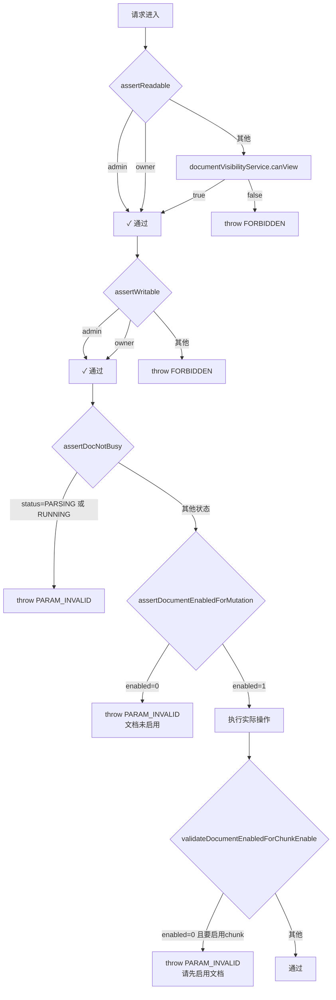
```mermaid
flowchart TD
    A[请求进入] --> B{assertReadable}
    B -->|admin| B1[✓ 通过]
    B -->|owner| B1
    B -->|其他| B2[documentVisibilityService.canView]
    B2 -->|true| B1
    B2 -->|false| B3[throw FORBIDDEN]

    B1 --> C{assertWritable}
    C -->|admin| C1[✓ 通过]
    C -->|owner| C1
    C -->|其他| C2[throw FORBIDDEN]

    C1 --> D{assertDocNotBusy}
    D -->|status=PARSING 或 RUNNING| D1[throw PARAM_INVALID]
    D -->|其他状态| E

    E{assertDocumentEnabledForMutation}
    E -->|enabled=0| E1[throw PARAM_INVALID<br/>文档未启用]
    E -->|enabled=1| F[执行实际操作]

    F --> G{validateDocumentEnabledForChunkEnable}
    G -->|enabled=0 且要启用chunk| G1[throw PARAM_INVALID<br/>请先启用文档]
    G -->|其他| H[通过]
```

#### `create` 方法详解

```java
@Override
@Transactional(rollbackFor = Exception.class)
public KbChunkVO create(Long docId, KbChunkCreateRequest requestParam, UserContext user) {
    // ① 三重校验
    KbDocument document = loadDocOrThrow(docId);
    assertWritable(document, user);
    assertDocNotBusy(document);
    assertDocumentEnabledForMutation(document);

    // ② 内容校验
    String content = requestParam.getContent();
    if (!StringUtils.hasText(content)) {
        throw new BizException(ErrorCode.PARAM_INVALID, "Chunk 内容不能为空");
    }

    // ③ 确定 chunkIndex：请求指定 > 自动追加（maxIndex + 1） > 0
    KbDocumentChunk latest = baseMapper.selectOne(
            Wrappers.lambdaQuery(KbDocumentChunk.class)
                    .eq(KbDocumentChunk::getDocumentId, docId)
                    .orderByDesc(KbDocumentChunk::getChunkIndex)
                    .last("LIMIT 1"));
    int chunkIndex = requestParam.getIndex() != null
            ? requestParam.getIndex()
            : (latest != null && latest.getChunkIndex() != null
                ? latest.getChunkIndex() + 1 : 0);

    // ④ 确定主键：请求指定 > 雪花生成
    long chunkPk = requestParam.getChunkId() != null
            ? requestParam.getChunkId() : IdWorker.getId();

    // ⑤ 构建 Chunk 实体
    KbDocumentChunk chunk = new KbDocumentChunk();
    chunk.setId(chunkPk);
    chunk.setDocumentId(docId);
    chunk.setChunkIndex(chunkIndex);
    chunk.setChunkText(content);
    chunk.setContentHash(ContentHashUtil.sha256Hex(content));
    chunk.setCharCount(content.length());
    chunk.setTokenCount(resolveTokenCount(content));
    chunk.setEnabled(1);
    chunk.setVectorId(String.valueOf(chunkPk));
    chunk.setMetadataJson("{}");
    chunk.setCreatedBy(user.getUserId());
    chunk.setUpdatedBy(user.getUserId());
    chunk.setCreatedAt(LocalDateTime.now());
    chunk.setUpdatedAt(LocalDateTime.now());

    // ⑥ INSERT
    baseMapper.insert(chunk);

    // ⑦ 更新文档 chunk_count
    documentMapper.update(null, Wrappers.lambdaUpdate(KbDocument.class)
            .eq(KbDocument::getId, docId)
            .set(KbDocument::getChunkCount, countChunksByDoc(docId) + 1)
            .set(KbDocument::getUpdatedAt, LocalDateTime.now()));

    // ⑧ 同步向量（embed + Milvus insert）
    vectorSyncService.syncChunk(document, chunk);

    return toVo(chunk);
}
```

#### `batchToggleEnabled` 方法详解（最复杂的 Chunk 方法）

```java
public void batchToggleEnabled(Long docId, KbChunkBatchRequest requestParam,
                                boolean enabled, UserContext user) {
    // ① 参数校验
    if (requestParam == null || requestParam.getChunkIds() == null
            || requestParam.getChunkIds().isEmpty()) {
        throw new BizException(ErrorCode.PARAM_INVALID,
                "请指定需要操作的 Chunk，全量启用/禁用请使用文档启用接口");
    }
    List<Long> requestedIds = requestParam.getChunkIds();
    if (requestedIds.size() > 500) {
        throw new BizException(ErrorCode.PARAM_INVALID,
                "单次批量操作 Chunk 数量不能超过 500");
    }

    // ② 权限 + 状态校验
    KbDocument document = loadDocOrThrow(docId);
    assertWritable(document, user);
    assertDocNotBusy(document);
    validateDocumentEnabledForChunkEnable(document, enabled);

    // ③ 验证所有 chunkId 有效且属于该文档
    List<KbDocumentChunk> found = baseMapper.selectList(
            new LambdaQueryWrapper<KbDocumentChunk>()
                    .in(KbDocumentChunk::getId, requestedIds));
    if (found.size() != requestedIds.size()) {
        throw new BizException(ErrorCode.PARAM_INVALID,
                "存在无效的 Chunk ID，请求 " + requestedIds.size()
                + " 个，实际找到 " + found.size() + " 个");
    }
    for (KbDocumentChunk c : found) {
        if (!c.getDocumentId().equals(docId)) {
            throw new BizException(ErrorCode.PARAM_INVALID,
                    "Chunk " + c.getId() + " 不属于文档 " + docId);
        }
    }

    // ④ 过滤已处于目标状态的 Chunk
    int enabledValue = enabled ? 1 : 0;
    List<KbDocumentChunk> needUpdateChunks = baseMapper.selectList(
            new LambdaQueryWrapper<KbDocumentChunk>()
                    .in(KbDocumentChunk::getId, targetIds)
                    .ne(KbDocumentChunk::getEnabled, enabledValue));
    List<Long> needUpdateIds = needUpdateChunks.stream()
            .map(KbDocumentChunk::getId).collect(Collectors.toList());

    if (needUpdateIds.isEmpty()) {
        throw new BizException(ErrorCode.PARAM_INVALID,
                enabled ? "所有 Chunk 已全部启用" : "所有 Chunk 已全部禁用");
    }

    // ⑤ 启用 → 向量化 + 写入；禁用 → 删除向量
    Long uid = user.getUserId();
    if (enabled) {
        // 5a: 构建 VectorDocChunk + embedBatch
        List<VectorDocChunk> vectorChunks = needUpdateChunks.stream()
                .map(c -> VectorDocChunk.builder()
                        .chunkId(String.valueOf(c.getId()))
                        .content(c.getChunkText())
                        .index(c.getChunkIndex()).build())
                .collect(Collectors.toList());
        List<String> texts = vectorChunks.stream()
                .map(VectorDocChunk::getContent).collect(Collectors.toList());
        List<List<Float>> vecs = vectorSyncService.embedBatch(texts, document);
        for (int i = 0; i < vectorChunks.size(); i++) {
            vectorChunks.get(i).setEmbedding(
                    VectorSyncService.toArray(vecs.get(i)));
        }

        // 5b: 事务：UPDATE enabled + Milvus insert
        transactionTemplate.executeWithoutResult(status -> {
            baseMapper.update(null,
                    Wrappers.lambdaUpdate(KbDocumentChunk.class)
                            .in(KbDocumentChunk::getId, needUpdateIds)
                            .set(KbDocumentChunk::getEnabled, 1)
                            .set(KbDocumentChunk::getUpdatedBy, uid)
                            .set(KbDocumentChunk::getUpdatedAt, LocalDateTime.now()));
            vectorSyncService.indexDocumentChunks(document, vectorChunks);
        });
    } else {
        // 禁用：事务：UPDATE enabled + Milvus delete
        List<String> idStrs = needUpdateIds.stream()
                .map(String::valueOf).collect(Collectors.toList());
        transactionTemplate.executeWithoutResult(status -> {
            baseMapper.update(null,
                    Wrappers.lambdaUpdate(KbDocumentChunk.class)
                            .in(KbDocumentChunk::getId, needUpdateIds)
                            .set(KbDocumentChunk::getEnabled, 0)
                            .set(KbDocumentChunk::getUpdatedBy, uid)
                            .set(KbDocumentChunk::getUpdatedAt, LocalDateTime.now()));
            vectorSyncService.deleteChunkVectors(document, idStrs);
        });
    }
}
```

### 10.6 DocumentDeleteService —— 删除服务

**文件路径**：`service/impl/DocumentDeleteService.java`  
**行数**：65 行

```mermaid
flowchart TD
    A[deleteVisible 开始] --> B[selectById 查文档]
    B -->|不存在| B1[throw NOT_FOUND]
    B -->|存在| C{权限校验}
    C -->|非owner且非admin| C1[throw FORBIDDEN]
    C -->|通过| D{状态校验}
    D -->|RUNNING| D1[throw PARAM_INVALID<br/>文档正在分块中]
    D -->|非RUNNING| E[★ 先删向量]

    E -->|异常| E1[throw VECTOR_WRITE_FAILED<br/>文档不删除]
    E -->|成功| F[DELETE kb_document_chunk<br/>物理删除 条件: document_id]
    F --> G[DELETE kb_document_chunk_log<br/>物理删除 条件: document_id]
    G --> H[DELETE kb_document_permission<br/>物理删除 条件: document_id]
    H --> I[kbDocumentMapper.deleteById<br/>逻辑删除 UPDATE deleted=1]

    style E fill:#ffcdd2
    style E1 fill:#ffcdd2
```

**关键设计决策：删除顺序**

```
应该: ① 删 Milvus 向量 → ② 删关联表 → ③ 删文档
不应该: 删文档 → 删关联表 → 删向量  (向量删除失败 = 孤儿向量)
```

### 10.7 KbKnowledgeBaseServiceImpl —— 知识库管理

**文件路径**：`service/impl/KbKnowledgeBaseServiceImpl.java`  
**行数**：253 行

#### `create` 方法详解

```java
@Override
@Transactional(rollbackFor = Exception.class)
public Long create(KbKnowledgeBaseCreateRequest request, UserContext user) {
    // ① 名称校验
    if (!StringUtils.hasText(request.getName())) {
        throw new BizException(ErrorCode.PARAM_INVALID, "知识库名称不能为空");
    }
    String displayName = request.getName().trim();

    // ② 集合名校验
    String collection = request.getCollectionName() == null
            ? "" : request.getCollectionName().trim();
    if (!StringUtils.hasText(collection)) {
        throw new BizException(ErrorCode.PARAM_INVALID, "集合名称不能为空");
    }
    // Milvus 集合命名规范：字母/数字/下划线，不能数字开头，1~128 字符
    if (!COLLECTION_NAME.matcher(collection).matches()) {
        throw new BizException(ErrorCode.PARAM_INVALID,
                "集合名称仅允许字母、数字、下划线，且不能以数字开头，长度 1~128");
    }

    // ③ 名称唯一性校验
    Long dupName = kbKnowledgeBaseMapper.selectCount(
            Wrappers.lambdaQuery(KbKnowledgeBase.class)
                    .eq(KbKnowledgeBase::getName, displayName));
    if (dupName != null && dupName > 0) {
        throw new BizException(ErrorCode.PARAM_INVALID,
                "知识库名称已存在：" + displayName);
    }

    // ④ 集合名唯一性校验
    Long dupCol = kbKnowledgeBaseMapper.selectCount(
            Wrappers.lambdaQuery(KbKnowledgeBase.class)
                    .eq(KbKnowledgeBase::getCollectionName, collection));
    if (dupCol != null && dupCol > 0) {
        throw new BizException(ErrorCode.PARAM_INVALID,
                "Milvus 集合名已被占用：" + collection);
    }

    // ⑤ INSERT
    KbKnowledgeBase row = new KbKnowledgeBase();
    row.setName(displayName);
    row.setCollectionName(collection);
    row.setEmbeddingModel(StringUtils.hasText(request.getEmbeddingModel())
            ? request.getEmbeddingModel().trim() : null);
    row.setOwnerId(user.getUserId());
    row.setCreatedAt(LocalDateTime.now());
    row.setUpdatedAt(LocalDateTime.now());
    row.setDeleted(0);
    kbKnowledgeBaseMapper.insert(row);

    // ⑥ 创建 Milvus 集合（Schema + Index + Load）
    milvusCollectionHelper.ensureCollectionLoaded(collection);

    log.info("创建知识库成功 id={}, collection={}", row.getId(), collection);
    return row.getId();
}
```

#### `update` —— 嵌入模型变更保护

```java
// ★ 关键保护逻辑：修改嵌入模型前检查是否有已向量化的文档
if (StringUtils.hasText(request.getEmbeddingModel())
        && !request.getEmbeddingModel().trim().equals(
            kb.getEmbeddingModel() == null ? "" : kb.getEmbeddingModel())) {

    // 查询该知识库下 chunk_count > 0 的文档
    Long docCount = kbDocumentMapper.selectCount(
            Wrappers.lambdaQuery(KbDocument.class)
                    .eq(KbDocument::getKbId, id)
                    .gt(KbDocument::getChunkCount, 0));

    if (docCount != null && docCount > 0) {
        throw new BizException(ErrorCode.PARAM_INVALID,
                "知识库下已有向量化文档，不允许修改嵌入模型");
    }
    kb.setEmbeddingModel(request.getEmbeddingModel().trim());
}
```

**为什么禁止修改**：切换嵌入模型后，新模型产生的向量在完全不同的语义空间中，与旧向量无法比较。如果强行修改，后续检索会混合两个不同向量空间的向量，导致检索结果完全错误。

#### `pageQuery` —— 批量聚合优化

```java
// ★ 避免 N+1 查询：一次 GROUP BY 获取所有知识库的文档数
Map<Long, Long> docCountMap = new HashMap<>();
List<Long> kbIds = records.stream()
        .map(KbKnowledgeBase::getId).collect(Collectors.toList());

if (!kbIds.isEmpty()) {
    List<Map<String, Object>> rows = kbDocumentMapper.selectMaps(
            Wrappers.query(KbDocument.class)
                    .select("kb_id AS kbId", "COUNT(1) AS docCount")
                    .in("kb_id", kbIds)
                    .groupBy("kb_id"));  // ★ 一次查询替代 N 次 COUNT
    for (Map<String, Object> row : rows) {
        // 填充 docCountMap
    }
}
```

### 10.8 VectorSyncService —— 向量同步统一入口

**文件路径**：`service/VectorSyncService.java`  
**行数**：181 行  
**依赖注入**：`EmbeddingService`, `ChunkVectorStore`, `KbMilvusRoutingService`

**核心方法调用链**：

```mermaid
flowchart LR
    subgraph "业务层调用"
        A1[syncChunk]
        A2[updateChunk]
        A3[indexDocumentChunks]
        A4[deleteDocumentVectors]
        A5[deleteChunkVector]
        A6[deleteChunkVectors]
    end

    subgraph "VectorSyncService"
        B1[embed + build + index]
        B2[embed + upsert]
        B3[直接写入]
        B4[delete]
        B5[delete]
        B6[delete]
    end

    subgraph "底层"
        C1[EmbeddingService]
        C2[ChunkVectorStore]
        C3[MilvusVectorWriter]
    end

    A1 --> B1 --> C1
    B1 --> C2 --> C3
    A2 --> B2 --> C1
    B2 --> C2 --> C3
    A3 --> B3 --> C2
    A4 --> B4 --> C2
    A5 --> B5 --> C2
    A6 --> B6 --> C2
```

### 10.9 KbMilvusRoutingService —— 多知识库路由

**文件路径**：`service/KbMilvusRoutingService.java`  
**行数**：72 行

```java
@Component
@RequiredArgsConstructor
public class KbMilvusRoutingService {
    private final KbKnowledgeBaseMapper kbKnowledgeBaseMapper;
    private final KnowledgeAiProperties knowledgeAiProperties;

    /** 全局向量写入开关 || 嵌入模型配置 → 决定是否执行向量化 */
    public boolean shouldEmbed(KbDocument doc) {
        if (!knowledgeAiProperties.isVectorWriteEnabled()) return false;
        String model = embeddingModelOrDefault(doc);
        return StringUtils.hasText(model);  // embedding-model="" → false
    }

    /** 写入场景：文档有关联知识库 → 用知识库的集合名；无关联 → null（默认集合） */
    public String collectionForVectorWrite(KbDocument doc) {
        if (doc == null || doc.getKbId() == null) return null;
        KbKnowledgeBase kb = kbKnowledgeBaseMapper.selectById(doc.getKbId());
        if (kb == null) throw new BizException(ErrorCode.NOT_FOUND, "所属知识库不存在");
        return kb.getCollectionName();
    }

    /** 删除场景：知识库已删除时回退默认集合，避免阻塞删除操作 */
    public String collectionForVectorWriteOrDefault(KbDocument doc) {
        try { return collectionForVectorWrite(doc); }
        catch (BizException ex) { return null; }
    }

    /** 模型选择优先级：知识库配置 > 全局配置 */
    public String embeddingModelOrDefault(KbDocument doc) {
        if (doc == null || doc.getKbId() == null)
            return knowledgeAiProperties.getEmbeddingModel();
        KbKnowledgeBase kb = kbKnowledgeBaseMapper.selectById(doc.getKbId());
        if (kb != null && StringUtils.hasText(kb.getEmbeddingModel()))
            return kb.getEmbeddingModel();
        return knowledgeAiProperties.getEmbeddingModel();
    }
}
```

### 10.10 DocumentVisibilityService —— 权限判断

**文件路径**：`service/DocumentVisibilityService.java`  
**行数**：52 行

```java
@Component
public class DocumentVisibilityService {

    /**
     * 判断当前用户是否可查看指定文档。
     *
     * 判断优先级（短路逻辑）：
     *   1. admin → true（管理员全局可见）
     *   2. owner → true（自己的文档自己看）
     *   3. 根据 permissionType 分支判断
     */
    public boolean canView(KbDocument doc, UserContext user,
                           List<KbDocumentPermission> permissions) {
        // ★ 管理员全局可见
        if (user.isAdmin()) return true;
        // ★ 文档上传者本人
        if (Objects.equals(doc.getOwnerId(), user.getUserId())) return true;

        final DocumentPermissionType type;
        try {
            type = DocumentPermissionType.valueOf(doc.getPermissionType());
        } catch (IllegalArgumentException ex) {
            return false;  // 无效的权限类型 → 拒绝
        }

        return switch (type) {
            case ALL         → true;                          // 全员
            case DEPARTMENT  → doc.getDepartmentId() != null   // 同部门
                            && Objects.equals(doc.getDepartmentId(),
                                              user.getDepartmentId());
            case ADMIN       → false;                          // 管理员在上面已放行
            case PROJECT     → user.getProjectId() != null      // 项目成员
                            && permissions.stream().anyMatch(p ->
                               "PROJECT".equals(p.getPermissionTargetType())
                            && Objects.equals(p.getPermissionTargetId(),
                                              user.getProjectId()));
            case USER        → permissions.stream().anyMatch(p -> // 指定用户
                               "USER".equals(p.getPermissionTargetType())
                            && Objects.equals(p.getPermissionTargetId(),
                                              user.getUserId()));
        };
    }
}
```

### 10.11 其他服务

#### TikaDocumentParser

**文件路径**：`service/TikaDocumentParser.java`  
**行数**：76 行

- `extractText(InputStream, resourceName, hintContentType)`：`AutoDetectParser` 自动识别格式并提取文本，最大 32MB（`MAX_BODY_CHARS = 32 * 1024 * 1024`），防止畸形文件撑爆内存
- `detectMime(byte[] prefix, resourceName)`：读前 8192 字节探测 MIME 类型
- `summarize(text, maxLen)`：替换换行为空格，截断前 `maxLen` 字符 + "..."

#### LocalFileStorageService

**文件路径**：`service/impl/LocalFileStorageService.java`  
**行数**：76 行

- `store(docId, originalName, input)`：`baseDir/{docId}/{safeName}`，过滤 `..` 防路径穿越
- `read(docId)`：从 `baseDir/{docId}/` 取第一个普通文件
- `delete(docId)`：递归删除 `baseDir/{docId}/`，失败静默忽略

---

## 11. 分块策略 —— 策略模式

### 11.1 策略模式类图

```mermaid
classDiagram
    class ChunkingStrategy {
        <<interface>>
        +mode() ChunkingMode
        +chunk(text String, options ChunkingOptions) List~TextChunk~
    }

    class FixedSizeChunkingStrategy {
        +mode() ChunkingMode
        +chunk(text, options) List~TextChunk~
        -算法: 固定窗口 maxChars 滑窗，相邻窗口 overlapChars 重叠
    }

    class ParagraphChunkingStrategy {
        -FixedSizeChunkingStrategy fallback
        +mode() ChunkingMode
        +chunk(text, options) List~TextChunk~
        -算法: 按 \\R\\R+ 拆分段落，超长段落降级为 FixedSize
    }

    class ChunkingStrategyFactory {
        -Map~ChunkingMode, ChunkingStrategy~ strategies
        +ChunkingStrategyFactory(List~ChunkingStrategy~)
        +requireStrategy(ChunkingMode) ChunkingStrategy
    }

    class ChunkingOptions {
        <<record>>
        +int maxChars
        +int overlapChars
        +defaults() ChunkingOptions$
        +fromMap(Map) ChunkingOptions$
    }

    class TextChunk {
        <<record>>
        +int index
        +String content
    }

    ChunkingStrategy <|.. FixedSizeChunkingStrategy
    ChunkingStrategy <|.. ParagraphChunkingStrategy
    ParagraphChunkingStrategy --> FixedSizeChunkingStrategy : 降级委托
    ChunkingStrategyFactory --> ChunkingStrategy : 管理
    ChunkingStrategy ..> ChunkingOptions : 使用
    ChunkingStrategy ..> TextChunk : 返回
```

### 11.2 FixedSizeChunkingStrategy 完整分析

**文件路径**：`chunk/FixedSizeChunkingStrategy.java`  
**行数**：72 行  
**注解**：`@Component`（Spring 自动注册到 `ChunkingStrategyFactory`）

```java
@Component
public class FixedSizeChunkingStrategy implements ChunkingStrategy {

    @Override
    public ChunkingMode mode() {
        return ChunkingMode.FIXED_SIZE;
    }

    @Override
    public List<TextChunk> chunk(String text, ChunkingOptions options) {
        if (!StringUtils.hasText(text)) {
            return List.of();  // 空文本 → 空列表
        }

        int max = options.maxChars();          // 默认 2000
        int overlap = Math.min(options.overlapChars(), max - 1);  // overlap 不能超过 max-1
        List<TextChunk> out = new ArrayList<>();
        int idx = 0;
        int pos = 0;

        while (pos < text.length()) {
            int end = Math.min(text.length(), pos + max);
            String slice = text.substring(pos, end).trim();
            if (StringUtils.hasText(slice)) {
                out.add(new TextChunk(idx++, slice));
            }
            if (end >= text.length()) {
                break;  // 已到文本末尾
            }
            pos = end - overlap;
            if (pos <= 0) {
                pos = end;  // ★ 防止死循环：overlap 过大导致 pos 不前进
            }
        }
        return out;
    }
}
```

**滑窗算法图示**：

```
文本: "ABCDEFGHIJKLMNOPQRSTUVWXYZ"  (26 字符)
参数: maxChars=10, overlapChars=3

第0块: pos=0,  end=10  → "ABCDEFGHIJ"   (idx=0)
       pos=10-3=7
第1块: pos=7,  end=17  → "HIJKLMNOPQ"   (idx=1)
       pos=17-3=14
第2块: pos=14, end=24  → "OPQRSTUVWX"   (idx=2)
       pos=24-3=21
第3块: pos=21, end=26  → "VWXYZ"        (idx=3)
       end>=26 → break

结果: 4 个块，相邻块有 3 字符重叠
```

### 11.3 ParagraphChunkingStrategy 完整分析

**文件路径**：`chunk/ParagraphChunkingStrategy.java`  
**行数**：81 行  
**依赖注入**：`FixedSizeChunkingStrategy`（降级用）

```java
@Component
@RequiredArgsConstructor
public class ParagraphChunkingStrategy implements ChunkingStrategy {

    private final FixedSizeChunkingStrategy fixedSizeChunkingStrategy;

    @Override
    public ChunkingMode mode() {
        return ChunkingMode.PARAGRAPH;
    }

    @Override
    public List<TextChunk> chunk(String text, ChunkingOptions options) {
        if (!StringUtils.hasText(text)) {
            return List.of();
        }

        int max = options.maxChars();
        List<TextChunk> out = new ArrayList<>();
        int idx = 0;

        // 步骤 1: 按两个以上连续换行符拆分段落
        // \\R = 任意 Unicode 换行符 (\n, \r\n, \r 等)
        for (String block : text.split("\\R\\R+")) {
            String p = block.trim();
            if (!StringUtils.hasText(p)) {
                continue;  // 跳过空白段落
            }

            // 步骤 2: 段落长度在限制内 → 直接作为一个 chunk
            if (p.length() <= max) {
                out.add(new TextChunk(idx++, p));
            } else {
                // 步骤 3: 超长段落 → 降级为 FixedSizeChunkingStrategy 滑窗切分
                for (TextChunk sub : fixedSizeChunkingStrategy.chunk(p, options)) {
                    out.add(new TextChunk(idx++, sub.content()));
                }
            }
        }

        // 步骤 4: 兜底 —— 如果整个文本无段落边界，退回固定窗口切分
        if (out.isEmpty()) {
            return fixedSizeChunkingStrategy.chunk(text, options);
        }
        return out;
    }
}
```

### 11.4 ChunkingStrategyFactory 完整分析

**文件路径**：`chunk/ChunkingStrategyFactory.java`  
**行数**：54 行

```java
@Component
public class ChunkingStrategyFactory {

    /** 策略注册表：EnumMap 保证 O(1) 查找，且按枚举序迭代 */
    private final Map<ChunkingMode, ChunkingStrategy> strategies =
            new EnumMap<>(ChunkingMode.class);

    /**
     * Spring 构造器注入：自动收集所有 ChunkingStrategy 实现 Bean。
     * 新增策略只需 @Component 即可，工厂无需修改。
     */
    public ChunkingStrategyFactory(List<ChunkingStrategy> list) {
        for (ChunkingStrategy s : list) {
            strategies.put(s.mode(), s);
        }
    }

    /**
     * 按模式获取策略，不存在则抛异常。
     */
    public ChunkingStrategy requireStrategy(ChunkingMode mode) {
        ChunkingStrategy s = strategies.get(mode);
        if (s == null) {
            throw new BizException(ErrorCode.PARAM_INVALID,
                    "不支持的分块策略: " + mode);
        }
        return s;
    }
}
```

### 11.5 ChunkingOptions 完整分析

**文件路径**：`chunk/ChunkingOptions.java`  
**行数**：88 行  
**类型**：Java `record`（不可变数据载体）

```java
public record ChunkingOptions(int maxChars, int overlapChars) {

    /** 默认配置：2000 字符/块，无重叠 */
    public static ChunkingOptions defaults() {
        return new ChunkingOptions(2000, 0);
    }

    /** 从 Map 解析（来自 kb_document.chunk_config JSON 字段） */
    public static ChunkingOptions fromMap(Map<String, Object> map) {
        if (map == null || map.isEmpty()) {
            return defaults();
        }
        int max = parseInt(map.get("maxChars"), 2000);
        int overlap = parseInt(map.get("overlapChars"), 0);
        return new ChunkingOptions(Math.max(256, max),    // ★ maxChars 下限 256
                                   Math.max(0, overlap));  // ★ overlap 下限 0
    }

    /** 安全解析 int，支持 Number 和 String 类型 */
    private static int parseInt(Object v, int def) {
        if (v == null) return def;
        if (v instanceof Number n) return n.intValue();
        try { return Integer.parseInt(v.toString()); }
        catch (NumberFormatException e) { return def; }
    }
}
```

---

## 12. 向量存储层 —— 三层架构

### 12.1 三层架构图

```mermaid
graph TB
    subgraph "业务层"
        A1[DocumentChunkingService]
        A2[KbChunkServiceImpl]
        A3[KbDocumentServiceImpl.enableDocument]
        A4[DocumentDeleteService]
    end

    subgraph "统一入口层"
        B[VectorSyncService<br/>嵌入 + 路由 + 存储]
    end

    subgraph "路由层"
        C[KbMilvusRoutingService<br/>集合名 / 模型选择]
    end

    subgraph "存储抽象层"
        D[ChunkVectorStore<br/>接口: 5 个方法]
    end

    subgraph "适配层"
        E[MilvusChunkVectorStore<br/>Long → String 类型适配]
    end

    subgraph "底层写入层"
        F[MilvusVectorWriter<br/>MilvusClientV2 gRPC<br/>Insert / Upsert / Delete<br/>向量校验 / content截断 / 注入防护]
    end

    subgraph "集合管理层"
        G[MilvusCollectionHelper<br/>Schema 创建 / Index 配置<br/>Load 到内存]
        H[MilvusCollectionBootstrap<br/>启动时自动初始化默认集合]
    end

    subgraph "Milvus 服务"
        I[(Milvus<br/>向量集合)]
    end

    A1 & A2 & A3 & A4 --> B
    B --> C
    B --> D
    D --> E
    E --> F
    F --> I
    G --> I
    H --> G
```

### 12.2 MilvusVectorWriter —— 底层 gRPC 操作（330 行）

**文件路径**：`milvus/MilvusVectorWriter.java`  
**行数**：332 行  
**注解**：`@Component` + `@RequiredArgsConstructor`  
**依赖注入**：`MilvusClientV2`, `MilvusProperties`

#### 五个核心方法对照表

| 方法 | 行号 | Milvus API | 操作类型 | 说明 |
|------|------|------------|----------|------|
| `indexDocumentChunks` | 92-130 | `milvusClient.insert()` | 批量 Insert | 写入文档的所有切片向量 |
| `upsertChunk` | 143-180 | `milvusClient.upsert()` | 单条 Upsert | 更新单条切片（同主键覆盖） |
| `deleteByDocumentId` | 192-206 | `milvusClient.delete()` | 条件 Delete | 删文档所有向量 `metadata["doc_id"]=="id"` |
| `deleteByChunkId` | 216-230 | `milvusClient.delete()` | 条件 Delete | 删单条 `id == "chunkId"` |
| `deleteByChunkIds` | 241-261 | `milvusClient.delete()` | 条件 Delete | 批量删 `id in [...]` |

#### `indexDocumentChunks` 方法完整分析

```java
public void indexDocumentChunks(String collectionName, String docId,
                                 List<VectorDocChunk> chunks) {
    // ① 空列表校验
    if (chunks == null || chunks.isEmpty()) {
        throw new BizException(ErrorCode.PARAM_INVALID, "文档分块不允许为空");
    }

    final int dim = milvusProperties.getVectorDimension();   // 如 128
    String col = resolveCollection(collectionName);           // 空时用默认
    String metaCollection = resolvedCollectionNameForMetadata(collectionName);

    try {
        List<JsonObject> rows = new ArrayList<>(chunks.size());

        for (VectorDocChunk chunk : chunks) {
            // ② 主键校验
            if (!StringUtils.hasText(chunk.getChunkId())) {
                throw new BizException(ErrorCode.PARAM_INVALID, "Chunk 主键不能为空");
            }

            // ③ 向量校验（非空 + 维度匹配）
            float[] vector = requireVector(chunk, dim);

            // ④ content 截断（Milvus VarChar 上限 65535）
            String content = chunk.getContent() == null ? "" : chunk.getContent();
            if (content.length() > 65535) {
                content = content.substring(0, 65535);
            }

            // ⑤ 构建 metadata JSON
            JsonObject metadata = buildMetadata(metaCollection, docId, chunk);

            // ⑥ 构建行数据
            JsonObject row = new JsonObject();
            row.addProperty("id", chunk.getChunkId());
            row.addProperty("content", content);
            row.add("metadata", metadata);
            row.add("embedding", toJsonArray(vector));
            rows.add(row);
        }

        // ⑦ gRPC 调用
        InsertReq req = InsertReq.builder()
                .collectionName(col)
                .data(rows)
                .build();
        InsertResp resp = milvusClient.insert(req);

        log.info("Milvus chunk 写入成功, collection={}, insertCnt={}",
                col, resp.getInsertCnt());
    } catch (BizException ex) {
        throw ex;  // 业务异常直接抛出
    } catch (Exception ex) {
        throw new BizException(ErrorCode.VECTOR_WRITE_FAILED,
                ErrorCode.VECTOR_WRITE_FAILED.getMessage() + ": " + ex.getMessage());
    }
}
```

#### 注入防护机制

```java
/**
 * 转义 Milvus 标量过滤表达式中的特殊字符。
 *
 * Milvus 过滤表达式语法：metadata["key"] == "value"
 * 如果 value 含双引号或反斜杠，需要转义防止注入。
 *
 * 例：docId = 'test"value'  →  'test\"value'
 */
private static String escapeFilterString(String s) {
    if (s == null) return "";
    return s.replace("\\", "\\\\")   // 先转义反斜杠
            .replace("\"", "\\\"");   // 再转义双引号
}
```

#### 向量校验方法

```java
private static float[] requireVector(VectorDocChunk chunk, int expectedDim) {
    float[] vector = chunk.getEmbedding();
    if (vector == null || vector.length == 0) {
        throw new BizException(ErrorCode.PARAM_INVALID, "向量不能为空");
    }
    if (vector.length != expectedDim) {
        throw new BizException(ErrorCode.PARAM_INVALID,
                "向量维度不匹配，期望 " + expectedDim + "，实际 " + vector.length);
    }
    return vector;
}
```

#### metadata 构建

```java
private JsonObject buildMetadata(String collectionNameForMeta, String docId,
                                  VectorDocChunk chunk) {
    JsonObject metadata = new JsonObject();
    // 合并业务扩展字段（如果有）
    Map<String, Object> extra = chunk.getMetadata();
    if (extra != null) {
        extra.forEach((k, v) -> metadata.add(k, GSON.toJsonTree(v)));
    }
    // 固定字段（用于后续删除和检索过滤）
    metadata.addProperty("collection_name", collectionNameForMeta);
    metadata.addProperty("doc_id", docId);
    metadata.addProperty("chunk_index", chunk.getIndex());
    return metadata;
}
```

### 12.3 MilvusCollectionHelper —— 集合创建与管理

**文件路径**：`milvus/MilvusCollectionHelper.java`  
**行数**：114 行

```java
public void ensureCollectionLoaded(String collectionName) {
    if (!StringUtils.hasText(collectionName)) {
        throw new IllegalArgumentException("collectionName must not be blank");
    }
    try {
        // ① 检查集合是否存在
        Boolean exists = milvusClient.hasCollection(
                HasCollectionReq.builder().collectionName(collectionName).build());

        if (!Boolean.TRUE.equals(exists)) {
            // ② 创建 Schema
            CreateCollectionReq.CollectionSchema schema =
                    CreateCollectionReq.CollectionSchema.builder().build();

            schema.addField(AddFieldReq.builder()
                    .fieldName("id")
                    .dataType(DataType.VarChar)
                    .maxLength(128)
                    .isPrimaryKey(true)
                    .autoID(false)          // ★ 主键由应用层指定
                    .build());

            schema.addField(AddFieldReq.builder()
                    .fieldName("content")
                    .dataType(DataType.VarChar)
                    .maxLength(65535)        // ★ Milvus VarChar 上限
                    .build());

            schema.addField(AddFieldReq.builder()
                    .fieldName("metadata")
                    .dataType(DataType.JSON)
                    .build());

            schema.addField(AddFieldReq.builder()
                    .fieldName("embedding")
                    .dataType(DataType.FloatVector)
                    .dimension(milvusProperties.getVectorDimension())
                    .build());

            // ③ 创建集合（含索引）
            CreateCollectionReq req = CreateCollectionReq.builder()
                    .collectionName(collectionName)
                    .collectionSchema(schema)
                    .indexParam(IndexParam.builder()
                            .fieldName("embedding")
                            .indexType(IndexParam.IndexType.AUTOINDEX)  // Milvus 自动选择最优索引
                            .metricType(IndexParam.MetricType.COSINE)   // 余弦相似度
                            .build())
                    .build();
            milvusClient.createCollection(req);
            log.info("Milvus collection created: {}", collectionName);
        }

        // ④ 加载到内存（同步等待）
        milvusClient.loadCollection(LoadCollectionReq.builder()
                .collectionName(collectionName)
                .async(false)  // 同步加载，确保立即可用
                .build());
        log.info("Milvus collection loaded: {}", collectionName);
    } catch (BizException ex) {
        throw ex;
    } catch (Exception ex) {
        throw new BizException(ErrorCode.VECTOR_WRITE_FAILED,
                "Milvus 集合初始化失败: " + ex.getMessage());
    }
}
```

### 12.4 MilvusCollectionBootstrap —— 启动初始化

**文件路径**：`milvus/MilvusCollectionBootstrap.java`  
**行数**：51 行

```java
@Slf4j
@Component
@RequiredArgsConstructor
public class MilvusCollectionBootstrap {

    private final MilvusCollectionHelper milvusCollectionHelper;
    private final MilvusProperties milvusProperties;

    /**
     * @PostConstruct: Bean 初始化完成后自动执行。
     *
     * failOnInit=true  → 初始化失败抛出 IllegalStateException，阻止应用启动
     * failOnInit=false → 初始化失败仅打印 warn 日志，应用继续启动
     */
    @PostConstruct
    public void init() {
        String collection = milvusProperties.getCollection();  // 默认集合名
        try {
            milvusCollectionHelper.ensureCollectionLoaded(collection);
        } catch (Exception ex) {
            log.error("Milvus init failed, collection={}", collection, ex);
            if (milvusProperties.isFailOnInit()) {
                throw new IllegalStateException(
                        "Milvus 初始化失败：必须可用并完成集合加载后才能启动。", ex);
            }
        }
    }
}
```

---

## 13. 嵌入服务与 Token 计数

### 13.1 EmbeddingService 接口

**文件路径**：`embedding/EmbeddingService.java`  
**行数**：17 行

```java
public interface EmbeddingService {
    List<Float> embed(String content);                          // 单文本 → 向量
    List<Float> embed(String content, String model);            // 指定模型
    List<List<Float>> embedBatch(List<String> texts);           // 批量
    List<List<Float>> embedBatch(List<String> texts, String model);
}
```

### 13.2 PlaceholderEmbeddingService

**文件路径**：`embedding/PlaceholderEmbeddingService.java`  
**行数**：51 行

```java
@Service
@RequiredArgsConstructor
public class PlaceholderEmbeddingService implements EmbeddingService {

    private final MilvusProperties milvusProperties;

    @Override
    public List<Float> embed(String content) {
        // ★ 占位实现：基于文本哈希生成确定性的"伪向量"，仅供开发测试
        return toList(PlaceholderEmbedding.fromText(content,
                milvusProperties.getVectorDimension()));
    }

    @Override
    public List<Float> embed(String content, String model) {
        return embed(content);  // model 参数忽略（占位实现）
    }

    @Override
    public List<List<Float>> embedBatch(List<String> texts) {
        List<List<Float>> out = new ArrayList<>(texts.size());
        for (String t : texts) {
            out.add(embed(t));  // 循环单条调用
        }
        return out;
    }

    @Override
    public List<List<Float>> embedBatch(List<String> texts, String model) {
        return embedBatch(texts);  // model 忽略
    }

    private static List<Float> toList(float[] arr) {
        List<Float> list = new ArrayList<>(arr.length);
        for (float v : arr) list.add(v);
        return list;
    }
}
```

### 13.3 SimpleTokenCounterService

**文件路径**：`token/SimpleTokenCounterService.java`  
**行数**：19 行

```java
@Service
public class SimpleTokenCounterService implements TokenCounterService {

    @Override
    public int countTokens(String text) {
        if (!StringUtils.hasText(text)) {
            return 0;
        }
        // ★ 简单估算：英文约 4 字符/token，中文约 1-2 字符/token
        return Math.max(1, text.length() / 4);
    }
}
```

### 13.4 ContentHashUtil

**文件路径**：`util/ContentHashUtil.java`  
**行数**：31 行

```java
public final class ContentHashUtil {
    private ContentHashUtil() {}  // 工具类禁止实例化

    public static String sha256Hex(String content) {
        try {
            MessageDigest md = MessageDigest.getInstance("SHA-256");
            byte[] hash = md.digest(content.getBytes(StandardCharsets.UTF_8));
            StringBuilder sb = new StringBuilder(hash.length * 2);
            for (byte b : hash) {
                sb.append(String.format("%02x", b));  // 字节 → 十六进制小写
            }
            return sb.toString();  // 64 字符的十六进制字符串
        } catch (NoSuchAlgorithmException e) {
            throw new IllegalStateException(e);  // SHA-256 是标准算法，不会不存在
        }
    }
}
```

---

## 14. 事件驱动异步

### 14.1 事件驱动架构图

```mermaid
sequenceDiagram
    participant HTTP as HTTP 请求线程
    participant SVC as DocumentChunkingService.startChunk()
    participant TX as Spring 事务管理器
    participant PUB as ApplicationEventPublisher
    participant ASYNC as @Async 线程池
    participant LST as DocumentChunkEventListener
    participant CHK as DocumentChunkingService.executeChunk()

    HTTP->>SVC: startChunk(docId, user)
    SVC->>SVC: 状态校验 (PENDING/FAILED)
    SVC->>TX: CAS UPDATE status→RUNNING

    Note over SVC: @Transactional 方法

    SVC->>PUB: publishEvent(DocumentChunkRequestedEvent)
    Note over PUB: 事件暂存，等待事务提交

    SVC-->>TX: 方法返回
    TX->>TX: COMMIT (事务提交)
    Note over TX: AFTER_COMMIT 阶段触发

    TX-->>PUB: 触发 TransactionalEventListener
    PUB->>ASYNC: 提交异步任务
    ASYNC->>LST: onChunkRequested(event)
    LST->>CHK: executeChunk(docId, userId)

    Note over CHK: 在新线程中执行<br/>不阻塞 HTTP 响应

    HTTP-->>HTTP: 响应已返回给客户端

    CHK->>CHK: Tika 解析 + 分块 + 向量化 + 持久化
```

### 14.2 DocumentChunkRequestedEvent

**文件路径**：`event/DocumentChunkRequestedEvent.java`  
**行数**：3 行（`record`）

```java
/**
 * 文档分块请求事件。
 * Java record：自动生成构造器、equals、hashCode、toString、访问器方法。
 */
public record DocumentChunkRequestedEvent(
        Long documentId,       // 待分块的文档 ID
        Long operatorUserId    // 操作人用户 ID
) {}
```

### 14.3 DocumentChunkEventListener

**文件路径**：`event/DocumentChunkEventListener.java`  
**行数**：30 行

```java
@Slf4j
@Component
@RequiredArgsConstructor
public class DocumentChunkEventListener {

    private final KbDocumentService kbDocumentService;

    /**
     * 监听 DocumentChunkRequestedEvent，异步执行分块任务。
     *
     * @Async:                         不阻塞发布事件的线程
     * @TransactionalEventListener:    事务提交后才触发
     *   phase = AFTER_COMMIT:         DB 的 status=RUNNING 已持久化
     *   fallbackExecution = true:     无事务时也能触发（补偿调用场景）
     */
    @Async
    @TransactionalEventListener(
            phase = TransactionPhase.AFTER_COMMIT,
            fallbackExecution = true
    )
    public void onChunkRequested(DocumentChunkRequestedEvent event) {
        try {
            kbDocumentService.executeChunk(
                    event.documentId(), event.operatorUserId());
        } catch (Exception ex) {
            // ★ 异常仅记录日志，不向外抛出（异步任务无法通知调用方）
            log.error("异步分块执行失败, documentId={}", event.documentId(), ex);
        }
    }
}
```

**三个关键注解的精确含义**：

| 注解 | 作用 | 去掉后的影响 |
|------|------|-------------|
| `@Async` | 方法在独立线程池中执行 | HTTP 请求会一直等待分块完成才返回（可能超时） |
| `@TransactionalEventListener(phase=AFTER_COMMIT)` | 仅当事务成功提交后才触发 | 如果事务回滚，仍会触发分块，导致状态不一致 |
| `fallbackExecution = true` | 无事务时也能触发 | `executeChunkAsUser` 手动触发路径需要在无事务环境下也工作 |

---


### 1.4 Agent 智能检索数据流

```mermaid
sequenceDiagram
    participant U as 用户
    participant GW as Gateway
    participant CTL as AgentController
    participant LOOP as AgentLoop
    participant LLM as LLM API
    participant REG as ToolRegistry
    participant TOOL as McpTool
    participant SVC as KbDocumentService

    U->>GW: POST /api/kb/agent/chat<br/>"帮我找关于微服务架构的文档"
    GW->>CTL: + X-User-Id 等请求头
    CTL->>CTL: 保存用户消息到 kb_agent_message
    CTL->>LOOP: run(session, user, emitter)

    loop Agent 循环
        LOOP->>LOOP: 构建 messages (system + history)
        LOOP->>REG: getAllDefinitions()
        REG-->>LOOP: List of ToolDefinition
        LOOP->>LLM: chatStream(messages, tools)
        LLM-->>LOOP: tool_call: search_documents(keyword="微服务架构")
        LOOP->>REG: execute("search_documents", args, user)
        REG->>TOOL: execute(args, user)
        TOOL->>SVC: searchDocuments(user, keyword, limit)
        SVC-->>TOOL: List of KbDocument
        TOOL-->>REG: ToolResult.success(docs)
        REG-->>LOOP: ToolResult
        LOOP->>LLM: 回填 tool_result + 继续
        LLM-->>LOOP: text: "找到 3 篇相关文档..."
    end

    LOOP-->>CTL: SSE 流式输出
    CTL-->>U: event: message / tool_call / done
    LOOP->>LOOP: 保存助手消息到 kb_agent_message
```

---

## 15. Agent 智能检索 + MCP Server（新增）

> 详细设计见 `docs/superpowers/specs/2026-05-10-agent-mcp-design.md`

### 15.1 模块全景图

```mermaid
graph TB
    subgraph "Agent 模块"
        direction TB

        subgraph "对话层"
            AGENT_CTL[AgentController<br/>POST /api/kb/agent/chat<br/>GET/DELETE /api/kb/agent/sessions]
            AGENT_LOOP[AgentLoop<br/>Agent 循环引擎]
            AGENT_SESSION[AgentSessionService<br/>会话与消息持久化]
            SSE[SseEmitter<br/>SSE 事件发射器]
        end

        subgraph "MCP Server 层"
            MCP_CTL[McpServerController<br/>/mcp/sse /mcp/tools/list<br/>/mcp/messages]
            TOOL_REG[ToolRegistry<br/>Tool 注册与分发]
        end

        subgraph "LLM 层"
            LLM_CLIENT[LlmClient 接口]
            ANTHROPIC[AnthropicLlmClient<br/>占位实现]
            STREAM_LISTENER[StreamListener<br/>流式回调]
        end

        subgraph "Tool 层"
            SEARCH[SearchDocumentsTool]
            LIST[ListDocumentsTool]
            DETAIL[GetDocumentDetailTool]
            KB_LIST[ListKnowledgeBasesTool]
        end

        subgraph "数据模型层"
            CHAT_MSG[ChatMessage]
            TOOL_CALL[ToolCall]
            CHAT_USAGE[ChatUsage]
            TOOL_DEF[ToolDefinition]
            TOOL_RESULT[ToolResult]
        end
    end

    subgraph "现有 Service 层"
        DOC_SVC[KbDocumentService]
        KB_SVC[KbKnowledgeBaseService]
    end

    subgraph "外部"
        LLM_API[大模型 API]
        MCP_HOST[MCP Host 客户端]
    end

    AGENT_CTL --> AGENT_LOOP
    AGENT_CTL --> AGENT_SESSION
    AGENT_LOOP --> LLM_CLIENT
    AGENT_LOOP --> TOOL_REG
    AGENT_LOOP --> AGENT_SESSION
    AGENT_LOOP --> SSE

    LLM_CLIENT --> ANTHROPIC
    ANTHROPIC --> LLM_API
    LLM_CLIENT --> STREAM_LISTENER

    TOOL_REG --> SEARCH & LIST & DETAIL & KB_LIST
    SEARCH & LIST & DETAIL --> DOC_SVC
    KB_LIST --> KB_SVC

    MCP_CTL --> TOOL_REG
    MCP_HOST --> MCP_CTL
```

### 15.2 模块文件清单

模块共 **24 个 Java 文件**，分 8 个子包：

| 包 | 文件数 | 职责 |
|----|--------|------|
| `agent/` (根) | 4 | AgentController, AgentLoop, AgentSessionService, SseEmitter |
| `agent/config/` | 1 | AgentProperties — 配置属性 |
| `agent/entity/` | 2 | KbAgentSession, KbAgentMessage |
| `agent/mapper/` | 2 | KbAgentSessionMapper, KbAgentMessageMapper |
| `agent/model/` | 3 | ChatMessage, ToolCall, ChatUsage |
| `agent/llm/` | 3 | LlmClient, StreamListener, AnthropicLlmClient |
| `agent/mcp/` | 4 | McpTool, ToolRegistry, ToolDefinition, ToolResult, McpServerController |
| `agent/tool/` | 4 | SearchDocumentsTool, ListDocumentsTool, GetDocumentDetailTool, ListKnowledgeBasesTool |

### 15.3 AgentController — 对话与会话管理

**文件路径**：`agent/AgentController.java`  
**路径前缀**：`/api/kb/agent`  
**依赖注入**：`AgentLoop`（构造器注入）+ `AgentSessionService`（构造器注入）

| 方法 | 路径 | 说明 |
|------|------|------|
| `POST` | `/chat` | 对话接口（SSE 流式响应） |
| `GET` | `/sessions` | 我的会话列表 |
| `GET` | `/sessions/{id}` | 会话历史消息 |
| `DELETE` | `/sessions/{id}` | 归档会话 |

**对话请求**：

```java
@Data
public static class ChatRequest {
    private Long sessionId;   // null = 新会话
    private String message;   // 用户自然语言输入
}
```

**SSE 事件类型**：

| 事件名 | 数据结构 | 触发时机 |
|--------|----------|----------|
| `message` | `{"delta": "文本", "type": "text"}` | LLM 输出文本增量 |
| `tool_call` | `{"tool": "search_documents", "args": {...}}` | LLM 发起 tool call |
| `tool_result` | `{"tool": "search_documents", "result": [...]}` | Tool 执行完成 |
| `error` | `{"message": "错误信息"}` | 发生错误 |
| `done` | `{"sessionId": 123, "tokenUsage": {...}}` | 对话完成 |

### 15.4 AgentLoop — Agent 循环引擎

**文件路径**：`agent/AgentLoop.java`  
**依赖注入**：`LlmClient` + `ToolRegistry` + `AgentSessionService` + `AgentProperties`

```
核心流程:
  run(session, user, emitter)
    ├── ① 构建 messages 列表
    │     messages = [
    │       { role: system, content: SYSTEM_PROMPT },
    │       ...history (从 kb_agent_message 加载),
    │       { role: user, content: userMessage }
    │     ]
    │
    ├── ② 获取 tools JSON Schema
    │     tools = toolRegistry.getAllDefinitions()
    │
    ├── ③ LLM 循环 (MAX_TURNS=10)
    │     llmClient.chatStream(messages, tools, listener)
    │       ├── onTextDelta → emitter.send("message", delta)
    │       ├── onToolCall  → emitter.send("tool_call", ...)  + 执行 tool
    │       ├── onDone      → emitter.send("done", ...)
    │       └── onError     → emitter.error(...)
    │
    └── ④ 保存助手消息到 kb_agent_message
```

**System Prompt**：

```
你是企业知识库助手。你的职责是帮助员工查找和了解公司内部文档。

可用工具：search_documents、list_documents、get_document_detail、list_knowledge_bases

规则：
1. 只回答与知识库文档相关的问题
2. 当用户询问文档内容时，先搜索再回答
3. 回答时引用具体的文档标题和来源
4. 不要编造信息，找不到就说找不到
5. 不讨论文档上传、删除、分块等管理操作
```

### 15.5 AgentSessionService — 会话持久化

**文件路径**：`agent/AgentSessionService.java`  
**依赖注入**：`KbAgentSessionMapper` + `KbAgentMessageMapper`

| 方法 | 说明 |
|------|------|
| `getOrCreateSession(sessionId, userId, title)` | 创建或加载会话（null 则创建新会话） |
| `saveUserMessage(sessionId, content)` | 保存用户消息（role=user） |
| `saveAssistantMessage(sessionId, content, tokenCount)` | 保存助手回复（role=assistant） |
| `saveToolMessage(sessionId, toolName, input, output)` | 保存 tool 调用记录（role=tool） |
| `loadHistory(sessionId, maxMessages)` | 加载会话历史 → `List<ChatMessage>` |
| `listUserSessions(userId)` | 查询用户的活跃会话列表 |
| `archiveSession(sessionId, userId)` | 归档会话（status → ARCHIVED） |

### 15.6 SseEmitter — SSE 事件发射器

**文件路径**：`agent/SseEmitter.java`  
**封装**：Spring `SseEmitter`，设置 5 分钟超时

| 方法 | 说明 |
|------|------|
| `send(event, data)` | 发送命名 SSE 事件 |
| `complete()` | 标记完成 |
| `error(message)` | 发送错误并关闭连接 |
| `getDelegate()` | 获取底层 Spring SseEmitter（供 Controller 返回） |

### 15.7 McpServerController — MCP Server 端点

**文件路径**：`agent/mcp/McpServerController.java`  
**路径前缀**：`/mcp`  
**依赖注入**：`ToolRegistry`

| 方法 | 路径 | 说明 |
|------|------|------|
| `GET` | `/mcp/sse` | 建立 MCP SSE 连接，返回 endpoint 事件 |
| `POST` | `/mcp/tools/list` | 返回所有 Tool 的 JSON Schema 定义 |
| `POST` | `/mcp/messages?sessionId=xx` | 接收 tool call 请求，执行并返回 ToolResult |

**MCP SSE 连接流程**：

```
客户端 → GET /mcp/sse
服务端 → SSE event: endpoint → /mcp/messages?sessionId=xxx
客户端 → POST /mcp/tools/list → 获取 tools JSON Schema
客户端 → POST /mcp/messages?sessionId=xxx → Body: {name, arguments}
服务端 → 执行 tool → 返回 ToolResult
```

### 15.8 ToolRegistry — Tool 注册与分发

**文件路径**：`agent/mcp/ToolRegistry.java`  
**设计模式**：构造器注入 `List<McpTool>` → `LinkedHashMap<String, McpTool>` 索引

```java
@Component
public class ToolRegistry {
    private final Map<String, McpTool> tools = new LinkedHashMap<>();

    public ToolRegistry(List<McpTool> toolList) {
        for (McpTool tool : toolList) {
            tools.put(tool.getDefinition().getName(), tool);
        }
    }

    public List<ToolDefinition> getAllDefinitions() { ... }   // 返回所有 Tool Schema
    public McpTool requireTool(String name) { ... }           // 按名获取 Tool
    public ToolResult execute(String name, Map args, UserContext user) { ... }
}
```

### 15.9 McpTool 接口

**文件路径**：`agent/mcp/McpTool.java`

```java
public interface McpTool {
    ToolDefinition getDefinition();                              // Tool 元数据
    ToolResult execute(Map<String, Object> args, UserContext user); // 执行
}
```

**新增 Tool 只需实现此接口并注册为 Spring Bean，无需修改 ToolRegistry。**

### 15.10 4 个 MCP Tool 详解

```mermaid
classDiagram
    class McpTool {
        <<interface>>
        +getDefinition() ToolDefinition
        +execute(Map, UserContext) ToolResult
    }

    class SearchDocumentsTool {
        -KbDocumentService kbDocumentService
        +getDefinition() ToolDefinition
        +execute(Map, UserContext) ToolResult
    }

    class ListDocumentsTool {
        -KbDocumentService kbDocumentService
        +getDefinition() ToolDefinition
        +execute(Map, UserContext) ToolResult
    }

    class GetDocumentDetailTool {
        -KbDocumentService kbDocumentService
        +getDefinition() ToolDefinition
        +execute(Map, UserContext) ToolResult
    }

    class ListKnowledgeBasesTool {
        -KbKnowledgeBaseService kbKnowledgeBaseService
        +getDefinition() ToolDefinition
        +execute(Map, UserContext) ToolResult
    }

    McpTool <|.. SearchDocumentsTool
    McpTool <|.. ListDocumentsTool
    McpTool <|.. GetDocumentDetailTool
    McpTool <|.. ListKnowledgeBasesTool
```

#### 15.10.1 SearchDocumentsTool

**文件路径**：`agent/tool/SearchDocumentsTool.java`  
**依赖**：`KbDocumentService`

| Tool 名 | 参数 | 映射方法 |
|---------|------|----------|
| `search_documents` | `keyword`(必填, string), `limit`(可选, integer, 默认10, 最大50) | `KbDocumentService.searchDocuments()` |

**返回字段**：id, title, status, fileType, summary, createdAt（不返回 content_text、file_url）

#### 15.10.2 ListDocumentsTool

**文件路径**：`agent/tool/ListDocumentsTool.java`  
**依赖**：`KbDocumentService`

| Tool 名 | 参数 | 映射方法 |
|---------|------|----------|
| `list_documents` | `current`(可选, integer, 默认1), `size`(可选, integer, 默认20, 最大50) | `KbDocumentService.pageVisible()` |

#### 15.10.3 GetDocumentDetailTool

**文件路径**：`agent/tool/GetDocumentDetailTool.java`  
**依赖**：`KbDocumentService`

| Tool 名 | 参数 | 映射方法 |
|---------|------|----------|
| `get_document_detail` | `documentId`(必填, integer) | `KbDocumentService.getVisible()` |

**返回字段**：id, title, status, fileType, fileName, fileSize, summary, tags, permissionType, chunkCount, createdAt, updatedAt（不返回 content_text、file_url）

#### 15.10.4 ListKnowledgeBasesTool

**文件路径**：`agent/tool/ListKnowledgeBasesTool.java`  
**依赖**：`KbKnowledgeBaseService`

| Tool 名 | 参数 | 映射方法 |
|---------|------|----------|
| `list_knowledge_bases` | 无 | `KbKnowledgeBaseService.pageQuery()` |

**返回字段**：id, name, embeddingModel, collectionName, documentCount, createdAt

### 15.11 LLM 客户端层

#### 15.11.1 LlmClient 接口

**文件路径**：`agent/llm/LlmClient.java`

```java
public interface LlmClient {
    void chatStream(List<ChatMessage> messages, List<ToolDefinition> tools, StreamListener listener);
}
```

#### 15.11.2 StreamListener 回调接口

**文件路径**：`agent/llm/StreamListener.java`

| 回调方法 | 触发时机 |
|----------|----------|
| `onTextDelta(String delta)` | LLM 输出文本增量 |
| `onToolCall(ToolCall call)` | LLM 发起 tool call |
| `onDone(ChatUsage usage)` | 流式响应完成 |
| `onError(Throwable error)` | 发生错误 |

#### 15.11.3 AnthropicLlmClient

**文件路径**：`agent/llm/AnthropicLlmClient.java`  
**启用条件**：`@ConditionalOnProperty(value="app.agent.llm.provider", havingValue="anthropic", matchIfMissing=true)`

当前为占位实现，待接入 Anthropic Java SDK。配置 `app.agent.llm.api-key` 后即可替换为真实 API 调用。

### 15.12 数据模型

#### 15.12.1 ChatMessage

**文件路径**：`agent/model/ChatMessage.java`

| 字段 | 类型 | 说明 |
|------|------|------|
| `role` | `String` | system / user / assistant / tool |
| `content` | `String` | 文本内容 |
| `toolCalls` | `List<ToolCall>` | assistant 消息中的 tool call 列表 |
| `toolCallId` | `String` | tool 消息的回填 ID |
| `toolName` | `String` | tool 消息的工具名 |

#### 15.12.2 ToolCall

**文件路径**：`agent/model/ToolCall.java`

| 字段 | 类型 | 说明 |
|------|------|------|
| `id` | `String` | tool call 唯一 ID |
| `name` | `String` | 工具名 |
| `arguments` | `Map<String, Object>` | 参数 |

#### 15.12.3 ToolDefinition & ToolResult

**文件路径**：`agent/mcp/ToolDefinition.java`、`agent/mcp/ToolResult.java`

`ToolDefinition` — MCP Tool 的 JSON Schema 定义：
- `name`：工具名（snake_case）
- `description`：给 LLM 看的描述
- `inputSchema`：`JsonSchema { type, required[], properties }` → `PropertyDef { type, description, enumValues, defaultValue }`

`ToolResult` — Tool 执行结果：
- `success`：是否成功
- `data`：结果数据
- `error`：错误信息（失败时）
- 静态工厂：`ToolResult.success(data)` / `ToolResult.failure(error)`

### 15.13 新增数据库表

```sql
CREATE TABLE kb_agent_session (
    id BIGINT NOT NULL PRIMARY KEY,
    user_id BIGINT NOT NULL,
    title VARCHAR(256) NULL,
    status VARCHAR(32) DEFAULT 'ACTIVE',
    created_at TIMESTAMP DEFAULT CURRENT_TIMESTAMP,
    updated_at TIMESTAMP DEFAULT CURRENT_TIMESTAMP ON UPDATE CURRENT_TIMESTAMP,
    KEY idx_agent_session_user (user_id)
);

CREATE TABLE kb_agent_message (
    id BIGINT NOT NULL PRIMARY KEY,
    session_id BIGINT NOT NULL,
    role VARCHAR(16) NOT NULL,
    content LONGTEXT NULL,
    tool_name VARCHAR(128) NULL,
    tool_input JSON NULL,
    tool_output JSON NULL,
    token_count INT NULL,
    created_at TIMESTAMP DEFAULT CURRENT_TIMESTAMP,
    KEY idx_agent_message_session (session_id, created_at)
);
```

### 15.14 配置

```yaml
app:
  agent:
    llm:
      provider: anthropic
      api-key: ${ANTHROPIC_API_KEY:}
      model: claude-sonnet-4-6
      max-tokens: 4096
      temperature: 0.3
    session:
      max-history: 50
      archive-after-days: 30
```

### 15.15 安全约束

1. Tool 执行前走现有 `DocumentVisibilityService` 权限校验（复用 `KbDocumentService.getVisible()` / `pageVisible()`）
2. Tool 参数校验：`limit` 不超过 50，`size` 不超过 50
3. ToolResult 不返回 `content_text`、`file_url`、`chunk_text`、`vectorId` 等内部字段
4. 不暴露管理操作（上传、分块、删除、Chunk CRUD）
5. 依赖现有 `UserContextInterceptor` 做身份解析（X-User-Id 请求头）


---

## 16. 数据库设计

### 15.1 完整 ER 图

```mermaid
erDiagram
    kb_category ||--o{ kb_document : "category_id"
    kb_knowledge_base ||--o{ kb_document : "kb_id nullable"
    kb_document ||--o{ kb_document_permission : "document_id cascade"
    kb_document ||--o{ kb_document_chunk : "document_id cascade"
    kb_document ||--o{ kb_document_chunk_log : "document_id cascade"

    kb_category {
        BIGINT id PK "雪花ID"
        BIGINT parent_id "树形结构"
        VARCHAR category_name "分类名称"
        VARCHAR category_type
        BIGINT department_id
        INT sort_order "默认0"
        VARCHAR status "默认ACTIVE"
        TIMESTAMP created_at
        TIMESTAMP updated_at
        INT deleted "逻辑删除"
    }

    kb_knowledge_base {
        BIGINT id PK "雪花ID"
        VARCHAR name "唯一"
        VARCHAR embedding_model "可空"
        VARCHAR collection_name "唯一 Milvus集合名"
        BIGINT owner_id "创建者"
        TIMESTAMP created_at
        TIMESTAMP updated_at
        INT deleted "逻辑删除"
    }

    kb_document {
        BIGINT id PK "雪花ID"
        VARCHAR title "标题"
        BIGINT category_id FK "分类"
        BIGINT kb_id FK "知识库 可空"
        BIGINT owner_id "上传者"
        BIGINT department_id "部门"
        VARCHAR file_name "原始文件名"
        VARCHAR file_url "存储路径"
        VARCHAR file_type "MIME类型"
        BIGINT file_size "文件大小"
        VARCHAR summary "摘要"
        LONGTEXT content_text "Tika全文"
        VARCHAR tags "标签"
        VARCHAR permission_type "权限类型"
        VARCHAR status "文档状态"
        INT current_version "版本号"
        INT chunk_count "切片数量"
        INT enabled "是否启用"
        VARCHAR process_mode "处理模式"
        VARCHAR chunk_strategy "分块策略"
        LONGTEXT chunk_config "分块参数JSON"
        VARCHAR pipeline_id
        VARCHAR source_type "来源"
        VARCHAR source_location
        INT schedule_enabled "定时拉取"
        VARCHAR schedule_cron
        TIMESTAMP created_at
        TIMESTAMP updated_at
        INT deleted "逻辑删除"
    }

    kb_document_chunk {
        BIGINT id PK "手动INPUT"
        BIGINT document_id FK "文档"
        INT chunk_index "序号"
        LONGTEXT chunk_text "正文"
        VARCHAR content_hash "SHA-256"
        INT char_count "字符数"
        INT token_count "Token数"
        VARCHAR vector_id "Milvus主键"
        INT enabled "是否启用"
        LONGTEXT metadata_json
        BIGINT created_by
        BIGINT updated_by
        TIMESTAMP created_at
        TIMESTAMP updated_at
    }

    kb_document_permission {
        BIGINT id PK "雪花ID"
        BIGINT document_id FK "文档"
        VARCHAR permission_target_type "USER/PROJECT"
        BIGINT permission_target_id "目标ID"
        VARCHAR permission_level "READ"
        BIGINT created_by
        TIMESTAMP created_at
    }

    kb_document_chunk_log {
        BIGINT id PK "雪花ID"
        BIGINT document_id FK "文档"
        VARCHAR status "RUNNING/SUCCESS/FAILED"
        VARCHAR process_mode
        VARCHAR chunk_strategy
        INT chunk_count
        BIGINT extract_duration_ms "Tika解析"
        BIGINT chunk_duration_ms "分块"
        BIGINT embed_duration_ms "向量化"
        BIGINT persist_duration_ms "持久化"
        BIGINT total_duration_ms "总计"
        LONGTEXT error_message "失败原因"
        TIMESTAMP started_at "开始时间"
        TIMESTAMP ended_at "结束时间"
    }
```

### 15.2 索引设计

| 表 | 索引名 | 列 | 用途 |
|----|--------|-----|------|
| `kb_knowledge_base` | `idx_kb_base_owner` | `owner_id` | 按创建者过滤（非管理员只查自己的库） |
| `kb_knowledge_base` | `idx_kb_base_name` | `name` | 名称唯一性校验 + 搜索 |
| `kb_knowledge_base` | `idx_kb_base_collection` | `collection_name` | 集合名唯一性校验 |
| `kb_document` | `idx_kb_document_owner` | `owner_id` | 按 owner 过滤（权限 SQL 第一条） |
| `kb_document` | `idx_kb_document_category` | `category_id` | 按分类过滤 |
| `kb_document` | `idx_kb_document_kb` | `kb_id` | 按知识库过滤 + GROUP BY 聚合 |
| `kb_document` | `idx_kb_document_status` | `status` | 按状态过滤 |
| `kb_document_chunk` | `idx_kb_chunk_document` | `document_id` | 按文档查所有切片 |
| `kb_document_permission` | `idx_kb_doc_perm_document` | `document_id` | 权限明细查询 |
| `kb_document_chunk_log` | `idx_chunk_log_document` | `document_id` | 分块日志查询 |

### 15.3 物理删除 vs 逻辑删除策略

| 表 | 删除策略 | 原因 |
|----|----------|------|
| `kb_category` | 逻辑删除 (`deleted=1`) | 分类可能被文档引用 |
| `kb_knowledge_base` | 逻辑删除 (`deleted=1`) | 知识库被文档引用，MyBatis-Plus 自动在 SELECT 时过滤 `deleted=1` |
| `kb_document` | 逻辑删除 (`deleted=1`) | 核心业务数据，保留审计记录 |
| `kb_document_permission` | **物理删除** | 与文档生命周期绑定（文档删了权限行无意义），重分块时覆盖写入 |
| `kb_document_chunk` | **物理删除** | 与文档生命周期绑定，重分块时先删后插 |
| `kb_document_chunk_log` | **物理删除** | 日志表，随文档删除清理 |

### 15.4 MySQL vs Milvus 对照表

| 概念 | MySQL (`kb_document_chunk`) | Milvus (`collection`) |
|------|---------------------------|-----------------------|
| 主键 | `id BIGINT` (雪花ID) | `id VARCHAR(128)` (`String.valueOf(id)`) |
| 正文 | `chunk_text LONGTEXT` | `content VARCHAR(65535)` (超长截断) |
| 哈希 | `content_hash VARCHAR(64)` | 无 |
| Token数 | `token_count INT` | 无 |
| 向量 | 无 | `embedding FloatVector(dim)` |
| 元数据 | `metadata_json LONGTEXT` | `metadata JSON` |
| 文档关联 | `document_id BIGINT` (索引) | `metadata["doc_id"]` (标量过滤) |
| 序号 | `chunk_index INT` | `metadata["chunk_index"]` |

### 15.5 schema.sql 种子数据

```sql
-- 默认分类，ID 固定为 1001
INSERT INTO kb_category (id, parent_id, category_name, category_type,
                         sort_order, status, created_at, updated_at, deleted)
SELECT 1001, NULL, '默认分类', 'COMMON', 0, 'ACTIVE',
       CURRENT_TIMESTAMP, CURRENT_TIMESTAMP, 0
WHERE NOT EXISTS (SELECT 1 FROM kb_category WHERE id = 1001);
```

使用 `WHERE NOT EXISTS` 保证幂等（`spring.sql.init.mode=always` 每次启动都执行）。

---

## 17. 权限模型

### 16.1 权限架构图

```mermaid
flowchart TB
    subgraph "鉴权层（Gateway）"
        JWT[JWT Token 解析]
        RBAC[RBAC 角色判断]
    end

    subgraph "身份传递层（HTTP Headers）"
        H1[X-User-Id: 用户ID]
        H2[X-Department-Id: 部门ID]
        H3[X-Project-Id: 项目ID]
        H4[X-Is-Admin: true/false]
    end

    subgraph "权限解析层（Knowledge AI Service）"
        INT[UserContextInterceptor<br/>解析请求头 → UserContext]
    end

    subgraph "权限判断层"
        SQL[SQL 级别过滤<br/>selectPageVisible<br/>6 种 OR 条件]
        CODE[代码级别判断<br/>DocumentVisibilityService.canView<br/>switch permissionType]
    end

    subgraph "权限类型"
        ALL_T[ALL: 全员可见]
        DEPT_T[DEPARTMENT: 同部门]
        PROJ_T[PROJECT: 项目成员]
        USER_T[USER: 指定用户]
        ADMIN_T[ADMIN: 仅管理员]
    end

    JWT --> H1 & H2 & H3 & H4
    RBAC --> H4
    H1 & H2 & H3 & H4 --> INT
    INT --> SQL & CODE
    SQL --> ALL_T & DEPT_T & PROJ_T & USER_T & ADMIN_T
    CODE --> ALL_T & DEPT_T & PROJ_T & USER_T & ADMIN_T
```

### 16.2 列表查询权限（SQL 级别）

```mermaid
flowchart TD
    Q[SELECT FROM kb_document WHERE deleted=0] --> P1{owner_id = userId?}
    P1 -->|Y| PASS[✓ 可见]
    P1 -->|N| P2{permission_type = 'ALL'?}
    P2 -->|Y| PASS
    P2 -->|N| P3{permission_type = 'DEPARTMENT'?}
    P3 -->|Y| P3a{department_id 匹配?}
    P3a -->|Y| PASS
    P3a -->|N| FAIL[✗ 不可见]
    P3 -->|N| P4{permission_type = 'ADMIN' 且 isAdmin?}
    P4 -->|Y| PASS
    P4 -->|N| P5{permission_type = 'PROJECT'?}
    P5 -->|Y| P5a{EXISTS 权限行匹配 projectId?}
    P5a -->|Y| PASS
    P5a -->|N| FAIL
    P5 -->|N| P6{permission_type = 'USER'?}
    P6 -->|Y| P6a{EXISTS 权限行匹配 userId?}
    P6a -->|Y| PASS
    P6a -->|N| FAIL

    style PASS fill:#c8e6c9
    style FAIL fill:#ffcdd2
```

### 16.3 详情查询权限（代码级别）

`DocumentVisibilityService.canView()` 的执行优先级：

1. **管理员**：全局可见 → `return true`
2. **上传者**：自己的文档 → `return true`
3. **按 permissionType 分支**：
   - `ALL` → 全员 → `return true`
   - `DEPARTMENT` → `doc.departmentId == user.departmentId`（双方非空）
   - `ADMIN` → `return false`（管理员已在第 1 步放行）
   - `PROJECT` → 权限行中存在 `("PROJECT", user.projectId)`
   - `USER` → 权限行中存在 `("USER", user.userId)`

### 16.4 写权限判断

```
assertWritable(doc, user):
  if user.isAdmin():    → ✓ (管理员可写所有)
  if doc.ownerId == userId: → ✓ (自己的文档)
  否则 → ✗ FORBIDDEN
```

**关键设计**：写权限比读权限更严格 —— 即使你有 DEPARTMENT/PROJECT/USER 读权限，也不能修改文档。只有 owner 和 admin 可以修改。

---

## 18. 文档状态机

### 17.1 状态流转图

```mermaid
stateDiagram-v2
    [*] --> PENDING : upload()

    PENDING --> RUNNING : startChunk() CAS
    FAILED --> RUNNING : startChunk() CAS (重试)

    RUNNING --> SUCCESS : 分块+向量化成功
    RUNNING --> FAILED : 任何步骤异常

    SUCCESS --> RUNNING : startChunk() (重新分块)

    note right of PENDING : 上传完成，等待处理
    note right of RUNNING : 禁止修改/删除/Chunk操作
    note right of SUCCESS : 可检索，可重新分块
    note right of FAILED : 可重试，不可检索
```

### 17.2 状态约束矩阵

| 操作 | PENDING | RUNNING | SUCCESS | FAILED |
|------|:-------:|:-------:|:-------:|:------:|
| `POST /documents/{id}/start-chunk` | ✓ | ✗ (CAS) | ✗ | ✓ |
| `POST /documents/{id}/execute-chunk` | ✓ | ✗ (手动) | ✓ | ✓ |
| `PUT /documents/{id}` (更新元数据) | ✓ | ✗ | ✓ | ✓ |
| `PATCH /documents/{id}/enabled` | ✓ | ✗ | ✓ | ✓ |
| `DELETE /documents/{id}` | ✓ | ✗ | ✓ | ✓ |
| `POST /documents/{id}/chunks` (新增Chunk) | ✓ | ✗ | ✓ | ✓ |
| `PUT /documents/{id}/chunks/{id}` (更新Chunk) | ✓ | ✗ | ✓ | ✓ |
| `DELETE /documents/{id}/chunks/{id}` | ✓ | ✗ | ✓ | ✓ |
| `PATCH .../chunks/{id}/enabled` | ✓ | ✗ | ✓ | ✓ |
| `POST .../chunks/batch-enabled` | ✓ | ✗ | ✓ | ✓ |

**图例**：✓ = 允许 | ✗ = 禁止（抛出 `BizException`）

### 17.3 KbChunkServiceImpl 额外状态检查

`assertDocNotBusy` 方法额外检查了 `PARSING` 状态：

```java
private void assertDocNotBusy(KbDocument doc) {
    String s = doc.getStatus();
    if (DocumentStatus.PARSING.name().equals(s)     // 预留状态
            || DocumentStatus.RUNNING.name().equals(s)) {
        throw new BizException(ErrorCode.PARAM_INVALID,
                "文档正在分块处理中，暂不支持该操作");
    }
}
```

---

## 19. 完整 API 接口清单

### 19.1 Agent 智能检索（新增，5 个接口）

| # | 方法 | 路径 | 请求体/参数 | 响应 | 权限 | 说明 |
|---|------|------|------------|------|------|------|
| 1 | `POST` | `/api/kb/agent/chat` | `{"sessionId": null, "message": "..."}` | `SSE 流` | 登录即可 | 对话接口 |
| 2 | `GET` | `/api/kb/agent/sessions` | — | `Result<List<KbAgentSession>>` | 登录即可 | 我的会话列表 |
| 3 | `GET` | `/api/kb/agent/sessions/{id}` | — | `Result<List<ChatMessage>>` | 登录即可 | 会话历史消息 |
| 4 | `DELETE` | `/api/kb/agent/sessions/{id}` | — | `Result<Void>` | 登录即可 | 归档会话 |
| 5 | `GET` | `/mcp/sse` | — | `SSE 流` | 登录即可 | MCP SSE 连接 |
| 6 | `POST` | `/mcp/tools/list` | — | `Result<{tools: [...]}>` | 登录即可 | 工具发现 |
| 7 | `POST` | `/mcp/messages` | `{"name": "...", "arguments": {...}}` | `Result<ToolResult>` | 登录即可 | Tool 调用 |

### 19.2 知识库管理（6 个接口）

| # | 方法 | 路径 | 请求体 | 响应 | 权限 | 说明 |
|---|------|------|--------|------|------|------|
| 1 | `POST` | `/api/kb/bases` | `KbKnowledgeBaseCreateRequest` | `Result<Long>` | 登录即可 | 创建知识库 + Milvus 集合 |
| 2 | `GET` | `/api/kb/bases` | Query: `current`, `size`, `name?` | `Result<PageResult<KbKnowledgeBaseVO>>` | 过滤本人 | 分页列表（含 documentCount） |
| 3 | `GET` | `/api/kb/bases/{id}` | — | `Result<KbKnowledgeBaseVO>` | owner/admin | 详情 |
| 4 | `PUT` | `/api/kb/bases/{id}` | `KbKnowledgeBaseUpdateRequest` | `Result<Void>` | owner/admin | 更新（含嵌入模型保护） |
| 5 | `PUT` | `/api/kb/bases/{id}/rename` | `KbKnowledgeBaseRenameRequest` | `Result<Void>` | owner/admin | 仅重命名 |
| 6 | `DELETE` | `/api/kb/bases/{id}` | — | `Result<Void>` | owner/admin | 删除（有关联文档禁止） |

### 19.3 文档管理（11 个接口）

| # | 方法 | 路径 | 请求体/参数 | 响应 | 权限 | 说明 |
|---|------|------|------------|------|------|------|
| 1 | `GET` | `/api/kb/documents` | `current`(1), `size`(20) | `Result<PageResult<KbDocument>>` | 自动过滤 | 权限过滤分页 |
| 2 | `GET` | `/api/kb/documents/{id}` | — | `Result<KbDocument>` | 可读 | 详情 |
| 3 | `POST` | `/api/kb/documents/upload` | multipart: `meta` + `file` | `Result<Long>` | 登录即可 | 上传（status=PENDING） |
| 4 | `POST` | `/api/kb/documents/{id}/start-chunk` | — | `Result<Void>` | 可写 | 提交异步分块 |
| 5 | `POST` | `/api/kb/documents/{id}/execute-chunk` | — | `Result<Void>` | 可写 | 手动执行分块（运维） |
| 6 | `PUT` | `/api/kb/documents/{id}` | `KbDocumentUpdateRequest` | `Result<Void>` | 可写 | 更新元数据 |
| 7 | `PATCH` | `/api/kb/documents/{id}/enabled` | `on`(true/false) | `Result<Void>` | 可写 | 启用/禁用 |
| 8 | `GET` | `/api/kb/documents/{id}/chunk-logs` | `current`(1), `size`(20) | `Result<IPage<KbDocumentChunkLogVO>>` | 可读 | 分块日志 |
| 9 | `GET` | `/api/kb/documents/search` | `keyword`(必填), `limit`(10) | `Result<List<KbDocument>>` | 过滤本人 | 标题搜索 |
| 10 | `GET` | `/api/kb/documents/{id}/download` | — | `ResponseEntity<Resource>` | 可读 | 下载原始文件 |
| 11 | `DELETE` | `/api/kb/documents/{id}` | — | `Result<Void>` | owner/admin | 删除 |

### 19.4 Chunk 管理（8 个接口）

| # | 方法 | 路径 | 请求体/参数 | 响应 | 权限 |
|---|------|------|------------|------|------|
| 1 | `GET` | `/api/kb/documents/{docId}/chunks` | `current`, `size`, `enabled?` | `Result<IPage<KbChunkVO>>` | 可读 |
| 2 | `GET` | `/api/kb/documents/{docId}/chunks/list` | — | `Result<List<KbChunkVO>>` | 可读 |
| 3 | `POST` | `/api/kb/documents/{docId}/chunks` | `KbChunkCreateRequest` | `Result<KbChunkVO>` | 可写 |
| 4 | `POST` | `/api/kb/documents/{docId}/chunks/batch` | `writeVector?`, `List<KbChunkCreateRequest>` | `Result<Void>` | 可写 |
| 5 | `PUT` | `/api/kb/documents/{docId}/chunks/{chunkId}` | `KbChunkUpdateRequest` | `Result<Void>` | 可写 |
| 6 | `DELETE` | `/api/kb/documents/{docId}/chunks/{chunkId}` | — | `Result<Void>` | 可写 |
| 7 | `PATCH` | `/api/kb/documents/{docId}/chunks/{chunkId}/enabled` | `on`(true/false) | `Result<Void>` | 可写 |
| 8 | `POST` | `/api/kb/documents/{docId}/chunks/batch-enabled` | `on`, `KbChunkBatchRequest` | `Result<Void>` | 可写 |

### 19.5 分类管理（5 个接口）

| # | 方法 | 路径 | 说明 |
|---|------|------|------|
| 1 | `GET` | `/api/kb/categories` | 全量列表 |
| 2 | `GET` | `/api/kb/categories/{id}` | 详情 |
| 3 | `POST` | `/api/kb/categories` | 新建 |
| 4 | `PUT` | `/api/kb/categories/{id}` | 更新 |
| 5 | `DELETE` | `/api/kb/categories/{id}` | 逻辑删除 |

---

## 20. 目录结构速查

```
enterprise-knowledge-ai-service/
├── pom.xml                                          # Maven 依赖
└── src/main/
    ├── java/com/zjl/knowledge/
    │   ├── KnowledgeAiApplication.java              # [17行] 启动类 × 5个关键注解
    │   │
    │   ├── chunk/                                    # 分块策略（策略模式，6个文件）
    │   │   ├── ChunkingStrategy.java                 # [33行] 策略接口
    │   │   ├── FixedSizeChunkingStrategy.java        # [72行] 固定窗口滑窗
    │   │   ├── ParagraphChunkingStrategy.java        # [81行] 段落切分（超长降级）
    │   │   ├── ChunkingStrategyFactory.java          # [54行] 工厂（自动注入 + EnumMap）
    │   │   ├── ChunkingOptions.java                  # [88行] 参数 record（max: 256~∞, overlap: 0~∞）
    │   │   └── TextChunk.java                        # [13行] 结果 record
    │   │
    │   ├── config/                                   # Spring 配置（7个文件）
    │   │   ├── MilvusProperties.java                 # @ConfigurationProperties("app.milvus") 4字段
    │   │   ├── KnowledgeAiProperties.java            # @ConfigurationProperties("app.knowledge") 2字段
    │   │   ├── KbStorageProperties.java              # @ConfigurationProperties("app.kb") 1字段
    │   │   ├── MilvusClientConfiguration.java        # [27行] MilvusClientV2 Bean
    │   │   ├── MybatisPlusConfig.java                # [26行] PaginationInnerInterceptor(MySQL)
    │   │   ├── TransactionConfig.java                # [19行] TransactionTemplate Bean
    │   │   └── WebMvcConfig.java                     # [32行] 拦截器注册
    │   │
    │   ├── domain/                                   # 枚举（5个文件）
    │   │   ├── DocumentStatus.java                   # [57行] 10个值（4个活跃 + 6个预留）
    │   │   ├── DocumentPermissionType.java           # [32行] 5个值（2个需权限行）
    │   │   ├── ChunkingMode.java                     # [25行] 含 fromValue 工厂方法
    │   │   ├── ProcessMode.java                      # [25行] 含 normalize 工厂方法
    │   │   └── SourceType.java                       # [25行] 含 normalize 工厂方法
    │   │
    │   ├── dto/                                      # DTO（13个文件）
    │   │   ├── KbDocumentUploadRequest.java          # [92行] 15字段 @Valid校验
    │   │   ├── KbDocumentUpdateRequest.java          # [28行] 8字段
    │   │   ├── KbDocumentChunkLogVO.java             # 分块日志响应
    │   │   ├── KbCategoryRequest.java
    │   │   ├── chunk/                                # 5个 Chunk DTO
    │   │   │   ├── KbChunkCreateRequest.java         # [24行] chunkId? + index? + content
    │   │   │   ├── KbChunkUpdateRequest.java         # [14行] content
    │   │   │   ├── KbChunkBatchRequest.java          # [16行] chunkIds ≤ 500
    │   │   │   ├── KbChunkPageRequest.java           # 分页 + enabled过滤
    │   │   │   └── KbChunkVO.java                    # 14字段响应
    │   │   └── kb/                                   # 5个知识库 DTO
    │   │       ├── KbKnowledgeBaseCreateRequest.java # [25行] name + collectionName + model?
    │   │       ├── KbKnowledgeBaseUpdateRequest.java
    │   │       ├── KbKnowledgeBaseRenameRequest.java
    │   │       ├── KbKnowledgeBasePageRequest.java
    │   │       └── KbKnowledgeBaseVO.java            # [18行] 含 documentCount
    │   │
    │   ├── embedding/                                # 向量化（2个文件）
    │   │   ├── EmbeddingService.java                 # [17行] 接口 4个方法
    │   │   └── PlaceholderEmbeddingService.java      # [51行] 占位实现
    │   │
    │   ├── entity/                                   # ORM 实体（6个文件）
    │   │   ├── KbKnowledgeBase.java                  # [41行] 8字段 @TableLogic
    │   │   ├── KbDocument.java                       # [164行] 29字段（核心实体）
    │   │   ├── KbDocumentChunk.java                  # [87行] 14字段 IdType.INPUT
    │   │   ├── KbDocumentChunkLog.java               # [47行] 5阶段耗时
    │   │   ├── KbDocumentPermission.java             # 7字段（物理删除）
    │   │   └── KbCategory.java                       # 树形结构
    │   │
    │   ├── event/                                    # 事件驱动（2个文件）
    │   │   ├── DocumentChunkRequestedEvent.java      # [3行] record
    │   │   └── DocumentChunkEventListener.java       # [30行] @Async + AFTER_COMMIT
    │   │
    │   ├── mapper/                                   # Mapper（6个接口 + 1个XML）
    │   │   ├── KbKnowledgeBaseMapper.java            # extends BaseMapper
    │   │   ├── KbDocumentMapper.java                 # [40行] + selectPageVisible
    │   │   ├── KbDocumentChunkMapper.java
    │   │   ├── KbDocumentChunkLogMapper.java
    │   │   ├── KbDocumentPermissionMapper.java
    │   │   └── KbCategoryMapper.java
    │   │
    │   ├── milvus/                                   # 向量存储层（7个文件）
    │   │   ├── ChunkVectorStore.java                 # [54行] 接口 5个方法
    │   │   ├── MilvusChunkVectorStore.java           # [41行] Long→String 适配
    │   │   ├── MilvusVectorWriter.java               # [332行] gRPC 核心（最长文件）
    │   │   ├── MilvusCollectionHelper.java           # [114行] Schema + Index + Load
    │   │   ├── MilvusCollectionBootstrap.java        # [51行] @PostConstruct 启动初始化
    │   │   ├── VectorDocChunk.java                   # [42行] 向量切片 POJO
    │   │   └── PlaceholderEmbedding.java             # 占位嵌入工具
    │   │
    │   ├── agent/                                     # Agent 模块（新增，24个文件）
    │   │   ├── AgentController.java                   # POST /api/kb/agent/chat + sessions
    │   │   ├── AgentLoop.java                         # Agent 循环引擎
    │   │   ├── AgentSessionService.java               # 会话/消息持久化
    │   │   ├── SseEmitter.java                        # SSE 事件发射器
    │   │   ├── config/
    │   │   │   └── AgentProperties.java               # @ConfigurationProperties("app.agent")
    │   │   ├── entity/
    │   │   │   ├── KbAgentSession.java                # 会话实体
    │   │   │   └── KbAgentMessage.java                # 消息实体
    │   │   ├── llm/
    │   │   │   ├── LlmClient.java                     # LLM 调用抽象接口
    │   │   │   ├── StreamListener.java                # 流式回调接口
    │   │   │   └── AnthropicLlmClient.java            # Anthropic 占位实现
    │   │   ├── mapper/
    │   │   │   ├── KbAgentSessionMapper.java
    │   │   │   └── KbAgentMessageMapper.java
    │   │   ├── mcp/
    │   │   │   ├── McpTool.java                       # Tool 接口
    │   │   │   ├── ToolRegistry.java                  # Tool 注册表
    │   │   │   ├── ToolDefinition.java                # Tool JSON Schema
    │   │   │   ├── ToolResult.java                    # Tool 执行结果
    │   │   │   └── McpServerController.java           # /mcp/sse + /mcp/tools + /mcp/messages
    │   │   ├── model/
    │   │   │   ├── ChatMessage.java
    │   │   │   ├── ToolCall.java
    │   │   │   └── ChatUsage.java
    │   │   └── tool/
    │   │       ├── SearchDocumentsTool.java           # 搜索文档
    │   │       ├── ListDocumentsTool.java             # 文档列表
    │   │       ├── GetDocumentDetailTool.java         # 文档详情
    │   │       └── ListKnowledgeBasesTool.java        # 知识库列表
    │   │
    │   ├── service/                                  # 服务层（17个文件）
    │   │   ├── KbCategoryService.java                # 接口
    │   │   ├── KbKnowledgeBaseService.java           # [24行] 接口 6个方法
    │   │   ├── KbDocumentService.java                # [58行] 接口 11个方法
    │   │   ├── KbChunkService.java                   # [39行] 接口 10个方法
    │   │   ├── VectorSyncService.java                # [181行] 向量统一入口
    │   │   ├── KbMilvusRoutingService.java           # [72行] 多集合路由
    │   │   ├── TikaDocumentParser.java               # [76行] Apache Tika
    │   │   ├── FileStorageService.java               # [38行] 文件存储接口
    │   │   ├── DocumentVisibilityService.java        # [52行] 权限判断
    │   │   └── impl/                                 # 8个实现
    │   │       ├── KbCategoryServiceImpl.java        # extends ServiceImpl
    │   │       ├── KbKnowledgeBaseServiceImpl.java   # [253行] 知识库 CRUD + 约束
    │   │       ├── KbDocumentServiceImpl.java        # [283行] 门面 + 查询/更新
    │   │       ├── KbChunkServiceImpl.java           # [518行] Chunk CRUD + 批量
    │   │       ├── DocumentUploadService.java        # [214行] 上传 + 权限行
    │   │       ├── DocumentChunkingService.java      # [302行] 异步分块核心
    │   │       ├── DocumentDeleteService.java        # [65行] 先删向量再删DB
    │   │       └── LocalFileStorageService.java      # [76行] 本地磁盘
    │   │
    │   ├── token/                                    # Token 计数（2个文件）
    │   │   ├── TokenCounterService.java              # 接口
    │   │   └── SimpleTokenCounterService.java        # [19行] 字符数/4 估算
    │   │
    │   ├── util/                                     # 工具类
    │   │   └── ContentHashUtil.java                  # [31行] SHA-256 十六进制
    │   │
    │   └── web/                                      # Web 层（7个文件）
    │       ├── UserContext.java                      # [32行] 不可变 POJO @Builder
    │       ├── UserContextHolder.java                # [40行] ThreadLocal 持有者
    │       ├── UserContextInterceptor.java           # [94行] 请求头解析
    │       ├── KbCategoryController.java             # /api/kb/categories
    │       ├── KbKnowledgeBaseController.java        # [73行] /api/kb/bases
    │       ├── KbDocumentController.java             # [187行] /api/kb (11接口)
    │       └── KbChunkController.java                # [106行] /api/kb/documents/{docId}/chunks (8接口)
    │
    └── resources/
        ├── application.yml                           # [54行] 完整配置
        ├── db/
        │   └── schema.sql                            # [126行] 6张表 + 种子数据
        └── mapper/
            └── KbDocumentMapper.xml                  # [50行] 权限过滤 SQL
```

---

**文档版本**：v5.0（含 Agent 模块）  
**最后更新**：2026-05-10  
**覆盖范围**：107 个 Java 源文件（83 原有 + 24 Agent 新增）+ 3 个资源文件  
**图表数量**：24 个 Mermaid 图表（架构图 × 4、时序图 × 6、流程图 × 4、ER 图 × 1、类图 × 5、状态图 × 1、依赖图 × 1、数据流图 × 2）
