# enterprise-knowledge-ai-service 服务分析

本文基于当前 `enterprise-knowledge-ai-service` 代码整理，重点解释这个服务现在真实承担的职责、关键调用链、数据模型、Agent/RAG/MCP 结构，以及当前实现中的注意点。

---

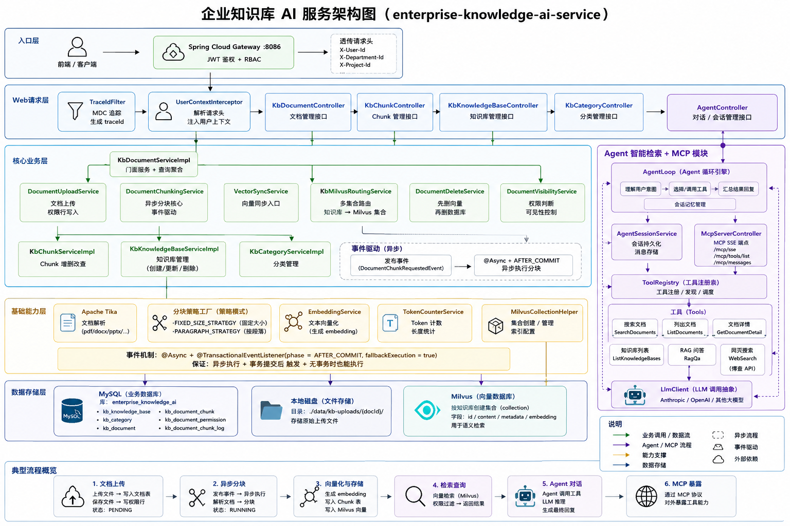

## 1. 服务定位

`enterprise-knowledge-ai-service` 是一个复合型知识服务，包含 4 条能力线：

1. 知识库管理
2. 文档上传、正文提取、分块、状态机流转
3. Milvus 向量写入与向量搜索
4. Agent 对话、RAG 检索、MCP 工具服务

如果从业务边界理解，它更像“知识中台 + AI 检索服务”。

---

## 2. 代码结构树

```text
enterprise-knowledge-ai-service/src/main/java/com/zjl/knowledge
├── agent                # Agent 对话、MCP、Tool、LLM 适配
├── chunk                # 分块策略与分块模型
├── config               # Spring / MyBatis / Milvus / 业务配置
├── domain               # 状态枚举与业务枚举
├── dto                  # 入参与出参对象
├── embedding            # 向量化接口与实现
├── entity               # MyBatis-Plus 实体
├── event                # 异步分块事件
├── mapper               # Mapper 接口
├── milvus               # Milvus 封装
├── service              # 服务接口与公共服务
├── service/impl         # 核心业务实现
├── token                # Token 估算
├── util                 # 工具类
└── web                  # Controller + UserContext
```

---

## 3. 启动与配置

### 3.1 启动入口

入口类是：[KnowledgeAiApplication.java](/Users/zjl/projectByZhangjilin/EnterpriseKnowledgeWorkspace/enterprise-knowledge-ai-service/src/main/java/com/zjl/knowledge/KnowledgeAiApplication.java)

关键注解职责：

1. `@SpringBootApplication(scanBasePackages = {"com.zjl.knowledge", "com.zjl.common"})`
2. `@ConfigurationPropertiesScan`
3. `@MapperScan({"com.zjl.knowledge.mapper", "com.zjl.knowledge.agent.mapper"})`
4. `@EnableAsync`
5. `@EnableTransactionManagement`

这意味着：

1. 业务 Bean 和 `frameworks` 公共组件会一起被扫描
2. 文档分块的异步事件监听器会生效
3. Agent 会话表的 Mapper 也会被注册

### 3.2 配置文件

配置文件：[application.yml](/Users/zjl/projectByZhangjilin/EnterpriseKnowledgeWorkspace/enterprise-knowledge-ai-service/src/main/resources/application.yml)

当前代码反映出来的关键配置点：

| 配置项 | 当前作用 |
|------|----------|
| `server.port=8083` | 当前知识服务实际配置端口 |
| `app.kb.upload-dir` | 本地文件落盘目录 |
| `app.knowledge.embedding-model` | 默认嵌入模型 |
| `app.knowledge.vector-write-enabled` | 全局向量写入总开关 |
| `app.milvus.uri` | Milvus 地址 |
| `app.milvus.collection` | 默认集合名 |
| `app.milvus.vector-dimension` | 向量维度 |
| `app.milvus.fail-on-init` | 启动时 Milvus 初始化失败是否中止应用 |
| `app.agent.llm.*` | Agent 对话模型配置 |
| `app.agent.web-search.*` | 联网搜索配置 |

---

## 4. Web 层入口

当前 Controller 大致可分为 3 组，如下所示：

### 4.1 知识库与文档管理

| Controller | 路径前缀 | 职责 |
|-----------|---------|------|
| `KbDocumentController` | `/api/kb` | 文档上传、列表、详情、下载、删除、启动分块 |
| `KbKnowledgeBaseController` | `/api/kb/bases` | 知识库 CRUD |
| `KbCategoryController` | `/api/kb/categories` | 分类 CRUD |
| `KbChunkController` | `/api/kb/documents/{docId}/chunks` | Chunk 分页、创建、修改、删除、批量启停 |

### 4.2 Agent 会话接口

| Controller | 路径前缀 | 职责 |
|-----------|---------|------|
| `AgentController` | `/api/kb/agent` | SSE 聊天、会话列表、历史、归档 |

### 4.3 MCP 协议接口

| Controller | 路径前缀 | 职责 |
|-----------|---------|------|
| `McpServerController` | `/mcp` | SSE 会话、工具发现、工具调用 |

---

## 5. 用户上下文与权限模型

### 5.1 用户上下文来源

知识服务本身不负责登录，它依赖网关透传的请求头：

1. `X-User-Id`
2. `X-Department-Id`
3. `X-Project-Id`
4. `X-Is-Admin`

处理链路：

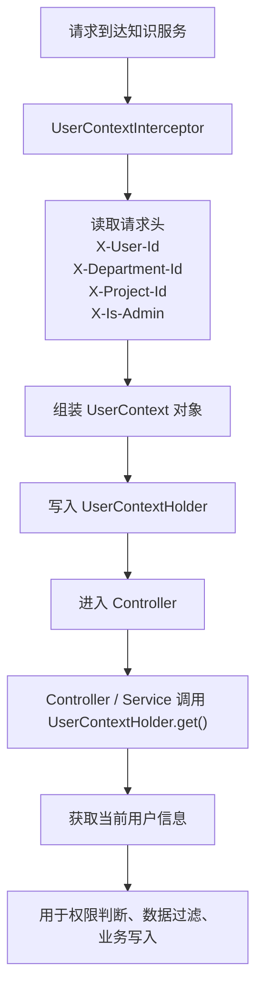

1. `UserContextInterceptor` 解析请求头
2. 写入 `UserContextHolder`
3. Controller/Service 通过 `UserContextHolder.get()` 获取当前人

### 5.2 文档权限模型

核心由两部分组成：

1. `kb_document.permission_type`
2. `kb_document_permission` 关联表

支持的权限类型：

1. `ALL`
2. `DEPARTMENT`
3. `PROJECT`
4. `USER`
5. `ADMIN`

权限判断主要分两层：

1. 列表查询时在 `KbDocumentMapper.xml` 中做 SQL 过滤
2. 单文档读取时由 `DocumentVisibilityService.canView(...)` 做二次校验

---

## 6. 文档主流程

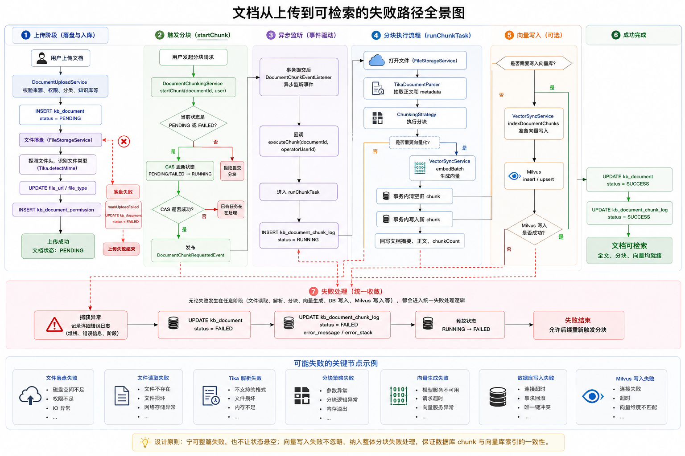

### 6.1 上传流程

关键文件：

| 文件 | 作用 |
|------|------|
| `KbDocumentController` | 上传接口入口 |
| `KbDocumentServiceImpl` | 文档门面 |
| `DocumentUploadService` | 上传落盘与入库 |
| `LocalFileStorageService` | 本地文件存储 |

上传流程可以理解为：

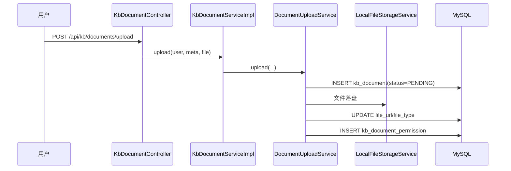

上传后的文档并不会自动可检索，它先进入 `PENDING`。

### 6.2 状态机

当前真正使用的主路径是：

1. `PENDING`
2. `RUNNING`
3. `SUCCESS`
4. `FAILED`

虽然 `DocumentStatus` 里还有 `DRAFT`、`PARSING`、`PUBLISHED`、`REJECTED` 等值，但当前主要是为了后续扩展保留。

### 6.3 触发分块

关键文件：

- [DocumentChunkingService.java](/Users/zjl/projectByZhangjilin/EnterpriseKnowledgeWorkspace/enterprise-knowledge-ai-service/src/main/java/com/zjl/knowledge/service/impl/DocumentChunkingService.java)

入口方法：

1. `startChunk(Long documentId, UserContext user)`
2. `executeChunk(Long documentId, Long operatorUserId)`
3. `executeChunkAsUser(Long documentId, UserContext user)`

当前实现里，`startChunk` 做了两件关键事：

1. 只允许 `PENDING` 或 `FAILED` 的文档提交分块
2. 使用 CAS 方式把状态切到 `RUNNING`

更新成功后，它不会直接在当前事务里做正文提取，而是发布 `DocumentChunkRequestedEvent`。

### 6.4 异步分块执行

异步链路：

1. `DocumentChunkingService.startChunk(...)`
2. 发布 `DocumentChunkRequestedEvent`
3. `DocumentChunkEventListener` 在事务提交后异步监听
4. 回调 `executeChunk(...)`
5. 最终进入 `runChunkTask(...)`

`runChunkTask(...)` 是整个文档处理闭环的中心，负责：

1. 建立 `kb_document_chunk_log`
2. 用 `TikaDocumentParser` 抽取正文和 metadata
3. 按 `ChunkingMode` 选择分块策略
4. 生成 `TextChunk` 列表
5. 如果需要向量化，则批量调用 `VectorSyncService.embedBatch(...)`
6. 通过事务清空旧 chunk、写入新 chunk、回写文档摘要与计数
7. 如果需要向量写入，则调用 Milvus 写入
8. 成功后回写文档 `SUCCESS`
9. 失败则回写 `FAILED`

### 6.5 上传到可检索的完整时序图

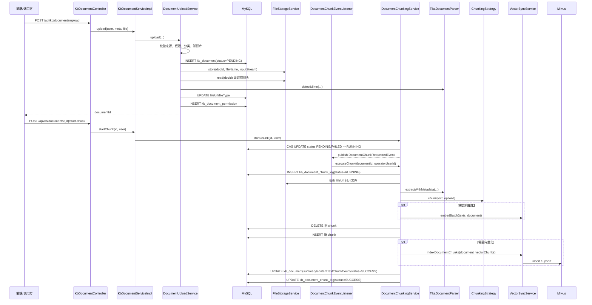

### 6.6 分块失败路径

当前失败路径的设计思路是“宁可整篇失败，也不让状态悬空”：

1. 上传落盘失败时，`DocumentUploadService.markUploadFailed(...)` 会把文档标记为 `FAILED`
2. 分块中任一步失败，`DocumentChunkingService.runChunkTask(...)` 会：
   - 记录错误日志
   - 回写 `kb_document.status=FAILED`
   - 更新 `kb_document_chunk_log`
3. 向量写入失败不会被默默吞掉，而是纳入分块失败处理

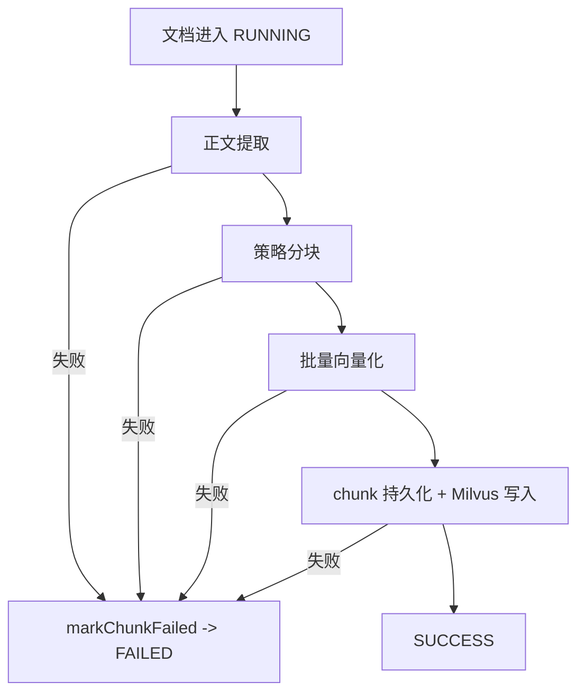

---

**总结整个流程：**

**上传和分块主流程**

1. 用户调用 POST /api/kb/documents/upload 上传文件和元数据。
2. 后端先做校验：文件不能为空、分类要存在、知识库要存在、权限参数要合法。
3. 校验通过后，先往 kb_document 插一条文档记录，状态写成 PENDING。
4. 然后把文件落到本地目录，再用 Tika 探测文件类型，回写到文档表。
5. 如果有文档权限配置，再写入 kb_document_permission。
6. 到这里上传就结束了，但文档还不能检索，因为只是“已上传，待处理”。

**为什么上传后不是马上分块**
因为分块和向量化比较重：

- 要读文件
- 要提取正文
- 要切 chunk
- 可能还要调 embedding 和 Milvus

所以系统把上传和分块拆成两步，避免上传接口阻塞太久。

**分块触发流程**

1. 用户再调用 POST /api/kb/documents/{id}/start-chunk。
2. 后端先检查文档状态，只有 PENDING 或 FAILED 才允许重新提交。
3. 然后把状态改成 RUNNING。
4. 再发布一个异步事件，真正的分块任务在后台执行。

**后台分块实际做了什么**
后台任务大致是这几步：

1. 读取原始文件。
2. 用 Tika 提取正文和 metadata。
3. 根据文档配置选择分块策略，比如固定长度或按段落。
4. 得到一组 TextChunk。
5. 如果当前文档需要向量化，就批量生成 embedding。
6. 删除旧 chunk，插入新 chunk。
7. 如果开启了向量写入，就把这些 chunk 写入 Milvus。
8. 最后回写文档表里的：
   - contentText
   - summary
   - chunkCount
   - status

**最终状态**

- 全部成功：文档变成 SUCCESS
- 中间任何一步失败：文档变成 FAILED


## 7. 分块体系

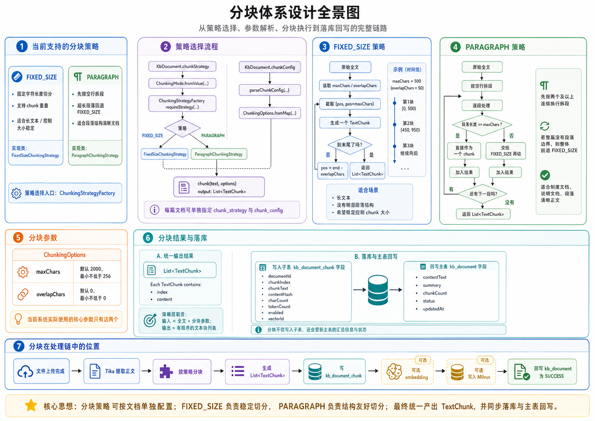

### 7.1 当前支持的分块策略

系统现在只有两种分块策略：

1. FIXED_SIZE
2. PARAGRAPH

对应实现：

- FixedSizeChunkingStrategy
- ParagraphChunkingStrategy

选择入口：

- ChunkingStrategyFactory

文档上决定分块方式的字段是：

1. kb_document.chunk_strategy
2. kb_document.chunk_config

也就是说，**每篇文档可以单独指定分块策略和参数**。

### 7.2 策略选择流程

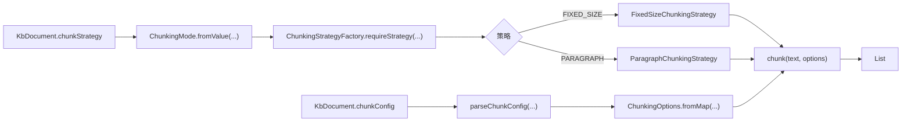

### 7.3 FIXED_SIZE 策略

FIXED_SIZE 的规则很简单：

1. 按固定字符长度切分
2. 相邻 chunk 可以保留重叠字符
3. 一直滑动到文本结束

核心参数：

1. maxChars
2. overlapChars

例子：

- maxChars = 500
- overlapChars = 50

那么切分大概会是：

- 第 1 块：[0, 500)
- 第 2 块：[450, 950)
- 第 3 块：继续往后

流程图：

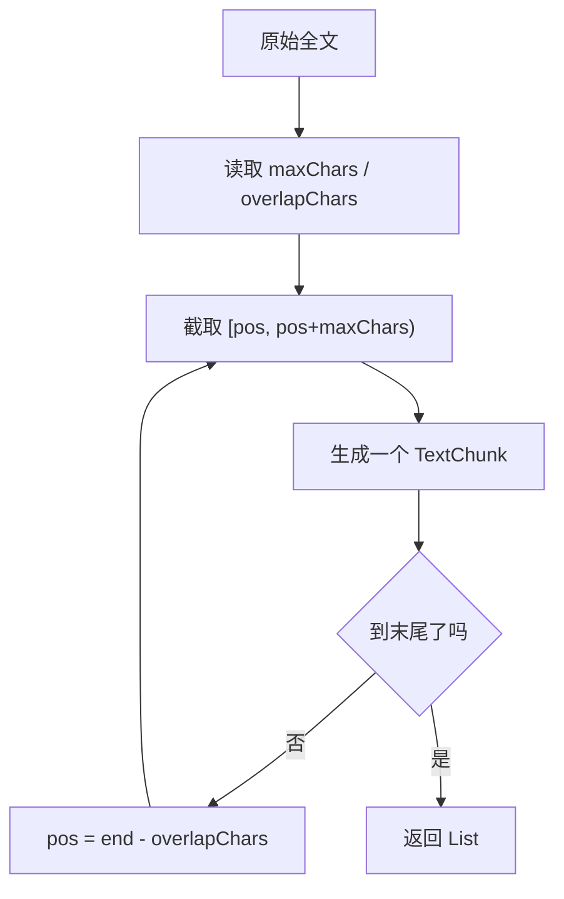

适合：

- 长文本
- 没有明显段落结构的内容
- 希望稳定控制 chunk 大小的场景

------

### 7.4 PARAGRAPH 策略

PARAGRAPH 的规则是：

1. 先按“两个及以上连续换行”拆段
2. 每段如果不长，直接作为一个 chunk
3. 如果某一段太长，再退回 FIXED_SIZE 切
4. 如果整篇没有段落边界，最后整体退回 FIXED_SIZE

流程图：

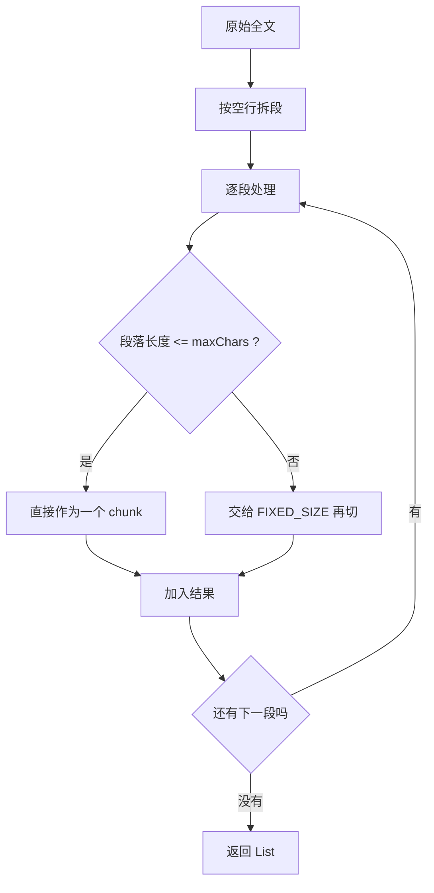

适合：

- 制度文档
- 说明文档
- 段落结构清晰的正文

------

### 7.5 分块参数

当前分块参数由 ChunkingOptions 承载，系统实际用到的只有两个：

1. maxChars
2. overlapChars

默认值：

- maxChars = 2000
- overlapChars = 0

系统会做基础修正：

- maxChars 最低不会小于 256
- overlapChars 最低不会小于 0

------

### 7.6 分块结果

不管用哪种策略，最后统一返回：

- List<TextChunk>

每个 TextChunk 只有两个核心值：

1. index
2. content

也就是说，策略层的职责就是：

- 输入：全文 + 分块参数
- 输出：有顺序的文本块列表

------

### 7.7 分块后的落库结果

分块完成后，不只是写 kb_document_chunk，还会回写 kb_document。

#### 写入 kb_document_chunk

每个 chunk 会保存：

1. documentId
2. chunkIndex
3. chunkText
4. contentHash
5. charCount
6. tokenCount
7. enabled
8. vectorId

#### 回写 kb_document

会更新：

1. contentText
2. summary
3. chunkCount
4. status
5. updatedAt

所以分块不是“只生成子表数据”，而是会同步更新文档主表。

------

### 7.8 分块在整个处理链里的位置


## 8. 向量化与 Milvus 结构

### 8.1 组件分层

当前 Milvus 相关代码分为 **4 层**

| 层次 | 主要类 | 职责 |
|------|-------|------|
| 路由层 | `KbMilvusRoutingService` | 决定用哪个集合、哪个 embedding model，支持知识库级别路由 |
| 服务层 | `VectorSyncService` | 统一封装 embed、search、index、delete 全部操作入口 |
| 接口层 | `ChunkVectorStore` | 抽象接口，定义向量存储标准操作 |
| 实现层 | `MilvusChunkVectorStore`、`MilvusVectorWriter` | Milvus SDK 实现，负责低层 HTTP/gRPC 通信 |

**关键接口抽象**：`ChunkVectorStore` 是存储层抽象，`MilvusChunkVectorStore` 是其 Milvus 实现。这种设计使得未来可以替换为其他向量数据库（如 Qdrant、Pinecone）。

```java
public interface ChunkVectorStore {
    void deleteDocumentVectors(String collectionName, Long documentId);
    void indexDocumentChunks(String collectionName, Long documentId, List<VectorDocChunk> chunks);
    void updateChunk(String collectionName, Long documentId, VectorDocChunk chunk);
    List<SearchResult> search(String collectionName, float[] vector, int topK, String filter);
}
```

### 8.2 集合与路由

**三级路由机制**：

1. **文档级别**：如果文档关联了 `kbId`，则优先使用知识库配置的 collection 和 embedding model
2. **知识库级别**：`KbKnowledgeBase.collectionName` 和 `KbKnowledgeBase.embeddingModel`
3. **全局默认值**：`app.milvus.collection` 和 `app.knowledge.embedding-model`

```java
// KbMilvusRoutingService.embeddingModelOrDefault(doc)
KbKnowledgeBase kb = kbKnowledgeBaseMapper.selectById(doc.getKbId());
if (kb != null && StringUtils.hasText(kb.getEmbeddingModel())) {
    return kb.getEmbeddingModel();  // 知识库级别
}
return knowledgeAiProperties.getEmbeddingModel();  // 全局默认
```

**路由方法对照表**：

| 方法 | 用途 | 知识库不存在时行为 |
|-----|------|------------------|
| `collectionForVectorWrite(doc)` | 向量写入 | 抛 BizException |
| `collectionForVectorWriteOrDefault(doc)` | 删除向量 | 回退到默认集合 |
| `embeddingModelOrDefault(doc)` | 获取 embedding 模型 | 回退到全局默认 |

### 8.3 什么时候写 Milvus

**两阶段决策**：

```java
// VectorSyncService.shouldEmbed(document)
public boolean shouldEmbed(KbDocument document) {
    return kbMilvusRoutingService.shouldEmbed(document);
}

// KbMilvusRoutingService.shouldEmbed(doc)
public boolean shouldEmbed(KbDocument doc) {
    if (!knowledgeAiProperties.isVectorWriteEnabled()) {
        return false;  // 全局开关关闭
    }
    String model = embeddingModelOrDefault(doc);
    return StringUtils.hasText(model);  // 无有效模型时不写入
}
```

**决策树**：

```
是否写向量？
    │
    ├── app.knowledge.vector-write-enabled = false → 不写（分块正常完成）
    │
    └── vector-write-enabled = true
            │
            ├── embeddingModelOrDefault(doc) 返回空 → 不写（分块正常完成）
            │
            └── 有有效模型 → 写入 Milvus
```

### 8.4 向量同步流程图

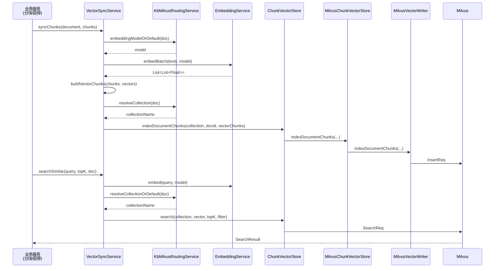

### 8.5 Embedding 服务实现

当前 `EmbeddingService` 是接口，`DeepSeekEmbeddingService` 是实现：

```java
public interface EmbeddingService {
    List<Float> embed(String content);                    // 单文本，使用默认模型
    List<Float> embed(String content, String model);      // 单文本，指定模型
    List<List<Float>> embedBatch(List<String> texts);    // 批量，使用默认模型
    List<List<Float>> embedBatch(List<String> texts, String model);  // 批量，指定模型
}
```

**实现特点**：
- 使用 DeepSeek API（OpenAI 兼容格式）
- API 端点：`{baseUrl}/v1/embeddings`
- 支持自定义模型名称
- 默认模型：`deepseek-chat`

### 8.6 MilvusVectorWriter 核心逻辑

`MilvusVectorWriter` 是最底层的写入器，直接操作 Milvus SDK：

**写入字段映射**：

| Milvus 字段 | 来源 | 说明 |
|------------|------|------|
| `id` | `chunk.getChunkId()` | Chunk 主键 |
| `content` | `chunk.getContent()` | 文本内容，超 65535 字符自动截断 |
| `metadata` | JSON 对象 | 包含 collection、docId、index 等 |
| `embedding` | float[] | 向量 |

**删除表达式**：

| 场景 | 表达式 |
|-----|--------|
| 按文档删 | `metadata["doc_id"] == "123"` |
| 按 chunk 删 | `id == "chunk_456"` |
| 批量删 chunk | `id in ["chunk_1", "chunk_2"]` |

### 8.7 当前启动约束

```java
// MilvusProperties
private boolean failOnInit = true;  // 默认 true，即 Milvus 不可用时启动失败
```

**当前设计**：
- `failOnInit=true`（默认）：Milvus 不可用时应用启动失败
- `failOnInit=false`：应用可启动，但向量写入会失败

**实际行为**：`MilvusClientV2` Bean 的创建在 `MilvusClientConfiguration` 中，无论 `failOnInit` 为何值，客户端 Bean 都会被创建。`failOnInit` 只影响集合初始化（`MilvusCollectionBootstrap`）是否阻止启动。

---

## 9. 文档、Chunk 与删除/启停逻辑

### 9.1 `KbDocumentServiceImpl` 的角色

- [KbDocumentServiceImpl.java](/Users/zjl/projectByZhangjilin/EnterpriseKnowledgeWorkspace/enterprise-knowledge-ai-service/src/main/java/com/zjl/knowledge/service/impl/KbDocumentServiceImpl.java)

它更像“文档门面服务”，自己不把所有逻辑写死，而是做协调：

1. 查询可见文档
2. 上传委托给 `DocumentUploadService`
3. 分块委托给 `DocumentChunkingService`
4. 删除委托给 `DocumentDeleteService`
5. 启停文档时同步更新 chunk enabled 和向量状态

### 9.2 启停文档

`enableDocument(...)` 会处理：

1. 校验文档不在 `RUNNING`
2. 更新文档启用状态
3. 调用 `KbChunkService` 批量更新 chunk 启用状态
4. 如果开启且需要 embedding，则重建向量
5. 如果关闭且已写向量，则删除该文档的向量

这意味着“文档启用状态”和“chunk 是否可检索”是联动的。

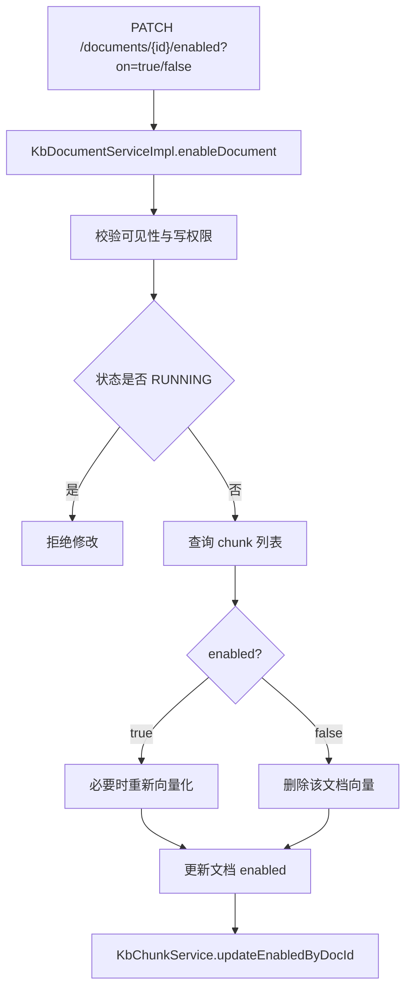

### 9.3 删除文档

删除流程由 `DocumentDeleteService` 负责，目标是尽量保持：

1. 向量先删
2. 再删 chunk
3. 再删文档及权限
4. 最后清理文件

这是为了降低 Milvus 留孤儿向量的概率。

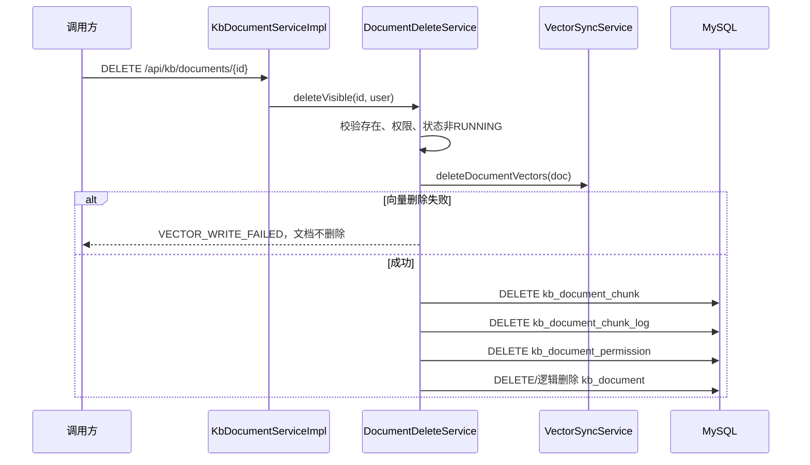

---

## 10. Agent 模块

### 10.1 Agent 入口

关键文件：

| 文件 | 作用 |
|------|------|
| `AgentController` | HTTP/SSE 入口 |
| `AgentLoop` | 核心循环 |
| `AgentSessionService` | 会话和消息持久化 |
| `KbAgentSession`、`KbAgentMessage` | 会话表与消息表 |

`AgentController.chat(...)` 做的事情很直接：

1. 拿当前用户
2. 获取或创建会话
3. 保存用户消息
4. 开启新线程执行 `agentLoop.run(...)`
5. 通过 `SseEmitter` 流式返回

```mermaid
sequenceDiagram
    participant FE as 前端
    participant CTL as AgentController
    participant SESS as AgentSessionService
    participant LOOP as AgentLoop
    participant LLM as LlmClient
    participant TOOLS as ToolRegistry

    FE->>CTL: POST /api/kb/agent/chat
    CTL->>SESS: getOrCreateSession(...)
    CTL->>SESS: saveUserMessage(...)
    CTL-->>FE: SSE 开始
    CTL->>LOOP: run(session, user, emitter)
    LOOP->>SESS: loadHistory(...)
    LOOP->>TOOLS: getAllDefinitions()
    LOOP->>LLM: chatStream(messages, tools, listener)
    alt LLM 直接回答
        LLM-->>FE: text delta
    else LLM 请求工具
        LLM-->>LOOP: onToolCall
        LOOP->>TOOLS: execute(name, args, user)
        TOOLS-->>LOOP: ToolResult
        LOOP-->>FE: tool_result
        LOOP->>LLM: 下一轮带 tool message 继续推理
    end
    LOOP->>SESS: saveAssistantMessage(...)
    LOOP-->>FE: done
```

### 10.2 AgentLoop 的职责

`AgentLoop` 当前实现的是“服务端自主控制”的工具型循环：

1. 构造 `system` + 历史消息
2. 从 `ToolRegistry` 取工具定义
3. 调用 `LlmClient.chatStream(...)`
4. 如果 LLM 返回 tool call，则在本地执行工具
5. 把 tool result 作为 `tool` 消息塞回上下文
6. 继续下一轮
7. 达到无工具调用或到达最大轮次后结束

这套结构的好处是：

1. 工具权限控制都在本服务内
2. 模型只是“提出调用建议”
3. 真正的业务执行由本地服务掌控

### 10.3 当前 LLM 适配

`agent/llm` 下目前有 3 个实现：

1. `SpringAiLlmClient`
2. `DeepSeekLlmClient`
3. `AnthropicLlmClient`

当前配置 `provider=deepseek` 时，会走 `SpringAiLlmClient`。

`DeepSeekLlmClient` 被改成了 `deepseek-legacy` 条件下启用，说明现在正在从“手写 HTTP + SSE 解析”迁移到 Spring AI 封装。

### 10.4 工具集

当前注册的工具类型至少包括：

1. `SearchDocumentsTool`
2. `ListDocumentsTool`
3. `GetDocumentDetailTool`
4. `ListKnowledgeBasesTool`
5. `RagQaTool`

从当前代码状态看，知识服务的 Agent 已经具备：

1. 基于标题的文档搜索
2. 文档详情获取
3. 知识库列表查询
4. 基于 Milvus 的 RAG 检索

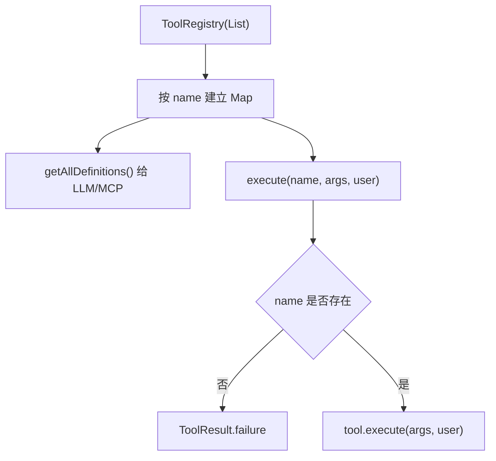

---

## 11. MCP 模块

`McpServerController` 当前实现的是一个轻量 MCP Server。

接口有 3 个：

1. `GET /mcp/sse`
2. `POST /mcp/tools/list`
3. `POST /mcp/messages`

它的意义不是“给前端网页直接聊天”，而是允许外部 MCP Client 把这套知识工具当作标准工具源接入。

换句话说，`AgentController` 是面向“本项目自己的聊天前端”，`McpServerController` 是面向“外部 Agent 生态”。

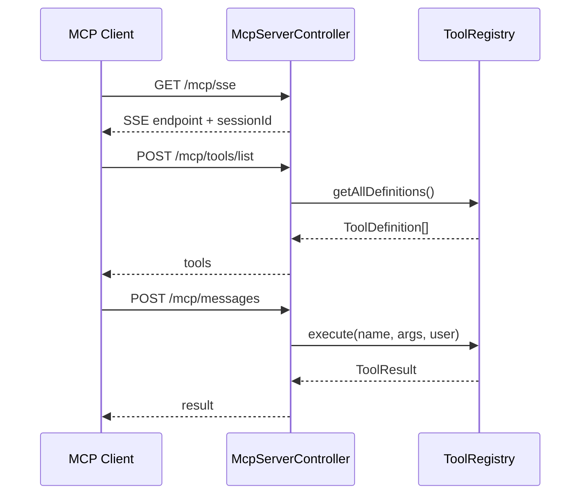

---

## 12. 数据库模型概览

知识服务核心表大致可分为 3 组。

### 12.1 知识库与文档元数据

1. `kb_knowledge_base`
2. `kb_document`
3. `kb_category`

### 12.2 分块与权限

1. `kb_document_chunk`
2. `kb_document_permission`
3. `kb_document_chunk_log`

### 12.3 Agent 会话

1. `kb_agent_session`
2. `kb_agent_message`

所以当前知识服务既是“文档处理服务”，也是“Agent 会话存储服务”。

---

## 13. 当前实现成熟度判断

### 13.1 已经较完整的部分

1. 文档上传到分块成功/失败的闭环
2. 基于知识库维度的 Milvus 路由
3. 文档可见性控制
4. Chunk CRUD 与向量同步
5. Agent 会话、SSE 输出、工具回路
6. MCP 协议基本支持

### 13.2 仍需重点关注的部分

1. Milvus 不可用时的启动降级
2. 端口与网关路由统一
3. Agent 工具调用前端事件展示细节
4. 联网搜索等敏感配置外置
5. Spring AI 接入后的完整编译与联调验证

---

## 14. 阅读代码建议顺序

如果要快速理解知识服务，推荐按这个顺序看：

1. `application.yml`
2. `KbDocumentController`
3. `KbDocumentServiceImpl`
4. `DocumentUploadService`
5. `DocumentChunkingService`
6. `VectorSyncService`
7. `MilvusVectorWriter`
8. `AgentController`
9. `AgentLoop`
10. `RagQaTool`
11. `McpServerController`

一句话总结：

`enterprise-knowledge-ai-service` 当前已经形成“文档处理闭环 + 向量检索 + 工具型 Agent + MCP 输出”的完整核心服务雏形，是整个仓库最成熟的后端模块。

---

## 15. 完整代码地图

这一节按包列出当前知识服务主要代码文件，并解释它们各自负责什么。这里的目标不是替代源码，而是给你一张“看到文件名就知道该往哪里找”的地图。

### 15.1 启动与配置包

| 文件 | 说明 |
|------|------|
| `KnowledgeAiApplication.java` | 应用启动入口，负责组件扫描、Mapper 扫描、异步与事务能力开启。 |
| `config/KnowledgeAiProperties.java` | 绑定 `app.knowledge.*`，控制默认 embedding model、全局向量写开关。 |
| `config/KbStorageProperties.java` | 绑定 `app.kb.*`，主要是上传目录。 |
| `config/MilvusProperties.java` | 绑定 `app.milvus.*`，包括地址、默认集合、维度、初始化失败策略。 |
| `config/MilvusClientConfiguration.java` | 创建 `MilvusClientV2` Bean。当前启动期 Milvus 强依赖问题与它直接相关。 |
| `config/MybatisPlusConfig.java` | 配置 MyBatis-Plus 分页等基础能力。 |
| `config/TransactionConfig.java` | 暴露 `TransactionTemplate`，用于 DB 与向量写入协调。 |
| `config/WebMvcConfig.java` | 注册 `UserContextInterceptor` 等 MVC 层基础组件。 |

### 15.2 Web 层

| 文件 | 说明 |
|------|------|
| `web/KbDocumentController.java` | 文档主入口，覆盖上传、分页、详情、搜索、下载、删除、分块触发、启停。 |
| `web/KbKnowledgeBaseController.java` | 知识库 CRUD 与分页查询。 |
| `web/KbCategoryController.java` | 文档分类管理。 |
| `web/KbChunkController.java` | 文档 chunk 级别的增删改查与批量启停。 |
| `web/UserContext.java` | 下游服务中的当前用户模型。 |
| `web/UserContextHolder.java` | ThreadLocal 持有当前用户。 |
| `web/UserContextInterceptor.java` | 从网关透传请求头中恢复用户身份。 |

### 15.3 领域枚举

| 文件 | 说明 |
|------|------|
| `domain/DocumentStatus.java` | 文档状态定义。当前主路径是 `PENDING/RUNNING/SUCCESS/FAILED`。 |
| `domain/DocumentPermissionType.java` | 文档权限类型。 |
| `domain/ChunkingMode.java` | 分块策略枚举。 |
| `domain/ProcessMode.java` | 文档处理模式，当前主要是 `CHUNK`，`PIPELINE` 仍未真正接入。 |
| `domain/SourceType.java` | 文档来源类型。当前 `URL` 上传仍未放开。 |

### 15.4 DTO 层

| 文件 | 说明 |
|------|------|
| `dto/KbDocumentUploadRequest.java` | 上传元数据，包含标题、权限、kbId、分块配置、来源类型等。 |
| `dto/KbDocumentUpdateRequest.java` | 更新文档标题、处理模式、调度信息、来源信息。 |
| `dto/KbDocumentChunkLogVO.java` | 分块日志返回对象。 |
| `dto/KbCategoryRequest.java` | 分类增改请求。 |
| `dto/chunk/KbChunkCreateRequest.java` | 手工新增 chunk。 |
| `dto/chunk/KbChunkUpdateRequest.java` | 修改单个 chunk。 |
| `dto/chunk/KbChunkPageRequest.java` | chunk 分页查询。 |
| `dto/chunk/KbChunkBatchRequest.java` | chunk 批量操作请求。 |
| `dto/chunk/KbChunkVO.java` | chunk 输出对象。 |
| `dto/kb/KbKnowledgeBaseCreateRequest.java` | 创建知识库。 |
| `dto/kb/KbKnowledgeBaseUpdateRequest.java` | 更新知识库。 |
| `dto/kb/KbKnowledgeBaseRenameRequest.java` | 重命名知识库。 |
| `dto/kb/KbKnowledgeBasePageRequest.java` | 知识库分页。 |
| `dto/kb/KbKnowledgeBaseVO.java` | 知识库输出对象。 |

DTO 层大多承担参数承接和返回包装，没有复杂逻辑，重点是理解它们承载的业务字段。

### 15.5 Entity 层

| 文件 | 说明 |
|------|------|
| `entity/KbKnowledgeBase.java` | 知识库实体，对应 Milvus collection 与 embedding model 配置。 |
| `entity/KbDocument.java` | 文档主表实体，既存元数据，也存全文、摘要、状态和分块统计。 |
| `entity/KbDocumentChunk.java` | chunk 明细表实体。 |
| `entity/KbDocumentPermission.java` | 文档授权行。 |
| `entity/KbDocumentChunkLog.java` | 分块执行日志。 |
| `entity/KbCategory.java` | 分类实体。 |

### 15.6 Mapper 层

| 文件 | 说明 |
|------|------|
| `mapper/KbKnowledgeBaseMapper.java` | 知识库表访问。 |
| `mapper/KbDocumentMapper.java` | 文档表访问，复杂权限 SQL 在 XML 里。 |
| `mapper/KbDocumentChunkMapper.java` | chunk 表访问。 |
| `mapper/KbDocumentPermissionMapper.java` | 授权表访问。 |
| `mapper/KbDocumentChunkLogMapper.java` | 分块日志访问。 |
| `mapper/KbCategoryMapper.java` | 分类表访问。 |

### 15.7 分块策略包

| 文件 | 说明 |
|------|------|
| `chunk/ChunkingStrategy.java` | 分块策略接口。 |
| `chunk/FixedSizeChunkingStrategy.java` | 按固定长度切分。 |
| `chunk/ParagraphChunkingStrategy.java` | 按段落切分。 |
| `chunk/ChunkingStrategyFactory.java` | 根据 `ChunkingMode` 选择策略实现。 |
| `chunk/ChunkingOptions.java` | 分块参数封装。 |
| `chunk/TextChunk.java` | 单个分块结果。 |

### 15.8 存储、解析与工具类

| 文件 | 说明 |
|------|------|
| `service/TikaDocumentParser.java` | 文本与 metadata 提取、MIME 探测。 |
| `service/FileStorageService.java` | 文件存储抽象。 |
| `service/impl/LocalFileStorageService.java` | 本地磁盘实现。 |
| `token/TokenCounterService.java` | token 计数接口。 |
| `token/SimpleTokenCounterService.java` | 简单计数实现。 |
| `util/ContentHashUtil.java` | chunk 内容哈希，用于去重或变更识别。 |

### 15.9 服务层接口与实现

| 文件 | 说明 |
|------|------|
| `service/KbDocumentService.java` | 文档门面接口。 |
| `service/impl/KbDocumentServiceImpl.java` | 文档门面实现，串起上传、分块、删除、启停、查询。 |
| `service/impl/DocumentUploadService.java` | 上传校验、插入文档、落盘、MIME 探测、写权限行。 |
| `service/impl/DocumentChunkingService.java` | 分块流程核心：状态切换、抽取正文、分块、向量化、落库。 |
| `service/impl/DocumentDeleteService.java` | 删除文档及其向量、chunk、权限、文件。 |
| `service/KbChunkService.java` | chunk 服务接口。 |
| `service/impl/KbChunkServiceImpl.java` | chunk CRUD 与向量同步。 |
| `service/KbKnowledgeBaseService.java` | 知识库接口。 |
| `service/impl/KbKnowledgeBaseServiceImpl.java` | 知识库实现，包含 collection 创建保障。 |
| `service/KbCategoryService.java` | 分类接口。 |
| `service/impl/KbCategoryServiceImpl.java` | 分类实现。 |
| `service/DocumentVisibilityService.java` | 文档单体可见性判断。 |
| `service/KbMilvusRoutingService.java` | 文档到 collection 和 embedding model 的路由。 |
| `service/VectorSyncService.java` | 向量化、检索、写入、删除的统一入口。 |

### 15.10 嵌入与 Milvus 包

| 文件 | 说明 |
|------|------|
| `embedding/EmbeddingService.java` | 文本转向量抽象。 |
| `embedding/DeepSeekEmbeddingService.java` | 当前默认 embedding 实现。 |
| `milvus/ChunkVectorStore.java` | 向量存储抽象。 |
| `milvus/MilvusChunkVectorStore.java` | Milvus 存储实现。 |
| `milvus/MilvusVectorWriter.java` | 直接调用 Milvus SDK 完成 insert/upsert/delete/search。 |
| `milvus/MilvusCollectionHelper.java` | 建 collection、建索引、load collection。 |
| `milvus/MilvusCollectionBootstrap.java` | 启动时初始化默认 collection。 |
| `milvus/VectorDocChunk.java` | 写入 Milvus 的 chunk 模型。 |
| `milvus/SearchResult.java` | 向量检索返回结构。 |

### 15.11 事件包

| 文件 | 说明 |
|------|------|
| `event/DocumentChunkRequestedEvent.java` | 异步分块事件载体。 |
| `event/DocumentChunkEventListener.java` | 事务提交后异步触发分块执行。 |

### 15.12 Agent 包

| 文件 | 说明 |
|------|------|
| `agent/AgentController.java` | SSE 对话接口与会话管理接口。 |
| `agent/AgentLoop.java` | 模型调用、工具调用、消息回填、轮次控制。 |
| `agent/AgentSessionService.java` | 会话与消息的持久化。 |
| `agent/AgentSseEmitter.java` | SSE 输出封装。 |
| `agent/config/AgentProperties.java` | `app.agent.*` 配置绑定。 |
| `agent/entity/KbAgentSession.java` | 会话实体。 |
| `agent/entity/KbAgentMessage.java` | 消息实体。 |
| `agent/mapper/KbAgentSessionMapper.java` | 会话表访问。 |
| `agent/mapper/KbAgentMessageMapper.java` | 消息表访问。 |
| `agent/model/ChatMessage.java` | Agent 内部消息模型。 |
| `agent/model/ChatUsage.java` | token 统计模型。 |
| `agent/model/ToolCall.java` | LLM 返回的工具调用模型。 |
| `agent/llm/LlmClient.java` | LLM 调用抽象。 |
| `agent/llm/SpringAiLlmClient.java` | 当前默认 DeepSeek 适配实现。 |
| `agent/llm/DeepSeekLlmClient.java` | legacy DeepSeek 实现。 |
| `agent/llm/AnthropicLlmClient.java` | Anthropic 适配实现。 |
| `agent/llm/StreamListener.java` | 流式回调接口。 |
| `agent/mcp/McpServerController.java` | MCP 协议入口。 |
| `agent/mcp/McpTool.java` | 工具接口。 |
| `agent/mcp/ToolDefinition.java` | 工具元信息与参数 Schema。 |
| `agent/mcp/ToolRegistry.java` | 工具收集与分发。 |
| `agent/mcp/ToolResult.java` | 工具执行结果。 |
| `agent/tool/SearchDocumentsTool.java` | 按标题/关键词搜文档。 |
| `agent/tool/ListDocumentsTool.java` | 列文档。 |
| `agent/tool/GetDocumentDetailTool.java` | 文档详情。 |
| `agent/tool/ListKnowledgeBasesTool.java` | 列知识库。 |
| `agent/tool/RagQaTool.java` | 向量检索问答。 |

---

## 16. 关键方法导读

这一节把最重要的方法列出来，告诉你“想理解某条流程时该先看哪个方法”。

### 16.1 文档上传

1. `KbDocumentController.upload(...)`
2. `KbDocumentServiceImpl.upload(...)`
3. `DocumentUploadService.upload(...)`
4. `DocumentUploadService.savePermissionRows(...)`

### 16.2 文档分块

1. `KbDocumentController.startChunk(...)`
2. `KbDocumentServiceImpl.startChunk(...)`
3. `DocumentChunkingService.startChunk(...)`
4. `DocumentChunkEventListener.onChunkRequested(...)`
5. `DocumentChunkingService.executeChunk(...)`
6. `DocumentChunkingService.runChunkTask(...)`
7. `DocumentChunkingService.persistChunksAndVectorsAtomically(...)`

### 16.3 Chunk 手工维护

1. `KbChunkController.*`
2. `KbChunkServiceImpl.createChunk(...)`
3. `KbChunkServiceImpl.updateChunk(...)`
4. `KbChunkServiceImpl.deleteChunk(...)`
5. `KbChunkServiceImpl.batchSetEnabled(...)`

### 16.4 文档删除与启停

1. `KbDocumentServiceImpl.enableDocument(...)`
2. `KbDocumentServiceImpl.deleteVisible(...)`
3. `DocumentDeleteService.deleteDocument(...)`

### 16.5 Agent 对话

1. `AgentController.chat(...)`
2. `AgentSessionService.getOrCreateSession(...)`
3. `AgentSessionService.saveUserMessage(...)`
4. `AgentLoop.run(...)`
5. `AgentLoop.agentLoop(...)`
6. `ToolRegistry.execute(...)`

### 16.6 RAG 检索

1. `RagQaTool.execute(...)`
2. `VectorSyncService.searchSimilar(...)`
3. `MilvusChunkVectorStore.search(...)`
4. `MilvusVectorWriter.search(...)`

---

## 17. 代码阅读建议

如果你要真正“把这个服务吃透”，建议按下面顺序看源码：

1. 先看 `application.yml`，理解配置面
2. 再看 `KbDocumentController` 和 `KbDocumentServiceImpl`
3. 接着看 `DocumentUploadService` 与 `DocumentChunkingService`
4. 然后看 `VectorSyncService`、`KbMilvusRoutingService` 和 `MilvusVectorWriter`
5. 最后看 `AgentController`、`AgentLoop`、`ToolRegistry` 和各个 `tool`

这样能先建立主业务，再理解 AI 与向量层，不容易迷路。

---

## 18. Controller 逐接口说明

这一节按 Controller 把接口职责、前置条件、调用去向写清楚。

### 18.1 `KbDocumentController`

这是知识服务最重要的入口 Controller，路径前缀是 `/api/kb`。

#### `GET /api/kb/documents`

作用：

1. 按当前用户可见范围分页查文档
2. 返回 `PageResult<KbDocument>`

调用链：

1. `KbDocumentController.page(...)`
2. `KbDocumentServiceImpl.pageVisible(...)`
3. `KbDocumentMapper.selectPageVisible(...)`

这个接口的重点不在分页，而在“可见性 SQL 已经提前过滤”。

#### `GET /api/kb/documents/{id}`

作用：

1. 查单个文档详情
2. 再做一次基于 `DocumentVisibilityService` 的权限判断

调用链：

1. `KbDocumentController.detail(...)`
2. `KbDocumentServiceImpl.getVisible(...)`
3. `KbDocumentPermissionMapper.selectList(...)`
4. `DocumentVisibilityService.canView(...)`

#### `POST /api/kb/documents/upload`

作用：

1. 接收 multipart 上传
2. 文档先入库为 `PENDING`
3. 不会立即分块

调用链：

1. `KbDocumentController.upload(...)`
2. `KbDocumentServiceImpl.upload(...)`
3. `DocumentUploadService.upload(...)`

这也是整个知识服务最重要的业务入口之一。

#### `POST /api/kb/documents/{id}/start-chunk`

作用：

1. 提交异步分块任务
2. 要求文档当前必须是 `PENDING` 或 `FAILED`

调用链：

1. `KbDocumentController.startChunk(...)`
2. `KbDocumentServiceImpl.startChunk(...)`
3. `DocumentChunkingService.startChunk(...)`

#### `POST /api/kb/documents/{id}/execute-chunk`

作用：

1. 立即执行分块
2. 更偏运维补偿接口

调用链：

1. `KbDocumentController.executeChunk(...)`
2. `KbDocumentServiceImpl.executeChunkAsUser(...)`
3. `DocumentChunkingService.executeChunkAsUser(...)`
4. `DocumentChunkingService.executeChunk(...)`

#### `PUT /api/kb/documents/{id}`

作用：

1. 更新文档标题
2. 更新处理模式、分块策略、调度信息等

调用链：

1. `KbDocumentController.updateDocument(...)`
2. `KbDocumentServiceImpl.updateDocument(...)`

这个接口当前不会重新分块，它只更新配置和元信息。

#### `PATCH /api/kb/documents/{id}/enabled`

作用：

1. 启停整个文档
2. 联动 chunk enabled 与向量状态

调用链：

1. `KbDocumentController.enableDocument(...)`
2. `KbDocumentServiceImpl.enableDocument(...)`
3. `KbChunkServiceImpl.updateEnabledByDocId(...)`
4. `VectorSyncService.indexDocumentChunks(...)` 或 `deleteDocumentVectors(...)`

#### `GET /api/kb/documents/{id}/chunk-logs`

作用：

1. 查看分块执行日志
2. 主要用于诊断成功/失败链路

调用链：

1. `KbDocumentController.chunkLogs(...)`
2. `KbDocumentServiceImpl.pageChunkLogs(...)`

#### `GET /api/kb/documents/search`

作用：

1. 按标题模糊搜文档
2. 返回轻量列表

调用链：

1. `KbDocumentController.search(...)`
2. `KbDocumentServiceImpl.searchDocuments(...)`

#### `GET /api/kb/documents/{id}/download`

作用：

1. 下载原始文件
2. 先校验可见性，再读文件流

调用链：

1. `KbDocumentController.download(...)`
2. `KbDocumentServiceImpl.getVisible(...)`
3. `FileStorageService.read(...)`

#### `DELETE /api/kb/documents/{id}`

作用：

1. 删除文档
2. 先删向量，再删 chunk、权限、日志、文档

调用链：

1. `KbDocumentController.delete(...)`
2. `KbDocumentServiceImpl.deleteVisible(...)`
3. `DocumentDeleteService.deleteVisible(...)`

### 18.2 `KbKnowledgeBaseController`

路径前缀是 `/api/kb/bases`。

#### `POST /api/kb/bases`

作用：

1. 新建知识库
2. 同时要求集合名合法
3. 创建成功后会尝试确保 Milvus collection 已可用

调用链：

1. `KbKnowledgeBaseController.create(...)`
2. `KbKnowledgeBaseServiceImpl.create(...)`
3. `MilvusCollectionHelper.ensureCollectionLoaded(...)`

#### `PUT /api/kb/bases/{id}`

作用：

1. 更新知识库名称
2. 更新 embedding model

当前实现里的重要限制：

1. 如果该知识库下已经存在完成向量化的文档，不允许再切 embedding model

#### `PUT /api/kb/bases/{id}/rename`

作用：

1. 只改名称
2. 和 `update` 相比更轻量

#### `DELETE /api/kb/bases/{id}`

作用：

1. 删除知识库
2. 前提是库下不能还有文档

#### `GET /api/kb/bases/{id}`

作用：

1. 查单个知识库详情
2. 附带文档数量统计

#### `GET /api/kb/bases`

作用：

1. 分页查知识库
2. 非管理员只能看到自己名下知识库

### 18.3 `KbCategoryController`

路径前缀是 `/api/kb/categories`。

当前分类接口比较直接：

1. `GET /api/kb/categories`：查全部分类
2. `POST /api/kb/categories`：创建分类
3. `PUT /api/kb/categories/{id}`：更新分类
4. `DELETE /api/kb/categories/{id}`：删除分类

它的特点是：

1. 业务逻辑轻
2. 大部分写操作直接通过 `ServiceImpl` 基础能力完成
3. 状态默认写为 `ACTIVE`

### 18.4 `KbChunkController`

路径前缀是 `/api/kb/documents/{docId}/chunks`。

这是文档分块管理的人工干预入口。

#### `GET /api/kb/documents/{docId}/chunks`

作用：

1. chunk 分页查询
2. 可按 `enabled` 过滤

#### `GET /api/kb/documents/{docId}/chunks/list`

作用：

1. 一次性查该文档所有 chunk
2. 适合编辑器或管理页面直接展示

#### `POST /api/kb/documents/{docId}/chunks`

作用：

1. 手工新增 chunk
2. 新增时会即时写向量

#### `POST /api/kb/documents/{docId}/chunks/batch`

作用：

1. 批量新增 chunk
2. 可以通过 `writeVector=true` 控制是否当场写向量

#### `PUT /api/kb/documents/{docId}/chunks/{chunkId}`

作用：

1. 更新单个 chunk 内容
2. 更新时同步更新向量

#### `DELETE /api/kb/documents/{docId}/chunks/{chunkId}`

作用：

1. 删除单个 chunk
2. 删除前先删对应向量

#### `PATCH /api/kb/documents/{docId}/chunks/{chunkId}/enabled`

作用：

1. 启停单个 chunk
2. 启用时补写向量，禁用时删向量

#### `POST /api/kb/documents/{docId}/chunks/batch-enabled`

作用：

1. 批量启停 chunk
2. 面向管理页面的大批量维护动作

### 18.5 Controller 全景图

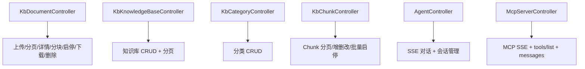

---

## 19. Service 主方法逐段解释

这一节不逐行抄代码，而是把关键服务方法“输入是什么、会改什么状态、会调用谁、失败怎么走”讲清楚。

### 19.1 `DocumentUploadService.upload(...)`

这是上传主入口，职责非常集中。

输入：

1. 当前用户 `UserContext`
2. 上传元数据 `KbDocumentUploadRequest`
3. 文件 `MultipartFile`

主要步骤：

1. 校验文件非空
2. 校验来源类型，目前 `URL` 上传不开放
3. 校验调度配置与权限类型
4. 校验分类存在
5. 如果指定 `kbId`，校验知识库存在
6. 规范化 `processMode`、`chunkStrategy`、`chunkConfig`
7. 先插入 `kb_document`，状态写 `PENDING`
8. 再调用 `FileStorageService.store(...)` 落盘
9. 用 `TikaDocumentParser.detectMime(...)` 探测 MIME
10. 更新文档 `fileUrl` 和 `fileType`
11. 写入授权行

失败处理：

1. 捕获异常后通过 `markUploadFailed(...)` 回写 `FAILED`

### 19.2 `DocumentChunkingService.startChunk(...)`

这是“提交异步分块”的入口，不是实际分块本体。

它的职责非常明确：

1. 查文档是否存在
2. 只允许 `PENDING/FAILED`
3. CAS 把状态切成 `RUNNING`
4. 发布 `DocumentChunkRequestedEvent`

所以它更像“任务投递器”。

### 19.3 `DocumentChunkingService.runChunkTask(...)`

这是最值得反复看的方法之一。

它的主步骤：

1. 初始化 chunk log
2. 解析 `ProcessMode`
3. 如果是 `PIPELINE`，当前直接报错，因为还没接入
4. 读取本地文件流
5. 调 `TikaDocumentParser.extractWithMetadata(...)`
6. 根据 `chunkStrategy` 找到具体 `ChunkingStrategy`
7. 用 `ChunkingOptions` 生成分块参数
8. 执行分块，得到 `List<TextChunk>`
9. 判断是否要向量化
10. 如需向量化则批量 embedding
11. 为每个 chunk 生成主键、组装 `VectorDocChunk`
12. 调 `persistChunksAndVectorsAtomically(...)`
13. 更新分块日志为成功
14. 一旦任一步异常，则：
    - 记录异常
    - `markChunkFailed(...)`
    - 更新分块日志为失败

### 19.4 `KbChunkServiceImpl.create(...)`

这个方法代表“人工维护 chunk”的典型动作。

它的主要逻辑：

1. 加载文档
2. 校验读写权限
3. 校验文档不在 `RUNNING`
4. 校验内容非空
5. 决定 `chunkIndex`
6. 组装 `KbDocumentChunk`
7. 调 `vectorSyncService.syncChunk(...)`
8. 插入 chunk
9. 回写文档 `chunkCount`

这个顺序说明：当前手工新增 chunk 默认希望它立即进入检索体系。

### 19.5 `KbChunkServiceImpl.update(...)`

更新 chunk 时：

1. 先校验文档与 chunk 关系
2. 再校验内容变化
3. 更新 hash、charCount、tokenCount
4. 调 `vectorSyncService.updateChunk(...)`
5. 更新数据库

也就是说，chunk 文本更新和向量更新是联动的。

### 19.6 `KbKnowledgeBaseServiceImpl.create(...)`

知识库创建的关键点不在插表，而在“Milvus collection 同步创建”。

主要逻辑：

1. 校验知识库名非空
2. 校验 collection 名非空且符合正则
3. 校验知识库名不重复
4. 校验 collection 名不重复
5. 插入 `kb_knowledge_base`
6. 调 `milvusCollectionHelper.ensureCollectionLoaded(collection)`

这意味着知识库不是纯逻辑概念，它和 Milvus collection 是显式绑定关系。

### 19.7 Service 流程图

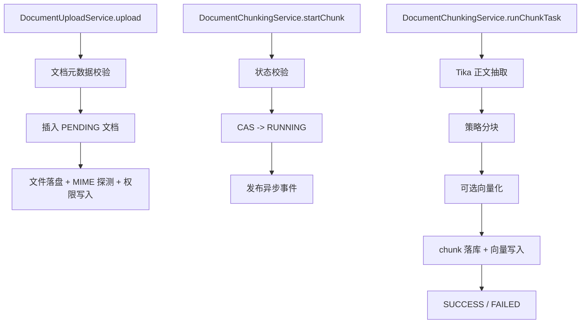

---

## 20. Tool 逐个解释

当前知识服务的 Agent Tool 数量不算多，但每个 Tool 都对应一类明确的检索意图。

### 20.1 `SearchDocumentsTool`

作用：

1. 根据 `keyword` 在文档标题中模糊匹配
2. 只返回当前用户有权看到的文档

调用链：

1. `SearchDocumentsTool.execute(...)`
2. `KbDocumentServiceImpl.searchDocuments(...)`

输出字段：

1. `id`
2. `title`
3. `status`
4. `fileType`
5. `summary`
6. `createdAt`

适合的用户问题：

1. “帮我找一下采购流程文档”
2. “有没有关于报销的资料”

### 20.2 `ListDocumentsTool`

作用：

1. 罗列当前用户可见的文档
2. 更适合“给我看看最近有哪些文档”这一类请求

它本质上比 `SearchDocumentsTool` 更偏列表展示，而不是关键词检索。

### 20.3 `GetDocumentDetailTool`

作用：

1. 根据 `documentId` 获取单文档详情
2. 会走 `kbDocumentService.getVisible(...)` 做权限校验

输出字段更完整，通常包括：

1. `id`
2. `title`
3. `status`
4. `fileType`
5. `fileName`
6. `fileSize`
7. `summary`
8. `tags`
9. `permissionType`
10. `chunkCount`
11. `createdAt`
12. `updatedAt`

### 20.4 `ListKnowledgeBasesTool`

作用：

1. 列出当前用户可见知识库
2. 适合 Agent 先摸清知识空间，再决定后续搜哪一类内容

### 20.5 `RagQaTool`

这是当前最像“知识问答核心”的 Tool。

主流程：

1. 接收 `question`
2. 调 `vectorSyncService.searchSimilar(question, topK * 3, contextDoc)`
3. 拿到 `SearchResult`
4. 查回文档信息
5. 过滤已删除和不可见文档
6. 按文档聚合命中的 chunk
7. 返回文档信息与 `matchedChunks`

输出的结构重点在：

1. 文档级信息
2. 命中的 chunk 片段
3. 每个 chunk 的 `score`

这意味着 `RagQaTool` 现在提供的是“检索结果与证据片段”，而不是在 Tool 内部直接拼装最终自然语言答案。

### 20.6 Tool 关系图

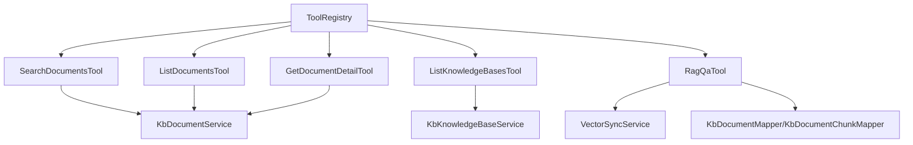
