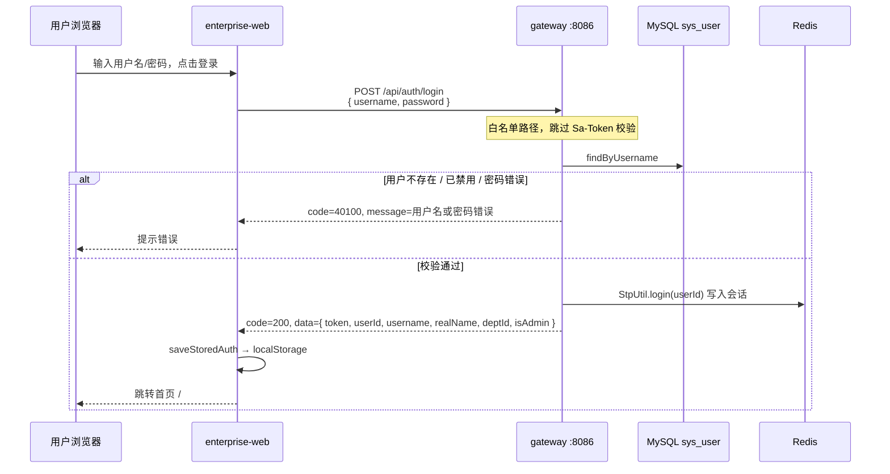

# 登录与认证流程说明

> **版本**：v1.0 · **更新日期**：2026-05-27  
> 基于当前源码整理。认证方案为 **Sa-Token + Redis 会话**（已从早期 JWT 方案迁移）。

---

## 1. 总览

平台采用 **网关集中认证** 架构：

| 角色 | 组件 | 端口 | 职责 |
|------|------|:----:|------|
| 前端 | `enterprise-web` | 5173 | 登录页、本地 Token 存储、路由守卫 |
| 网关 | `enterprise-gateway-service` | **8086** | 登录/登出、Sa-Token 校验、RBAC、身份头注入、路由转发 |
| 下游 | knowledge / collaboration / workbench | 8081–8084 | **不校验 Token**，只信任网关注入的 `X-*` 请求头 |

```text
┌──────────────┐  POST /api/auth/login   ┌─────────────────────────┐
│ enterprise-  │ ───────────────────────►│ enterprise-gateway      │
│ web :5173    │  Authorization: <token> │ :8086                   │
└──────────────┘                         │  · Sa-Token 校验        │
       │                                 │  · RBAC (admin)         │
       │  /api/kb/** 等                  │  · 注入 X-User-Id 等    │
       └────────────────────────────────►└───────────┬─────────────┘
                                                     │ lb:// 转发
                                                     ▼
                                          knowledge / collaboration / workbench
```

> **注意**：协作服务（`enterprise-collaboration-service`）另有独立的 `/api/auth/login` 与用户表，供 WebSocket 或直接访问 `:8082` 时使用。**前端主流程登录走的是网关**，两者账号体系互不通用。

---

## 2. 认证技术栈

| 项 | 值 |
|---|---|
| 框架 | [Sa-Token](https://sa-token.cc/) `1.43.0`（`sa-token-reactor-spring-boot3-starter`） |
| 会话存储 | Redis（`sa-token-redis-jackson` + `spring.data.redis`） |
| Token 请求头名 | `Authorization`（**不带** `Bearer` 前缀，值为 UUID 字符串） |
| Token 有效期 | `2592000` 秒（30 天） |
| 多端登录 | `is-concurrent: true`（允许同一账号多设备同时在线） |
| 同端复用 | `is-share: false`（每次登录生成新 Token） |
| 密码算法 | BCrypt（`BCryptPasswordEncoder`） |
| 用户数据 | MySQL `enterprise_gateway.sys_user` + RBAC 关联表 |

---

## 3. 登录流程（端到端）

### 3.1 时序图



### 3.2 网关登录接口

**路径**：`POST /api/auth/login`  
**白名单**：是（无需 Token）  
**实现**：`AuthController.login()`

**请求体**：

```json
{
  "username": "admin",
  "password": "your-password"
}
```

**成功响应**（`code=200`）：

```json
{
  "code": 200,
  "message": "success",
  "data": {
    "token": "a1b2c3d4-....",
    "userId": 1,
    "username": "admin",
    "realName": "管理员",
    "deptId": 10,
    "isAdmin": true
  },
  "traceId": "..."
}
```

**校验逻辑**：

1. 按 `username` 查 `sys_user`；不存在或 `enabled=false` → 401
2. `BCryptPasswordEncoder.matches()` 比对密码；失败 → 401（统一提示「用户名或密码错误」，不泄露具体原因）
3. `StpUtil.login(user.getId())` 创建 Sa-Token 会话
4. `isAdmin`：用户角色集合中是否存在 `code` 为 `admin`（不区分大小写）的角色

### 3.3 前端处理

**登录页**：`enterprise-web/src/pages/Login.vue`

1. `fetch('/api/auth/login', ...)` 提交表单
2. 成功后调用 `saveStoredAuth()`，写入：
   - `localStorage.token` — Token 字符串
   - `localStorage.user` — JSON（含 `id`、`username`、`realName`、`isAdmin`、`departmentId`、`token`）
3. `router.push('/')` 进入主布局

**应用启动**：`main.js` 在挂载前调用 `checkAuth()`

1. 读取本地 Token
2. 请求 `GET /api/auth/profile`（带 `Authorization` 头）刷新用户信息
3. 失败则 `forceLogout()` 清本地态并跳转 `/login`

**路由守卫**：`router/index.js`

| 条件 | 行为 |
|------|------|
| `meta.requiresAuth` 且无 `localStorage.user` | 重定向 `/login` |
| `meta.requiresAdmin` 且 `isAdmin=false` | 重定向 `/` |
| 已登录访问 `/login` | 重定向 `/` |

---

## 4. 已登录请求的鉴权链路

### 4.1 网关过滤器顺序

请求进入 `:8086` 后，按大致顺序执行：

| 顺序 | 组件 | 作用 |
|:----:|------|------|
| 1 | `GatewayTraceIdFilter` | 生成/透传 `X-Trace-Id`，写入 MDC |
| 2 | `IpAccessGlobalFilter` (Order=-100) | IP 黑白名单（默认均空 = 不限制） |
| 3 | `SimpleRateLimitGlobalFilter` (Order=-90) | 按 IP 固定窗口限流（默认 120 次/60 秒） |
| 4 | **`SaReactorFilter`** | **核心鉴权**：`StpUtil.checkLogin()`；`/api/system/**` 额外 `checkRole("admin")` |
| 5 | Spring Cloud Gateway 路由 | 匹配 `Path` 规则，`lb://` 转发 |
| 6 | `IdentityPropagationGlobalFilter` (Order=200) | 已登录时注入身份头，**移除** `Authorization` |
| 7 | `UserContextCleanupGlobalFilter` | 请求结束清理 ThreadLocal |

### 4.2 Sa-Token 鉴权规则

**配置类**：`SaTokenConfig`

```yaml
# 白名单（无需登录）
app.security.whitelist.paths:
  - /api/system/health
  - /api/auth/login
  - /actuator/health
  - /actuator/info
```

**规则**：

- 除白名单外，所有路径：`StpUtil.checkLogin()`
- `/api/system/**`：额外要求 Sa-Token 角色 `admin`（数据来自 `SaTokenStpInterfaceImpl` → `sys_user_role` → `sys_role.code`）
- 鉴权失败返回 JSON：`code=40100`（未登录）或 `40300`（无 admin 角色）

**Token 传递方式**：请求头

```http
Authorization: a1b2c3d4-e5f6-7890-abcd-ef1234567890
```

前端 `getAuthHeaders()` 同时附带 `X-User-Id` 等头；**经网关转发时，这些头会被网关根据会话重新覆盖**，下游应以网关注入的值为准。

### 4.3 身份透传到下游

**实现**：`IdentityPropagationGlobalFilter`

已登录请求转发前：

| 请求头 | 来源 | 说明 |
|--------|------|------|
| `X-User-Id` | `StpUtil.getLoginIdAsString()` | 当前登录用户 ID |
| `X-Department-Id` | `sys_user.dept_id` | 有部门时注入 |
| `X-Is-Admin` | 角色是否含 `admin` | `true` / `false` |
| `Authorization` | — | **被移除**，避免下游重复验 Token |

### 4.4 下游服务如何使用身份

**实现**：`UserContextInterceptor`（knowledge-ai 等 Servlet 服务）

- 除 `/actuator/**` 外，**必须**有 `X-User-Id`，否则抛 `BizException(UNAUTHORIZED)` → `40100`
- 解析为 `UserContextHolder`：`userId`、`departmentId`、`projectId`（可选）、`admin`
- 业务层通过 `UserContextHolder.get()` 做文档权限、操作审计等

**下游不验证 Sa-Token**；安全边界在网关。直连下游端口时，只要伪造 `X-User-Id` 即可冒充用户——**生产环境应禁止外网直连下游**。

---

## 5. 登出流程

### 5.1 接口

**路径**：`POST /api/auth/logout`  
**需要登录**：是

网关：`StpUtil.logout()` 销毁当前 Token 对应会话（Redis 中删除）。

### 5.2 前端

`logout()`（`api/index.js`）：

1. 带 `Authorization` 调用 `POST /api/auth/logout`
2. 清除 `localStorage.token` / `localStorage.user`
3. 跳转 `/login`

### 5.3 被动登出（Token 失效）

axios / fetch 拦截器检测：

- HTTP 401，或
- 响应体 `code === 40100`

→ 调用 `forceLogout('登录已过期，请重新登录')`

---

## 6. 当前用户资料

**路径**：`GET /api/auth/profile`  
**需要登录**：是

返回与登录响应类似的用户信息（不含 `token`），用于应用启动时刷新本地缓存。

---

## 7. RBAC 数据模型（网关库）

```text
sys_user ──M:N──► sys_user_role ──► sys_role ──M:N──► sys_role_permission ──► sys_permission
    │
    └── dept_id ──► sys_dept
```

| 概念 | 存储 | Sa-Token 用法 |
|------|------|---------------|
| 登录主体 | `sys_user.id` | `StpUtil.login(userId)` 的 loginId |
| 角色 | `sys_role.code`（如 `admin`） | `StpUtil.checkRole("admin")` |
| 权限码 | `sys_permission.code` | `StpUtil.checkPermission(...)`（当前网关仅用了 admin 角色） |
| 管理员标识 | 角色 code = `admin` | 登录响应 `isAdmin` + 头 `X-Is-Admin` |

用户由管理员在 **`/api/system/users`**（SystemAdminController）创建，**无自助注册**（登录页文案：「账号由管理员创建」）。

---

## 8. 网关路由与登录 API 归属

`/api/auth/*` **不转发**，由网关本地 `AuthController` 处理。

| 路由 ID | Path 前缀 | 下游服务 |
|---------|-----------|----------|
| knowledge-ai | `/api/kb/**`, `/api/ai-qa/**` | enterprise-knowledge-ai-service |
| collaboration | `/api/meetings/**`, `/api/chat/**`, … | enterprise-collaboration-service |
| workbench | `/api/workbench/**` | enterprise-workbench-service |

`/api/system/**` 也在网关本地处理（需 admin 角色）。

---

## 9. 本地开发代理说明

`enterprise-web/vite.config.js`：

```javascript
proxy: {
  '/api/workbench': 'http://localhost:8084',
  '/api/kb':          'http://localhost:8083',  // 直连 knowledge，绕过网关鉴权
  '/api/auth':        'http://localhost:8086',
  '/api':             'http://localhost:8086',
}
```

| 路径 | 实际到达 | 鉴权行为 |
|------|----------|----------|
| `/api/auth/*` | 网关 :8086 | 正常 Sa-Token 流程 |
| `/api/system/*`、会议/聊天等 | 网关 :8086 | 正常 Sa-Token 流程 |
| `/api/kb/*` | **直连** knowledge :8083 | **不经过网关**；knowledge 只检查 `X-User-Id` 请求头 |

本地调试知识库 API 时，前端会把 `localStorage` 里的 `X-User-Id` 直接带给 knowledge 服务。联调完整鉴权链时，应改为经 `:8086` 转发，或统一走网关入口。

---

## 10. 错误码速查

| code | 含义 | 典型场景 |
|:----:|------|----------|
| 200 | 成功 | 登录、profile、业务正常 |
| 40100 | 未登录或登录已过期 | Token 缺失/无效、下游缺 `X-User-Id` |
| 40300 | 无权限 | 非 admin 访问 `/api/system/**`、IP 黑白名单拦截 |
| 42900 | 请求过于频繁 | 网关限流 |
| 40000 | 参数无效 | 校验失败 |

登录失败（用户名/密码错误）也返回 **40100**，message 为「用户名或密码错误」。

---

## 11. 关键源码索引

| 模块 | 文件 | 职责 |
|------|------|------|
| 网关 | `web/AuthController.java` | login / logout / profile |
| 网关 | `config/SaTokenConfig.java` | 全局鉴权过滤器 |
| 网关 | `config/SaTokenStpInterfaceImpl.java` | 角色/权限列表 |
| 网关 | `filter/IdentityPropagationGlobalFilter.java` | 身份头注入 |
| 网关 | `resources/application.yml` | sa-token、白名单、限流 |
| 前端 | `pages/Login.vue` | 登录 UI |
| 前端 | `api/index.js` | Token 存取、checkAuth、logout、请求头 |
| 前端 | `router/index.js` | 路由守卫 |
| 下游 | `knowledge/.../UserContextInterceptor.java` | 解析 `X-*` 头 |

---

## 12. 与旧文档的差异

`docs/gateway-service-code-analysis.md`（v3.0）仍描述 **JWT + 黑名单** 方案。当前代码已改为 **Sa-Token + Redis**：

- 已移除：`JwtUtil`、`JwtAuthenticationWebFilter`、`TokenBlacklistService`、`SecurityConfig`
- 新增：`SaTokenConfig`、`SaTokenStpInterfaceImpl`
- 退出登录：由 JWT 黑名单改为 `StpUtil.logout()` 销毁 Redis 会话

以 **本文 + 当前源码** 为准。

---

## 13. 快速验证清单

```bash
# 1. 启动 Redis、MySQL、网关
mvn spring-boot:run -pl enterprise-gateway-service

# 2. 登录
curl -s -X POST http://localhost:8086/api/auth/login \
  -H 'Content-Type: application/json' \
  -d '{"username":"admin","password":"<密码>"}' | jq .

# 3. 带 Token 访问 profile（将 TOKEN 替换为上一步返回值）
curl -s http://localhost:8086/api/auth/profile \
  -H "Authorization: <TOKEN>" | jq .

# 4. 访问受保护 API（经网关）
curl -s "http://localhost:8086/api/system/users?current=1&size=10" \
  -H "Authorization: <TOKEN>" | jq .

# 5. 登出
curl -s -X POST http://localhost:8086/api/auth/logout \
  -H "Authorization: <TOKEN>" | jq .
```
