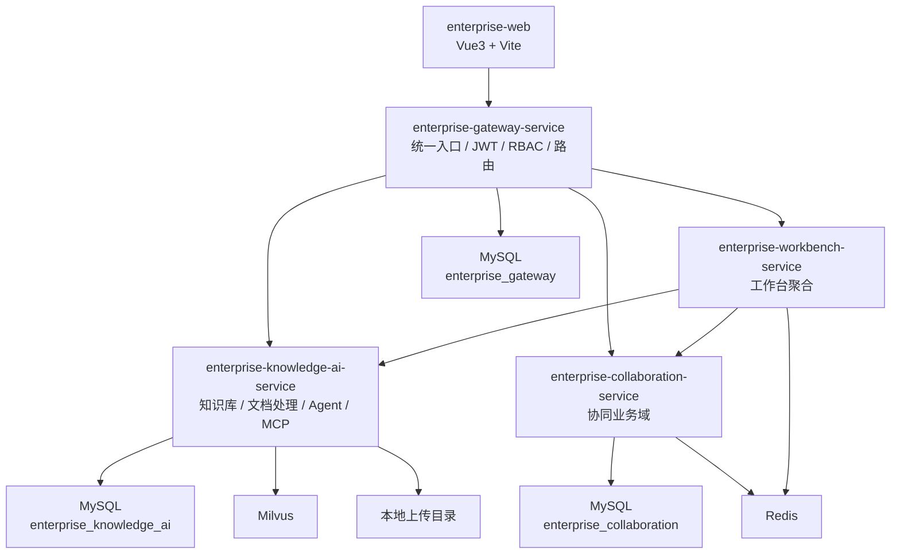

# EnterpriseKnowledgeWorkspace 项目总结与代码地图

本文基于当前仓库代码整理，目标不是逐行解释，而是帮助开发者快速建立对系统边界、模块职责、关键流程、真实落地状态和主要代码入口的整体认知。

---

## 1. 项目定位

这是一个面向企业内部的智能协同办公平台，后端采用 Maven 多模块微服务结构，前端为独立的 Vue 3 工程 `enterprise-web`。

当前仓库的重点不只是“知识库”，而是以下 5 个部分共同组成的平台：

| 模块 | 当前定位 | 技术关键词 |
|------|----------|-----------|
| `frameworks` | 公共基础库 | `Result`、`BizException`、`TraceIdFilter`、全局异常 |
| `enterprise-gateway-service` | 统一入口与安全边界 | Spring Cloud Gateway、WebFlux、JWT、RBAC、JPA |
| `enterprise-knowledge-ai-service` | 知识库、文档处理、向量检索、Agent | MyBatis-Plus、Tika、Milvus、DeepSeek、MCP |
| `enterprise-collaboration-service` | 协同业务域 | 认证、会议、待办、任务、审批、公告、聊天、文档 |
| `enterprise-workbench-service` | 工作台聚合 | 聚合协同与知识服务数据、Redis 缓存 |

前端 `enterprise-web` 不在根 `pom.xml` 的聚合模块里，但已经和上述服务形成实际联调关系。

---

## 2. 仓库结构

```text
EnterpriseKnowledgeWorkspace
├── frameworks
│   ├── common
│   └── web
├── enterprise-gateway-service
├── enterprise-knowledge-ai-service
├── enterprise-collaboration-service
├── enterprise-workbench-service
├── enterprise-web
└── docs
```

### 2.1 根 POM 聚合关系

根 `pom.xml` 当前聚合了以下模块：

1. `frameworks`
2. `enterprise-gateway-service`
3. `enterprise-knowledge-ai-service`
4. `enterprise-workbench-service`
5. `enterprise-collaboration-service`

`enterprise-web` 是单独的前端工程，不参与 Maven 聚合。

---

## 3. 真实运行形态

### 3.1 服务职责图



### 3.2 当前配置中已体现的端口

| 模块 | 当前配置端口 | 说明 |
|------|-------------|------|
| `enterprise-gateway-service` | `8086` | 统一入口 |
| `enterprise-knowledge-ai-service` | `8083` | 当前 `application.yml` 如此配置 |
| `enterprise-collaboration-service` | `8090` | 协同服务 |
| `enterprise-workbench-service` | `8084` | 工作台聚合 |

### 3.3 当前代码里存在的联调风险

当前仓库有一处明显的“文档/配置不同步”：

1. `enterprise-knowledge-ai-service` 的配置端口是 `8083`
2. `enterprise-gateway-service` 的路由把知识服务指向 `http://localhost:8081`
3. `enterprise-workbench-service` 的 `knowledge.service.url` 指向 `http://localhost:8083`

这意味着：

- 工作台默认会打到 `8083`
- 网关默认会把 `/api/kb/**` 转发到 `8081`
- 如果没有统一端口，前后端联调很容易出现“直连能通、走网关不通”的情况

这不是文档问题，而是当前代码现状，后续联调时应优先统一。

---

## 4. 各模块现状总结

### 4.1 `frameworks`

这是整个仓库的公共基建层，主要解决统一响应、统一异常、统一 traceId。

关键文件：

| 文件 | 作用 |
|------|------|
| `frameworks/common/.../Result.java` | 统一返回结构 |
| `frameworks/common/.../Results.java` | 成功/失败工厂方法 |
| `frameworks/common/.../BizException.java` | 业务异常 |
| `frameworks/common/.../ErrorCode.java` | 错误码枚举 |
| `frameworks/web/.../GlobalExceptionHandler.java` | 全局异常转 `Result` |
| `frameworks/web/.../TraceIdFilter.java` | 请求 traceId 注入与透传 |

业务服务普遍依赖 `frameworks-web-spring-boot-starter`，从而间接得到 common 能力。

### 4.2 `enterprise-gateway-service`

这是平台的统一入口，同时承载系统管理与认证职责，不只是纯网关。

主要职责：

1. JWT 登录、鉴权、黑名单处理
2. RBAC 权限管理
3. 用户、角色、部门、权限管理
4. 路由转发
5. IP 黑白名单
6. 基础限流
7. 操作日志

关键代码入口：

| 文件 | 作用 |
|------|------|
| `GatewaySpringbootStarter.java` | 启动类 |
| `filter/JwtAuthenticationWebFilter.java` | JWT 认证过滤器 |
| `filter/IpAccessGlobalFilter.java` | IP 访问控制 |
| `filter/SimpleRateLimitGlobalFilter.java` | 固定窗口限流 |
| `security/SecurityConfig.java` | Security 过滤链配置 |
| `web/AuthController.java` | 登录/退出 |
| `web/SystemAdminController.java` | 管理后台接口 |

技术上它和知识服务不同：这里使用的是 `JPA/Hibernate`，而不是 MyBatis-Plus。

### 4.3 `enterprise-knowledge-ai-service`

这是当前完成度最高、最具产品感的服务。

它已经不是单纯的“文档上传服务”，而是 4 类能力叠加：

1. 知识库管理
2. 文档解析与分块
3. 向量写入与向量检索
4. Agent / RAG / MCP 工具服务

核心链路如下：


同时，这个服务还暴露了：

1. `AgentController` 提供 SSE 对话接口
2. `ToolRegistry + McpTool` 提供内部工具体系
3. `McpServerController` 提供 MCP 协议入口
4. `RagQaTool` 提供基于 Milvus 的知识问答检索

### 4.4 `enterprise-collaboration-service`

这部分和旧文档中“骨架服务”的说法已经不一致了。

当前代码里，它已经落地了多个业务域：

1. 登录注册与 JWT
2. 即时通讯与会话
3. WebSocket 聊天
4. 通讯录
5. 公告
6. 会议预约
7. 待办事项
8. 任务协同与评论
9. OA 审批
10. 协同文档

它不是一个简单 demo，而是一个“多个轻量业务模块共存”的服务。

### 4.5 `enterprise-workbench-service`

工作台服务目前不是复杂业务域，更像一个“聚合适配层”。

它主要做两类事情：

1. 从协同服务拉会议、任务、待办、审批等数据
2. 从知识服务拉最近文档、文档总数

然后对外提供：

1. `/api/workbench/overview`
2. `/api/workbench/stats`

这部分当前实现比较轻，核心在 [WorkbenchController.java](/Users/zjl/projectByZhangjilin/EnterpriseKnowledgeWorkspace/enterprise-workbench-service/src/main/java/com/zjl/workbench/web/WorkbenchController.java)。

---

## 5. 当前知识服务的关键流程

### 5.1 上传与分块闭环

关键文件：

| 文件 | 角色 |
|------|------|
| `web/KbDocumentController.java` | 接口入口 |
| `service/impl/KbDocumentServiceImpl.java` | 文档门面服务 |
| `service/impl/DocumentUploadService.java` | 上传落盘与入库 |
| `service/impl/DocumentChunkingService.java` | 分块核心执行器 |
| `event/DocumentChunkEventListener.java` | 事务后异步触发 |
| `service/VectorSyncService.java` | 向量同步门面 |

实际流程：

1. 上传接口写 `kb_document`，状态设为 `PENDING`
2. 保存文件到本地目录
3. 根据权限模型写 `kb_document_permission`
4. 用户调用 `start-chunk`
5. 服务把状态 CAS 更新到 `RUNNING`
6. 事务提交后发布 `DocumentChunkRequestedEvent`
7. 监听器异步执行正文抽取、分块、向量生成、Chunk 持久化
8. 最终回写 `SUCCESS` 或 `FAILED`

### 5.2 Agent 与 RAG

关键文件：

| 文件 | 角色 |
|------|------|
| `agent/AgentController.java` | SSE 会话入口 |
| `agent/AgentLoop.java` | LLM 调用与 tool loop |
| `agent/llm/SpringAiLlmClient.java` | 当前 `deepseek` provider 的默认实现 |
| `agent/llm/DeepSeekLlmClient.java` | legacy 实现 |
| `agent/mcp/ToolRegistry.java` | 工具注册表 |
| `agent/tool/RagQaTool.java` | 向量问答工具 |
| `agent/tool/SearchDocumentsTool.java` | 文档搜索工具 |
| `agent/tool/GetDocumentDetailTool.java` | 文档详情工具 |

当前 Agent 设计特点：

1. 服务端自己维护对话循环
2. LLM 只负责生成文本和 tool call
3. 真正的工具执行在服务端完成
4. 工具结果再回填给模型继续推理

这意味着它更接近“内置工具型 Agent”，而不是简单聊天接口。

### 5.3 MCP 支持

当前知识服务已经实现一个轻量 MCP Server：

1. `GET /mcp/sse`
2. `POST /mcp/tools/list`
3. `POST /mcp/messages`

它的作用不是给浏览器页面直接用，而是让外部 Agent/LLM 客户端以 MCP 协议接入当前知识服务工具集。

---

## 6. 当前协同服务的关键流程

### 6.1 认证

关键文件：

| 文件 | 作用 |
|------|------|
| `web/AuthController.java` | 登录/注册/注销接口 |
| `service/impl/UserLoginServiceImpl.java` | 登录业务实现 |
| `web/JwtAuthFilter.java` | 请求 JWT 解析 |
| `util/JwtUtil.java` | Token 生成与校验 |

这套认证是“协同服务自带的一套轻量 JWT 机制”，和网关侧 JWT 并不完全是同一套实现。

### 6.2 聊天

关键文件：

| 文件 | 作用 |
|------|------|
| `web/ChatController.java` | 会话、消息、成员查询 |
| `web/ChatWebSocketHandler.java` | WebSocket 实时通信 |
| `entity/ImConversation*.java` | 会话与成员 |
| `entity/ImMessage.java` | 消息实体 |

### 6.3 协同业务面

当前已有 Controller：

1. `MeetingController`
2. `TodoController`
3. `TaskController`
4. `ApprovalController`
5. `AnnouncementController`
6. `ContactController`
7. `DocController`

所以从代码现状看，它已经承担了“协同业务中台”的角色。

---

## 7. 文档阅读顺序建议

如果是第一次接这个仓库，建议按下面顺序看：

1. `docs/AGENTS.md`
2. 本文 `docs/project-summary-and-code-tree.md`
3. `docs/step3-summary.md`
4. `docs/knowledge-service-code-analysis.md`
5. `docs/collaboration-service-code-analysis.md`
6. `docs/api.md`
7. `docs/database.md`

如果你只关心知识库和 Agent：

1. `docs/step3-summary.md`
2. `docs/knowledge-service-code-analysis.md`
3. `enterprise-knowledge-ai-service/src/main/java/com/zjl/knowledge/service/impl/KbDocumentServiceImpl.java`
4. `enterprise-knowledge-ai-service/src/main/java/com/zjl/knowledge/service/impl/DocumentChunkingService.java`
5. `enterprise-knowledge-ai-service/src/main/java/com/zjl/knowledge/agent/AgentLoop.java`

---

## 8. 当前代码现状判断

### 8.1 已比较成熟的部分

1. 知识库文档处理主链路
2. 文档权限与可见性控制
3. Chunk CRUD 与向量同步
4. 基础 Agent / RAG / MCP 框架
5. 协同服务中的会议、任务、待办、审批、聊天基础接口

### 8.2 还需要继续收敛的部分

1. 各服务端口与网关路由统一
2. Milvus 不可用场景的启动与降级策略
3. 协同服务与网关安全模型统一
4. 工作台聚合调用当前没有显式透传请求头
5. 配置中的敏感信息外置化

### 8.3 用一句话概括

这个仓库已经不是“一个知识库 demo”，而是一个以知识服务为核心、协同服务为业务面、网关为统一入口、工作台为聚合层的企业内部智能协同平台雏形。
