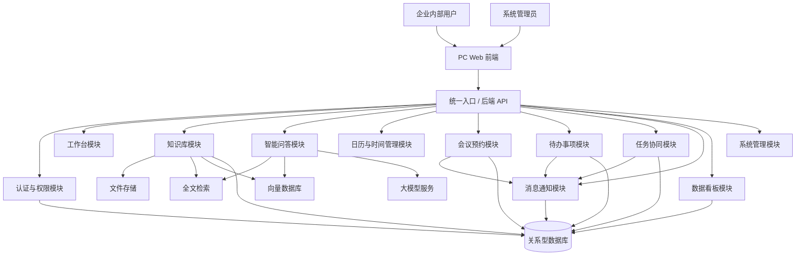
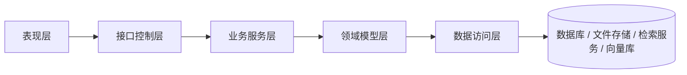
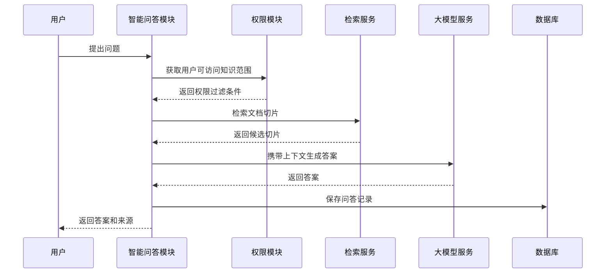
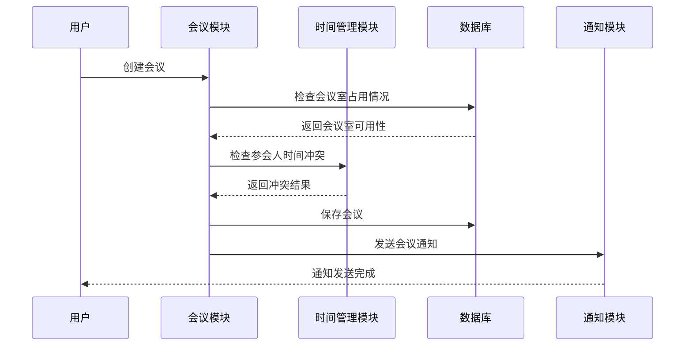

# SDD 软件设计文档

## 1. 系统总体架构

## 2. 分层架构

## 3. 核心模块设计

### 3.1 认证与权限模块

职责：

1. 登录。
2. 退出。
3. Token 校验。
4. 获取用户信息。
5. 角色权限管理。
6. 数据权限控制。

### 3.2 知识库模块

职责：

1. 知识分类管理。
2. **逻辑知识库**管理（绑定 Milvus `collection_name`、可选嵌入模型）。
3. 文档上传与元数据（可选 `kb_id`）；**Tika** 解析与 **异步分块**（`PENDING`/`RUNNING`/`SUCCESS`/`FAILED`）。
4. 文档权限控制（列表 SQL + 详情校验）。
5. 文档版本管理（规划能力，以库表与实现为准）。
6. 文档标题搜索等轻量检索（全文检索属扩展能力）。
7. **多切片**生成与维护、**Milvus** 向量同步（插入 / Upsert / 按文档或主键删除）。
8. **分块任务日志**查询。

> 接口与表结构见 **`docs/api.md`**、**`docs/database.md`**；实现总览见 **`docs/step3-summary.md`**。

### 3.3 智能问答模块

职责：

1. 接收用户问题。
2. 检索用户有权限访问的文档切片。
3. 生成有来源依据的答案。
4. 返回答案和引用来源。
5. 收集用户反馈。

### 3.4 会议预约模块

职责：

1. 会议室管理。
2. 会议预约。
3. 会议室冲突检测。
4. 参会人冲突检测。
5. 会议修改。
6. 会议取消。
7. 会议纪要。

### 3.5 待办事项模块

职责：

1. 个人待办管理。
2. 截止时间管理。
3. 提醒时间管理。
4. 优先级管理。
5. 完成状态管理。

### 3.6 任务协同模块

职责：

1. 任务创建。
2. 任务分配。
3. 状态流转。
4. 评论。
5. 结果提交。
6. 完成确认。

### 3.7 消息通知模块

职责：

1. 站内通知。
2. 未读数量统计。
3. 标记已读。
4. 跳转关联业务页面。

## 4. 关键流程图

### 4.1 智能问答流程

### 4.2 会议预约流程

## 5. 数据设计

完整数据库设计见 database.md。

## 6. 接口设计

完整接口设计见 api.md。

## 7. 安全设计

系统安全要求：

1. 所有业务接口默认需要认证。
2. 采用 RBAC 权限模型。
3. 支持数据权限过滤。
4. 支持文档权限过滤。
5. 智能问答检索必须进行权限过滤。
6. 关键操作必须记录审计日志。
7. 密码不能明文存储。
8. 不允许泄露无权限文档来源。

## 8. 部署设计

完整部署方案见 deployment.md。
