# 企业内部智能协同平台 SDD 文档包

## 文档包说明

本文档包按照软件设计文档 Software Design Document, SDD 的常见规范编写，用于承接前期 Spec / PRD 文档，并进一步细化系统架构、模块设计、数据库设计、接口设计、权限安全、部署方案与运维方案。

本 SDD 文档包适用于以下场景：

1. 项目立项后的技术方案评审。
2. 前后端开发前的系统设计确认。
3. 数据库建模与接口开发依据。
4. 后续测试用例、部署方案、验收标准的编写基础。

**知识库与摄取**：下文若出现旧版文档状态（如仅 `DRAFT`/`PUBLISHED`）或简化表结构，以实现仓库为准；请对照 **`enterprise-knowledge-ai-service/src/main/resources/schema.sql`** 与 **`docs/step3-summary.md`**。

---

# 文档 1：SDD 总体设计说明书

## 1.1 项目名称

企业内部智能协同平台。

## 1.2 系统定位

本系统是面向公司内部员工、部门负责人、项目负责人、管理层和系统管理员的一站式智能协同办公平台。系统围绕知识库、智能问答、时间管理、会议预约、待办事项、任务协同、消息通知和数据看板等核心场景建设，目标是提升企业内部知识复用效率、会议协调效率和任务推进透明度。

## 1.3 设计目标

系统设计需要满足以下目标：

1. 支持公司内部多部门、多角色、多权限的统一使用。
2. 支持知识文档集中管理、智能检索和智能问答。
3. 支持会议室预约、参会人冲突检测和会议通知。
4. 支持个人待办和正式任务协同管理。
5. 支持统一消息通知和操作日志追踪。
6. 支持管理层查看知识、会议、任务等核心协作指标。
7. 支持后续扩展企业微信、钉钉、飞书、OA、HR、邮箱、网盘等系统。

## 1.4 设计原则

### 1.4.1 模块化原则

系统按照业务边界拆分为用户权限、知识库、智能问答、会议管理、时间管理、待办任务、消息通知、数据看板和系统管理等模块。各模块之间通过接口进行交互，降低耦合度。

### 1.4.2 权限优先原则

由于系统涉及公司内部制度、项目资料、会议记录和任务信息，因此所有核心数据访问均需要进行身份认证和权限校验。知识库智能问答也必须基于用户权限范围内的数据生成答案。

### 1.4.3 可扩展原则

系统一期优先实现核心协同能力，但架构上需要预留 AI 能力、第三方系统集成、移动端、更多办公场景扩展的能力。

### 1.4.4 可审计原则

系统关键操作需要记录操作日志，包括文档上传、权限修改、会议创建、任务状态变更、用户登录、角色变更等，便于后续问题追踪和安全审计。

### 1.4.5 智能能力可控原则

智能问答、会议推荐、任务提醒等 AI 能力应遵循“有依据、可追溯、可关闭、可反馈”的原则，避免无依据生成和越权访问。

---

# 文档 2：系统总体架构设计

## 2.1 总体架构说明

系统采用前后端分离架构，前端主要面向 PC Web 端，后端采用分层架构设计。根据项目规模，可以选择单体模块化架构作为一期实现方式，也可以在后续演进为微服务架构。

一期建议采用“模块化单体 + 可拆分边界”的方式建设。这样可以降低初期开发和部署复杂度，同时在代码结构上保持清晰边界，后续如果业务规模扩大，可以将知识库、智能问答、会议管理、消息中心等模块拆分为独立服务。

## 2.2 系统架构图

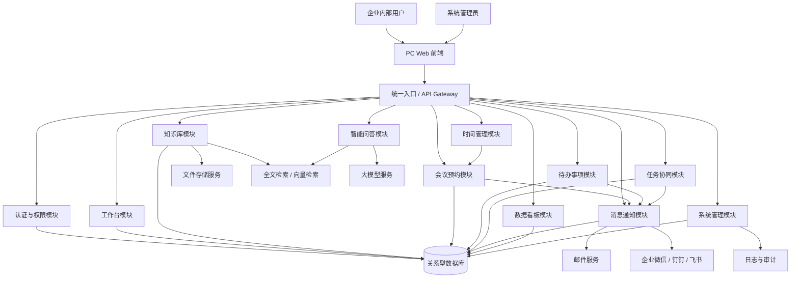

## 2.3 分层架构设计

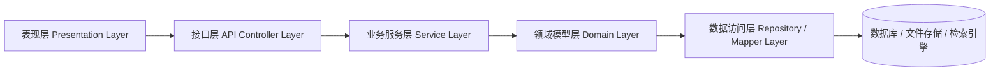

### 2.3.1 表现层

表现层主要由 PC Web 前端组成，负责页面展示、表单交互、数据可视化和用户操作入口。

### 2.3.2 接口层

接口层负责接收前端请求，进行参数校验、身份校验、权限校验和统一响应封装。

### 2.3.3 业务服务层

业务服务层负责核心业务逻辑，如会议冲突检测、任务状态流转、知识文档审核、智能问答流程控制等。

### 2.3.4 领域模型层

领域模型层用于抽象核心业务对象，包括用户、部门、知识文档、会议、待办、任务、消息等。

### 2.3.5 数据访问层

数据访问层负责数据库读写、文件存储访问、检索服务调用和第三方接口访问。

## 2.4 核心模块依赖关系

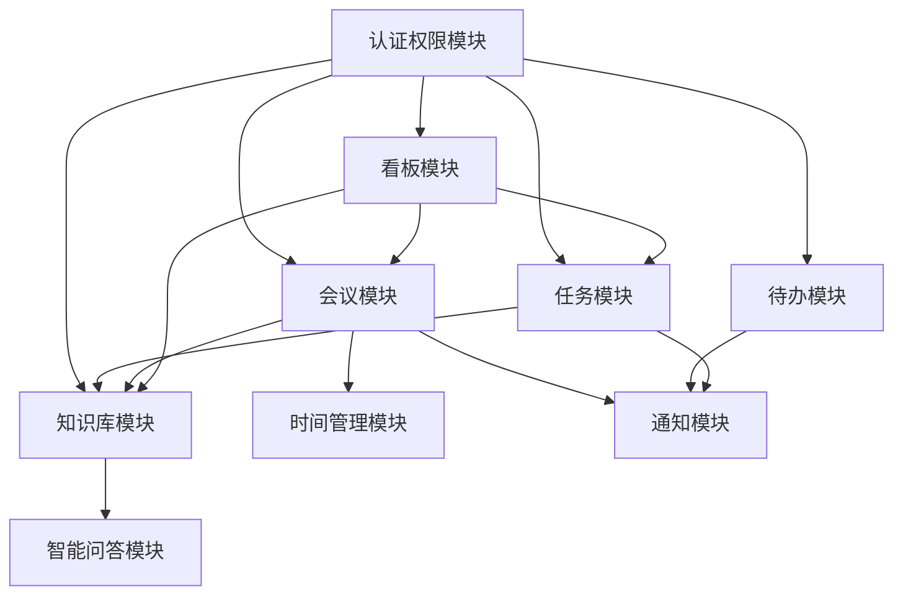

## 2.5 技术架构建议

| 层级    | 推荐技术                        | 说明                   |
| ----- | --------------------------- | -------------------- |
| 前端    | React / Vue                 | 构建 PC Web 管理系统和员工工作台 |
| 后端    | Spring Boot / Spring Cloud  | 提供业务接口和服务治理能力        |
| 数据库   | MySQL / PostgreSQL          | 存储业务数据               |
| 缓存    | Redis                       | 存储登录态、热点数据、消息计数、临时锁  |
| 文件存储  | MinIO / OSS / 企业网盘          | 存储知识文档和附件            |
| 检索服务  | Elasticsearch / OpenSearch  | 支持全文搜索               |
| 向量库   | Milvus / pgvector           | 支持智能问答语义检索           |
| AI 服务 | 私有化大模型 / API 大模型            | 支持问答、摘要、行动项提取        |
| 消息队列  | RabbitMQ / Kafka / RocketMQ | 支持异步通知、文档解析任务        |
| 部署    | Docker / Kubernetes         | 支持容器化部署和弹性扩展         |

## 2.6 一期架构

1. 前端 Web 项目。
2. 后端微服务化，包含网关微服务，RAG知识库微服务，其他业务自成一个微服务。
3. 一个关系型数据库。
4. 一个 Redis。
5. 一个文件存储服务。
6. 一个检索服务。
7. 一个可选向量库。
8. 一个消息队列用于异步任务。

这样可以保证系统快速落地，同时保留后续拆分空间。

---

# 文档 3：数据库设计说明书

## 3.1 数据库设计原则

1. 所有业务主表均使用统一主键 id。
2. 所有核心表保留 created_at、updated_at、created_by、updated_by 字段。
3. 涉及软删除的数据表保留 deleted 字段。
4. 涉及状态流转的数据表使用 status 字段。
5. 涉及权限的数据表需要支持部门、角色、人员三个维度。
6. 涉及 AI 检索的数据需要保留原文、切片、向量索引关联关系。

## 3.2 ER 关系总览图

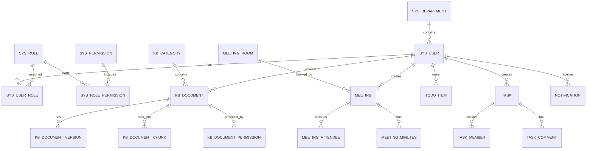

---

## 3.3 系统用户表：sys_user

| 字段名           | 类型           | 是否必填 | 说明         |
| ------------- | ------------ | ---- | ---------- |
| id            | bigint       | 是    | 用户 ID      |
| username      | varchar(64)  | 是    | 登录用户名      |
| password_hash | varchar(255) | 是    | 加密后的密码     |
| real_name     | varchar(64)  | 是    | 真实姓名       |
| email         | varchar(128) | 否    | 邮箱         |
| phone         | varchar(32)  | 否    | 手机号        |
| department_id | bigint       | 否    | 所属部门 ID    |
| position_name | varchar(128) | 否    | 岗位名称       |
| avatar_url    | varchar(512) | 否    | 头像地址       |
| status        | tinyint      | 是    | 状态：1启用，0停用 |
| last_login_at | datetime     | 否    | 最近登录时间     |
| created_at    | datetime     | 是    | 创建时间       |
| updated_at    | datetime     | 是    | 更新时间       |
| deleted       | tinyint      | 是    | 是否删除：0否，1是 |

### 建表 SQL

```sql
CREATE TABLE sys_user (
    id BIGINT PRIMARY KEY,
    username VARCHAR(64) NOT NULL UNIQUE,
    password_hash VARCHAR(255) NOT NULL,
    real_name VARCHAR(64) NOT NULL,
    email VARCHAR(128),
    phone VARCHAR(32),
    department_id BIGINT,
    position_name VARCHAR(128),
    avatar_url VARCHAR(512),
    status TINYINT NOT NULL DEFAULT 1,
    last_login_at DATETIME,
    created_at DATETIME NOT NULL,
    updated_at DATETIME NOT NULL,
    deleted TINYINT NOT NULL DEFAULT 0,
    INDEX idx_department_id (department_id),
    INDEX idx_status (status)
);
```

---

## 3.4 部门表：sys_department

| 字段名             | 类型           | 是否必填 | 说明         |
| --------------- | ------------ | ---- | ---------- |
| id              | bigint       | 是    | 部门 ID      |
| parent_id       | bigint       | 否    | 上级部门 ID    |
| department_name | varchar(128) | 是    | 部门名称       |
| manager_id      | bigint       | 否    | 部门负责人 ID   |
| sort_order      | int          | 否    | 排序         |
| status          | tinyint      | 是    | 状态：1启用，0停用 |
| created_at      | datetime     | 是    | 创建时间       |
| updated_at      | datetime     | 是    | 更新时间       |
| deleted         | tinyint      | 是    | 是否删除       |

```sql
CREATE TABLE sys_department (
    id BIGINT PRIMARY KEY,
    parent_id BIGINT,
    department_name VARCHAR(128) NOT NULL,
    manager_id BIGINT,
    sort_order INT DEFAULT 0,
    status TINYINT NOT NULL DEFAULT 1,
    created_at DATETIME NOT NULL,
    updated_at DATETIME NOT NULL,
    deleted TINYINT NOT NULL DEFAULT 0,
    INDEX idx_parent_id (parent_id),
    INDEX idx_manager_id (manager_id)
);
```

---

## 3.5 角色表：sys_role

| 字段名         | 类型           | 是否必填 | 说明    |
| ----------- | ------------ | ---- | ----- |
| id          | bigint       | 是    | 角色 ID |
| role_code   | varchar(64)  | 是    | 角色编码  |
| role_name   | varchar(128) | 是    | 角色名称  |
| description | varchar(255) | 否    | 角色描述  |
| status      | tinyint      | 是    | 状态    |
| created_at  | datetime     | 是    | 创建时间  |
| updated_at  | datetime     | 是    | 更新时间  |

```sql
CREATE TABLE sys_role (
    id BIGINT PRIMARY KEY,
    role_code VARCHAR(64) NOT NULL UNIQUE,
    role_name VARCHAR(128) NOT NULL,
    description VARCHAR(255),
    status TINYINT NOT NULL DEFAULT 1,
    created_at DATETIME NOT NULL,
    updated_at DATETIME NOT NULL
);
```

---

## 3.6 用户角色关联表：sys_user_role

```sql
CREATE TABLE sys_user_role (
    id BIGINT PRIMARY KEY,
    user_id BIGINT NOT NULL,
    role_id BIGINT NOT NULL,
    created_at DATETIME NOT NULL,
    UNIQUE KEY uk_user_role (user_id, role_id),
    INDEX idx_user_id (user_id),
    INDEX idx_role_id (role_id)
);
```

---

## 3.7 权限表：sys_permission

```sql
CREATE TABLE sys_permission (
    id BIGINT PRIMARY KEY,
    permission_code VARCHAR(128) NOT NULL UNIQUE,
    permission_name VARCHAR(128) NOT NULL,
    permission_type VARCHAR(32) NOT NULL,
    parent_id BIGINT,
    path VARCHAR(255),
    component VARCHAR(255),
    sort_order INT DEFAULT 0,
    status TINYINT NOT NULL DEFAULT 1,
    created_at DATETIME NOT NULL,
    updated_at DATETIME NOT NULL
);
```

## 3.8 角色权限关联表：sys_role_permission

```sql
CREATE TABLE sys_role_permission (
    id BIGINT PRIMARY KEY,
    role_id BIGINT NOT NULL,
    permission_id BIGINT NOT NULL,
    created_at DATETIME NOT NULL,
    UNIQUE KEY uk_role_permission (role_id, permission_id),
    INDEX idx_role_id (role_id),
    INDEX idx_permission_id (permission_id)
);
```

---

## 3.9 知识分类表：kb_category

```sql
CREATE TABLE kb_category (
    id BIGINT PRIMARY KEY,
    parent_id BIGINT,
    category_name VARCHAR(128) NOT NULL,
    category_type VARCHAR(32) NOT NULL,
    department_id BIGINT,
    sort_order INT DEFAULT 0,
    status TINYINT NOT NULL DEFAULT 1,
    created_at DATETIME NOT NULL,
    updated_at DATETIME NOT NULL,
    deleted TINYINT NOT NULL DEFAULT 0,
    INDEX idx_parent_id (parent_id),
    INDEX idx_department_id (department_id)
);
```

---

## 3.10 知识文档表：kb_document

| 字段名             | 类型           | 是否必填 | 说明      |
| --------------- | ------------ | ---- | ------- |
| id              | bigint       | 是    | 文档 ID   |
| title           | varchar(255) | 是    | 文档标题    |
| category_id     | bigint       | 是    | 分类 ID   |
| owner_id        | bigint       | 是    | 上传人 ID  |
| department_id   | bigint       | 否    | 所属部门 ID |
| file_name       | varchar(255) | 是    | 原始文件名   |
| file_url        | varchar(512) | 是    | 文件存储地址  |
| file_type       | varchar(64)  | 否    | 文件类型    |
| file_size       | bigint       | 否    | 文件大小    |
| summary         | text         | 否    | 文档摘要    |
| content_text    | longtext     | 否    | 解析后的正文  |
| tags            | varchar(512) | 否    | 标签      |
| permission_type | varchar(32)  | 是    | 权限类型    |
| status          | varchar(32)  | 是    | 状态      |
| current_version | int          | 是    | 当前版本号   |
| created_at      | datetime     | 是    | 创建时间    |
| updated_at      | datetime     | 是    | 更新时间    |
| deleted         | tinyint      | 是    | 是否删除    |

```sql
CREATE TABLE kb_document (
    id BIGINT PRIMARY KEY,
    title VARCHAR(255) NOT NULL,
    category_id BIGINT NOT NULL,
    owner_id BIGINT NOT NULL,
    department_id BIGINT,
    file_name VARCHAR(255) NOT NULL,
    file_url VARCHAR(512) NOT NULL,
    file_type VARCHAR(64),
    file_size BIGINT,
    summary TEXT,
    content_text LONGTEXT,
    tags VARCHAR(512),
    permission_type VARCHAR(32) NOT NULL DEFAULT 'PRIVATE',
    status VARCHAR(32) NOT NULL DEFAULT 'DRAFT',
    current_version INT NOT NULL DEFAULT 1,
    created_at DATETIME NOT NULL,
    updated_at DATETIME NOT NULL,
    deleted TINYINT NOT NULL DEFAULT 0,
    INDEX idx_category_id (category_id),
    INDEX idx_owner_id (owner_id),
    INDEX idx_department_id (department_id),
    INDEX idx_status (status),
    FULLTEXT INDEX ft_title_content (title, content_text)
);
```

---

## 3.11 知识文档版本表：kb_document_version

```sql
CREATE TABLE kb_document_version (
    id BIGINT PRIMARY KEY,
    document_id BIGINT NOT NULL,
    version_no INT NOT NULL,
    file_name VARCHAR(255) NOT NULL,
    file_url VARCHAR(512) NOT NULL,
    content_text LONGTEXT,
    change_note VARCHAR(512),
    created_by BIGINT NOT NULL,
    created_at DATETIME NOT NULL,
    UNIQUE KEY uk_document_version (document_id, version_no),
    INDEX idx_document_id (document_id)
);
```

---

## 3.12 知识文档切片表：kb_document_chunk

该表用于支持智能问答和语义检索。文档解析后会被切分成多个 chunk，每个 chunk 可以对应向量库中的一条向量记录。

```sql
CREATE TABLE kb_document_chunk (
    id BIGINT PRIMARY KEY,
    document_id BIGINT NOT NULL,
    chunk_index INT NOT NULL,
    chunk_text TEXT NOT NULL,
    token_count INT,
    vector_id VARCHAR(128),
    metadata_json JSON,
    created_at DATETIME NOT NULL,
    updated_at DATETIME NOT NULL,
    INDEX idx_document_id (document_id),
    INDEX idx_vector_id (vector_id)
);
```

---

## 3.13 知识文档权限表：kb_document_permission

```sql
CREATE TABLE kb_document_permission (
    id BIGINT PRIMARY KEY,
    document_id BIGINT NOT NULL,
    permission_target_type VARCHAR(32) NOT NULL,
    permission_target_id BIGINT NOT NULL,
    permission_level VARCHAR(32) NOT NULL DEFAULT 'READ',
    created_by BIGINT NOT NULL,
    created_at DATETIME NOT NULL,
    INDEX idx_document_id (document_id),
    INDEX idx_target (permission_target_type, permission_target_id)
);
```

permission_target_type 可选值：USER、DEPARTMENT、ROLE、PROJECT。

---

## 3.14 会议室表：meeting_room

```sql
CREATE TABLE meeting_room (
    id BIGINT PRIMARY KEY,
    room_name VARCHAR(128) NOT NULL,
    location VARCHAR(255),
    capacity INT NOT NULL,
    equipment_json JSON,
    open_start_time TIME,
    open_end_time TIME,
    manager_id BIGINT,
    status VARCHAR(32) NOT NULL DEFAULT 'AVAILABLE',
    created_at DATETIME NOT NULL,
    updated_at DATETIME NOT NULL,
    deleted TINYINT NOT NULL DEFAULT 0,
    INDEX idx_capacity (capacity),
    INDEX idx_status (status)
);
```

---

## 3.15 会议表：meeting

```sql
CREATE TABLE meeting (
    id BIGINT PRIMARY KEY,
    title VARCHAR(255) NOT NULL,
    room_id BIGINT,
    creator_id BIGINT NOT NULL,
    start_time DATETIME NOT NULL,
    end_time DATETIME NOT NULL,
    description TEXT,
    meeting_type VARCHAR(32) DEFAULT 'OFFLINE',
    online_url VARCHAR(512),
    status VARCHAR(32) NOT NULL DEFAULT 'BOOKED',
    need_minutes TINYINT NOT NULL DEFAULT 0,
    created_at DATETIME NOT NULL,
    updated_at DATETIME NOT NULL,
    deleted TINYINT NOT NULL DEFAULT 0,
    INDEX idx_room_time (room_id, start_time, end_time),
    INDEX idx_creator_id (creator_id),
    INDEX idx_start_time (start_time),
    INDEX idx_status (status)
);
```

---

## 3.16 会议参会人表：meeting_attendee

```sql
CREATE TABLE meeting_attendee (
    id BIGINT PRIMARY KEY,
    meeting_id BIGINT NOT NULL,
    user_id BIGINT NOT NULL,
    attendee_status VARCHAR(32) NOT NULL DEFAULT 'PENDING',
    created_at DATETIME NOT NULL,
    updated_at DATETIME NOT NULL,
    UNIQUE KEY uk_meeting_user (meeting_id, user_id),
    INDEX idx_meeting_id (meeting_id),
    INDEX idx_user_time (user_id)
);
```

---

## 3.17 会议纪要表：meeting_minutes

```sql
CREATE TABLE meeting_minutes (
    id BIGINT PRIMARY KEY,
    meeting_id BIGINT NOT NULL,
    content LONGTEXT NOT NULL,
    action_items_json JSON,
    document_id BIGINT,
    created_by BIGINT NOT NULL,
    created_at DATETIME NOT NULL,
    updated_at DATETIME NOT NULL,
    INDEX idx_meeting_id (meeting_id),
    INDEX idx_document_id (document_id)
);
```

---

## 3.18 待办事项表：todo_item

```sql
CREATE TABLE todo_item (
    id BIGINT PRIMARY KEY,
    title VARCHAR(255) NOT NULL,
    description TEXT,
    owner_id BIGINT NOT NULL,
    due_time DATETIME,
    reminder_time DATETIME,
    priority VARCHAR(32) NOT NULL DEFAULT 'MEDIUM',
    status VARCHAR(32) NOT NULL DEFAULT 'TODO',
    related_type VARCHAR(64),
    related_id BIGINT,
    repeat_rule VARCHAR(255),
    completed_at DATETIME,
    created_at DATETIME NOT NULL,
    updated_at DATETIME NOT NULL,
    deleted TINYINT NOT NULL DEFAULT 0,
    INDEX idx_owner_status (owner_id, status),
    INDEX idx_due_time (due_time),
    INDEX idx_priority (priority)
);
```

---

## 3.19 任务表：task

```sql
CREATE TABLE task (
    id BIGINT PRIMARY KEY,
    title VARCHAR(255) NOT NULL,
    description TEXT,
    creator_id BIGINT NOT NULL,
    assignee_id BIGINT NOT NULL,
    department_id BIGINT,
    project_id BIGINT,
    due_time DATETIME,
    priority VARCHAR(32) NOT NULL DEFAULT 'MEDIUM',
    status VARCHAR(32) NOT NULL DEFAULT 'NOT_STARTED',
    result_text TEXT,
    related_type VARCHAR(64),
    related_id BIGINT,
    completed_at DATETIME,
    created_at DATETIME NOT NULL,
    updated_at DATETIME NOT NULL,
    deleted TINYINT NOT NULL DEFAULT 0,
    INDEX idx_assignee_status (assignee_id, status),
    INDEX idx_creator_id (creator_id),
    INDEX idx_department_id (department_id),
    INDEX idx_due_time (due_time)
);
```

---

## 3.20 任务成员表：task_member

```sql
CREATE TABLE task_member (
    id BIGINT PRIMARY KEY,
    task_id BIGINT NOT NULL,
    user_id BIGINT NOT NULL,
    member_role VARCHAR(32) NOT NULL DEFAULT 'PARTICIPANT',
    created_at DATETIME NOT NULL,
    UNIQUE KEY uk_task_user (task_id, user_id),
    INDEX idx_task_id (task_id),
    INDEX idx_user_id (user_id)
);
```

---

## 3.21 任务评论表：task_comment

```sql
CREATE TABLE task_comment (
    id BIGINT PRIMARY KEY,
    task_id BIGINT NOT NULL,
    user_id BIGINT NOT NULL,
    content TEXT NOT NULL,
    attachment_json JSON,
    created_at DATETIME NOT NULL,
    deleted TINYINT NOT NULL DEFAULT 0,
    INDEX idx_task_id (task_id),
    INDEX idx_user_id (user_id)
);
```

---

## 3.22 消息通知表：notification

```sql
CREATE TABLE notification (
    id BIGINT PRIMARY KEY,
    receiver_id BIGINT NOT NULL,
    title VARCHAR(255) NOT NULL,
    content TEXT,
    notification_type VARCHAR(64) NOT NULL,
    related_type VARCHAR(64),
    related_id BIGINT,
    read_status TINYINT NOT NULL DEFAULT 0,
    read_at DATETIME,
    created_at DATETIME NOT NULL,
    INDEX idx_receiver_read (receiver_id, read_status),
    INDEX idx_type (notification_type),
    INDEX idx_created_at (created_at)
);
```

---

## 3.23 操作日志表：operation_log

```sql
CREATE TABLE operation_log (
    id BIGINT PRIMARY KEY,
    operator_id BIGINT,
    operation_module VARCHAR(64) NOT NULL,
    operation_type VARCHAR(64) NOT NULL,
    operation_content TEXT,
    request_uri VARCHAR(255),
    request_method VARCHAR(16),
    ip_address VARCHAR(64),
    user_agent VARCHAR(512),
    result_status VARCHAR(32),
    error_message TEXT,
    created_at DATETIME NOT NULL,
    INDEX idx_operator_id (operator_id),
    INDEX idx_module_type (operation_module, operation_type),
    INDEX idx_created_at (created_at)
);
```

---

# 文档 4：核心模块详细设计

## 4.1 用户与权限模块

### 4.1.1 模块职责

用户与权限模块负责系统登录、用户信息维护、组织架构维护、角色管理、权限校验和数据权限控制。

### 4.1.2 核心功能

1. 用户登录。
2. 用户退出。
3. 用户信息维护。
4. 部门管理。
5. 角色管理。
6. 菜单权限管理。
7. 操作权限管理。
8. 数据权限管理。

### 4.1.3 权限校验流程

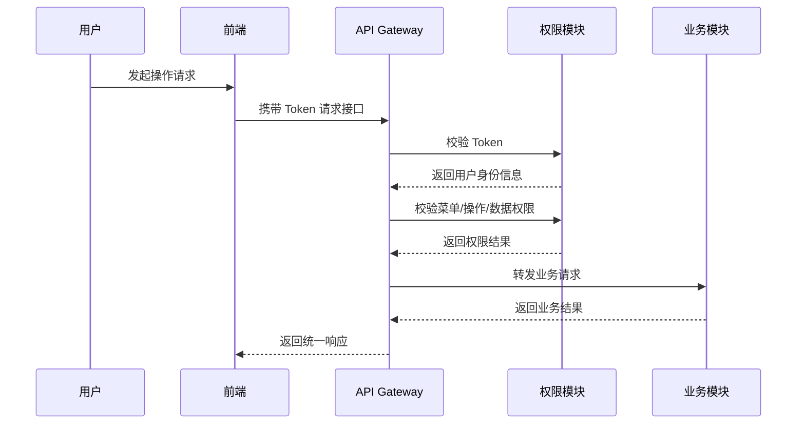

---

## 4.2 知识库模块

### 4.2.1 模块职责

知识库模块负责文档上传、解析、分类、权限控制、版本管理、全文检索和智能问答数据准备。

### 4.2.2 文档处理流程

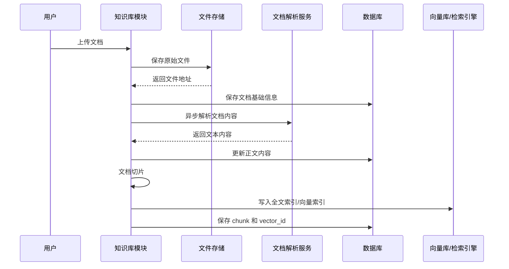

### 4.2.3 文档状态

| 状态        | 说明   |
| --------- | ---- |
| DRAFT     | 草稿   |
| PARSING   | 解析中  |
| REVIEWING | 审核中  |
| PUBLISHED | 已发布  |
| REJECTED  | 审核拒绝 |
| OFFLINE   | 已下架  |
| FAILED    | 解析失败 |

---

## 4.3 智能问答模块

### 4.3.1 模块职责

智能问答模块负责接收用户问题，在用户权限范围内检索知识库内容，并调用大模型生成有引用依据的回答。

### 4.3.2 问答流程

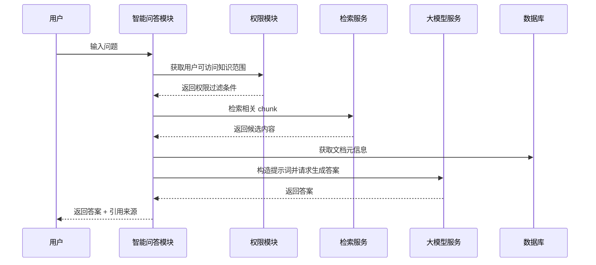

### 4.3.3 问答安全规则

1. 检索范围必须受用户权限控制。
2. 答案必须带引用来源。
3. 未检索到可靠内容时，不得编造答案。
4. 敏感文档不得泄露标题、摘要或片段。
5. 用户反馈需要记录，用于知识优化。

---

## 4.4 会议预约模块

### 4.4.1 模块职责

会议预约模块负责会议室资源管理、会议创建、会议冲突检测、参会人通知、会议变更和会议纪要管理。

### 4.4.2 会议预约流程

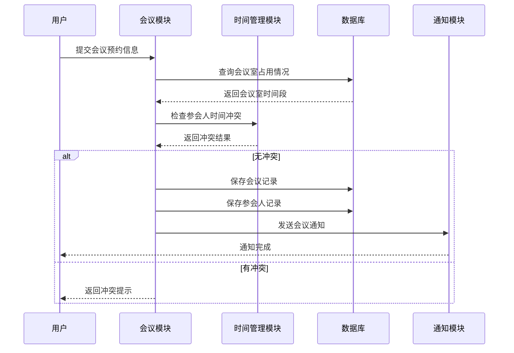

### 4.4.3 会议状态

| 状态        | 说明  |
| --------- | --- |
| BOOKED    | 已预约 |
| CANCELLED | 已取消 |
| FINISHED  | 已结束 |
| EXPIRED   | 已过期 |

---

## 4.5 待办事项模块

### 4.5.1 模块职责

待办事项模块用于管理个人轻量事项，支持创建、提醒、完成、延期和重复待办。

### 4.5.2 待办状态

| 状态          | 说明  |
| ----------- | --- |
| TODO        | 未开始 |
| IN_PROGRESS | 进行中 |
| DONE        | 已完成 |
| DELAYED     | 已延期 |
| CANCELLED   | 已取消 |

---

## 4.6 任务协同模块

### 4.6.1 模块职责

任务协同模块用于管理正式工作任务，支持创建人、负责人、参与人、状态流转、评论、附件和验收。

### 4.6.2 任务状态流转图

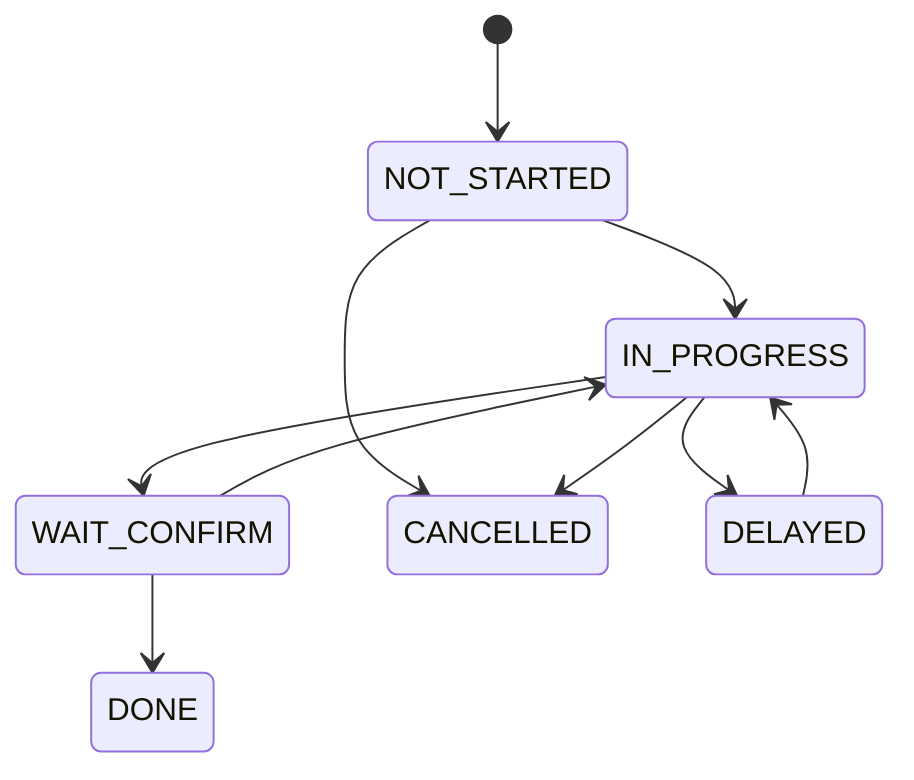

### 4.6.3 任务状态说明

| 状态           | 说明  |
| ------------ | --- |
| NOT_STARTED  | 未开始 |
| IN_PROGRESS  | 进行中 |
| WAIT_CONFIRM | 待确认 |
| DONE         | 已完成 |
| DELAYED      | 已延期 |
| CANCELLED    | 已取消 |

---

## 4.7 消息通知模块

### 4.7.1 模块职责

消息通知模块负责统一处理系统内通知，包括会议通知、任务通知、待办提醒、知识审核通知和系统公告。

### 4.7.2 通知发送流程

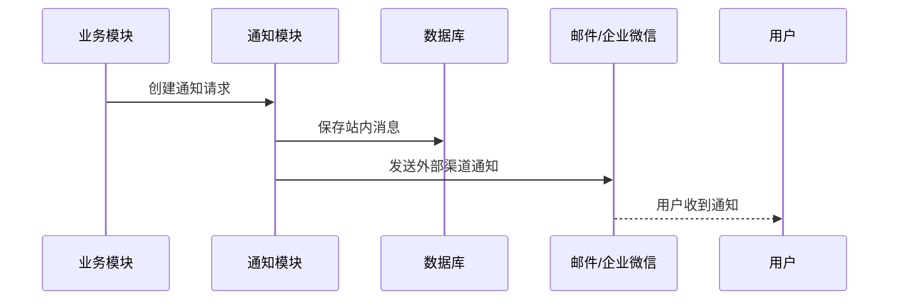

---

# 文档 5：接口设计说明书

## 5.1 接口设计规范

### 5.1.1 请求方式

系统接口采用 RESTful 风格，常见请求方式如下：

| 方法     | 用途        |
| ------ | --------- |
| GET    | 查询数据      |
| POST   | 新增数据或复杂操作 |
| PUT    | 更新数据      |
| DELETE | 删除数据      |

### 5.1.2 统一响应格式

```json
{
  "code": 200,
  "message": "success",
  "data": {},
  "traceId": "request-trace-id"
}
```

### 5.1.3 分页响应格式

```json
{
  "code": 200,
  "message": "success",
  "data": {
    "current": 1,
    "size": 20,
    "total": 100,
    "records": []
  }
}
```

---

## 5.2 用户认证接口

| 接口                    | 方法   | 说明       |
| --------------------- | ---- | -------- |
| /api/auth/login       | POST | 用户登录     |
| /api/auth/logout      | POST | 用户退出     |
| /api/auth/profile     | GET  | 获取当前用户信息 |
| /api/auth/permissions | GET  | 获取当前用户权限 |

### 登录请求示例

```json
{
  "username": "zhangsan",
  "password": "123456"
}
```

### 登录响应示例

```json
{
  "token": "Bearer xxxxxx",
  "userId": 10001,
  "realName": "张三"
}
```

---

## 5.3 知识库接口

| 接口                       | 方法     | 说明     |
| ------------------------ | ------ | ------ |
| /api/kb/documents        | GET    | 查询文档列表 |
| /api/kb/documents/upload | POST   | 上传文档   |
| /api/kb/documents/{id}   | GET    | 查看文档详情 |
| /api/kb/documents/{id}   | PUT    | 更新文档信息 |
| /api/kb/documents/{id}   | DELETE | 删除文档   |
| /api/kb/categories       | GET    | 查询知识分类 |
| /api/kb/categories       | POST   | 新增知识分类 |

### 文档查询参数

| 参数           | 类型     | 说明    |
| ------------ | ------ | ----- |
| keyword      | string | 搜索关键词 |
| categoryId   | long   | 分类 ID |
| departmentId | long   | 部门 ID |
| status       | string | 文档状态  |
| page         | int    | 页码    |
| size         | int    | 每页数量  |

---

## 5.4 智能问答接口

| 接口                  | 方法   | 说明     |
| ------------------- | ---- | ------ |
| /api/ai/qa/ask      | POST | 发起智能问答 |
| /api/ai/qa/history  | GET  | 查询问答历史 |
| /api/ai/qa/feedback | POST | 提交回答反馈 |

### 问答请求示例

```json
{
  "question": "差旅报销需要哪些材料？",
  "conversationId": "optional-conversation-id"
}
```

### 问答响应示例

```json
{
  "answer": "根据公司差旅报销制度，员工需要提交审批单、发票、行程单等材料。",
  "sources": [
    {
      "documentId": 1001,
      "documentTitle": "公司差旅报销制度",
      "chunkText": "差旅报销需提交审批单、发票和行程证明。"
    }
  ]
}
```

---

## 5.5 会议接口

| 接口                           | 方法   | 说明     |
| ---------------------------- | ---- | ------ |
| /api/meeting/rooms           | GET  | 查询会议室  |
| /api/meeting/rooms           | POST | 新增会议室  |
| /api/meetings                | GET  | 查询会议列表 |
| /api/meetings                | POST | 创建会议   |
| /api/meetings/{id}           | GET  | 查看会议详情 |
| /api/meetings/{id}           | PUT  | 修改会议   |
| /api/meetings/{id}/cancel    | POST | 取消会议   |
| /api/meetings/check-conflict | POST | 检查会议冲突 |

### 创建会议请求示例

```json
{
  "title": "项目需求评审会",
  "roomId": 2001,
  "startTime": "2026-05-01 10:00:00",
  "endTime": "2026-05-01 11:00:00",
  "attendeeIds": [10001, 10002, 10003],
  "description": "讨论企业内部协同平台一期需求。"
}
```

---

## 5.6 待办接口

| 接口                       | 方法     | 说明     |
| ------------------------ | ------ | ------ |
| /api/todos               | GET    | 查询我的待办 |
| /api/todos               | POST   | 新建待办   |
| /api/todos/{id}          | PUT    | 修改待办   |
| /api/todos/{id}/complete | POST   | 完成待办   |
| /api/todos/{id}          | DELETE | 删除待办   |

---

## 5.7 任务接口

| 接口                       | 方法   | 说明     |
| ------------------------ | ---- | ------ |
| /api/tasks               | GET  | 查询任务列表 |
| /api/tasks               | POST | 创建任务   |
| /api/tasks/{id}          | GET  | 查看任务详情 |
| /api/tasks/{id}          | PUT  | 修改任务   |
| /api/tasks/{id}/status   | POST | 更新任务状态 |
| /api/tasks/{id}/comments | POST | 新增任务评论 |

---

# 文档 6：权限与安全设计说明书

## 6.1 认证设计

系统采用 Token 认证机制。用户登录成功后，服务端签发访问令牌。前端在后续请求中携带 Token，后端对 Token 进行校验后识别用户身份。

## 6.2 授权设计

授权采用 RBAC 角色权限模型，并结合数据权限进行控制。


## 6.3 数据权限设计

数据权限分为以下范围：

| 范围                      | 说明         |
| ----------------------- | ---------- |
| SELF                    | 仅本人数据      |
| DEPARTMENT              | 本部门数据      |
| DEPARTMENT_AND_CHILDREN | 本部门及下级部门数据 |
| ALL                     | 全部数据       |
| CUSTOM                  | 自定义范围      |

## 6.4 知识库安全控制

1. 文档上传时必须设置权限范围。
2. 文档搜索结果必须进行权限过滤。
3. 智能问答检索内容必须进行权限过滤。
4. 无权限文档不能在问答来源中出现。
5. 下架文档不能被普通用户搜索或问答引用。

## 6.5 接口安全控制

1. 所有业务接口默认需要登录。
2. 管理接口需要管理员权限。
3. 文件下载接口需要校验文档访问权限。
4. 删除和取消类操作需要二次确认。
5. 高频接口需要限流。

---

# 文档 7：部署与运维设计说明书

## 7.1 部署架构图

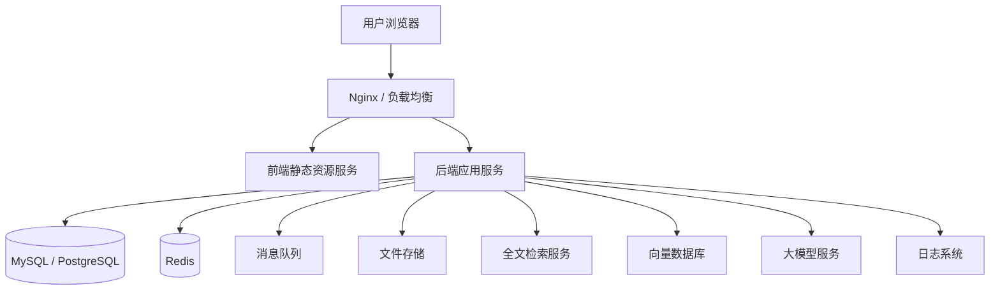

## 7.2 环境规划

| 环境   | 说明              |
| ---- | --------------- |
| DEV  | 开发环境，用于开发人员联调   |
| TEST | 测试环境，用于测试人员验证功能 |
| UAT  | 用户验收环境，用于业务方验收  |
| PROD | 生产环境，用于正式使用     |

## 7.3 服务清单

| 服务                       | 说明        |
| ------------------------ | --------- |
| frontend-web             | 前端 Web 服务 |
| backend-api              | 后端业务服务    |
| mysql/postgresql         | 关系型数据库    |
| redis                    | 缓存服务      |
| minio/oss                | 文件存储服务    |
| elasticsearch/opensearch | 全文检索服务    |
| milvus/pgvector          | 向量检索服务    |
| rabbitmq/kafka           | 消息队列服务    |
| nginx                    | 网关和静态资源服务 |

## 7.4 日志设计

系统日志分为以下几类：

1. 应用运行日志。
2. 接口访问日志。
3. 操作审计日志。
4. 异常错误日志。
5. AI 问答调用日志。
6. 文档解析日志。

## 7.5 备份策略

1. 数据库每日全量备份。
2. 核心业务表支持按小时增量备份。
3. 文件存储需要定期备份。
4. 知识库原始文件和解析结果均需保留。
5. 生产环境备份需要定期恢复演练。

## 7.6 监控指标

| 类型     | 指标                 |
| ------ | ------------------ |
| 应用指标   | QPS、响应时间、错误率       |
| 数据库指标  | 连接数、慢 SQL、CPU、磁盘   |
| 缓存指标   | 命中率、内存使用率          |
| 文件存储指标 | 上传成功率、下载成功率        |
| AI 指标  | 问答成功率、平均响应时间、反馈满意度 |
| 业务指标   | 会议创建数、任务完成率、知识搜索次数 |

---

# 文档 8：测试设计说明书

## 8.1 测试范围

测试范围包括：

1. 用户登录与权限。
2. 知识库上传、搜索、权限控制。
3. 智能问答准确性和引用来源。
4. 会议预约和冲突检测。
5. 待办创建、提醒和完成。
6. 任务创建、分配、状态流转。
7. 消息通知。
8. 数据看板。
9. 系统管理后台。

## 8.2 核心测试用例示例

| 用例编号  | 模块   | 测试点       | 预期结果          |
| ----- | ---- | --------- | ------------- |
| TC001 | 登录   | 正确账号密码登录  | 登录成功并返回 Token |
| TC002 | 登录   | 停用账号登录    | 登录失败并提示账号已停用  |
| TC003 | 知识库  | 上传 PDF 文档 | 上传成功并进入解析流程   |
| TC004 | 知识库  | 无权限用户查看文档 | 系统拒绝访问        |
| TC005 | 智能问答 | 查询有依据问题   | 返回答案并展示引用     |
| TC006 | 智能问答 | 查询无依据问题   | 提示未找到明确依据     |
| TC007 | 会议   | 预约空闲会议室   | 预约成功          |
| TC008 | 会议   | 预约已占用会议室  | 系统提示冲突        |
| TC009 | 任务   | 分配任务给员工   | 员工收到通知        |
| TC010 | 任务   | 完成任务并提交确认 | 状态变为待确认       |

---

# 文档 9：一期开发范围与里程碑

## 9.1 MVP 范围

一期 MVP 建议包含：

1. 用户登录。
2. 组织架构。
3. 角色权限。
4. 工作台。
5. 知识库上传、分类、搜索、详情。
6. 智能问答基础能力。
7. 会议室管理。
8. 会议预约和冲突检测。
9. 待办事项。
10. 任务协同。
11. 消息通知。
12. 基础数据看板。

## 9.2 开发阶段划分

| 阶段     | 内容      | 产出             |
| ------ | ------- | -------------- |
| 第 1 阶段 | 基础框架搭建  | 登录、权限、组织架构、菜单  |
| 第 2 阶段 | 知识库建设   | 文档上传、分类、搜索、权限  |
| 第 3 阶段 | 会议与时间管理 | 会议室、会议预约、冲突检测  |
| 第 4 阶段 | 待办与任务   | 待办、任务、评论、状态流转  |
| 第 5 阶段 | 智能能力    | 智能问答、会议纪要行动项提取 |
| 第 6 阶段 | 看板与验收   | 数据看板、测试、部署、验收  |

## 9.3 交付物清单

| 类型   | 文档 / 产物             |
| ---- | ------------------- |
| 产品文档 | PRD、页面清单、流程图        |
| 设计文档 | SDD、架构设计、数据库设计、接口设计 |
| 开发产物 | 前端代码、后端代码、数据库脚本     |
| 测试产物 | 测试计划、测试用例、缺陷记录、测试报告 |
| 部署产物 | 部署手册、运维手册、环境配置说明    |
| 验收产物 | 验收报告、用户操作手册         |

---

# 总结

本 SDD 文档包将企业内部智能协同平台拆分为多个正式设计文档，覆盖了从总体设计、系统架构、数据库建模、模块流程、接口规范、权限安全到部署运维和测试验收的完整设计内容。

从工程实施角度看，一期最合适的路线是采用模块化单体架构，先完成知识库、智能问答、会议预约、待办任务和消息通知这几个高频核心场景。等系统稳定运行后，再逐步扩展第三方集成、移动端、复杂审批流、智能排程和高级数据分析能力。

