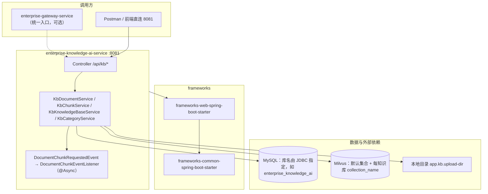
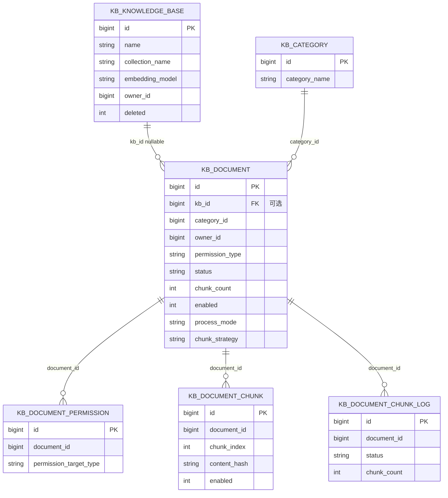
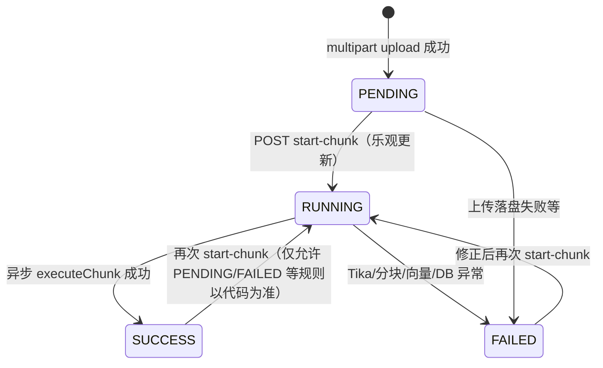
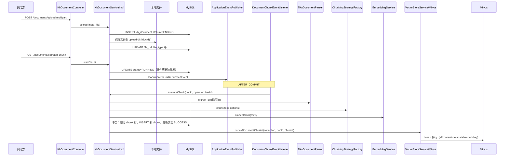
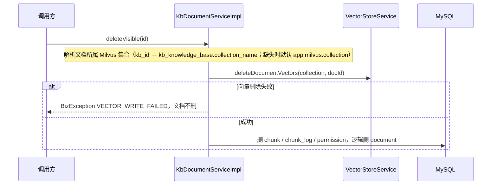

# Step3 总结文档（知识库最小闭环 — 实现版）

> 本文档依据 `docs/development-flow.md` 中 **Step 3：知识库最小闭环（阶段二-前半）** 的目标，对**当前仓库真实实现**做逐项说明，便于联调、Code Review、验收与进入 Step4。  
> 若代码与文档冲突，**以代码与 `enterprise-knowledge-ai-service/src/main/resources/schema.sql` 为准**，并回写本文档及相关 `docs/*.md`。

---

## 0. 修订说明（相对早期 Step3 文档的主要变化）

| 主题 | 早期文档描述 | 当前实现 |
|------|----------------|----------|
| 文档状态 | DRAFT → PARSING → PUBLISHED | 摄取链路以 **PENDING → RUNNING → SUCCESS / FAILED** 为主（枚举中仍保留 DRAFT/PARSING/PUBLISHED 等供扩展，**上传入口写 PENDING**） |
| 解析 | 仅 txt/md | **Apache Tika** 落盘后从磁盘流解析多种格式 |
| 分块 | 单 chunk 同步占位 | **策略化分块**（FIXED_SIZE / PARAGRAPH）+ 多 chunk + **异步** `start-chunk`（事务提交后 `@TransactionalEventListener` + `@Async`） |
| Milvus | 单集合 `chunk_id` + `document_id` | **每知识库可选独立集合**；行结构为 **`id` + `content` + `metadata`(JSON) + `embedding`**，删除按 `metadata["doc_id"]` 或主键 `id` |
| 知识库实体 | 无 | **`kb_knowledge_base`** + 文档 **`kb_id`** 关联；REST **`/api/kb/bases`** |
| 向量更新 | 删后插 | 单条更新走 **Upsert**（`MilvusVectorWriter.upsertChunk`） |
| ORM | 混用不存在的 `documentMapper` | `KbDocumentServiceImpl` 继承 **`ServiceImpl<KbDocumentMapper, KbDocument>`**，写库统一使用父类 **`baseMapper`** |

---

## 1. Step3 在流程中的定位

| 来源 | 要求摘要 |
|------|-----------|
| `development-flow.md` Step3 | 知识分类、文档上传与元数据、状态与权限、可验收列表/详情/上传。 |
| `docs/api.md` | 知识库路径前缀 `/api/kb/...`（本文第 7 节给出**已实现**的完整清单）。 |
| `docs/database.md` | 知识库相关表结构（本文第 5 节与 `database.md` 已同步扩展）。 |

**Step4 边界**：全文检索（ES/OpenSearch）、RAG 问答编排、会话落库、生产级 Embedding 模型切换等，不在 Step3 必达范围；当前已具备 **多切片、Milvus 向量、分块日志**，为 Step4 检索与问答打基础。

---

## 2. 服务与依赖拓扑

### 2.1 组件关系（Mermaid）

### 2.2 核心表 ER（逻辑关系，与实现一致）

---

## 3. 文档状态机（摄取与分块链路）

业务主路径使用字符串状态写入 `kb_document.status`（与 `DocumentStatus` 枚举名一致）。

### 3.1 状态说明表

| 状态值 | 含义 | 典型场景 |
|--------|------|----------|
| **PENDING** | 已上传元数据与文件，**等待**用户调用 `start-chunk` | `POST .../upload` 成功后 |
| **RUNNING** | 已提交分块任务，**异步**执行解析 / 分块 / 向量 / 入库 | `start-chunk` CAS 更新成功之后 |
| **SUCCESS** | 分块与向量写入成功，`chunk_count` 与切片表一致 | `executeChunk` 全流程成功 |
| **FAILED** | 解析失败、向量失败、业务校验失败等 | 任一步骤捕获异常并回写 |
| PARSING | 枚举保留，当前主链路较少单独落库 | 扩展用 |
| DRAFT / PUBLISHED / REVIEWING / REJECTED / OFFLINE | 枚举保留 | 后续业务流 |

### 3.2 状态流转（Mermaid）

### 3.3 上传与异步分块（时序）

### 3.4 文档删除与向量清理

---

## 4. 模块与源码索引（按职责）

| 职责 | 路径（均在 `enterprise-knowledge-ai-service` 下） |
|------|--------------------------------------------------|
| 启动类 / MapperScan / @EnableAsync | `.../KnowledgeAiApplication.java` |
| 用户请求头 → `UserContext` | `.../web/UserContextInterceptor.java`、`UserContextHolder.java` |
| 分类 API | `.../web/KbCategoryController.java` |
| 知识库（多 Milvus 集合）API | `.../web/KbKnowledgeBaseController.java` |
| 文档 API | `.../web/KbDocumentController.java` |
| Chunk API | `.../web/KbChunkController.java` |
| 文档服务（上传、分块、删除、检索） | `.../service/impl/KbDocumentServiceImpl.java`（`extends ServiceImpl<KbDocumentMapper, KbDocument>`，使用 **`baseMapper`**） |
| Chunk 服务 | `.../service/impl/KbChunkServiceImpl.java` |
| 知识库服务 | `.../service/impl/KbKnowledgeBaseServiceImpl.java` |
| 分块事件与监听 | `.../event/DocumentChunkRequestedEvent.java`、`.../event/DocumentChunkEventListener.java` |
| Tika 解析 | `.../service/TikaDocumentParser.java` |
| 分块策略 | `.../chunk/ChunkingStrategy*.java`、`ChunkingStrategyFactory.java`、`ChunkingOptions.java` |
| 嵌入占位 | `.../embedding/*` |
| Milvus 集合引导 | `.../milvus/MilvusCollectionBootstrap.java`、`MilvusCollectionHelper.java` |
| 向量写入 | `.../milvus/MilvusVectorWriter.java`、`MilvusVectorStoreService.java`、`VectorStoreService.java` |
| 对业务暴露的向量门面 | `.../milvus/ChunkVectorStore.java`、`MilvusChunkVectorStore.java` |
| 文档↔集合路由 | `.../service/KbMilvusRoutingService.java` |
| 分页 SQL | `src/main/resources/mapper/KbDocumentMapper.xml` |
| 表结构 | `src/main/resources/schema.sql` |
| 增量 SQL（旧库升级） | `src/main/resources/db/*.sql`（如 `document-ingestion-alter.sql`、`chunk-v2-alter.sql`、`knowledge-base-alter.sql`） |

---

## 5. 数据库表（与 `schema.sql` 对齐的要点）

### 5.1 `kb_knowledge_base`

- 一行代表一个**逻辑知识库**，绑定 **Milvus 集合名** `collection_name`（创建时调用 `MilvusCollectionHelper.ensureCollectionLoaded` 建表并 load）。  
- `embedding_model` 可空：空则文档分块嵌入使用全局配置；非空则优先用于该库下文档的 `EmbeddingService` 调用链（见 `KbMilvusRoutingService`）。  
- **权限**：`owner_id`；非管理员仅能管理自己的库；分页列表默认按 owner 过滤。  
- **删除约束**：存在 `kb_document.kb_id` 指向且未删文档时不可删知识库。

### 5.2 `kb_document`（关键扩展字段）

除标题、分类、文件、权限、状态外，实现中需关注：

| 字段 | 说明 |
|------|------|
| `kb_id` | 可选；非空时向量读写走对应知识库的 `collection_name` |
| `chunk_count` | 当前切片数量 |
| `enabled` | 文档级启用；禁用时配合删除/重建向量 |
| `process_mode` | 如 `CHUNK` / `PIPELINE`（PIPELINE 未接会报错） |
| `chunk_strategy` / `chunk_config` | 分块策略与 JSON 参数 |
| `status` | 见第 3 节 |

### 5.3 `kb_document_chunk` / `kb_document_chunk_log`

- **chunk**：`content_hash`、`token_count`、`char_count`、`enabled`、`vector_id`（与 Milvus 主键 `id` 对齐，一般为 chunk 主键字符串）。  
- **chunk_log**：每次分块任务一条运行记录，含各阶段耗时与错误信息，供 `GET .../chunk-logs` 查询。

### 5.4 `kb_document_permission`

与 `permission_type` 组合使用：`USER` 时需授权行；`PROJECT` 时需项目 ID 与请求头一致等（见 `DocumentVisibilityService` 与 `KbDocumentMapper.xml`）。

### 5.5 初始化与升级

- 新库：依赖 Spring Boot `schema.sql`（注意 `spring.sql.init.mode` 配置）。  
- 已有库：执行 `src/main/resources/db/` 下对应 **ALTER** 脚本；若列已存在需手工跳过（脚本头注释已说明）。

---

## 6. HTTP 接口清单（已实现，`enterprise-knowledge-ai-service`）

**统一前缀**：`/api/kb`（分类为 `/api/kb/categories`，知识库为 `/api/kb/bases`，文档为 `/api/kb/documents`）。

### 6.1 分类 `KbCategoryController` → `/api/kb/categories`

| 方法 | 路径 | 说明 |
|------|------|------|
| GET | `/api/kb/categories` | 列表 |
| GET | `/api/kb/categories/{id}` | 详情 |
| POST | `/api/kb/categories` | 新建 |
| PUT | `/api/kb/categories/{id}` | 更新 |
| DELETE | `/api/kb/categories/{id}` | 逻辑删除 |

### 6.2 知识库（多集合）`KbKnowledgeBaseController` → `/api/kb/bases`

| 方法 | 路径 | 说明 |
|------|------|------|
| POST | `/api/kb/bases` | 创建（body：`name`、`collectionName`、可选 `embeddingModel`）；服务端建 Milvus 集 |
| GET | `/api/kb/bases` | 分页（Query：`current`、`size`、`name`） |
| GET | `/api/kb/bases/{id}` | 详情（含 documentCount 聚合） |
| PUT | `/api/kb/bases/{id}` | 更新（含嵌入模型变更校验：已有 chunk_count>0 的文档则禁止改模型） |
| PUT | `/api/kb/bases/{id}/rename` | 仅重命名 |
| DELETE | `/api/kb/bases/{id}` | 删除（无下属文档） |

### 6.3 文档 `KbDocumentController` → `/api/kb/documents`

| 方法 | 路径 | 说明 |
|------|------|------|
| GET | `/api/kb/documents` | 分页列表（权限 SQL） |
| GET | `/api/kb/documents/{id}` | 详情（权限校验） |
| POST | `/api/kb/documents/upload` | `multipart/form-data`：`meta`（JSON，`KbDocumentUploadRequest`）+ `file`；可选 **`kbId`** |
| POST | `/api/kb/documents/{id}/start-chunk` | 提交异步分块 |
| POST | `/api/kb/documents/{id}/execute-chunk` | 同步执行分块（补偿/排障，需写权限） |
| PUT | `/api/kb/documents/{id}` | 更新元数据（非 RUNNING 等规则见代码） |
| PATCH | `/api/kb/documents/{id}/enabled?on=true|false` | 文档启用/禁用并同步向量 |
| GET | `/api/kb/documents/{id}/chunk-logs` | 分块任务日志分页 |
| GET | `/api/kb/documents/search` | 简易标题搜索（管理员可看更多，规则见实现） |
| DELETE | `/api/kb/documents/{id}` | 删除（先删向量） |

### 6.4 切片 `KbChunkController` → `/api/kb/documents/{docId}/chunks`

| 方法 | 路径 | 说明 |
|------|------|------|
| GET | `/api/kb/documents/{docId}/chunks` | 分页 Query：`KbChunkPageRequest` |
| GET | `/api/kb/documents/{docId}/chunks/list` | 全量列表 |
| POST | `/api/kb/documents/{docId}/chunks` | 单条创建（写向量） |
| POST | `/api/kb/documents/{docId}/chunks/batch?writeVector=` | 批量创建 |
| PUT | `/api/kb/documents/{docId}/chunks/{chunkId}` | 更新内容与向量（Upsert） |
| DELETE | `/api/kb/documents/{docId}/chunks/{chunkId}` | 删除 |
| PATCH | `/api/kb/documents/{docId}/chunks/{chunkId}/enabled?on=` | 切片启用/禁用 |
| POST | `/api/kb/documents/{docId}/chunks/batch-enabled?on=` | 批量启用/禁用 |

### 6.5 统一响应与错误

- 成功体为 `Result`（`frameworks-common`：`code`、`message`、`data`、`traceId`）。  
- 业务异常 `BizException` + `ErrorCode`（如 `VECTOR_WRITE_FAILED`、`PARAM_INVALID`、`FORBIDDEN`、`NOT_FOUND`）。  
- 网关侧若有 `ApiResponseWriter` 等，需与 `Result` 格式对齐（见网关模块文档）。

---

## 7. 请求身份（一期联调）

除 Actuator、`/api/system/**` 等白名单外，知识库接口依赖 **`UserContextInterceptor`** 解析头并构造 `UserContext`：

| 请求头 | 说明 |
|--------|------|
| `X-User-Id` | **必填**（Long） |
| `X-Department-Id` | 可选 |
| `X-Project-Id` | 可选（PROJECT 权限） |
| `X-Is-Admin` | 可选（`true` 表示管理员） |

权限判定见 `DocumentVisibilityService` 与 `KbDocumentMapper.xml` 中 `selectPageVisible`。

---

## 8. Milvus 与向量模型

### 8.1 配置（`application.yml` / `MilvusProperties`）

| 配置键 | 说明 |
|--------|------|
| `app.milvus.uri` | Milvus 地址，默认 `http://localhost:19530` |
| `app.milvus.collection` | **默认集合名**（文档无 `kb_id` 或路由失败时的回退） |
| `app.milvus.vector-dimension` | 向量维度，须与 `EmbeddingService` 输出一致 |
| `app.milvus.fail-on-init` | 默认 `true`：启动时必须完成默认集合创建与 load |

知识库创建时额外集合与默认集合 **Schema 一致**。

### 8.2 集合字段（新建集合）

| 字段 | 类型 | 说明 |
|------|------|------|
| `id` | VarChar PK | 与业务 `kb_document_chunk.id` 字符串一致 |
| `content` | VarChar(65535) | 切片正文（超长截断） |
| `metadata` | JSON | 至少含 `collection_name`、`doc_id`、`chunk_index`；可并业务扩展 |
| `embedding` | FloatVector | AUTOINDEX + COSINE（与 `MilvusCollectionHelper` 一致） |

### 8.3 删除与更新表达式（与参考对齐）

- 按文档删：`metadata["doc_id"] == "<docId>"`  
- 按切片删：`id == "<chunkId>"` 或 `id in ["...","..."]`  
- 更新单条：**Upsert** 同一主键

### 8.4 嵌入服务

- 一期可为 **SHA-256 展开占位向量** 或项目内既定占位实现；通过 `EmbeddingService` 抽象，便于替换真实模型。  
- 模型选择顺序：`KbKnowledgeBase.embedding_model`（当文档 `kb_id` 命中且非空）→ 全局 `KnowledgeAiProperties`（若仍配置）。

---

## 9. 与 Step3 验收项对照（`development-flow.md`）

| 验收项 | 结论 |
|--------|------|
| 上传后可在文档列表检索到 | **满足**：`SUCCESS` 等可见状态文档出现在分页；SQL 权限过滤。 |
| 无权限用户看不到文档数据 | **满足**：列表与详情校验。 |
| 状态流转正确且有日志 | **满足**：状态机见第 3 节；**`kb_document_chunk_log`** 记录分块任务维度日志；应用日志含关键 info/error。 |

---

## 10. 已知边界与 Step4 建议

1. **全文检索**：未接 ES/OpenSearch；当前有标题 `search` 与 DB 列表。  
2. **RAG 问答**：未实现 `/api/ai/qa/*` 编排与会话落库。  
3. **网关**：直连 8081 可联调；统一入口需在网关配置路由（见 `plan.md`）。  
4. **Milvus 旧集合**：若曾用旧 Schema，需 **drop 集合** 后由服务重建或换新 `collection_name`。  
5. **生产**：连接池、Milvus 高可用、备份策略见 `deployment.md`、`database.md`。

---

## 11. 文档维护清单（变更代码时请同步）

| 文档 | 同步内容 |
|------|-----------|
| `docs/api.md` | 新增/变更的 REST 路径与请求体 |
| `docs/database.md` | 表字段、ER、索引 |
| `docs/development-flow.md` | Step3 描述与状态名 |
| `docs/AGENTS.md` | 状态枚举与约定 |
| `docs/plan.md` / `docs/SKILL.md` | 库表列表与流程摘要 |
| `docs/step3-summary.md` | 本文件总览 |

---

**最后更新**：与当前仓库 `enterprise-knowledge-ai-service` 实现同步；后续迭代请在合并前更新本节日期与表格。
