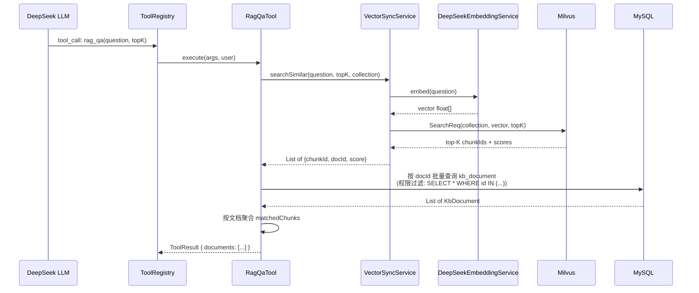

# RAG 智能问答设计文档

> 2026-05-11 | enterprise-knowledge-ai-service

## 目标

在 Agent 框架中新增 RAG（检索增强生成）能力。用户自然语言提问 → 向量检索 → 返回相关文档 → LLM 生成带来源的答案。

## 技术决策

| 维度 | 决策 |
|------|------|
| 入口方式 | Agent 内聚：新增 `rag_qa` Tool，通过 AgentLoop 统一调度 |
| 检索链路 | 先实现 Milvus 向量检索（`VectorSyncService.search()`），再开发 Tool |
| 检索粒度 | 返回 top-K 文档级信息（含 matchedChunks），非单个 chunk |
| 元数据 | Tika 自动提取 → `metadata` JSON 列；管理员手动填 → `filter_tags` JSON 列 |

## 新增/修改清单

| 改动 | 文件 | 说明 |
|------|------|------|
| Milvus Search | `milvus/MilvusVectorWriter.java` | 新增 `search()` 方法，调用 gRPC Search |
| 向量检索服务 | `service/VectorSyncService.java` | 新增 `searchSimilar()` 封装 embed+search |
| 文档元数据 | `entity/KbDocument.java` | 新增 `metadata`、`filterTags` 字段 |
| 表结构 | `schema.sql` | 新增 `metadata`、`filter_tags` 列 |
| Tika 元数据提取 | `service/TikaDocumentParser.java` | `extractText()` 改为返回 `ParseResult{text, metadata}` |
| 上传保存 | `service/impl/DocumentUploadService.java` | 上传时保存 metadata + filterTags |
| RAG Tool | `agent/tool/RagQaTool.java` | 新增第 5 个 Agent Tool |
| DTO | `dto/KbDocumentUploadRequest.java` | 新增 `filterTags` 字段 |

## RAG Tool 设计

### Tool Schema

```
Tool: rag_qa
参数: question (必填, string) — 用户问题
      topK (可选, integer, 默认5, 最大10) — 返回文档数
返回: { documents: [{ documentId, title, summary, fileType, fileName,
          createdAt, metadata, matchedChunks }] }
```

### 执行流程



### 返回格式

```json
{
  "documents": [
    {
      "documentId": 123,
      "title": "微服务架构设计指南",
      "summary": "本文介绍了微服务架构的核心概念...",
      "fileType": "application/pdf",
      "fileName": "微服务架构设计指南.pdf",
      "fileSize": 2048000,
      "createdAt": "2026-03-15T10:30:00",
      "metadata": {
        "author": "张三",
        "creationDate": "2026-03-10",
        "pageCount": "45"
      },
      "matchedChunks": [
        {
          "chunkIndex": 3,
          "text": "微服务架构是一种将应用拆分为...",
          "score": 0.92
        }
      ]
    }
  ]
}
```

## 数据模型变更

### kb_document 新增字段

```sql
ALTER TABLE kb_document
    ADD COLUMN metadata JSON NULL COMMENT 'Tika自动提取的元数据',
    ADD COLUMN filter_tags JSON NULL COMMENT '管理员填写的过滤标签';
```

### KbDocument 实体新增

```java
/** Tika 自动提取的元数据（author、creationDate 等） */
private String metadata;

/** 管理员填写的过滤标签 {"department":"技术部","level":"机密"} */
private String filterTags;
```

## Milvus Search 设计

### MilvusVectorWriter.search()

```java
/**
 * 向量相似度检索
 *
 * @param collectionName Milvus 集合名
 * @param vector         查询向量
 * @param topK           返回数量
 * @param filter         标量过滤表达式（可选，如 metadata["doc_id"] in [...]）
 * @return 搜索结果 {chunkId, docId, score}
 */
public List<SearchResult> search(String collectionName, float[] vector,
                                  int topK, String filter)
```

### SearchResult

```java
public record SearchResult(String chunkId, String docId, float score) {}
```

### VectorSyncService.searchSimilar()

```java
/**
 * 向量相似检索：embed(query) → Milvus Search
 *
 * @param query  查询文本
 * @param topK   返回数量
 * @param document 上下文文档（用于路由集合）
 * @return 搜索结果的 chunkId/docId/score
 */
public List<SearchResult> searchSimilar(String query, int topK, KbDocument document) {
    float[] vector = toArray(embed(query, document));
    String collection = resolveCollectionOrDefault(document);
    return chunkVectorStore.search(collection, vector, topK, null);
}
```

## 权限过滤

RAG 检索的权限控制分两层：

1. **Milvus 层**：Search 不带权限过滤（向量索引不支持复杂的 SQL 级权限）
2. **应用层**：Milvus 返回 top-K 结果后，按 docId 批量查 MySQL，走现有 `DocumentVisibilityService` 过滤无权限文档，只返回当前用户可见的

## 安全约束

1. Tool 执行前走 `DocumentVisibilityService` 权限校验
2. ToolResult 中的 `matchedChunks.text` 只返回匹配片段（非全文），避免泄露完整文档内容
3. 不返回 `content_text`、`file_url`
4. `filter_tags` 中的过滤条件在校验环节使用，不随 rag 结果暴露给普通用户

## 不在本阶段范围

- filter_tags 的权限过滤逻辑（当前只存，RAG 暂时只用文档级权限 + 用户身份过滤）
- Milvus 标量过滤（metadata filter 下推到 Milvus）
- 混合检索（向量 + ES）
