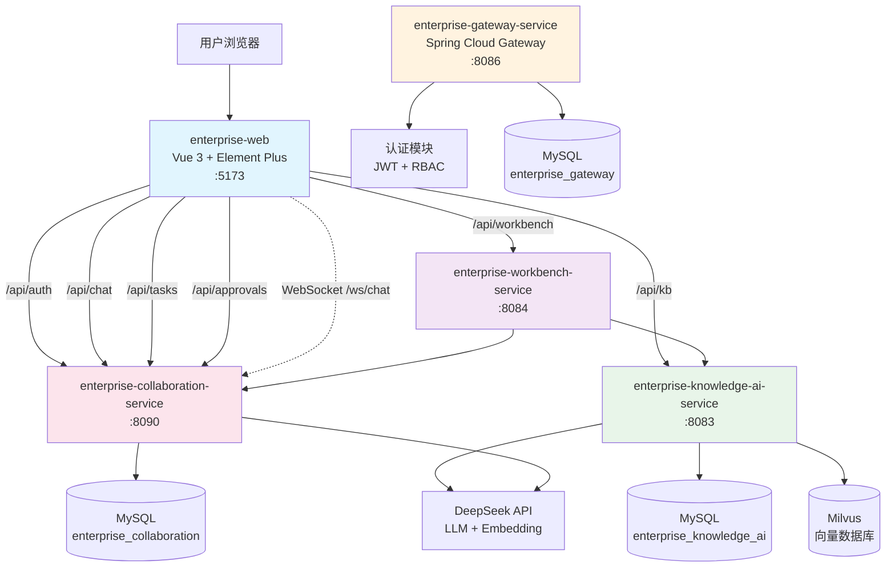
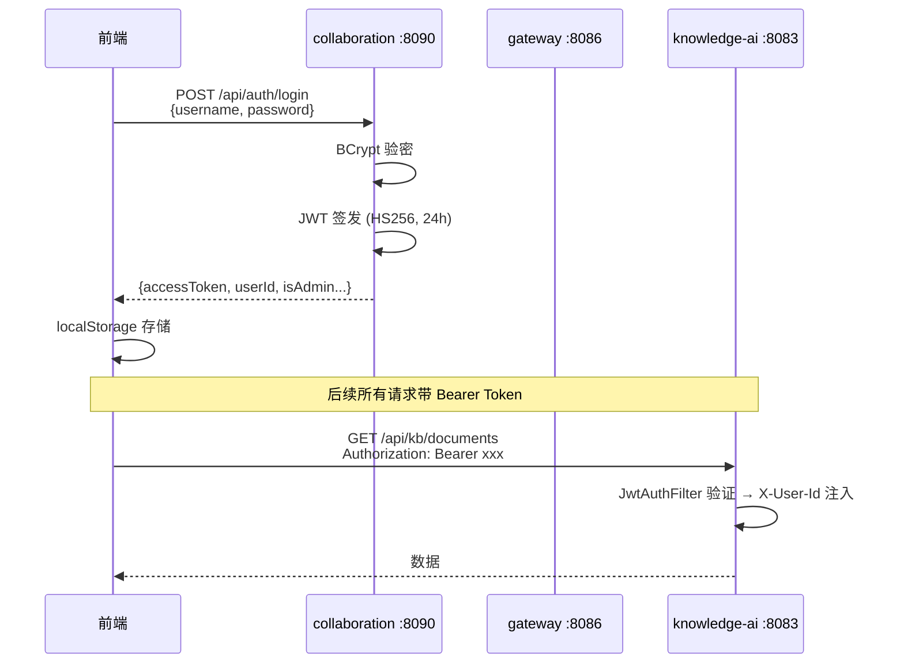
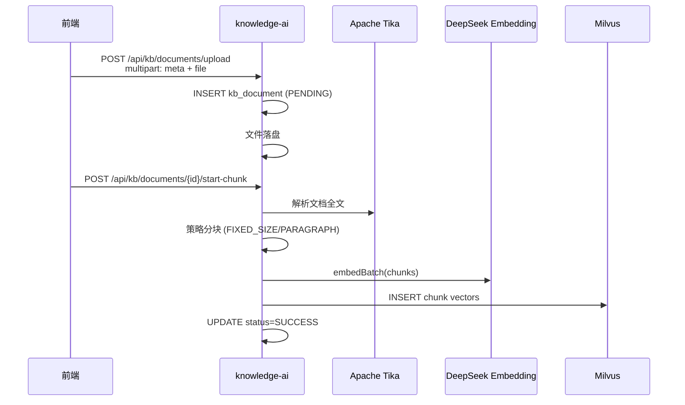
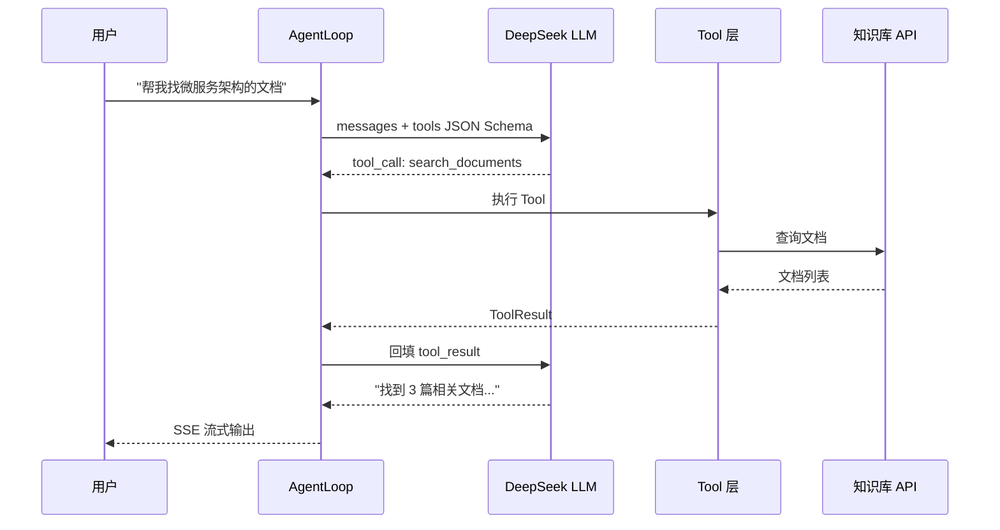
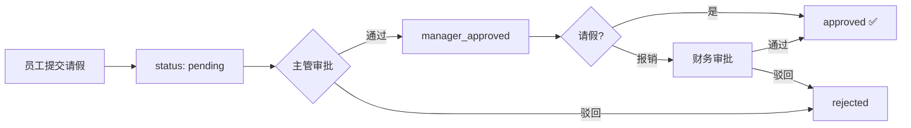

# 企业智能工作平台 — 系统全景文档

> 2026-05-12 | 4 个微服务 + 1 个前端 | 29 张数据库表 | 30+ 个 API 端点

---

## 1. 系统架构

### 1.1 服务拓扑



### 1.2 技术栈

| 层 | 技术 |
|----|------|
| 前端 | Vue 3 + Element Plus + Vue Router + Axios + Vite |
| 网关 | Spring Cloud Gateway + WebFlux + Spring Security |
| 知识库 | Spring Boot 3.3 + MyBatis-Plus + Milvus SDK + Apache Tika + DeepSeek API |
| 协同 | Spring Boot 3.3 + MyBatis-Plus + WebSocket + JJWT |
| 工作台 | Spring Boot 3.3 + RestTemplate |
| 数据库 | MySQL 8.0×3（3 个独立数据库） |
| 向量库 | Milvus 2.6 (gRPC) |
| AI | DeepSeek (LLM 对话 + Embedding 向量化) |
| 认证 | JWT (HS256) + BCrypt + Bearer Token |

### 1.3 端口与数据库

| 服务 | 端口 | 数据库 | 表数 |
|------|:---:|------|:---:|
| enterprise-gateway-service | 8086 | enterprise_gateway | 8 |
| enterprise-knowledge-ai-service | 8083 | enterprise_knowledge_ai | 8 |
| enterprise-collaboration-service | 8090 | enterprise_collaboration | 13 |
| enterprise-workbench-service | 8084 | 无（调其他服务 API） | — |
| enterprise-web (Vite) | 5173 | — | — |

---

## 2. 功能全景

### 2.1 模块矩阵

```
企业智能工作平台
├── 1. 认证与权限
│   ├── 登录 / 注册 / 注销            POST /api/auth/*
│   ├── JWT Token 签发与验证          HS256, 24h 过期
│   ├── Token 黑名单                  ConcurrentHashMap 内存管理
│   └── RBAC 角色权限                 Gateway 层面控制
│
├── 2. 知识库管理
│   ├── 文档上传                      POST /api/kb/documents/upload
│   ├── Tika 文档解析                 支持 PDF/Word/Excel/PPT/HTML/MD
│   ├── 策略分块                      FIXED_SIZE / PARAGRAPH
│   ├── 向量化写入 Milvus             DeepSeek Embedding
│   ├── 文档权限                      5 种权限模型 (ALL/DEPT/PROJECT/USER/ADMIN)
│   ├── 知识库管理                    多 Milvus 集合路由
│   └── 文件下载                      GET /api/kb/documents/{id}/download
│
├── 3. AI 智能助手
│   ├── Agent 自然语言检索            5 个 MCP Tool
│   │   ├── search_documents          标题关键词搜索
│   │   ├── list_documents            分页文档列表
│   │   ├── get_document_detail       文档详情
│   │   ├── list_knowledge_bases      知识库列表
│   │   └── rag_qa                    RAG 智能问答
│   ├── SSE 流式输出                  实时打字效果
│   ├── 会话持久化                    kb_agent_session / kb_agent_message
│   └── MCP Server                    /mcp/sse + /mcp/tools/list
│
├── 4. 文档协作
│   ├── 富文本编辑器                  contenteditable + 工具栏
│   ├── 自动保存                      1.5s 防抖 → PUT /api/docs/{id}
│   ├── 协作成员在线状态
│   ├── 评论讨论
│   └── 分享权限管理
│
├── 5. 即时通讯
│   ├── WebSocket 实时消息            /ws/chat
│   ├── 单聊 / 群聊                   创建群组，邀请成员
│   ├── 在线状态广播
│   └── 消息历史                      最近 100 条
│
├── 6. 组织与沟通
│   ├── 通讯录                        部门树 + 员工列表
│   └── 公告通知                      管理员发布 / 置顶
│
├── 7. 任务管理
│   ├── Kanban 看板                   4 列：待开始/进行中/待确认/已完成
│   ├── 任务创建 / 分配               优先级 / 截止日 / 负责人
│   ├── 状态流转                      拖拽切换
│   └── 评论讨论
│
├── 8. OA 审批
│   ├── 请假申请                      固定链：提交→主管→通过
│   ├── 报销申请                      固定链：提交→主管→财务→通过
│   ├── 审批记录时间线
│   └── 驳回理由
│
├── 9. 会议与日程
│   ├── 会议预约                      会议室选择 + 参会人
│   ├── 线下 / 线上                    腾讯会议预留
│   └── 会议列表
│
├── 10. 个人效率
│   ├── 待办事项                      CRUD + 完成切换
│   └── 优先级管理                    高/中/低
│
├── 11. 数据看板
│   ├── 工作台 Dashboard               今日会议 + 待办 + 最近文档
│   ├── 统计看板                       任务分布 + 审批统计 + 文档总数
│   └── 卡片概览
│
└── 12. 系统管理
    ├── 用户管理                      启停用 + 角色分配
    ├── 文档管理（管理员）             上传/分块/启用/删除
    ├── 知识库管理                     创建/删除 + 嵌入模型
    ├── 角色权限管理
    └── 操作日志审计
```

---

## 3. 核心业务流程

### 3.1 登录 → 全局认证



### 3.2 文档上传 → 向量检索（知识闭环）



### 3.3 Agent 智能问答



### 3.4 OA 审批流转



---

## 4. 数据架构

### 4.1 数据库总览

| 数据库 | 表数 | 核心表 |
|--------|:---:|------|
| enterprise_knowledge_ai | 8 | kb_document, kb_document_chunk, kb_knowledge_base, kb_agent_session |
| enterprise_gateway | 8 | sys_user, sys_role, sys_permission, sys_op_log |
| enterprise_collaboration | 13 | sys_user, im_message, sys_task, sys_approval_request, sys_meeting, sys_doc |

### 4.2 MySQL ↔ Milvus 对照

| MySQL (kb_document_chunk) | Milvus (collection) |
|---------------------------|---------------------|
| id (BIGINT) | id (VARCHAR) = String.valueOf(id) |
| chunk_text | content (VARCHAR 65535, 超长截断) |
| content_hash (SHA-256) | — |
| metadata_json | metadata (JSON): collection_name, doc_id, chunk_index |
| — | embedding (FloatVector): AUTOINDEX + COSINE |

---

## 5. 前端路由

| 路由 | 页面 | 后端来源 |
|------|------|----------|
| `/` | 工作台 | workbench :8084 聚合 |
| `/analytics` | 数据看板 | workbench :8084 |
| `/chat` | 智能对话 (ChatGPT 风格) | knowledge-ai :8083 |
| `/documents` | 文档协作 (腾讯文档风格) | collaboration :8090 |
| `/chats` | 即时通讯 | collaboration :8090 WebSocket |
| `/contacts` | 通讯录 | collaboration :8090 |
| `/notifications` | 公告通知 | collaboration :8090 |
| `/tasks` | 任务看板 (Kanban) | collaboration :8090 |
| `/approvals` | OA 审批 | collaboration :8090 |
| `/meetings` | 会议预约 | collaboration :8090 |
| `/todos` | 我的待办 | collaboration :8090 |
| `/admin/documents` | 文档管理 | knowledge-ai :8083 |
| `/admin/bases` | 知识库管理 | knowledge-ai :8083 |
| `/admin/users` | 用户管理 | collaboration :8090 |
| `/admin/roles` | 角色管理 | 前端 mock |
| `/admin/logs` | 操作日志 | 前端 mock |

---

## 6. 部署拓扑

```
┌─────────────────────────────────────────────────────┐
│                    前端 (Vite :5173)                   │
├─────────────────────────────────────────────────────┤
│  代理: /api/auth → :8090  /api/kb → :8083            │
│         /api/* → :8090    /api/workbench → :8084      │
└─────────────────────────────────────────────────────┘
          │                │              │
    ┌─────┘         ┌──────┘       ┌─────┘
    ▼               ▼              ▼
┌────────┐   ┌──────────┐   ┌──────────┐
│Gateway │   │Knowledge │   │Collabora-│
│ :8086  │   │AI :8083  │   │tion :8090│
│        │   │          │   │          │
│ JPA    │   │MyBatis-  │   │MyBatis-  │
│Hibernate│  │Plus      │   │Plus      │
│WebFlux │   │MVC       │   │MVC       │
└────────┘   └──────────┘   └──────────┘
    │              │              │
    ▼              ▼              ▼
┌────────┐   ┌──────────┐   ┌──────────┐
│ MySQL  │   │ MySQL     │   │ MySQL    │
│gateway │   │knowledge │   │collabora-│
│  8表   │   │AI 8表    │   │tion 13表 │
└────────┘   └──────────┘   └──────────┘
                  │
                  ▼
            ┌──────────┐
            │ Milvus   │
            │ :19530   │
            └──────────┘
                  │
                  ▼
            ┌──────────┐
            │ DeepSeek │
            │ API      │
            └──────────┘
```

---

**文档版本**：v1.0  
**最后更新**：2026-05-12  
**覆盖范围**：4 个微服务 + 1 个前端应用，29 张表，16 个前端页面
