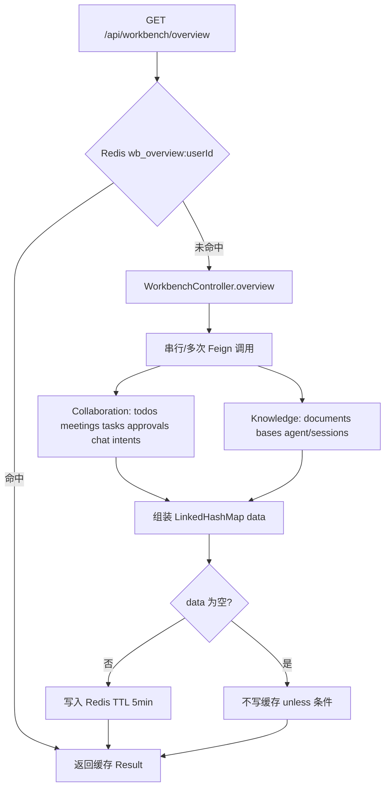
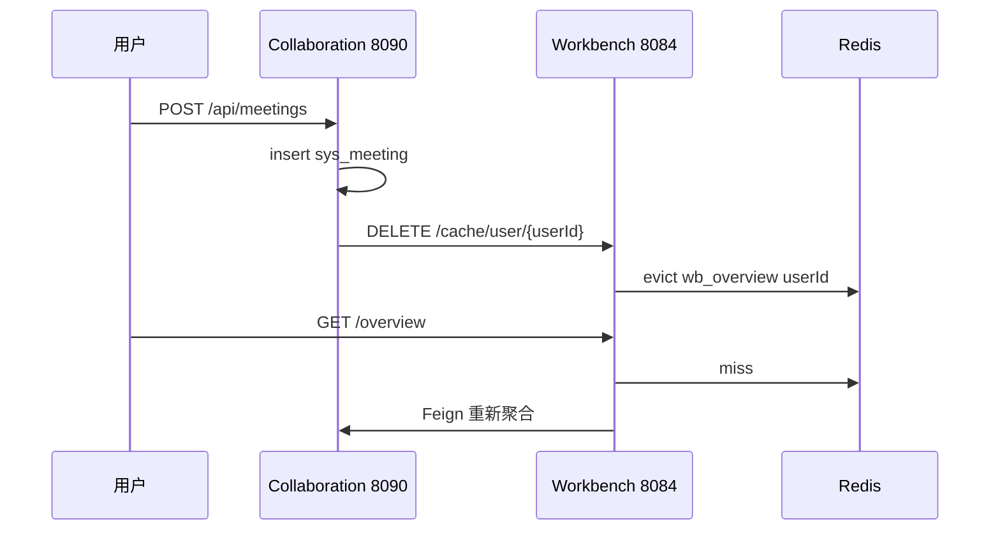

# enterprise-workbench-service 服务分析

> **文档版本**：v2.0 · **更新日期**：2026-05-25  
> 基于当前 `enterprise-workbench-service` 源码整理，覆盖 BFF 聚合、Feign 下游契约、Redis 缓存、收藏 CRUD、与前端/协同服务的联动。

本文重点解释工作台如何**扇出调用**多个微服务、失败如何降级、缓存 key 设计，以及当前实现中与下游 API **形状不匹配**的字段（如 `intentCount`、`todaySessionCount`）。

**文档结构**

| 章节 | 内容 |
|------|------|
| §1–§4 | 定位、架构、目录树、启动与配置 |
| §5–§6 | 请求链路、Controller 全量 API |
| §7–§8 | Overview 逐字段、Stats 统计 |
| §9–§11 | 收藏、Redis 缓存、缓存失效协作 |
| §12–§13 | Feign 客户端、数据库 |
| §14–§15 | 前端消费、响应与降级 |
| §16–§17 | 阅读路线、逐文件代码地图 |
| §18–§20 | 附录：REST 速查、调用链、Gotchas |

---

## 1. 服务定位

`enterprise-workbench-service` 是 **Dashboard / 分析页专用的 BFF（Backend for Frontend）**：

| 能力 | 说明 |
|------|------|
| Overview 聚合 | 一次 HTTP 拉取待办、会议、文档、任务、审批、IM、知识库、Agent 等统计 |
| Stats 聚合 | 任务看板状态分布、审批状态、会议数、文档总数 |
| 用户收藏 | 本地表 `wb_favorite` CRUD |
| Redis 缓存 | overview 按用户、stats 全局，TTL 5 分钟 |
| 缓存失效 | Collaboration 会议变更后 HTTP 回调清 overview |

**明确不做的事**：

- 不存储任务/会议/文档主数据（只读聚合）
- 不做登录鉴权（依赖 Gateway 注入 Header）
- 不代理 WebSocket

| 项 | 值 |
|---|---|
| 端口 | **8084** |
| Nacos 名 | `enterprise-workbench-service` |
| 数据库 | MySQL **`enterprise_collaboration`**（与协同服务**共用库**，仅 `wb_*` 表由本服务写） |
| 缓存 | Redis（Spring Cache `@Cacheable`） |
| 下游 | OpenFeign → Collaboration **8090**、Knowledge **8083** |
| 代码规模 | **8** 个 Java 源文件，**无 Service 层** |

### 1.1 平台位置

```text
┌──────────────┐
│ enterprise-web│  Dashboard.vue / Analytics.vue
│    :5173     │
└──────┬───────┘
       │ GET /api/workbench/overview|stats
       │ DELETE /api/workbench/cache/*
       ▼
┌──────────────────────────┐     Feign (lb://)      ┌─────────────────────────┐
│ enterprise-workbench     │ ─────────────────────► │ enterprise-collaboration│
│        :8084             │                        │         :8090           │
│  Redis + wb_favorite       │ ─────────────────────► │ enterprise-knowledge-ai │
└──────────────────────────┘                        │         :8083           │
       ▲                                            └─────────────────────────┘
       │ DELETE /cache/user/{id}
       │ (会议 CUD 后)
┌──────┴───────┐
│ Collaboration│  WorkbenchCacheNotifier
│ MeetingCtrl  │
└──────────────┘
```

**流量路径（生产）**：

```text
浏览器 → Gateway :8086 (/api/workbench/**) → lb://enterprise-workbench-service:8084
```

**流量路径（本地 Vite）**：

```text
/api/workbench/* → 直连 http://localhost:8084（绕过 Gateway）
```

其余 `/api/*` 仍走 Gateway `:8086`；`/api/kb` 直连 `:8083`。

---

## 2. 代码结构树

```text
enterprise-workbench-service/
├── pom.xml
├── src/main/java/com/zjl/workbench/
│   ├── WorkbenchApplication.java       # @EnableCaching @EnableFeignClients
│   ├── web/
│   │   └── WorkbenchController.java    # 唯一 Controller，~320 行
│   ├── feign/
│   │   ├── CollaborationFeignClient.java
│   │   └── KnowledgeFeignClient.java
│   ├── config/
│   │   ├── FeignConfig.java
│   │   └── RedisCacheConfig.java
│   ├── entity/
│   │   └── WbFavorite.java
│   └── mapper/
│       └── WbFavoriteMapper.java
└── src/main/resources/
    ├── application.yml
    ├── application-secrets.yml         # datasource.password
    ├── logback-spring.xml
    └── db/migration/
        └── V001__workbench.sql
```

**架构特征**：所有聚合逻辑堆在 `WorkbenchController`，Feign 接口即下游契约。扩展时应抽 `WorkbenchAggregationService` 避免 Controller 继续膨胀。

---

## 3. 启动与配置

### 3.1 启动入口

**文件**：`WorkbenchApplication.java`

```java
@EnableCaching
@EnableFeignClients
@SpringBootApplication(scanBasePackages = {"com.zjl.workbench", "com.zjl.common"})
public class WorkbenchApplication { ... }
```

| 注解 | 作用 |
|------|------|
| `@EnableCaching` | 激活 `@Cacheable` / `@CacheEvict` |
| `@EnableFeignClients` | 扫描 `feign/*` 接口 |
| `scanBasePackages` | 引入 `frameworks-common` 的 `Result`、`TraceIdHolder` 等 |

### 3.2 application.yml

```yaml
spring.config.import:
  - optional:classpath:application-secrets.yml
  - optional:nacos:enterprise-workbench-service.yaml
  - optional:nacos:common-config.yaml

server.port: 8084
spring.application.name: enterprise-workbench-service

mybatis-plus.configuration.map-underscore-to-camel-case: true
```

本地 **无** `datasource` / `redis` 块 — 通常来自 Nacos。

### 3.3 Nacos 预期配置（参考集成文档）

**`enterprise-workbench-service.yaml`**（专属）：

```yaml
spring:
  datasource:
    url: jdbc:mysql://127.0.0.1:3306/enterprise_collaboration?...
    username: root
    password: ${DB_PASSWORD:123456}
    driver-class-name: com.mysql.cj.jdbc.Driver
```

**`common-config.yaml`**（共享）通常含：

```yaml
spring:
  data:
    redis:
      host: localhost
      port: 6379
```

### 3.4 Maven 依赖

| 依赖 | 版本/说明 |
|------|-----------|
| `frameworks-web-spring-boot-starter` | GlobalExceptionHandler、TraceIdFilter（Servlet 栈；本服务为 MVC） |
| `mybatis-plus-spring-boot3-starter` | 3.5.7 |
| `spring-boot-starter-data-redis` | Spring Cache + Redis |
| `spring-cloud-starter-openfeign` | 声明式 HTTP |
| `spring-cloud-starter-loadbalancer` | `lb://` 解析 |
| `spring-cloud-starter-alibaba-nacos-*` | 注册与配置 |
| Spring Boot | 3.4.4 |

### 3.5 Gateway 路由

```yaml
# enterprise-gateway-service application.yml
- id: workbench
  uri: lb://enterprise-workbench-service
  predicates:
    - Path=/api/workbench/**
```

---

## 4. 请求链路与身份

### 4.1 鉴权方式

Workbench **不解析 JWT**。身份完全依赖请求头：

| Header | 来源 | 用途 |
|--------|------|------|
| `X-User-Id` | Gateway `IdentityPropagationGlobalFilter` | 必填；收藏隔离、Feign 透传 |
| `X-Is-Admin` | Gateway | 默认 `"false"`；透传下游做权限放宽 |

本地 Vite 直连 `:8084` 时，前端 `getAuthHeaders()` 需自行带头（与经 Gateway 行为一致）。

### 4.2 Overview 请求链路



### 4.3 Feign 调用与 Header 透传

Feign 方法签名上的 `@RequestHeader("X-User-Id")` / `@RequestHeader("X-Is-Admin")` 会随请求发往下游。  
下游 Collaboration 的 `JwtAuthFilter`：有 `X-User-Id` 则**跳过**协同 JWT 校验。

---

## 5. Controller 全量 API

**类**：`WorkbenchController` · 前缀 **`/api/workbench`**

| 方法 | 路径 | 缓存 | 身份头 | 说明 |
|------|------|------|--------|------|
| GET | `/overview` | `@Cacheable wb_overview#userId` | X-User-Id, X-Is-Admin | 首页大盘 |
| GET | `/stats` | `@Cacheable wb_stats#global` | 同上 | 分析页统计 |
| GET | `/favorites` | 无 | X-User-Id | 收藏列表 |
| POST | `/favorites` | 无 | X-User-Id | 新增收藏 |
| DELETE | `/favorites/{id}` | 无 | X-User-Id | 按 id+userId 删 |
| DELETE | `/cache` | `@CacheEvict` 全部 | **无** | 清 wb_overview + wb_stats |
| DELETE | `/cache/user/{userId}` | `@CacheEvict wb_overview#userId` | **无** | 协同回调 |

### 5.1 缓存注解细节

```java
@Cacheable(value = "wb_overview", key = "#userId", unless = "#result.data.isEmpty()")
@Cacheable(value = "wb_stats", key = "'global'", unless = "#result.data.isEmpty()")
@CacheEvict(value = {"wb_overview", "wb_stats"}, allEntries = true)  // /cache
@CacheEvict(value = "wb_overview", key = "#userId")                   // /cache/user/{id}
```

| 点 | 说明 |
|----|------|
| `unless = "#result.data.isEmpty()"` | **空 Map 不缓存**，每次 miss 都打下游 |
| stats key `'global'` | **所有用户共享同一份 stats 缓存**（见 §8.2） |
| cache 端点无鉴权 | 内网回调或前端 refresh 可直接 DELETE |

---

## 6. Overview 聚合（GET /overview）

### 6.1 响应结构总览

成功时 `data` 为 `Map<String, Object>`，字段如下：

```json
{
  "code": "200",
  "data": {
    "todos": [],
    "meetings": [],
    "todayMeetings": [],
    "meetingCount": 0,
    "recentDocs": [],
    "documentCount": 0,
    "todoCount": 0,
    "inProgressTaskCount": 0,
    "pendingApprovalCount": 0,
    "unreadMessageCount": 0,
    "baseCount": 0,
    "intentCount": 0,
    "todaySessionCount": 0
  },
  "traceId": "..."
}
```

### 6.2 逐字段说明

| 字段 | Feign / 下游 | 计算逻辑 | 失败降级 |
|------|-------------|----------|----------|
| `todos` | `GET /api/todos` | 原样 List | `[]` |
| `meetings` | `GET /api/meetings/my?userName=` | 原样 List | `[]` |
| `todayMeetings` | 同上 | `date == LocalDate.now()` | `[]` |
| `meetingCount` | 同上 | `todayMeetings.size()` | `0` |
| `recentDocs` | `GET /api/kb/documents?current=1&size=5` | 每条加 `docType=knowledge` | `[]` |
| `documentCount` | 同上 | PageResult `total` | `0` |
| `todoCount` | **`GET /api/todos` 第二次调用** | `done` 为 null/0/false | `0` |
| `inProgressTaskCount` | `GET /api/tasks` | status ∈ `todo`,`in_progress` | `0` |
| `pendingApprovalCount` | `GET /api/approvals` | 非 approved/rejected | `0` |
| `unreadMessageCount` | `GET /api/chat/unread-count` | Integer | `0` |
| `baseCount` | `GET /api/kb/bases?current=1&size=1` | `total` | `0` |
| `intentCount` | `GET /api/intents?current=1&size=1` | `total` | `0` |
| `todaySessionCount` | `GET /api/kb/agent/sessions?current=1&size=1` | `total` | `0` |

### 6.3 下游 API 形状匹配情况

| 字段 | Workbench 期望 | 下游实际 | 结果 |
|------|---------------|----------|------|
| `documentCount` / `recentDocs` | `Map` 含 `total`、`records` | `Result<PageResult>` → JSON 一致 | ✅ 正常 |
| `baseCount` | `Map.total` | `Result<PageResult>` | ✅ 正常 |
| `intentCount` | `GET /api/intents?current&size` 分页 | IntentController **仅有** `/api/intents/nodes` 等 | ❌ Feign 404/失败 → **恒 0** |
| `todaySessionCount` | `Map.total` | `GET /api/kb/agent/sessions` 返回 **`List`** 非分页 | ❌ `instanceof Map` 失败 → **恒 0** |

### 6.4 性能：重复 Feign 调用

`overview()` 内 **`getTodos` 被调用两次**（约 L47 与 L107）：一次填 `todos`，一次算 `todoCount`。可优化为复用第一次结果。

### 6.5 待办 done 字段

Collaboration `SysTodo.done` 为 **Integer** `0/1`。Workbench 判定未完成：

```java
d == null || "0".equals(d.toString()) || Boolean.FALSE.equals(d)
```

前端 `Dashboard.vue` 额外映射：`done: t.done===1 || t.done===true`。

### 6.6 会议「今日」过滤

后端：`LocalDate.now().toString()` 与 `m.get("date")` 字符串相等。  
前端：`Dashboard.vue` 用本地 `todayStr()` 对 `meetings` 再滤一遍作为 `todayMeetings` 兜底。

### 6.7 任务统计范围

`TaskController.list` **不按 userId 过滤**，返回库内**全部任务**。故 `inProgressTaskCount` 实为**全局任务看板**进行中数量，非当前用户个人任务数。

### 6.8 Overview 执行顺序图

```text
overview(userId, isAdmin)
  │
  ├─[1] collabClient.getTodos          → todos
  ├─[2] collabClient.getMyMeetings     → meetings, todayMeetings, meetingCount
  ├─[3] knowledgeClient.getDocuments   → recentDocs, documentCount
  ├─[4] collabClient.getTodos  (重复)  → todoCount
  ├─[5] collabClient.getTasks          → inProgressTaskCount
  ├─[6] collabClient.getApprovals      → pendingApprovalCount
  ├─[7] collabClient.getUnreadCount    → unreadMessageCount
  ├─[8] knowledgeClient.getBases       → baseCount
  ├─[9] collabClient.getIntents        → intentCount (常失败)
  └─[10] knowledgeClient.getAgentSessions → todaySessionCount (常失败)
```

每一步独立 `try/catch (FeignException)`，`log.warn` 后字段降级，**不中断**其他字段。

---

## 7. Stats 聚合（GET /stats）

### 7.1 响应结构

```json
{
  "taskStats": { "todo": 0, "inProgress": 0, "review": 0, "done": 0, "total": 0 },
  "approvalStats": { "pending": 0, "approved": 0, "rejected": 0, "total": 0 },
  "meetingStats": { "today": 0, "total": 0 },
  "docCount": 0
}
```

### 7.2 各块计算

**taskStats** — 来源 `GET /api/tasks`，遍历 `status`：

| status 值 | 计数键 |
|-----------|--------|
| `todo` | todo |
| `in_progress` | inProgress |
| `review` | review |
| `done` | done |

**approvalStats** — 来源 `GET /api/approvals`：

| status | 计数 |
|--------|------|
| `approved` | approved |
| `rejected` | rejected |
| 其他 | pending |

**meetingStats** — 来源 `GET /api/meetings/my`：`today` 为当日 date 计数，`total` 为列表长度。

**docCount** — 来源 `GET /api/kb/documents?current=1&size=1` 的 `total`。

### 7.3 stats 缓存缺陷（重要）

```java
@Cacheable(value = "wb_stats", key = "'global'", ...)
public Result<Map<String, Object>> stats(..., @RequestHeader(UA) Long userId, ...)
```

| 问题 | 说明 |
|------|------|
| key 固定 `global` | 用户 A 请求后，用户 B 命中缓存会看到 **A 触发时**算出的 task/approval 分布 |
| Feign 仍带各自 userId | 但 tasks 列表本身不过滤用户，影响有限；若下游改为按用户过滤则会**串数据** |
| 建议 | key 改为 `#userId` 或取消 stats 缓存 |

---

## 8. 收藏（wb_favorite）

### 8.1 表结构

见 §13.2。`item_type` 注释：`document / meeting / kb`。

### 8.2 API

**GET `/favorites`**

```java
favoriteMapper.selectList(
    Wrappers.lambdaQuery(WbFavorite.class)
        .eq(WbFavorite::getUserId, userId)
        .orderByDesc(WbFavorite::getCreatedAt))
```

**POST `/favorites`**

Body：

```json
{ "itemType": "document", "itemId": 123, "title": "某某文档" }
```

- `itemId` 经 `Long.valueOf(body.get("itemId").toString())` 转换
- 无重复校验（同一 item 可多次收藏）
- **不触发** overview 缓存失效

**DELETE `/favorites/{id}`**

按 `id` + `userId` 双条件删除（防越权）。

### 8.3 前端封装

`enterprise-web/src/api/index.js`：`getFavorites` / `addFavorite` / `removeFavorite`。

---

## 9. Redis 缓存

### 9.1 RedisCacheConfig

```java
RedisCacheConfiguration.defaultCacheConfig()
    .entryTtl(Duration.ofMinutes(5))
    .serializeValuesWith(GenericJackson2JsonRedisSerializer)
```

| 项 | 值 |
|----|-----|
| TTL | **5 分钟** |
| 序列化 | JSON（含类型信息） |
| Cache 名 | `wb_overview`、`wb_stats` |

### 9.2 Redis Key 形态（Spring Cache 默认）

通常为 `wb_overview::{userId}`、`wb_stats::global`（取决于 `RedisCacheManager` 配置，未自定义 prefix）。

### 9.3 何时失效

| 触发 | 方式 |
|------|------|
| TTL 到期 | 自动 |
| 用户点 Dashboard「刷新」 | 前端 `DELETE /cache/user/{id}` 再 GET overview |
| 会议创建/更新/删除 | Collaboration `WorkbenchCacheNotifier` |
| 运维 | `DELETE /api/workbench/cache` 清全部 |

**未失效场景**：待办/任务/审批/文档变更**不会**自动清缓存（仅会议有回调）。

---

## 10. 缓存失效协作（Collaboration → Workbench）

### 10.1 WorkbenchCacheNotifier

**文件**：`enterprise-collaboration-service/.../WorkbenchCacheNotifier.java`

```java
@Value("${app.workbench.service-url:http://localhost:8084}")
DELETE {workbenchUrl}/api/workbench/cache/user/{userId}
```

- 使用 Java 11+ `HttpClient`，同步 `send`
- 失败仅 `log.warn`，**不影响**会议主流程

### 10.2 MeetingController 触发点

| 操作 | evict 目标 userId |
|------|-------------------|
| POST `/api/meetings` | 当前创建者 `userId` |
| PUT `/api/meetings/{id}` | 会议 `creatorId` |
| DELETE `/api/meetings/{id}` | 原会议 `creatorId` |

**未触发**：待办/任务/审批/聊天变更均不回调 Workbench。

### 10.3 失效链路图



---

## 11. Feign 客户端详解

### 11.1 服务名与负载均衡

```java
@FeignClient(name = "enterprise-collaboration-service", configuration = FeignConfig.class)
@FeignClient(name = "enterprise-knowledge-ai-service", configuration = FeignConfig.class)
```

Nacos 注册名须与 `spring.application.name` 一致，由 `LoadBalancer` 解析实例。

### 11.2 CollaborationFeignClient

| 方法 | HTTP | 下游 Controller |
|------|------|-----------------|
| `getTodos` | GET `/api/todos` | TodoController.list（按 X-User-Id） |
| `getMyMeetings` | GET `/api/meetings/my` | MeetingController.listMy |
| `getTasks` | GET `/api/tasks` | TaskController.list（**全量**） |
| `getApprovals` | GET `/api/approvals` | ApprovalController |
| `getIntents` | GET `/api/intents?current&size` | **无匹配** |
| `getUnreadCount` | GET `/api/chat/unread-count` | ChatController |

### 11.3 KnowledgeFeignClient

| 方法 | HTTP | 说明 |
|------|------|------|
| `getDocuments` | GET `/api/kb/documents` | 分页 current/size |
| `getBases` | GET `/api/kb/bases` | 分页 |
| `getAgentSessions` | GET `/api/kb/agent/sessions` | **返回 List 非 Page** |

### 11.4 FeignConfig

```java
@Bean
Logger.Level feignLoggerLevel() { return Logger.Level.BASIC; }
```

BASIC 级别记录方法、URL、状态、耗时。排查下游 404/503 时可临时改 FULL。

### 11.5 错误处理

仅捕获 `FeignException`（4xx/5xx、连接失败）。  
**不捕获**：下游 200 但 `code!=200` 的 `Result` — 此时 `resp.getData()` 可能为 null，字段静默为 0/[]。

---

## 12. 数据库

### 12.1 库与迁移

- **Schema**：`enterprise_collaboration`（与协同服务同库）
- **脚本**：`db/migration/V001__workbench.sql`（Flyway **未**接入，需手工执行）
- **本地密码**：`application-secrets.yml` → `spring.datasource.password: 123456`

### 12.2 表定义

**wb_user_layout**（尚无 API）

| 列 | 类型 | 说明 |
|----|------|------|
| id | BIGINT PK | |
| user_id | BIGINT UK | 每用户一条 |
| layout_json | TEXT | 布局 JSON |
| updated_at | TIMESTAMP | |

**wb_favorite**

| 列 | 类型 | 说明 |
|----|------|------|
| id | BIGINT PK | AUTO |
| user_id | BIGINT | INDEX |
| item_type | VARCHAR(32) | document/meeting/kb |
| item_id | BIGINT | |
| title | VARCHAR(256) | |
| created_at | TIMESTAMP | |

### 12.3 MyBatis-Plus

- `WbFavoriteMapper extends BaseMapper<WbFavorite>`
- 无 XML；收藏 CRUD 用 `LambdaQueryWrapper`
- 全局 `map-underscore-to-camel-case: true`

---

## 13. 前端消费

### 13.1 Dashboard.vue（`/` 首页）

| 前端变量 | overview 字段 |
|----------|---------------|
| `todos` | `data.todos` |
| `todayMeetings` | `data.todayMeetings` 或本地 filter |
| `collabStats.todos` | `todoCount` |
| `collabStats.meetings` | `meetingCount` |
| `collabStats.approvals` | `pendingApprovalCount` |
| `collabStats.messages` | `unreadMessageCount` |
| `knowledgeStats.documents` | `documentCount` |
| `knowledgeStats.bases` | `baseCount` |
| `knowledgeStats.intents` | `intentCount` |
| `knowledgeStats.sessions` | `todaySessionCount` |
| `recentDocs` | `data.recentDocs` |

**刷新**：`refreshData()` → `DELETE /cache/user/{localStorage.user.id}` → `GET /overview`。

### 13.2 Analytics.vue（分析页）

`GET /api/workbench/stats` → 填充 `taskStats`、`approvalStats`、`meetingStats`、`docCount`。  
同页还独立请求 `/api/system/users/stats`、`/api/kb/admin/stats` 等 — **不全依赖** Workbench。

### 13.3 Vite 代理

```javascript
'/api/workbench': 'http://localhost:8084'
```

生产应统一走 Gateway `:8086`，避免 CORS 与 Header 不一致。

---

## 14. 响应、错误与降级策略

### 14.1 成功约定

与全平台一致：`String(code) === '200'` 为成功（前端 Dashboard 用 `(await resp.json()).data`）。

### 14.2 降级策略（Overview / Stats）

| 场景 | 行为 |
|------|------|
| 下游连接失败 | 该字段 empty/0，warn 日志 |
| 下游 404（如 intents） | 同上 |
| 下游 200 但 data 形状不对 | 静默 0（无异常） |
| 全部字段 empty | overview **不写入 Redis** |

### 14.3 收藏接口

无 try/catch 包装 — 数据库异常走 `GlobalExceptionHandler` → `Result` 失败。

---

## 15. 阅读路线与问题反查

| 阶段 | 阅读顺序 |
|------|----------|
| ① | `WorkbenchController` 全文 |
| ② | 两个 FeignClient |
| ③ | `RedisCacheConfig` |
| ④ | Collaboration `MeetingController` + `WorkbenchCacheNotifier` |
| ⑤ | 前端 `Dashboard.vue` loadData |

| 现象 | 排查 |
|------|------|
| 首页全 0 | 下游 8090/8083 是否启动；Feign 日志 |
| intent/sessions 永远 0 | §6.3 API 形状不匹配 |
| 刷新仍旧数据 | Redis 是否 evict；是否 hit stats global 缓存 |
| 会议变更不更新 | Collaboration 是否调 cache/user；workbenchUrl 配置 |
| 收藏 403/401 | 直连 8084 是否带 X-User-Id |
| stats 多人数据怪 | stats 全局缓存 key |

---

## 16. 完整代码地图（逐文件）

| 文件 | 行数 | 说明 |
|------|------|------|
| `WorkbenchApplication.java` | ~15 | 启动 |
| `web/WorkbenchController.java` | ~320 | overview/stats/favorites/cache |
| `feign/CollaborationFeignClient.java` | ~51 | 6 个 GET |
| `feign/KnowledgeFeignClient.java` | ~38 | 3 个 GET |
| `config/FeignConfig.java` | ~15 | BASIC 日志 |
| `config/RedisCacheConfig.java` | ~24 | TTL 5min JSON |
| `entity/WbFavorite.java` | ~26 | 表 wb_favorite |
| `mapper/WbFavoriteMapper.java` | ~9 | BaseMapper |
| `resources/application.yml` | ~27 | 端口 Nacos |
| `resources/db/migration/V001__workbench.sql` | ~16 | 建表 |
| `resources/logback-spring.xml` | ~46 | 文件+控制台日志 |

---

## 17. 附录 A — REST 接口速查

| 方法 | 路径 | 请求头 | 响应 data |
|------|------|--------|-----------|
| GET | `/api/workbench/overview` | X-User-Id, X-Is-Admin? | Map §6.1 |
| GET | `/api/workbench/stats` | 同上 | Map §7.1 |
| GET | `/api/workbench/favorites` | X-User-Id | List WbFavorite |
| POST | `/api/workbench/favorites` | X-User-Id | WbFavorite |
| DELETE | `/api/workbench/favorites/{id}` | X-User-Id | void |
| DELETE | `/api/workbench/cache` | — | void |
| DELETE | `/api/workbench/cache/user/{userId}` | — | void |

---

## 18. 附录 B — 关键调用链

### B.1 首页加载（经 Gateway）

```
GET /api/workbench/overview
  Authorization: Bearer → Gateway → X-User-Id
  Workbench @Cacheable miss
  → 10 次 Feign（含重复 todos）
  → Result.success(data)
  → Redis set wb_overview:{userId} TTL 5m
```

### B.2 用户手动刷新

```
Dashboard refreshData
  DELETE /api/workbench/cache/user/{id}
  GET /api/workbench/overview
```

### B.3 创建会议后自动失效

```
POST /api/meetings (Collaboration)
  → WorkbenchCacheNotifier.evictOverview(creatorId)
  → DELETE http://8084/api/workbench/cache/user/{id}
```

---

## 19. 附录 C — Gotchas 与改进建议

| 项 | 现状 | 影响 | 建议 |
|----|------|------|------|
| 无 Service 层 | 逻辑全在 Controller | 难测、难扩展 | 抽 AggregationService |
| getTodos 调两次 | overview 内重复 Feign |  latency +1 | 复用第一次结果 |
| intentCount | Feign 路径不存在 | 恒 0 | 改调 `/api/intents/nodes` 或删字段 |
| todaySessionCount | 期望分页 Map，实际 List | 恒 0 | 改 Feign 返回类型或 `list.size()` |
| stats 缓存 global | 多用户共享 | 潜在串缓存 | key 用 userId |
| 任务不过滤用户 | TaskController 全量 | 统计非个人 | 下游加 userId 过滤或文档说明 |
| 仅会议 evict | 其他域变更 | overview 最多 stale 5min | 扩展 MQ/回调或缩短 TTL |
| cache 无鉴权 | DELETE 裸奔 | 伪造 evict | 内网 + shared secret |
| wb_user_layout 无 API | 表闲置 | 布局无法持久化 | 补 CRUD |
| 直连 vs Gateway | Vite 8084 | Header 需前端自建 | 生产统一 8086 |
| Agent sessions Feign 带 current/size | 下游忽略参数 | 无影响但误导 | 去掉 query 参数 |
| 空 overview 不缓存 | unless empty | 下游全挂时每请求打穿 | 可缓存空结果短 TTL |

---

*文档结束 · v2.0 · 2026-05-25*
