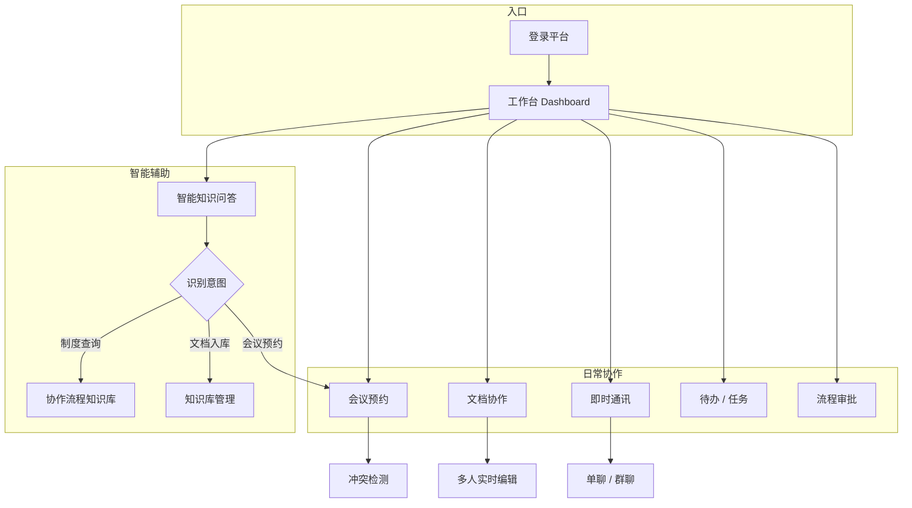

# 企业智能工作平台 · 协作流程手册

> 版本：2026-05  
> 适用对象：全体员工  
> 关联知识库：**协作流程知识库**

---

## 1. 文档说明

本手册描述在企业智能工作平台中进行日常协作的标准流程，涵盖会议预约、文档协同、即时通讯、待办任务、流程审批及智能助手辅助协作。

平台采用「**工作台聚合 + 协作服务执行 + 知识库支撑**」架构：

- **工作台（Dashboard）**：统一查看今日待办、今日会议、未读消息
- **协作服务**：会议、文档、IM、待办、任务、审批的业务承载
- **知识库 / 智能问答**：制度查询、流程说明、Agent 工具调用（如预约会议）

---

## 2. 协作流程总览



---

## 3. 会议预约流程

### 3.1 适用场景

- 部门例会、项目评审、客户沟通
- 线下会议室占用或 Zoom 线上会议

### 3.2 操作路径

**方式一：页面操作**

1. 左侧菜单进入 **「会议预约」**
2. 点击 **「新建会议」**
3. 填写表单并提交

**方式二：智能助手**

在 **「智能知识问答」** 中直接用自然语言，例如：

- 「帮我预约明天下午 2 点到 3 点 A301 的项目评审会」
- 「查一下我今天的会议安排」
- 「取消 id 为 5 的会议」

Agent 会调用 `create_meeting`、`list_my_meetings`、`check_meeting_conflict`、`cancel_meeting` 等工具完成操作。

### 3.3 新建会议字段说明

| 字段 | 必填 | 说明 |
|------|------|------|
| 会议标题 | 是 | 简明描述会议主题 |
| 日期 | 是 | 会议举行日期 |
| 开始 / 结束时间 | 是 | 结束时间须晚于开始时间 |
| 地点 | 是 | 线下：A301 / B102 / C501；线上：Zoom 视频会议 |
| 参会人 | 否 | 多人以标签形式添加，逗号或回车分隔 |
| 备注 | 否 | 议程、准备材料、注意事项 |

### 3.4 标准预约流程（推荐）

```
填写会议信息
    ↓
选择线下会议室？
    ├─ 是 → 系统检测同房间同时段是否冲突
    │         ├─ 有冲突 → 调整时间或更换会议室
    │         └─ 无冲突 → 创建成功
    └─ 否（Zoom）→ 自动创建 Zoom 会议并生成入会链接
    ↓
会议出现在「我的会议」列表
    ↓
工作台「今日会议」展示当天安排
    ↓
会议开始前 → 点击「入会」（线上）或前往会议室（线下）
    ↓
如需变更 → 「编辑」；无需举行 → 「取消」
```

### 3.5 冲突检测规则

- **线下会议室**：同一日期、同一会议室、时间段重叠则判定冲突
- **线上 Zoom**：不检测物理会议室占用，但仍建议自行核对参会人日程
- 创建前可调用 **「检测冲突」** 接口或在 Agent 对话中说明时间与地点，由助手先行校验

### 3.6 权限与可见范围

- 「我的会议」列表展示：**我创建的** + **参会人包含我的** 会议
- 仅创建人可编辑、取消会议
- 有 `join_url` 的线上会议，所有可见人均可点击「入会」

### 3.7 注意事项

1. 预约成功后请及时在 IM 或邮件中通知参会人（系统通知能力持续完善中）
2. 长时间会议请预留 5–10 分钟缓冲，避免影响下一场
3. 取消会议请尽早操作，释放会议室资源

---

## 4. 文档协作流程

### 4.1 适用场景

- 方案共创、会议纪要、项目计划、制度草案的多人编辑

### 4.2 操作路径

1. 进入 **「文档协作」**
2. 新建或打开已有文档
3. 邀请协作者并设置权限
4. 多人同时编辑，光标与内容实时同步

### 4.3 协作编辑流程

```
创建 / 打开文档
    ↓
添加协作者（只读 / 可编辑）
    ↓
编辑者进入文档 → WebSocket 建立协同连接
    ↓
Quill 编辑器实时同步（OT 算法）
    ↓
自动保存 + 版本递增
    ↓
可选：添加评论、生成分享链接（只读 / 可编辑）
```

### 4.4 权限说明

| 角色 | 能力 |
|------|------|
| 文档所有者 | 编辑、分享、管理协作者、删除 |
| 可编辑协作者 | 实时编辑、查看评论 |
| 只读协作者 / 分享链接访客 | 查看内容，不可修改 |

### 4.5 最佳实践

- 重要文档先由负责人搭好目录结构，再开放协作
- 大规模修改前在 IM 群同步，避免多人同时改同一段落
- 对外分享使用 **限时分享链接**，并选择最小必要权限

---

## 5. 即时通讯流程

### 5.1 适用场景

- 快速沟通、文件传递、会议临时协调

### 5.2 操作路径

1. 进入 **「即时通讯」**
2. 从 **「通讯录」** 发起单聊，或创建群组
3. 支持文字消息；文件上传后由后端存储

### 5.3 建议使用方式

| 场景 | 建议 |
|------|------|
| 紧急事项 | IM 直接 @ 相关人员 |
| 需留痕的决策 | IM 结论同步写入文档或待办 |
| 会议变更 | IM 通知 + 会议预约页更新 |

---

## 6. 待办与任务协同

### 6.1 待办事项

**路径**：工作台 / **「我的待办」**

```
创建待办 → 设置优先级与截止时间 → 执行 → 标记完成
```

适用于个人短期行动项，例如「会后 24 小时内提交纪要」。

### 6.2 任务协同

**路径**：**「任务协同」**

```
创建任务 → 指定负责人 / 参与人 → 更新状态（待办 / 进行中 / 评审 / 完成）
         → 评论讨论 → 上传附件 → 确认关闭
```

适用于跨部门、有明确交付物的协作项。

### 6.3 与会议联动示例

| 会议结论 | 后续动作 |
|----------|----------|
| 「下周完成原型」 | 创建任务，指定设计负责人，设截止日期 |
| 「张三整理竞品分析」 | 为张三创建待办，截止周五 |
| 「制度修订需审批」 | 发起流程审批（见下节） |

---

## 7. 流程审批

**路径**：**「流程审批」**

适用于请假、报销、采购、合同等需多级确认的场景。

```
发起人提交申请
    ↓
审批人收到待办 / 通知
    ↓
审批通过 / 驳回（附意见）
    ↓
发起人查看结果，必要时重新提交
```

工作台会汇总 **待审批数量**，便于管理者集中处理。

---

## 8. 智能助手协作（Agent）

### 8.1 意图识别

平台通过 **意图树** 与 **关键词映射** 理解用户问题：

- 意图树：场景（如「会议预约」）→ 子意图（如「创建会议」「取消会议」）
- 关键词映射：如「会议」「会议室」→ 路由至 **协作流程知识库**

### 8.2 全员可用能力

| 能力 | 示例 |
|------|------|
| 查询我的会议 | 「我今天有哪些会？」 |
| 预约 / 取消会议 | 「订明天 10 点 B102，标题产品站会」 |
| 冲突检测 | 「明天下午 A301 3 点到 4 点有人吗？」 |
| 解析聊天附件 | 上传 PDF / Word，询问文档内容 |
| 联网搜索 | 开启 Web 搜索后查询外部资料 |

### 8.3 管理员额外能力

- 上传文档至知识库并触发分块、向量入库
- 管理知识库、意图树、关键词映射、流水线

### 8.4 使用建议

1. 问题尽量 **具体**：包含时间、地点、人物、目标
2. 涉及制度流程时，先问「标准流程是什么」，再执行操作
3. 助手给出会议 ID 后，可在「会议预约」页核对

---

## 9. 工作台一日协作示例

**场景：产品经理小张的工作日上午**

| 时间 | 动作 | 使用模块 |
|------|------|----------|
| 09:00 | 打开工作台，查看今日 2 场会议、3 条待办 | Dashboard |
| 09:15 | IM 与研发确认评审材料已上传 | 即时通讯 |
| 09:30 | 站会（A301），会中协作文档记录结论 | 文档协作 |
| 10:30 | 在待办中勾选「收集竞品资料」 | 我的待办 |
| 11:00 | 问 Agent「帮我预约周五下午 C501 需求评审，参会人李四、王五」 | 智能问答 |
| 14:00 | 处理 1 条流程审批 | 流程审批 |
| 16:00 | 创建任务「UI 原型 v2」，指派设计 | 任务协同 |

---

## 10. 常见问题（FAQ）

**Q1：工作台「今日会议」为空，但意图树里配置了会议预约？**  
A：意图树是 AI 路由配置，不等于真实会议数据。需在「会议预约」或通过 Agent **实际创建** 当天的会议。

**Q2：线下会议室冲突怎么办？**  
A：更换时间段或会议室；Agent 可在创建前调用冲突检测。

**Q3：Zoom 会议没有入会链接？**  
A：确认协作服务已配置 Zoom 凭证；未配置时仅创建本地记录，不生成链接。

**Q4：文档协作时他人看不到我的修改？**  
A：检查网络与 WebSocket 连接；刷新页面重新进入文档。

**Q5：如何让 AI 回答「报销 / 请假」等公司制度？**  
A：将制度文档上传至对应知识库（如财务制度、人事制度），通过智能问答检索；关键词映射可提升命中率。

---

## 11. 附录：系统入口速查

| 功能 | 菜单路径 | 服务端口（开发环境） |
|------|----------|----------------------|
| 工作台 | 首页 Dashboard | 8084（workbench） |
| 智能问答 | 智能知识问答 | 8083（knowledge-ai） |
| 会议预约 | 会议预约 | 8090（collaboration） |
| 文档协作 | 文档协作 | 8090 |
| 即时通讯 | 即时通讯 | 8090 |
| 待办 | 我的待办 | 8090 |
| 任务 | 任务协同 | 8090 |
| 审批 | 流程审批 | 8090 |
| 管理后台 | 意图树 / 关键词 / 流水线 | 8086 网关 + 各下游 |

---

## 12. 文档维护

| 项目 | 说明 |
|------|------|
| 维护部门 | 信息化 / 协作平台项目组 |
| 更新频率 | 功能变更后 5 个工作日内修订 |
| 反馈渠道 | IM 联系平台管理员，或提交待办「协作流程手册反馈」 |
| 入库建议 | 可将本文档上传至 **协作流程知识库**，供 Agent 检索回答 |

---

*本文档依据当前系统已实现能力编写；部分规划能力（如全自动会议通知、完整日历同步）将在后续版本补充。*
